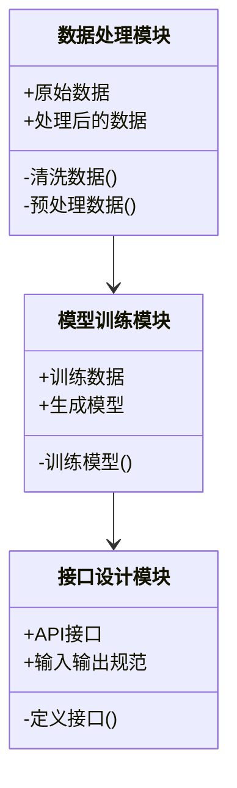
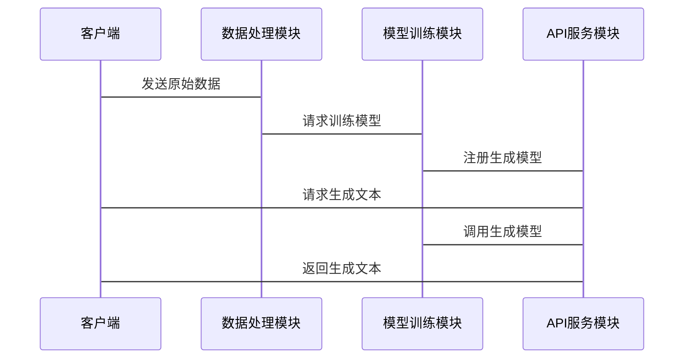

                 


# 金融领域自然语言生成技术的创新应用

## 关键词：自然语言生成，金融应用，文本生成，机器学习，深度学习，NLP

## 摘要：  
本文探讨自然语言生成技术在金融领域的创新应用，从技术原理到实际场景，详细分析其如何帮助金融机构提升效率、降低成本并提供更智能化的服务。通过介绍核心算法、系统架构设计和项目实战，本文旨在为读者提供全面的视角，理解自然语言生成技术在金融领域的潜力和未来发展方向。

---

## 正文

### 第1章：背景介绍

#### 1.1 自然语言生成技术的定义与背景
自然语言生成（Natural Language Generation, NLG）是人工智能领域的重要分支，旨在让计算机能够自动生成人类可读的文本。随着深度学习技术的发展，NLG技术在金融领域的应用逐渐成为研究热点。

- **问题背景**：金融行业数据繁多，报告、分析和客户服务的文本需求量大，传统的人工处理效率低下，且成本高昂。  
- **问题描述**：金融机构需要快速生成高质量的金融报告、客户沟通文本以及市场分析等内容，但依赖人工处理存在效率瓶颈。  
- **问题解决**：通过引入自然语言生成技术，金融机构可以自动化处理文本生成任务，提升效率并降低成本。  
- **边界与外延**：自然语言生成技术的应用范围包括金融报告生成、新闻摘要、客户沟通自动化等，但需注意生成文本的准确性和合规性。  

#### 1.2 金融领域的自然语言生成技术的应用场景
- **金融报告生成**：自动生成财务报表、市场分析报告等。  
- **金融新闻摘要**：从大量金融新闻中提取关键信息，生成简短摘要。  
- **客户沟通自动化**：通过NLG技术生成个性化的客户沟通文本，如邮件、短信等。

---

### 第2章：自然语言生成技术的核心技术

#### 2.1 文本生成模型
- **RNN模型**：循环神经网络（RNN）通过处理序列数据，生成连贯的文本。  
- **Transformer模型**：基于自注意力机制，Transformer模型在文本生成任务中表现出色。  
- **GAN模型**：生成对抗网络（GAN）通过生成器和判别器的对抗训练，提升生成文本的质量。

#### 2.2 文本摘要技术
- **提取式摘要**：从文本中提取关键句子或短语，生成摘要。  
- **生成式摘要**：通过模型生成全新的文本内容，使其覆盖原文的核心信息。  
- **基于Transformer的摘要模型**：如BERT和GPT系列模型，广泛应用于金融领域的文本摘要任务。

#### 2.3 机器翻译技术
- **经典机器翻译模型**：如统计机器翻译（SMT）和基于神经网络的机器翻译（NMT）。  
- **神经机器翻译的发展**：从单层神经网络到多层Transformer架构的演变。  
- **多语言翻译在金融领域中的应用**：支持多种语言的金融文本翻译，帮助跨国金融机构处理多语言文本。

---

### 第3章：金融领域的特殊需求与挑战

#### 3.1 金融数据的敏感性
- **数据隐私保护**：金融数据涉及客户隐私，生成文本时需确保数据安全。  
- **合规性要求**：生成的文本需符合金融行业的法律法规，如反洗钱（AML）和合规报告要求。

#### 3.2 金融术语的复杂性
- **专业术语的处理**：金融领域的术语复杂且多样，生成模型需准确理解和使用这些术语。  
- **文本生成中的术语准确性**：生成的文本需避免术语错误，确保专业性。

#### 3.3 金融场景的多样性
- **不同金融产品的需求差异**：如股票、基金、保险等不同产品对文本生成的需求不同。  
- **不同客户群体的语言偏好**：生成的文本需适应不同客户的语言习惯和理解能力。

---

### 第4章：自然语言生成技术在金融领域的创新应用

#### 4.1 智能客服系统的应用
- **自动回复系统的构建**：通过NLG技术生成自动回复文本，提升客户服务效率。  
- **客户意图识别与生成**：结合自然语言理解（NLU）技术，实现智能对话生成。

#### 4.2 风险管理中的应用
- **风险报告自动生成**：从大量数据中提取关键信息，生成风险评估报告。  
- **异常交易预警的自然语言描述**：通过生成自然语言描述，帮助风险管理人员快速理解异常情况。

#### 4.3 投资建议生成系统
- **个性化投资建议生成**：基于客户的投资偏好和市场数据，生成个性化的投资建议。  
- **市场分析报告的自动生成**：通过NLG技术生成详细的市场分析报告，供投资者参考。

---

### 第5章：系统架构设计

#### 5.1 问题场景介绍
- **数据处理**：金融数据的清洗、预处理和标注。  
- **模型训练**：基于标注数据训练自然语言生成模型。  
- **接口设计**：与金融机构现有的系统无缝对接。

#### 5.2 系统功能设计（领域模型Mermaid类图）


#### 5.3 系统架构设计（Mermaid架构图）


#### 5.4 系统交互设计（Mermaid序列图）


---

### 第6章：项目实战

#### 6.1 环境安装
- **Python环境**：安装Python 3.8及以上版本。  
- **依赖库安装**：使用pip安装PyTorch、Hugging Face Transformers、spaCy等库。

#### 6.2 核心实现代码
```python
from transformers import AutoTokenizer, AutoModelForCausalLM
import torch

# 初始化模型和分词器
model_name = "gpt2"
tokenizer = AutoTokenizer.from_pretrained(model_name)
model = AutoModelForCausalLM.from_pretrained(model_name)

# 定义生成函数
def generate_text(prompt, max_length=50):
    inputs = tokenizer.encode(prompt, return_tensors="pt")
    input_ids = inputs.to(torch.device("cuda" if torch.cuda.is_available() else "cpu"))
    outputs = model.generate(input_ids, max_length=max_length, do_sample=True)
    return tokenizer.decode(outputs[0], skip_special_tokens=True)

# 示例生成
prompt = "最新的市场趋势显示，"
print(generate_text(prompt))
```

#### 6.3 代码解读与分析
- **模型加载**：使用Hugging Face的预训练模型GPT-2，加载模型和分词器。  
- **生成函数**：定义生成文本的函数，设置最大长度和随机采样参数。  
- **示例生成**：输入提示文本，生成最新的市场趋势分析。

#### 6.4 实际案例分析
- **案例一**：生成金融报告  
- **案例二**：生成客户沟通邮件  
- **案例三**：生成投资建议

#### 6.5 项目小结
- **关键点总结**：模型选择、数据处理、生成效果优化。  
- **注意事项**：确保生成文本的准确性和合规性，避免误导客户或违反法规。

---

### 第7章：总结与展望

#### 7.1 全文总结
- 本文从技术原理到实际应用，全面探讨了自然语言生成技术在金融领域的创新应用。  
- 通过系统架构设计和项目实战，展示了如何将NLG技术应用于金融场景。

#### 7.2 未来展望
- **模型优化**：更高效、更准确的生成模型将推动NLG技术的发展。  
- **跨领域应用**：自然语言生成技术将与更多领域结合，创造更大的价值。  
- **伦理与合规**：生成文本的准确性和合规性将是未来研究的重点。

---

### 最佳实践 Tips
- 在实际应用中，建议结合具体业务需求选择合适的自然语言生成模型。  
- 数据预处理是关键，需确保数据质量和完整性。  
- 生成文本后，建议进行人工校验，确保准确性和合规性。

--- 

### 小结
通过本文的详细介绍，读者可以全面了解自然语言生成技术在金融领域的创新应用，掌握从理论到实践的全过程，为未来的深入研究和实践奠定基础。

