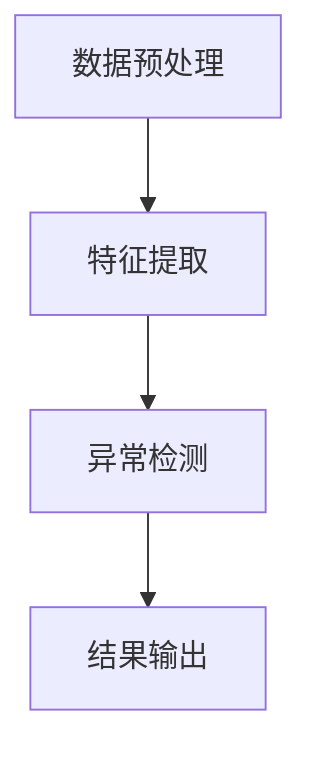

                 


# 金融领域自监督学习在市场异常模式识别中的应用

## 关键词：
自监督学习，金融市场，异常模式识别，深度学习，无监督学习

## 摘要：
本文探讨自监督学习在金融市场异常模式识别中的应用，分析其优势、算法原理及实际案例，旨在为金融领域的技术实践者提供深度见解。

---

## 第一部分：背景介绍

### 第1章：自监督学习的基本概念

#### 1.1 自监督学习的定义与特点
- **自监督学习的定义**：通过未标记数据和预设任务，利用数据本身的结构关系进行学习的方法。
- **特点**：
  - 无需大量标注数据。
  - 利用数据内部关系，实现自我监督。
  - 适用于高维数据，如文本、图像和金融时间序列。

#### 1.2 问题背景与问题描述
- **问题背景**：金融市场数据复杂，异常模式识别需要高精度检测，但标注成本高。
- **问题描述**：传统监督学习依赖大量标注数据，而金融数据常呈现复杂模式，自监督学习提供了解决方案。
- **边界与外延**：仅关注异常模式识别，不涉及交易策略优化。

---

## 第二部分：自监督学习的核心概念与联系

### 第2章：自监督学习的原理与机制

#### 2.1 自监督学习的核心原理
- **核心原理**：通过对比学习或生成式方法，利用数据内部关系进行特征提取。

#### 2.2 自监督学习与监督学习的对比
- **对比学习**：利用数据对的相似性，推断潜在特征。
- **生成式方法**：通过生成样本，对比真实与生成数据的差异。

#### 2.3 自监督学习在异常检测中的应用
- **数据特性**：金融数据的高维性、噪声和稀疏性。
- **特征提取**：利用自监督学习提取稳定特征，提升异常检测性能。

---

## 第三部分：算法原理讲解

### 第3章：自监督学习的数学模型

#### 3.1 对比学习模型
- **损失函数**：
  $$\mathcal{L}(\theta) = -\sum_{i=1}^{n} \log p_i$$
  其中，$p_i$为数据对的相似性概率。

#### 3.2 生成对抗网络模型
- **生成器与判别器**：
  $$\min_{G} \max_{D} \mathcal{L}(G,D)$$

#### 3.3 实现细节
- 使用ResNet作为编码器，训练时输入两种数据增强版本，计算其相似性。

---

## 第四部分：系统分析与架构设计

### 第4章：系统设计

#### 4.1 功能模块
- 数据预处理模块：处理和归一化金融数据。
- 特征提取模块：利用自监督学习提取特征。
- 异常检测模块：基于深度模型识别异常。

#### 4.2 系统架构图


#### 4.3 接口设计
- 数据接口：接收原始金融数据。
- 模型接口：输出异常标志。

---

## 第五部分：项目实战

### 第5章：环境安装与核心代码实现

#### 5.1 环境安装
- 安装Python、TensorFlow、Keras等工具。

#### 5.2 核心代码
```python
import tensorflow as tf
from tensorflow.keras import layers

class Encoder(tf.keras.Model):
    def __init__(self):
        super(Encoder, self).__init__()
        self.dense1 = layers.Dense(256, activation='relu')
        self.dense2 = layers.Dense(64, activation='relu')
        self.dense3 = layers.Dense(32, activation='relu')

    def call(self, inputs):
        x = self.dense1(inputs)
        x = self.dense2(x)
        x = self.dense3(x)
        return x

# 初始化编码器
encoder = Encoder()
```

---

## 第六部分：最佳实践与小结

### 第6章：总结与展望

#### 6.1 总结
- 自监督学习在金融异常检测中的优势。
- 实际应用中的注意事项。

#### 6.2 未来研究方向
- 更高效的自监督算法。
- 结合强化学习的异常检测。

---

通过以上结构，本文系统地探讨了自监督学习在金融异常检测中的应用，结合理论与实践，为读者提供了全面的解决方案。

