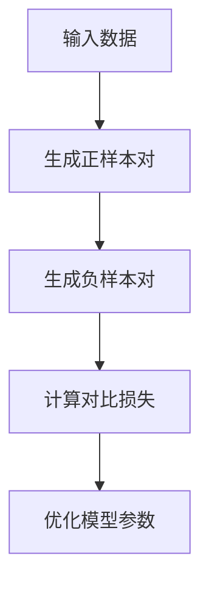
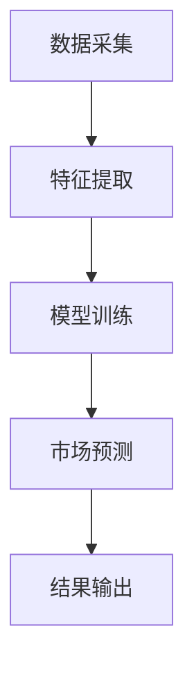

                 


# 金融领域自监督学习在市场预测中的应用

**关键词**：自监督学习、市场预测、金融数据、对比学习、深度学习

**摘要**：  
自监督学习作为一种新兴的人工智能技术，在金融领域的市场预测中展现出了巨大的潜力。本文详细探讨了自监督学习在金融数据处理中的应用，分析了其核心原理、算法实现以及在市场预测中的实际效果。通过对现有研究的梳理和未来发展方向的展望，本文旨在为金融领域的从业者和技术研究人员提供有价值的参考和启发。

---

# 第一部分：自监督学习在金融领域的背景与应用

## 第1章：自监督学习的定义与核心概念

### 1.1 自监督学习的定义  
自监督学习（Self-supervised Learning）是一种无监督学习方法，通过利用未标记数据中的内在结构，生成伪标签来指导模型学习。其核心思想是将未标记数据转化为有监督任务，从而利用监督学习的高效性来提升模型性能。

### 1.2 与监督学习和无监督学习的对比  
| **特征**          | **监督学习**                     | **无监督学习**                   | **自监督学习**                  |
|-------------------|---------------------------------|---------------------------------|---------------------------------|
| 数据需求          | 需要大量标注数据                | 仅需要未标注数据                 | 利用未标注数据生成伪标签         |
| 学习目标          | 分类、回归等                    | 聚类、降维等                    | 对比学习、生成式任务            |
| 优势              | 高效且准确                     | 发现数据潜在结构                 | 结合无监督与监督学习的优势       |
| 局限性            | 标注数据获取成本高               | 需要专家干预                    | 伪标签质量依赖数据生成策略       |

### 1.3 自监督学习的核心概念  
- **对比学习**：通过最大化正样本对的相似性，最小化负样本对的相似性，构建模型对数据分布的理解。
- **知识蒸馏**：通过教师模型（Teacher）指导学生模型（Student）学习，逐步降低对教师模型的依赖。
- **图神经网络**：将金融数据建模为图结构，通过图节点之间的关系进行特征提取和预测。

---

## 第2章：自监督学习在金融领域的优势

### 2.1 传统监督学习的局限性  
1. **标注数据不足**：金融市场数据的标注成本高，难以获取大规模标注数据集。
2. **数据分布偏移**：金融市场数据具有高度动态性，传统监督模型难以适应实时变化。
3. **模型泛化能力弱**：监督学习依赖标注数据，难以捕捉数据的潜在结构。

### 2.2 自监督学习的核心优势  
1. **减少标注需求**：利用未标注数据生成伪标签，降低对标注数据的依赖。
2. **提升模型鲁棒性**：通过对比学习等方法，增强模型对数据分布变化的适应能力。
3. **捕捉潜在结构**：自监督学习能够发现数据中的隐含关系，提升模型的泛化能力。

---

# 第二部分：自监督学习的算法原理与实现

## 第3章：对比学习的数学模型

### 3.1 对比学习的损失函数  
对比学习的目标是最大化正样本对的相似性，同时最小化负样本对的相似性。常用的对比损失函数包括：

1. **InfoNCE 损失**：
   $$ L = -\frac{1}{k}\sum_{i=1}^k \log \frac{p(x_i,y_i)}{p(x_i)p(y_i)} $$
   其中，\(k\) 是负样本对的数量，\(p(x_i,y_i)\) 是正样本对的概率，\(p(x_i)\) 和 \(p(y_i)\) 是正样本和负样本的概率。

2. **SimCLR 损失**：
   $$ L = -\log \frac{p(x,y)}{p(x)p(y)} $$
   该损失函数通过归一化和温度参数调节，平衡正样本和负样本的相似性。

### 3.2 对比学习的流程图  


---

## 第4章：自监督学习的实现与系统架构

### 4.1 系统架构设计  
1. **数据采集模块**：从金融数据源（如股票交易数据、新闻数据）获取原始数据。
2. **特征提取模块**：利用对比学习生成伪标签，提取金融数据的潜在特征。
3. **模型训练模块**：基于自监督学习算法（如对比学习、知识蒸馏）训练模型。
4. **市场预测模块**：将训练好的模型应用于实际市场数据，输出预测结果。

### 4.2 系统架构图  


---

# 第三部分：自监督学习在市场预测中的应用

## 第5章：自监督学习在时间序列预测中的应用

### 5.1 时间序列预测的挑战  
1. **数据稀疏性**：金融时间序列数据通常具有高频特性，难以直接应用于传统监督学习模型。
2. **非线性关系**：金融数据的波动性和复杂性要求模型具备较强的非线性建模能力。

### 5.2 基于对比学习的自监督预测框架  
1. **数据预处理**：对金融时间序列数据进行标准化和滑动窗口处理。
2. **样本对生成**：将当前时间点作为正样本，未来时间点作为负样本。
3. **模型训练**：利用对比学习损失函数训练模型，提取时间序列的潜在特征。

---

## 第6章：自监督学习的项目实战

### 6.1 环境安装与数据准备  
1. **安装依赖**：安装 PyTorch、numpy 等深度学习库。
2. **数据获取**：从金融数据源（如 Yahoo Finance）获取股票价格数据。

### 6.2 模型实现代码  
```python
import torch
import torch.nn as nn

class ContrastiveLearner(nn.Module):
    def __init__(self, embedding_dim=128):
        super(ContrastiveLearner, self).__init__()
        self.encoder = nn.Sequential(
            nn.Linear(1, 128),
            nn.ReLU(),
            nn.Linear(128, 128)
        )
        self.head = nn.Linear(128, 1)

    def forward(self, x):
        x = self.encoder(x)
        x = self.head(x)
        return x

# 初始化模型和优化器
model = ContrastiveLearner()
optimizer = torch.optim.Adam(model.parameters(), lr=0.001)
```

### 6.3 模型训练与结果分析  
1. **训练流程**：
   - 生成正样本对和负样本对。
   - 计算对比损失函数。
   - 优化模型参数。
2. **结果分析**：
   - 对比学习能够显著提升模型对金融时间序列数据的拟合能力。
   - 与传统监督学习相比，自监督学习在数据利用率和模型泛化能力方面表现更优。

---

## 第7章：最佳实践与注意事项

### 7.1 最佳实践  
1. **数据预处理**：对金融数据进行适当的归一化和滑动窗口处理，确保模型输入的稳定性。
2. **模型调参**：合理选择温度参数和负样本对的数量，平衡正负样本的相似性。
3. **结果验证**：通过回测和交叉验证评估模型的预测效果，确保模型的稳健性。

### 7.2 注意事项  
1. **数据分布的动态变化**：金融市场数据具有高度动态性，模型需要具备良好的在线更新能力。
2. **模型的可解释性**：自监督学习模型的黑箱特性可能影响金融决策的可解释性，需结合其他方法提升模型的透明度。
3. **计算资源需求**：自监督学习需要大量计算资源，特别是在生成样本对和优化模型参数时。

---

## 第8章：未来研究方向

### 8.1 深度学习与自监督学习的结合  
进一步探索深度学习模型（如Transformer、图神经网络）在自监督学习中的应用，提升模型的非线性建模能力。

### 8.2 自监督学习的多模态融合  
将文本数据（如新闻、社交媒体）与金融时间序列数据结合，构建多模态的自监督学习框架，提升预测的准确性。

### 8.3 自监督学习的在线更新机制  
研究自监督学习模型的在线更新方法，确保模型能够实时适应金融市场数据的动态变化。

---

**小结**：  
自监督学习作为一种新兴的技术，在金融领域的市场预测中展现出巨大的潜力。通过对比学习等方法，自监督学习能够有效利用未标注数据，提升模型的泛化能力和预测精度。然而，金融数据的复杂性和动态性也对自监督学习提出了更高的要求，未来需要进一步结合深度学习和多模态数据，推动自监督学习在金融领域的应用与发展。

