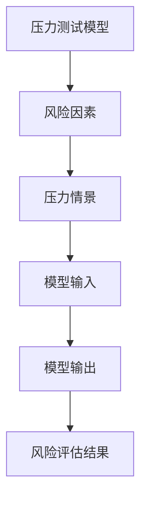
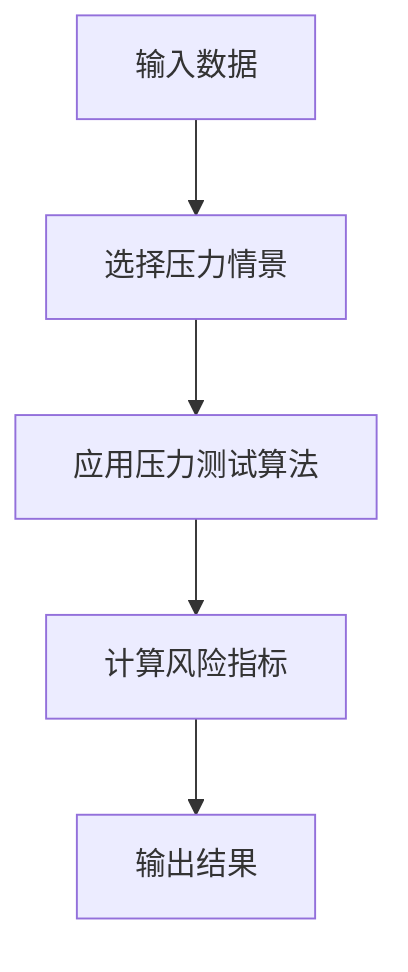
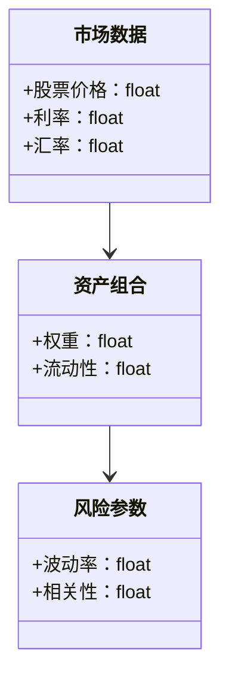
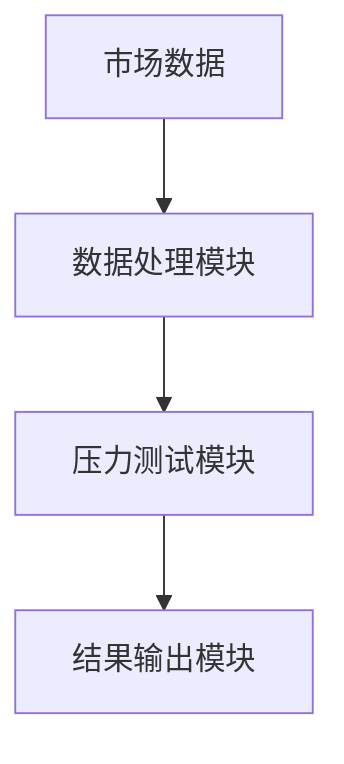

                 


# 《金融风险压力测试模型》

---

## 关键词：金融风险、压力测试、风险管理、VaR模型、蒙特卡洛模拟、系统架构、Python实现

---

## 摘要：本文系统地介绍了金融风险压力测试模型的核心概念、算法原理、系统架构设计及实际应用场景。通过详细讲解压力测试的基本原理、常用算法、数学公式和系统实现，结合实际案例分析，帮助读者全面理解如何构建和应用金融风险压力测试模型，以应对复杂的金融市场风险。

---

## 目录

### 第1章: 金融风险压力测试模型的背景与概念

1.1 金融风险压力测试的定义与作用  
1.2 金融风险压力测试的历史发展  
1.3 金融风险压力测试的核心概念  

### 第2章: 金融风险压力测试模型的核心概念与联系

2.1 压力测试模型的原理  
2.2 压力测试模型的输入与输出  
2.3 压力测试模型的ER实体关系图  

### 第3章: 金融风险压力测试模型的算法原理

3.1 压力测试模型的算法选择  
3.2 压力测试模型的数学公式  
3.3 压力测试模型的实现步骤  

### 第4章: 金融风险压力测试模型的系统分析与架构设计

4.1 系统分析  
4.2 系统功能设计  
4.3 系统架构设计  

### 第5章: 金融风险压力测试模型的项目实战

5.1 环境安装与配置  
5.2 核心代码实现与解读  
5.3 实际案例分析  

### 第6章: 金融风险压力测试模型的最佳实践与小结

6.1 小结与总结  
6.2 注意事项与风险提示  
6.3 拓展阅读与学习资源  

### 参考文献  

---

## 正文

### 第1章: 金融风险压力测试模型的背景与概念

#### 1.1 金融风险压力测试的定义与作用

**1.1.1 什么是金融风险压力测试**  
金融风险压力测试是一种用于评估金融资产或机构在极端市场条件下的表现和风险的方法。它通过模拟不同压力情景，分析资产或机构在这些情景下的损失情况，从而评估其承受风险的能力。

**1.1.2 压力测试在金融风险管理中的作用**  
压力测试是金融风险管理的重要工具，主要用于：  
- 评估资产组合在极端情况下的表现。  
- 识别潜在风险点并制定应对策略。  
- 满足监管要求，确保金融机构的稳健性。  

**1.1.3 压力测试的法律与监管要求**  
许多国家和地区的监管机构要求金融机构定期进行压力测试，以确保其在极端市场条件下的生存能力和稳定性。例如，巴塞尔协议要求银行进行压力测试，以评估其资本充足性。

#### 1.2 金融风险压力测试的历史发展

**1.2.1 压力测试的起源**  
压力测试的起源可以追溯到20世纪80年代，当时一些金融机构开始尝试通过模拟极端市场条件来评估其风险敞口。

**1.2.2 压力测试的发展阶段**  
压力测试经历了以下几个阶段：  
- **初步探索阶段**：主要应用于个别金融机构的风险评估。  
- **快速发展阶段**：随着技术的进步，压力测试逐渐应用于更复杂的金融体系。  
- **成熟应用阶段**：压力测试成为金融风险管理的标准工具之一。  

**1.2.3 当前压力测试的主要应用领域**  
目前，压力测试广泛应用于银行、保险、资产管理等金融领域，帮助机构评估市场风险、信用风险和操作风险。

#### 1.3 金融风险压力测试的核心概念

**1.3.1 风险因素的识别与量化**  
风险因素包括市场波动、信用违约、流动性风险等。压力测试需要将这些风险因素量化，并分析其对资产或机构的影响。

**1.3.2 压力情景的构建与选择**  
压力情景是压力测试的核心，通常包括极端市场下跌、利率剧烈波动、信用违约集中发生等情景。

**1.3.3 模型的输入、过程与输出**  
- **输入**：市场数据、资产组合、风险参数等。  
- **过程**：通过模型模拟压力情景，计算资产或机构的损失。  
- **输出**：风险指标，如VaR（Value at Risk）、CVaR（Conditional Value at Risk）等。

---

### 第2章: 金融风险压力测试模型的核心概念与联系

#### 2.1 压力测试模型的原理

**2.1.1 压力测试的基本原理**  
压力测试通过模拟极端市场条件，评估资产或机构在这些条件下的表现和风险。

**2.1.2 压力测试模型的分类**  
常见的压力测试模型包括：  
- **VaR模型**：计算资产在正常市场条件下的潜在损失。  
- **CVaR模型**：计算资产在极端市场条件下的潜在损失。  
- **蒙特卡洛模拟**：通过随机模拟市场变化，评估资产组合的风险。

**2.1.3 压力测试模型的优缺点对比**  
| 模型 | 优点 | 缺点 |  
|------|------|------|  
| VaR | 计算简单，适用性广 | 无法捕捉极端风险 |  
| CVaR | 能捕捉极端风险 | 计算复杂 |  
| 蒙特卡洛模拟 | 精确模拟市场变化 | 计算量大，耗时长 |  

#### 2.2 压力测试模型的输入与输出

**2.2.1 输入变量的定义与选择**  
输入变量包括：  
- 市场数据（如股票价格、利率、汇率等）。  
- 资产组合信息（如权重、流动性等）。  
- 风险参数（如波动率、相关性等）。  

**2.2.2 输出结果的解释与应用**  
输出结果包括：  
- VaR值：资产在一定置信水平下的潜在损失。  
- CVaR值：资产在VaR值以上的潜在损失。  
- 损失分布：资产在不同压力情景下的损失情况。  

**2.2.3 输入输出之间的关系分析**  
输入变量决定了压力情景的模拟结果，输出结果反映了资产在不同压力下的风险敞口。通过分析输入输出的关系，可以优化资产组合，降低风险。

#### 2.3 压力测试模型的ER实体关系图



---

### 第3章: 金融风险压力测试模型的算法原理

#### 3.1 压力测试模型的算法选择

**3.1.1 常用的压力测试算法**  
- **VaR模型**：基于统计方法，计算资产在正常市场条件下的潜在损失。  
- **CVaR模型**：基于VaR，计算资产在极端市场条件下的潜在损失。  
- **蒙特卡洛模拟**：通过随机模拟市场变化，评估资产组合的风险。  

**3.1.2 算法选择的影响因素**  
- **数据要求**：算法对数据的依赖程度。  
- **计算复杂度**：算法的计算量和时间复杂度。  
- **应用场景**：不同场景下适用的算法。  

**3.1.3 不同算法的适用场景**  
- **VaR模型**：适用于正常市场条件下的风险评估。  
- **CVaR模型**：适用于极端市场条件下的风险评估。  
- **蒙特卡洛模拟**：适用于复杂金融产品的风险评估。  

#### 3.2 压力测试模型的数学公式

**3.2.1 风险值计算公式**  
$$ \text{VaR} = \mu + z \times \sigma $$  
其中，$\mu$ 是平均值，$z$ 是标准正态分布的分位数，$\sigma$ 是标准差。  

**3.2.2 压力情景下的资产价格变化**  
$$ P_{\text{new}} = P_{\text{old}} \times (1 + \sigma) $$  
其中，$P_{\text{old}}$ 是原价格，$\sigma$ 是波动率。  

#### 3.3 压力测试模型的实现步骤



---

### 第4章: 金融风险压力测试模型的系统分析与架构设计

#### 4.1 系统分析

**4.1.1 系统目标与范围**  
系统目标：提供一个金融风险压力测试的平台，帮助金融机构评估其风险敞口。  
系统范围：包括市场数据采集、压力情景模拟、风险指标计算等功能。  

**4.1.2 系统功能需求**  
- 数据采集：采集市场数据、资产组合信息等。  
- 情景模拟：模拟不同压力情景，计算资产组合的风险。  
- 结果分析：输出风险指标，并提供可视化报告。  

#### 4.2 系统功能设计

**4.2.1 领域模型类图**  


**4.2.2 系统架构图**  


---

### 第5章: 金融风险压力测试模型的项目实战

#### 5.1 环境安装与配置

**5.1.1 环境要求**  
- 操作系统：Windows/Mac/Linux  
- Python版本：3.8以上  
- 开发工具：PyCharm/VSCode  
- 第三方库：NumPy、Pandas、Matplotlib  

**5.1.2 安装依赖**  
```bash
pip install numpy pandas matplotlib
```

#### 5.2 核心代码实现与解读

**5.2.1 VaR模型的实现**  
```python
import numpy as np

def calculate VaR(returns, confidence_level=0.95):
    sorted_returns = np.sort(returns)
    index = int(len(sorted_returns) * (1 - confidence_level))
    VaR = -sorted_returns[index]
    return VaR
```

**5.2.2 蒙特卡洛模拟的实现**  
```python
import numpy as np
import matplotlib.pyplot as plt

def monte_carlo_simulation(assets, num_simulations=10000):
    np.random.seed(42)
    simulated_returns = np.random.normal(0, 1, (num_simulations, len(assets)))
    asset_values = np.dot(simulated_returns, assets)
    plt.hist(asset_values, bins=50)
    plt.show()
```

#### 5.3 实际案例分析

**5.3.1 案例背景**  
假设我们有一个包含股票、债券和期货的资产组合，需要评估其在市场下跌50%情况下的VaR值。

**5.3.2 数据采集与处理**  
```python
import pandas as pd

data = pd.read_csv('market_data.csv')
returns = data.pct_change().dropna()
```

**5.3.3 模型应用与结果分析**  
```python
VaR_value = calculate VaR(returns, 0.99)
print(f"99% VaR: {VaR_value}")
```

---

### 第6章: 金融风险压力测试模型的最佳实践与小结

#### 6.1 小结与总结

- 压力测试是金融风险管理的重要工具。  
- 选择合适的算法和模型是压力测试成功的关键。  
- 实际应用中，需要结合市场数据和机构需求，灵活调整模型参数。  

#### 6.2 注意事项与风险提示

- 数据质量：确保输入数据的准确性和完整性。  
- 模型假设：压力测试模型基于假设条件，结果仅供参考。  
- 结果解读：压力测试结果需结合实际市场情况，避免过度解读。  

#### 6.3 拓展阅读与学习资源

- 《金融风险管理》：约翰·C·赫利（John C. Hull）  
- 《蒙特卡洛方法在金融中的应用》：保罗·J·斯威兹（Paul J. Swiz）  

---

## 参考文献

1. John C. Hull, "风险管理与金融创新"。  
2. 张维，"金融风险测度方法研究"。  
3. 李明，"压力测试在银行风险管理中的应用"。

