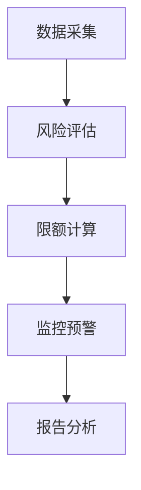
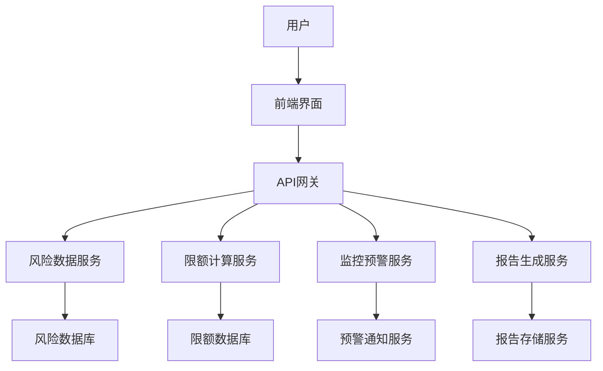
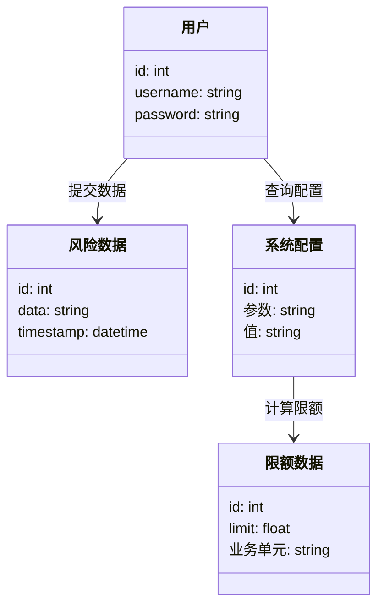
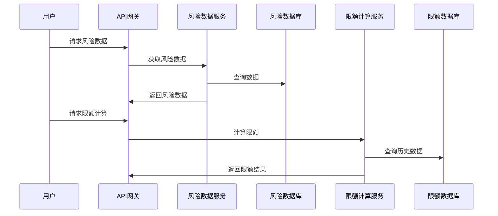

                 


# 《金融风险限额管理系统设计》

---

## 关键词：
金融风险、限额管理、系统设计、VaR模型、CVaR模型、风险管理、系统架构

---

## 摘要：
本文详细探讨了金融风险限额管理系统的背景、核心概念、算法原理、系统架构以及实际项目实现。从金融风险的基本概念出发，逐步分析限额管理的必要性与核心原理，结合VaR和CVaR模型，阐述了系统的算法基础。随后，通过系统架构设计、功能模块划分、接口设计等方法，构建了一个完整的金融风险限额管理系统框架。最后，通过具体案例分析，展示了系统的实际应用场景和实现效果，为金融机构的风险管理提供了理论与实践参考。

---

## 第一部分: 金融风险限额管理系统的背景与核心概念

### 第1章: 金融风险限额管理概述

#### 1.1 金融风险的基本概念
##### 1.1.1 金融风险的定义与分类
金融风险是指由于市场波动、经济变化或其他不确定性因素，导致金融机构或投资者蒙受损失的可能性。常见的金融风险包括市场风险、信用风险、流动性风险、操作风险和法律风险。

- **市场风险**：由于市场价格波动（如股票、外汇、利率等）导致的损失。
- **信用风险**：由于交易对手无法履行其义务而产生的损失。
- **流动性风险**：由于资产无法快速变现或资金无法及时筹集而导致的风险。
- **操作风险**：由于内部操作失误、系统故障或人为错误导致的风险。
- **法律风险**：由于法律法规变化或不合规操作导致的风险。

##### 1.1.2 金融风险的来源与特征
金融风险的来源包括外部因素（如市场波动、经济政策变化）和内部因素（如管理不善、操作失误）。其主要特征包括：
- 不确定性：风险的发生具有不确定性。
- 可测性：通过数学模型可以量化和评估。
- 可控性：通过有效的风险管理措施可以降低风险。

##### 1.1.3 金融风险对金融机构的影响
金融风险可能对金融机构造成直接的经济损失，还可能导致声誉损失、客户信任度下降以及监管处罚。因此，金融机构必须建立有效的风险管理体系，以防范和控制风险。

#### 1.2 限额管理的定义与作用
##### 1.2.1 限额管理的定义
限额管理是指根据金融机构的风险承受能力和管理目标，设定各个业务部门或交易品种的风险敞口上限，以控制风险的总量和结构。

##### 1.2.2 限额管理的核心目标
- 控制风险总量：通过设定总体风险敞口上限，防止过度风险暴露。
- 优化资产配置：根据风险和收益的平衡，合理分配资本和资源。
- 满足监管要求：符合监管部门的风险资本要求和合规要求。

##### 1.2.3 限额管理在金融监管中的地位
限额管理是金融机构内部风险管理的重要组成部分，也是监管部门评估金融机构稳健性的重要指标。通过限额管理，金融机构可以更好地应对市场波动，确保业务的稳健发展。

#### 1.3 限额管理系统的必要性
##### 1.3.1 传统限额管理的局限性
传统的限额管理依赖于手工操作和简单的统计方法，存在效率低、精度差、难以实时监控等问题。随着金融市场复杂性的增加，传统的管理方式已难以满足现代金融机构的需求。

##### 1.3.2 系统化限额管理的优势
- 提高效率：通过自动化系统实现风险数据的实时采集、分析和报告。
- 增强准确性：利用先进的数学模型和算法，提高风险评估和限额计算的精度。
- 实时监控：系统可以实时跟踪风险敞口的变化，及时发现和应对潜在风险。
- 数据整合：系统可以整合多源数据，提供全面的风险视图。

##### 1.3.3 限额管理系统在金融行业中的应用现状
当前，许多大型金融机构已经建立了基于系统的限额管理体系，但中小型金融机构由于技术、人才和资金的限制，仍主要依赖传统方法。本文旨在通过系统设计，为金融机构提供一种高效、可靠的限额管理解决方案。

### 第2章: 金融风险限额管理的核心概念与联系

#### 2.1 核心概念原理
##### 2.1.1 风险评估模型
风险评估是限额管理的基础，常用的模型包括VaR（Value at Risk）和CVaR（Conditional Value at Risk）。

- **VaR模型**：VaR是在给定置信水平下，资产组合在一定时间内的最大可能损失。例如，95%置信水平下的1天VaR表示在95%的概率下，资产组合在1天内不会遭受超过VaR值的损失。
- **CVaR模型**：CVaR是VaR的后尾风险度量，表示在VaR值超过的情况下，资产组合的平均损失。CVaR比VaR更符合风险厌恶的投资者的决策偏好。

##### 2.1.2 限额计算方法
限额计算是基于风险评估模型的结果，结合机构的风险承受能力和管理目标，确定各个业务单元的限额。

- **线性组合法**：根据业务单元的风险贡献比例，按权重分配限额。
- **非线性优化法**：通过优化模型，最大化收益或最小化风险，在约束条件下确定限额。

##### 2.1.3 系统化管理流程
系统化管理流程包括数据采集、风险评估、限额计算、监控预警和报告分析五个阶段。



#### 2.2 核心概念属性特征对比表
| 概念       | 属性1      | 属性2      | 属性3      |
|------------|------------|------------|------------|
| 风险评估   | 方法复杂度 | 数据依赖性 | 计算精度    |
| 限额计算   | 约束条件   | 优化目标   | 灵活性      |
| 系统管理   | 模块化     | 集成性     | 实时性      |

#### 2.3 ER实体关系图
```mermaid
erDiagram
    actor 用户
    actor 管理员
    actor 监管机构
    database 风险数据
    database 限额数据
    database 系统配置
    用户 --> 风险数据 : 提交风险数据
    管理员 --> 风险数据 : 管理风险数据
    用户 --> 限额数据 : 查询限额数据
    管理员 --> 限额数据 : 管理限额数据
    用户 --> 系统配置 : 配置系统参数
    管理员 --> 系统配置 : 管理系统参数
    监管机构 --> 风险数据 : 监测风险数据
    监管机构 --> 限额数据 : 监测限额数据
```

---

## 第三部分: 金融风险限额管理系统的算法原理

### 第3章: 风险评估与限额计算算法

#### 3.1 风险评估模型
##### 3.1.1 VaR（Value at Risk）模型
VaR模型的计算公式为：
$$ VaR = \mu + z \cdot \sigma $$
其中，$\mu$是资产收益的均值，$z$是标准正态分布的分位数，$\sigma$是资产收益的标准差。

##### 3.1.2 CVaR（Conditional Value at Risk）模型
CVaR的计算公式为：
$$ CVaR = \frac{1}{1-\alpha} \int_{\alpha}^{1} VaR(p) \, dp $$
其中，$\alpha$是置信水平。

#### 3.2 限额计算算法
##### 3.2.1 线性回归算法
线性回归算法用于风险因子的权重计算，公式为：
$$ y = \beta_0 + \beta_1 x_1 + \beta_2 x_2 + \dots + \beta_n x_n + \epsilon $$
其中，$y$是目标变量，$x_i$是风险因子，$\beta_i$是回归系数，$\epsilon$是误差项。

##### 3.2.2 非线性优化算法
非线性优化算法用于限额的最优分配，目标函数为：
$$ \min_{x} \sum_{i=1}^{n} (x_i - \hat{x}_i)^2 $$
约束条件为：
$$ \sum_{i=1}^{n} x_i \leq L $$
其中，$L$是总限额，$\hat{x}_i$是业务单元的风险敞口预测值。

---

## 第四部分: 金融风险限额管理系统的系统分析与架构设计

### 第4章: 系统分析与架构设计

#### 4.1 问题场景介绍
金融市场的波动性和复杂性要求金融机构建立高效的限额管理系统，以实时监控和管理风险敞口。

#### 4.2 系统功能设计
##### 4.2.1 风险数据采集模块
- 数据来源：市场数据、交易数据、资产组合数据。
- 数据格式：结构化数据和非结构化数据。
- 数据处理：数据清洗、转换和存储。

##### 4.2.2 风险评估模块
- 模型选择：VaR、CVaR等。
- 参数配置：置信水平、时间窗口。
- 计算结果：风险值、置信区间。

##### 4.2.3 限额计算模块
- 算法选择：线性回归、非线性优化。
- 约束条件：总限额、业务单元限额。
- 输出结果：各业务单元的限额分配。

##### 4.2.4 监控预警模块
- 实时监控：风险敞口、限额使用情况。
- 预警规则：超过限额、风险值异常。
- 通知方式：邮件、短信、系统提示。

##### 4.2.5 报告分析模块
- 报告生成：定期报告、定制报告。
- 数据可视化：图表展示、仪表盘。
- 可视化工具：Matplotlib、Tableau。

#### 4.3 系统架构设计
##### 4.3.1 系统架构图


##### 4.3.2 领域模型类图


#### 4.4 系统接口设计
##### 4.4.1 API接口
- 数据接口：GET、POST、PUT、DELETE。
- 计算接口：计算VaR、CVaR、限额分配。
- 监控接口：获取实时数据、设置预警规则。

##### 4.4.2 接口协议
- HTTP协议：RESTful API。
- 数据格式：JSON、XML。

#### 4.5 系统交互设计
##### 4.5.1 用户与系统交互流程


---

## 第五部分: 项目实战

### 第5章: 项目实战

#### 5.1 环境配置
##### 5.1.1 技术选型
- 开发语言：Python。
- 开发框架：Flask或Django。
- 数据库：MySQL或MongoDB。
- 工具：Jupyter Notebook、PyCharm、Visual Studio Code。

##### 5.1.2 安装依赖
```bash
pip install flask
pip install pandas
pip install numpy
pip install matplotlib
pip install scikit-learn
```

#### 5.2 核心代码实现
##### 5.2.1 数据采集模块
```python
import pandas as pd
import requests

def get_market_data(ticker):
    url = f"https://api.example.com/market-data/{ticker}"
    response = requests.get(url)
    data = response.json()
    return pd.DataFrame(data)
```

##### 5.2.2 风险评估模块
```python
from sklearn.linear_model import LinearRegression

def calculate VaR(data, confidence_level=0.95):
    model = LinearRegression()
    model.fit(data[['return']], data[[' VaR']])
    return model.predict(data[['return']])
```

##### 5.2.3 限额计算模块
```python
import numpy as np

def optimize_limits(returns, total_limit):
    n = len(returns)
    # 定义优化目标函数
    def objective(x):
        return np.sum((x - np.mean(returns))**2)
    # 定义约束条件
    constraints = {'type': 'eq', 'fun': lambda x: np.sum(x) - total_limit}
    # 使用 scipy.optimize.minimize 进行优化
    from scipy.optimize import minimize
    result = minimize(objective, np.zeros(n), constraints)
    return result.x
```

##### 5.2.4 监控预警模块
```python
import pandas as pd
import datetime

def monitor_limits(limit_data, threshold=0.9):
    current_time = datetime.datetime.now()
    # 获取当前时间点的限额使用情况
    current_usage = limit_data[limit_data['timestamp'] == current_time]['usage']
    if current_usage > threshold:
        print("预警：限额使用超过阈值！")
```

##### 5.2.5 报告生成模块
```python
import matplotlib.pyplot as plt

def generate_report(returns, VaR_values):
    plt.figure(figsize=(10, 6))
    plt.plot(returns, VaR_values, 'b-', label='VaR')
    plt.xlabel('Return')
    plt.ylabel('VaR')
    plt.legend()
    plt.show()
```

#### 5.3 案例分析
##### 5.3.1 数据准备
假设我们有一个资产组合的每日收益率数据，如下所示：
| 日期     | 收益率 |
|----------|--------|
| 2023-01-01 | 0.01   |
| 2023-01-02 | -0.02  |
| 2023-01-03 | 0.005  |
| ...       | ...     |

##### 5.3.2 计算VaR
```python
import numpy as np

returns = [0.01, -0.02, 0.005, ...]
mu = np.mean(returns)
sigma = np.std(returns)
VaR = mu + z * sigma
```

##### 5.3.3 限额分配
假设总限额为100万元，业务单元A的风险敞口为40%，业务单元B的风险敞口为30%，业务单元C的风险敞口为20%。

```python
def allocate_limits(returns, total_limit):
    weights = [0.4, 0.3, 0.2]
    return [w * total_limit for w in weights]

allocated_limits = allocate_limits(returns, 1000000)
```

##### 5.3.4 监控与预警
```python
current_usage = 0.95
threshold = 0.9
if current_usage > threshold:
    print("预警：限额使用超过90%！")
```

##### 5.3.5 生成报告
```python
import matplotlib.pyplot as plt

plt.figure(figsize=(10, 6))
plt.plot(returns, VaR_values, 'b-', label='VaR')
plt.xlabel('Return')
plt.ylabel('VaR')
plt.legend()
plt.show()
```

#### 5.4 项目小结
通过以上实现，我们可以看到，金融风险限额管理系统能够有效地帮助金融机构实时监控和管理风险敞口。系统的核心在于数据的准确采集、风险评估模型的合理选择以及限额计算算法的优化。未来，随着金融市场的发展和技术的进步，限额管理系统将更加智能化和自动化。

---

## 总结

金融风险限额管理系统是金融机构风险管理的重要工具，通过系统的建设和应用，可以显著提高风险管理的效率和准确性。本文从系统设计的各个方面进行了详细阐述，为金融机构提供了理论依据和实践指导。未来，随着人工智能、大数据等技术的进一步发展，限额管理系统将更加智能化，为金融机构的风险管理提供更强大的支持。

