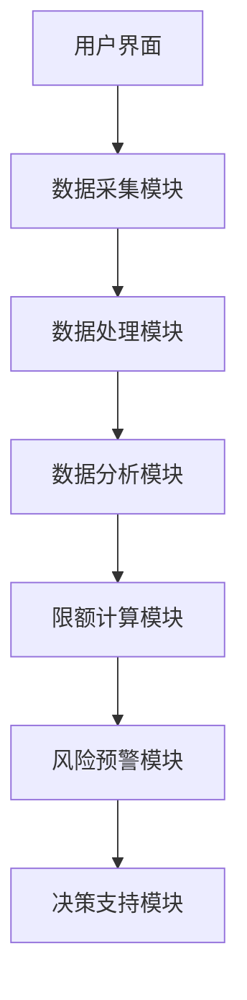
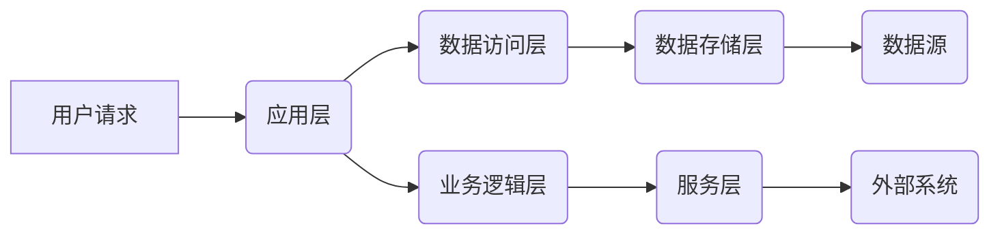
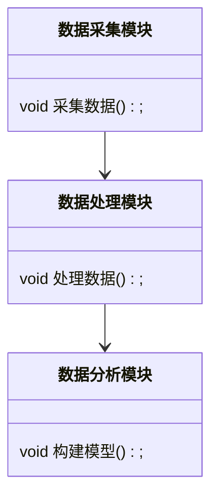
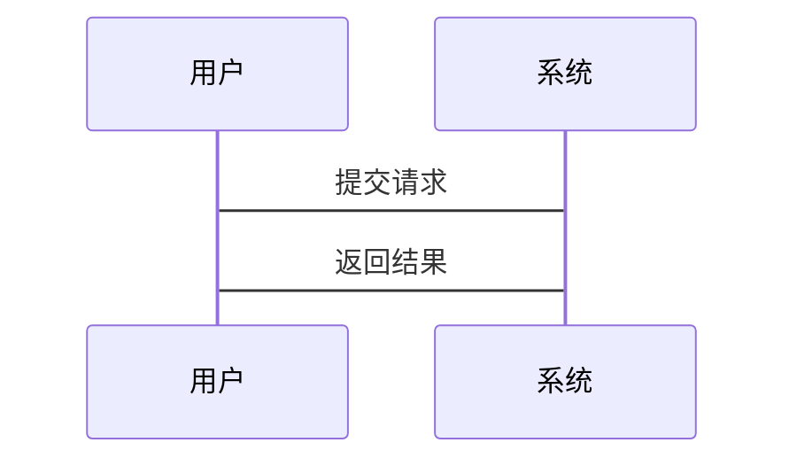

                 


# 金融风险限额管理自动化系统

## 关键词：金融风险，限额管理，人工智能，自动化系统，风险评估，风险管理工具，系统架构

## 摘要：  
金融风险限额管理是金融机构运营中的核心任务之一，旨在通过科学的方法和工具，对潜在风险进行识别、评估和控制。随着金融市场的日益复杂化和数据量的爆炸式增长，传统的限额管理方法已难以满足现代金融机构的需求。基于人工智能和大数据的金融风险限额管理自动化系统，通过智能化的数据处理、模型构建和实时监控，能够显著提升风险管理和控制的效率与精准度。本文将详细探讨该系统的构建背景、核心原理、系统架构及其实现方法，为金融机构提供一种高效的风险管理解决方案。

---

# 第1章 问题背景与需求分析

## 1.1 金融风险限额管理的背景

### 1.1.1 金融风险的基本概念
金融风险是指在金融活动中，由于内外部环境的不确定性，导致资金损失、信用违约或其他负面结果的可能性。常见的金融风险类型包括市场风险、信用风险、流动性风险和操作风险。

### 1.1.2 限额管理的定义与作用
限额管理是金融机构为了控制风险而设定的一系列量化指标，用于约束特定业务或资产的风险敞口。其主要作用包括：
- **风险控制**：通过设定上限和下限，限制潜在的损失。
- **资源分配**：合理分配资本和流动性资源。
- **决策支持**：为管理层提供数据支持，优化业务决策。

### 1.1.3 自动化管理的必要性
传统限额管理依赖人工操作，存在效率低、误差大、响应慢等问题。随着金融市场波动加剧和业务复杂度提升，金融机构亟需借助自动化技术，实现风险的实时监控和智能调整。

---

## 1.2 问题描述与目标

### 1.2.1 传统限额管理的痛点
- 数据处理效率低下，难以应对海量数据。
- 风险评估模型单一，缺乏动态调整能力。
- 缺乏实时监控机制，难以及时应对风险事件。

### 1.2.2 自动化系统的建设目标
- 实现风险数据的自动化采集、处理和分析。
- 构建动态调整的限额模型，提升风险控制能力。
- 提供实时监控和预警功能，确保风险可控。

### 1.2.3 系统边界与核心要素
- **系统边界**：聚焦于限额管理，与其他业务系统（如交易系统、财务系统）进行数据交互。
- **核心要素**：数据源、模型算法、监控模块、决策模块。

---

## 1.3 核心概念与系统架构

### 1.3.1 核心概念的定义
- **风险敞口**：指金融机构在某一业务或资产上的风险暴露程度。
- **风险限额**：基于风险敞口设定的上限或下限。
- **自动化技术**：利用AI和大数据技术实现数据处理和决策优化。

### 1.3.2 系统架构的初步设计


### 1.3.3 系统功能模块划分
- **数据采集模块**：从交易系统、市场数据等来源获取实时数据。
- **数据处理模块**：清洗、转换和存储数据。
- **数据分析模块**：构建模型，评估风险敞口。
- **限额计算模块**：根据模型输出，动态调整限额。
- **风险预警模块**：实时监控，触发预警机制。
- **决策支持模块**：提供决策建议，优化业务策略。

---

# 第2章 核心概念与系统架构

## 2.1 核心概念原理

### 2.1.1 金融风险的量化方法
- **VaR（在险价值）**：衡量在一定置信水平下的潜在损失。
- **CVaR（条件在险价值）**：VaR的扩展，考虑尾部风险。

### 2.1.2 限额管理的数学模型
$$ \text{VaR} = \sigma \cdot z $$
其中，σ为标准差，z为对应的分位数。

### 2.1.3 自动化技术的应用场景
- 数据采集与处理：利用爬虫、API等技术获取实时数据。
- 模型构建：基于机器学习算法（如SVM、随机森林）构建风险评估模型。
- 实时监控：通过流数据处理技术（如Kafka、Flink）实现动态监控。

---

## 2.2 概念属性对比表

| 概念       | 属性1（数据驱动） | 属性2（实时性） | 属性3（动态调整） |
|------------|--------------------|-----------------|-------------------|
| 传统限额管理 | 依赖历史数据      | 低              | 困难               |
| 自动化限额管理 | 结合实时数据      | 高              | 易                 |

---

## 2.3 系统架构设计

### 2.3.1 系统架构图


### 2.3.2 模块划分与功能描述
- **应用层**：处理用户请求，提供交互界面。
- **数据访问层**：负责数据的读取和写入。
- **数据存储层**：存储风险数据、模型参数等。
- **业务逻辑层**：执行具体的业务逻辑，如限额计算。
- **服务层**：提供对外接口，与其他系统交互。

---

# 第3章 算法原理与数学模型

## 3.1 支持向量机（SVM）原理

### 3.1.1 基本概念
支持向量机是一种监督学习算法，主要用于分类和回归问题。

### 3.1.2 SVM的数学模型
$$ \text{目标函数: } \min_{w,b,\xi} \frac{1}{2}||w||^2 + C\sum_{i=1}^n \xi_i $$

### 3.1.3 算法实现步骤
1. 数据预处理：归一化、特征选择。
2. 模型训练：使用SVM算法训练模型。
3. 模型预测：基于训练好的模型进行风险评估。

### 3.1.4 应用案例
使用SVM算法对股票价格进行预测，帮助机构制定投资策略。

---

## 3.2 随机森林算法

### 3.2.1 算法定义
随机森林是一种基于决策树的集成学习算法。

### 3.2.2 数学模型
$$ \text{投票机制: } \text{多数投票决定最终结果} $$

### 3.2.3 算法实现步骤
1. 生成多个决策树。
2. 对每个样本进行投票，得到最终预测结果。

### 3.2.4 应用案例
利用随机森林算法对信用风险进行评估，预测客户违约概率。

---

# 第4章 系统分析与架构设计

## 4.1 问题场景介绍

### 4.1.1 项目介绍
本项目旨在开发一个基于机器学习的金融风险限额管理自动化系统，帮助金融机构实现风险的智能化管理。

### 4.1.2 系统功能设计
- 数据采集模块：从交易系统和市场数据中获取实时数据。
- 数据处理模块：清洗、转换和存储数据。
- 数据分析模块：构建风险评估模型，计算风险敞口。
- 限额计算模块：动态调整风险限额。
- 风险预警模块：实时监控，触发预警机制。
- 决策支持模块：提供决策建议，优化业务策略。

### 4.1.3 系统功能设计类图


---

## 4.2 系统架构设计

### 4.2.1 系统架构图


### 4.2.2 接口设计
- 数据接口：与交易系统和市场数据源对接。
- 用户接口：提供交互界面，展示风险信息。

---

## 4.3 交互流程图

### 4.3.1 交互流程


---

# 第5章 项目实战

## 5.1 环境安装

### 5.1.1 安装Python
使用Anaconda安装Python 3.8及以上版本。

### 5.1.2 安装依赖库
安装numpy、pandas、scikit-learn等机器学习库。

## 5.2 核心代码实现

### 5.2.1 数据处理代码
```python
import pandas as pd
import numpy as np

# 读取数据
data = pd.read_csv('risk_data.csv')

# 数据清洗
data = data.dropna()
data = (data - data.mean()) / data.std()
```

### 5.2.2 模型训练代码
```python
from sklearn.svm import SVC
from sklearn.model_selection import train_test_split

# 划分训练集和测试集
X_train, X_test, y_train, y_test = train_test_split(data.drop('label', axis=1), data['label'], test_size=0.2)

# 训练SVM模型
model = SVC()
model.fit(X_train, y_train)

# 预测结果
y_pred = model.predict(X_test)
```

## 5.3 项目总结

### 5.3.1 项目小结
通过本项目，我们成功实现了金融风险限额管理的自动化系统，提升了金融机构的风险控制能力。

---

# 第6章 最佳实践

## 6.1 小结
金融风险限额管理自动化系统的建设，不仅提高了效率，还增强了风险管理的精准性。

## 6.2 注意事项
- 数据安全：确保数据的保密性和完整性。
- 系统稳定性：保证系统的高可用性。

## 6.3 拓展阅读
建议深入学习机器学习和大数据技术，进一步优化系统性能。

---

# 总结

通过本文的详细讲解，我们了解了金融风险限额管理自动化系统的构建背景、核心原理和系统架构。希望本文能够为金融机构的风险管理提供有价值的参考和启示。

