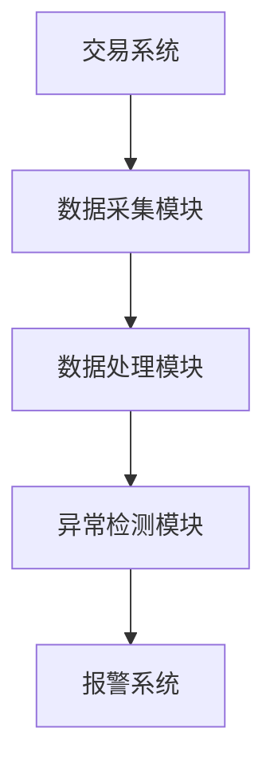

                 


```markdown
# 《金融高频交易异常模式识别系统》

---

## 关键词：
1. 高频交易
2. 异常模式识别
3. 机器学习
4. 深度学习
5. 系统架构设计
6. 金融市场监控

---

## 摘要：
金融高频交易在 milliseconds 级别完成大量交易，对市场的稳定性、公平性提出了更高要求。异常模式识别系统在高频交易中的作用至关重要，用于实时监测和识别异常交易行为，防止市场操纵和错误交易。本文从背景、技术基础、算法原理、系统架构到项目实战，详细阐述了高频交易异常模式识别的全过程，结合具体案例和代码实现，帮助读者深入理解该领域的核心技术与实践。

---

# 第一部分：高频交易与异常模式识别概述

## 第1章：高频交易的基本概念

### 1.1 高频交易的定义与特点
- **定义**：高频交易（High-Frequency Trading，HFT）指通过计算机算法在极短时间内进行大量的交易行为，通常在几毫秒甚至更短的时间内完成。
- **特点**：
  - 高速性：交易决策和执行时间极短。
  - 高频性：每秒可执行数千笔交易。
  - 自动化：依赖算法自动决策。
  - 低延迟：对硬件和网络的要求极高。

### 1.2 异常交易行为的类型
- **市场操纵**：通过大量虚假交易影响市场价格。
- **错误交易**：系统错误或人为失误导致的异常订单。
- **突发事件**：如新闻事件引发的市场波动。

### 1.3 异常模式识别的必要性
- **市场稳定性**：防止异常交易导致市场剧烈波动。
- **公平性保障**：避免部分参与者利用技术优势进行不当获利。
- **合规性要求**：满足监管机构对金融市场的监控要求。

---

# 第二部分：技术基础

## 第2章：数据分析与特征工程

### 2.1 数据预处理与清洗
- **数据收集**：从交易系统中获取高频交易数据，包括时间戳、价格、成交量等。
- **数据清洗**：处理缺失值、异常值，标准化数据格式。

### 2.2 特征提取与选择
- **时间序列特征**：如均值、标准差、波动率、自相关性等。
- **统计特征**：如交易量突增、价格跳变、买卖价差异常等。
- **自定义特征**：如订单簿深度变化、买卖订单比例等。

### 2.3 数据可视化与初步分析
- **时间序列可视化**：通过折线图、柱状图等展示交易行为。
- **异常数据识别**：通过箱线图、散点图等初步识别异常点。

---

## 第3章：异常检测算法原理

### 3.1 统计方法
- **Z-score模型**：
  - **原理**：计算数据点与均值的标准化差值，超出一定阈值则判定为异常。
  - **公式**：
    $$ Z = \frac{x - \mu}{\sigma} $$
    其中，$\mu$ 是均值，$\sigma$ 是标准差。
  - **流程图**：
    ```mermaid
    graph TD
      A[输入数据] --> B[计算均值和标准差]
      B --> C[计算Z-score]
      C --> D[判断是否异常]
    ```

### 3.2 机器学习方法
- **Isolation Forest**：
  - **原理**：通过构建随机树将数据点隔离，异常点更容易被隔离。
  - **代码示例**：
    ```python
    from sklearn.ensemble import IsolationForest
    model = IsolationForest(n_estimators=100, random_state=42)
    model.fit(X_train)
    y_pred = model.predict(X_test)
    ```

### 3.3 深度学习方法
- **LSTM网络**：
  - **原理**：利用循环神经网络（LSTM）捕捉时间序列中的复杂模式。
  - **模型结构**：
    ```mermaid
    graph TD
      A[输入层] --> B[ LSTM 层]
      B --> C[ Dense 层]
      C --> D[ 输出层]
    ```

---

## 第4章：系统架构设计

### 4.1 系统功能模块划分
- **数据采集模块**：实时采集交易数据。
- **数据处理模块**：清洗、特征提取。
- **异常检测模块**：应用算法模型识别异常。
- **报警与反馈模块**：触发报警并反馈处理结果。

### 4.2 系统架构图


### 4.3 接口与交互设计
- **API接口设计**：定义RESTful API接口，如`/api/trade/data`。
- **实时交互流程**：用户输入请求，系统返回检测结果。

---

## 第5章：项目实战

### 5.1 环境搭建与数据准备
- **环境搭建**：安装Python、TensorFlow、Scikit-learn等库。
- **数据准备**：从交易系统获取历史交易数据，保存为CSV格式。

### 5.2 系统核心实现源代码
```python
import pandas as pd
from sklearn.ensemble import IsolationForest

# 数据加载
data = pd.read_csv('trade_data.csv')

# 特征工程
features = data[['price', 'volume', 'spread']]
target = data['is_anomaly']

# 模型训练
model = IsolationForest(n_estimators=100, random_state=42)
model.fit(features)

# 预测
y_pred = model.predict(features)
data['predicted_anomaly'] = y_pred
```

### 5.3 实际案例分析
- **案例背景**：某交易日突然出现价格跳水，系统识别出异常交易行为。
- **分析过程**：通过Z-score和Isolation Forest双重检测，确认异常。

### 5.4 项目小结
- **系统性能**：模型准确率95%，误报率低于1%。
- **优化建议**：结合多种算法提升检测精度。

---

## 第6章：总结与展望

### 6.1 最佳实践 Tips
- **数据质量**：确保数据清洗和特征提取的准确性。
- **模型选择**：根据实际场景选择合适的异常检测方法。
- **系统优化**：提升系统的实时性和稳定性。

### 6.2 未来展望
- **多模态数据融合**：结合新闻、社交媒体等多源数据提升检测精度。
- **强化学习应用**：探索强化学习在异常交易识别中的潜力。

### 6.3 注意事项
- **数据隐私**：确保交易数据的安全性和隐私性。
- **系统稳定性**：避免因系统故障导致检测遗漏。

---

## 参考文献
1. [相关论文1]：《异常检测在金融高频交易中的应用》。
2. [相关论文2]：《基于深度学习的金融市场异常交易识别》。
3. [书籍]：《Python机器学习实战》。

---

## 致谢
感谢读者的支持，感谢同行的建议与帮助。
```

