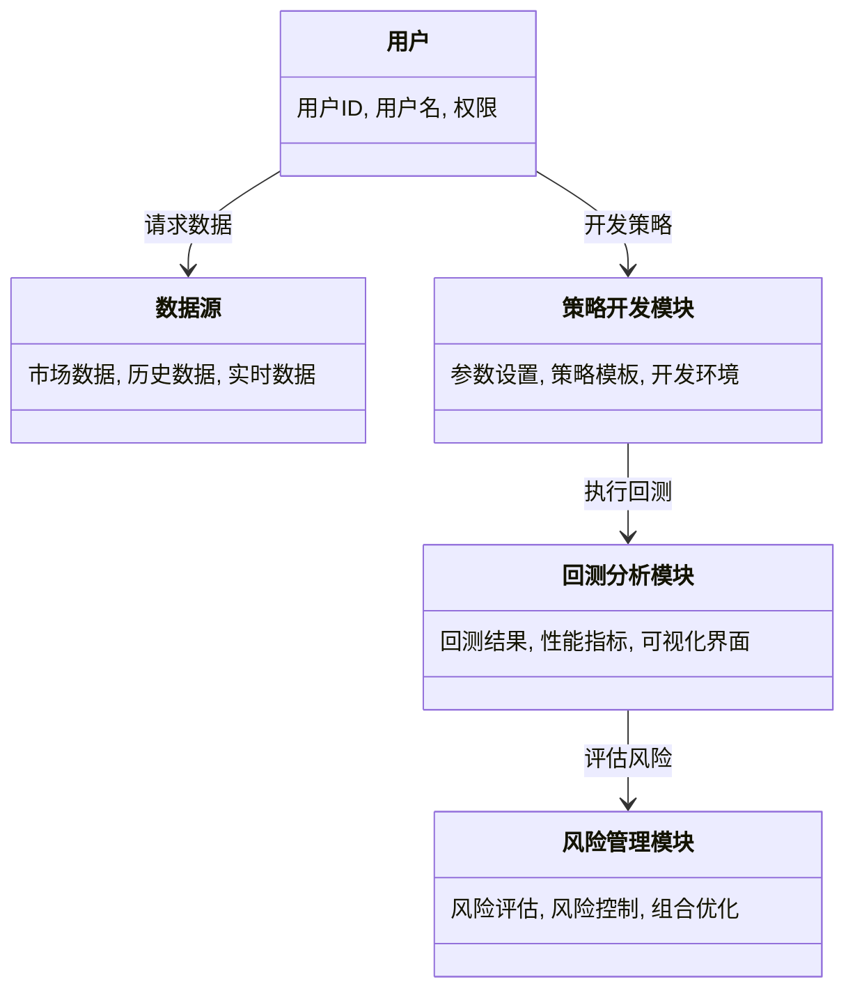
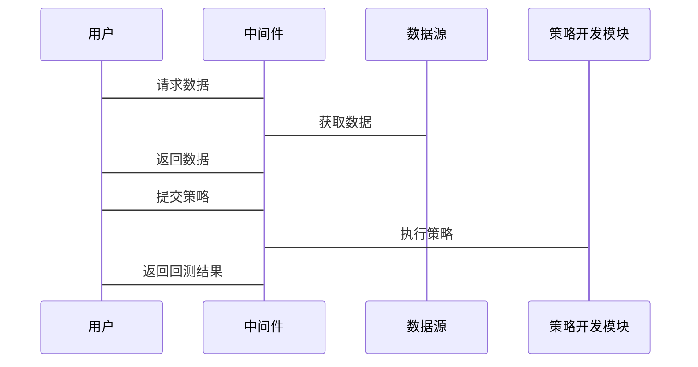

                 


# 《金融高频交易策略回测平台》

> **关键词**：高频交易、回测平台、策略开发、算法优化、金融系统架构

> **摘要**：本文系统地探讨了金融高频交易策略回测平台的设计与实现。首先介绍了高频交易和回测平台的基本概念及其在现代金融市场中的重要性。接着深入分析了高频交易策略的核心概念、算法原理和优化方法。然后详细阐述了回测平台的系统架构设计，包括功能模块划分、数据流设计和接口规范。通过一个实际的项目案例，详细讲解了平台的核心实现、测试与优化过程，并提出了性能优化和扩展性的改进方案。最后，总结了高频交易策略回测平台的关键点，展望了未来的发展趋势。

---

# 第4章: 回测平台的系统架构与设计

## 4.1 系统功能设计

### 4.1.1 数据采集与处理模块
- 数据来源：实时市场数据接口、历史数据存储。
- 数据清洗：处理缺失值、异常值。
- 数据预处理：标准化、特征提取。

### 4.1.2 策略开发模块
- 策略模板：提供可配置的参数和接口。
- 策略测试：局部回测、全周期回测。
- 策略分析：绘制回测曲线、计算指标（如 Sharpe 比率）。

### 4.1.3 回测分析模块
- 绩效评估：夏普比率、最大回撤、年化收益。
- 数据可视化：K线图、收益曲线、风险指标分布。
- 策略优化：参数优化、组合优化。

### 4.1.4 风险管理模块
- 风险评估：VaR、CVaR。
- 风险控制：头寸限制、止损设置。
- 组合优化：风险调整后的收益最大化。

---

## 4.2 系统架构设计

### 4.2.1 领域模型设计


### 4.2.2 系统架构设计


### 4.2.3 接口设计
- 数据接口：RESTful API。
- 策略接口：函数调用。
- 结果接口：JSON 格式。

### 4.2.4 交互流程


---

## 4.3 系统实现

### 4.3.1 系统实现细节
- 数据库选型：使用 MongoDB 存储非结构化数据。
- 技术选型：Python（策略开发）、Flask（Web 服务）、Django（数据处理）。

---

# 第5章: 项目实战

## 5.1 环境安装与配置

### 5.1.1 环境搭建
- 安装 Python 3.8+。
- 安装依赖：`pip install pandas numpy matplotlib requests`。

## 5.2 核心代码实现

### 5.2.1 数据处理代码
```python
import pandas as pd
import numpy as np

# 数据加载
data = pd.read_csv('data.csv')

# 数据清洗
data.dropna(inplace=True)
data['date'] = pd.to_datetime(data['date'])
data.set_index('date', inplace=True)

# 特征提取
data['SMA_20'] = data['close'].rolling(20).mean()
data['STD_20'] = data['close'].rolling(20).std()
```

### 5.2.2 策略实现代码
```python
def mean_reversion_strategy(prices, sma_window=20, std_window=20):
    sma = prices.rolling(sma_window).mean()
    std = prices.rolling(std_window).std()
    signals = pd.DataFrame(index=prices.index)
    signals['signal'] = 0
    signals['signal'][sma > prices] = 1
    signals['signal'][sma < prices] = -1
    return signals
```

### 5.2.3 回测与分析代码
```python
import backtrader as bt

class MeanReversionStrategy(bt.Strategy):
    def __init__(self):
        self.position = None
        self.data = self.datas[0]
        self.sma = bt.indicators.SimpleMovingAverage(
            self.data.close, period=20
        )
        self.std = bt.indicators.StandardDeviation(
            self.data.close, period=20
        )

    def next(self):
        if self.sma > self.data.close:
            self.position.close()
            self.position = self.buy()
        elif self.sma < self.data.close:
            self.position.close()
            self.position = self.sell()

# 回测设置
cerebro = bt.Cerebro()
cerebro.addstrategy(MeanReversionStrategy)
data = bt.feeds.PandasData(dataname=data)
cerebro.adddata(data)
cerebro.broker.setcash(100000.0)
cerebro.run()
```

## 5.3 测试与优化

### 5.3.1 测试策略
- 回测结果：年化收益、最大回撤、夏普比率。
- 策略优化：调整窗口大小、改进信号生成逻辑。

### 5.3.2 性能优化
- 并行化计算：使用多线程或分布式计算。
- 数据结构优化：使用更高效的数据结构（如 Pandas 的向量化运算）。

---

# 第6章: 优化与扩展

## 6.1 性能优化

### 6.1.1 数据处理优化
- 使用更高效的库：Dask、Polars。
- 数据缓存：避免重复计算。

### 6.1.2 策略优化
- 简化逻辑：减少计算复杂度。
- 增量计算：只计算变化的部分。

## 6.2 风险管理

### 6.2.1 风险控制策略
- 设置止损：当损失超过一定比例时平仓。
- 头寸限制：根据账户资金控制仓位。

## 6.3 数据源扩展

### 6.3.1 数据源多样化
- 结合高频数据和低频数据。
- 引入外部数据源（如新闻 sentiment）。

## 6.4 平台功能扩展

### 6.4.1 自动化交易
- 策略实时执行：根据回测结果自动下单。
- 交易日志：记录每笔交易的详细信息。

---

# 第7章: 总结与展望

## 7.1 总结
- 高频交易策略回测平台的核心功能包括数据处理、策略开发、回测分析和风险管理。
- 系统架构设计需考虑高性能、高可用性和可扩展性。
- 项目实战展示了平台的实现过程和实际应用价值。

## 7.2 未来展望
- AI 在策略开发中的应用：深度学习模型的引入。
- 区块链技术：提升交易透明度和安全性。
- 云计算：提供更大计算能力和数据存储空间。

## 7.3 注意事项与建议
- 风险管理是策略开发中的重中之重。
- 数据质量直接影响回测结果，需严格把控数据源。
- 系统性能优化需结合实际应用场景进行。

## 7.4 拓展阅读
- 《Algorithmic Trading: Winning Strategies and Their Rationale》
- 《Python for Finance: Mastering Data-Driven Finance》
- 《High-Frequency Trading: A Practical Guide to Algorithmic and Quantitative Trading》

---

通过以上内容，本文详细探讨了金融高频交易策略回测平台的设计与实现，从理论到实践，从架构到优化，为读者提供了全面的指导和深入的见解。

