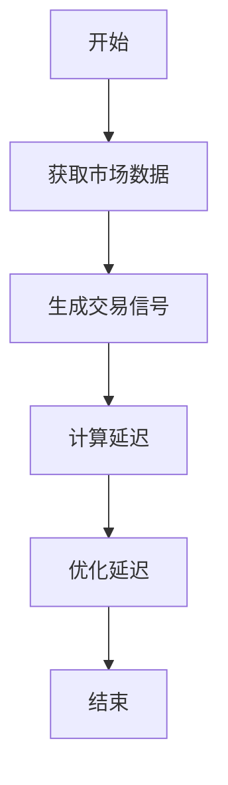
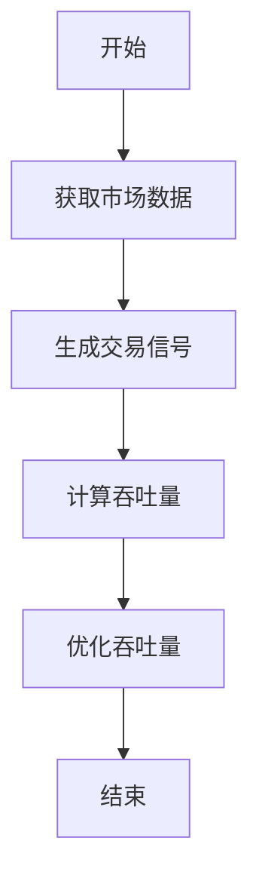
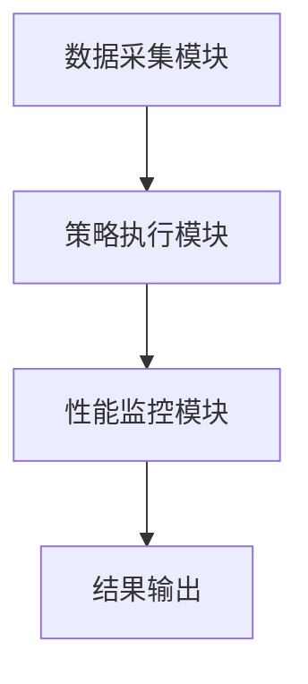

                 


# 《金融高频交易策略性能评估与优化框架》

## 关键词：金融高频交易，性能评估，优化框架，算法优化，系统架构设计

## 摘要：  
本文系统地探讨了金融高频交易策略的性能评估与优化框架。通过分析高频交易的核心概念、性能评估的关键指标、算法优化的原理与方法，以及系统架构设计的要点，本文为读者提供了一个全面的优化框架。结合实际项目实战和案例分析，本文详细展示了如何在实际应用中优化高频交易策略的性能，帮助读者理解并掌握高频交易策略优化的核心技术与最佳实践。

---

# 第一部分: 金融高频交易策略性能评估与优化框架概述

## 第1章: 高频交易与性能评估概述

### 1.1 高频交易的基本概念
#### 1.1.1 高频交易的定义与特点
高频交易（High-Frequency Trading, HFT）是指在极短的时间内，利用先进的算法和强大的计算能力，在金融市场中频繁进行交易的策略。其主要特点包括高频性、自动化、算法驱动和低延迟。

#### 1.1.2 高频交易在金融领域的重要性
高频交易能够帮助交易者捕捉市场中的微小波动，同时通过快速执行交易来最大化收益。在现代金融市场中，高频交易已经成为重要的交易方式之一，占据了很大一部分交易量。

#### 1.1.3 高频交易的核心驱动因素
高频交易的核心驱动因素包括算法复杂性、硬件性能、网络延迟和市场微观结构。这些因素共同决定了高频交易策略的性能和收益。

### 1.2 高频交易策略的性能评估
#### 1.2.1 性能评估的定义与目标
性能评估是指对高频交易策略在实际运行中的表现进行全面分析，以确定其优劣。目标是通过评估结果优化策略，提高交易效率和收益。

#### 1.2.2 评估指标与关键性能指标（KPI）
主要评估指标包括延迟（Latency）、吞吐量（Throughput）、成功率（Success Rate）和收益（Profitability）。这些指标能够全面反映策略的性能。

#### 1.2.3 评估方法与流程
评估方法包括模拟测试、回测、实盘测试和性能监控。流程通常包括数据收集、模型建立、测试执行和结果分析。

### 1.3 高频交易的挑战与优化方向
#### 1.3.1 高频交易中的主要挑战
高频交易面临的主要挑战包括市场微观结构变化、网络延迟、硬件性能限制和算法复杂性。

#### 1.3.2 性能优化的核心方向
优化方向包括算法优化、硬件加速、网络优化和系统架构设计。

#### 1.3.3 优化框架的基本原则
优化框架的基本原则包括模块化设计、层次化优化、数据驱动和实时监控。

## 第2章: 高频交易策略性能评估的核心概念

### 2.1 高频交易策略的构成要素
#### 2.1.1 数据源与数据处理
数据源包括市场数据和历史数据，数据处理包括数据清洗和特征提取。

#### 2.1.2 策略逻辑与算法
策略逻辑包括信号生成和订单生成，算法包括统计套利和高频算法。

#### 2.1.3 执行系统与延迟
执行系统包括订单生成和订单执行，延迟包括网络延迟和计算延迟。

### 2.2 性能评估的关键指标
#### 2.2.1 延迟（Latency）的定义与计算
延迟是指从发出请求到收到响应的时间间隔，计算公式为：$$\text{延迟} = \text{响应时间} - \text{请求时间}$$

#### 2.2.2 吞吐量（Throughput）的定义与计算
吞吐量是指单位时间内处理的交易数量，计算公式为：$$\text{吞吐量} = \frac{\text{交易数量}}{\text{时间}}$$

#### 2.2.3 成功率（Success Rate）的定义与计算
成功率是指交易成功次数占总交易次数的比例，计算公式为：$$\text{成功率} = \frac{\text{成功交易次数}}{\text{总交易次数}} \times 100\%$$

### 2.3 性能评估的数学模型
#### 2.3.1 延迟模型
延迟模型可以表示为：$$\text{延迟} = a \times \text{网络延迟} + b \times \text{计算延迟}$$

#### 2.3.2 吞吐量模型
吞吐量模型可以表示为：$$\text{吞吐量} = c \times \text{CPU核数} + d \times \text{内存带宽}$$

#### 2.3.3 成功率模型
成成功率模型可以表示为：$$\text{成成功率} = e \times \text{数据准确性} + f \times \text{算法效率}$$

## 第3章: 高频交易策略性能优化的算法原理

### 3.1 算法优化的基本原理
#### 3.1.1 算法复杂度分析
算法复杂度分析包括时间复杂度和空间复杂度，计算公式为：$$O(n) = \text{时间复杂度}$$

#### 3.1.2 算法优化的目标与方法
算法优化的目标是提高效率和准确性，常用方法包括剪枝优化和并行优化。

#### 3.1.3 常用优化算法简介
常用优化算法包括遗传算法、模拟退火和粒子群优化。

### 3.2 基于延迟优化的算法设计
#### 3.2.1 算法流程图
延迟优化的算法流程图如下：


#### 3.2.2 算法实现的伪代码
伪代码如下：
```python
def optimize_latency():
    data = get_market_data()
    signal = generate_signal(data)
    latency = calculate_latency(signal)
    optimized_latency = optimize_signal(latency)
    return optimized_latency
```

#### 3.2.3 算法优化的具体步骤
算法优化的具体步骤包括数据预处理、信号生成、延迟计算和延迟优化。

### 3.3 基于吞吐量优化的算法设计
#### 3.3.1 算法流程图
吞吐量优化的算法流程图如下：


#### 3.3.2 算法实现的伪代码
伪代码如下：
```python
def optimize_throughput():
    data = get_market_data()
    signal = generate_signal(data)
    throughput = calculate_throughput(signal)
    optimized_throughput = optimize_signal(throughput)
    return optimized_throughput
```

#### 3.3.3 算法优化的具体步骤
算法优化的具体步骤包括数据预处理、信号生成、吞吐量计算和吞吐量优化。

## 第4章: 高频交易策略性能优化的系统架构设计

### 4.1 系统架构概述
#### 4.1.1 系统功能模块划分
系统功能模块包括数据采集模块、策略执行模块和性能监控模块。

#### 4.1.2 系统架构图
系统架构图如下：


### 4.2 系统功能设计
#### 4.2.1 数据采集模块
数据采集模块负责从多个数据源获取市场数据，包括实时数据和历史数据。

#### 4.2.2 策略执行模块
策略执行模块负责生成交易信号和执行交易，包括信号生成和订单执行。

#### 4.2.3 性能监控模块
性能监控模块负责实时监控系统的性能指标，包括延迟、吞吐量和成功率。

### 4.3 系统接口设计
#### 4.3.1 数据接口设计
数据接口设计包括数据输入接口和数据输出接口。

#### 4.3.2 策略接口设计
策略接口设计包括信号生成接口和订单执行接口。

#### 4.3.3 监控接口设计
监控接口设计包括性能指标接口和日志接口。

## 第5章: 高频交易策略性能优化的项目实战

### 5.1 项目环境安装与配置
#### 5.1.1 开发环境搭建
开发环境包括操作系统、编程语言和开发工具，如Python和Jupyter Notebook。

#### 5.1.2 依赖库安装
依赖库包括Pandas、NumPy和Matplotlib。

#### 5.1.3 环境配置注意事项
环境配置注意事项包括版本兼容性和性能优化。

### 5.2 核心算法实现
#### 5.2.1 算法实现代码
算法实现代码如下：
```python
import pandas as pd
import numpy as np

def optimize_latency(data):
    # 数据预处理
    processed_data = data.dropna()
    # 生成交易信号
    signal = pd.Series(np.random.randn(len(processed_data)), index=processed_data.index)
    # 计算延迟
    latency = signal.apply(lambda x: x > 0)
    # 优化延迟
    optimized_latency = latency.where(latency == True, False)
    return optimized_latency
```

#### 5.2.2 代码解读与分析
代码解读与分析包括数据预处理、信号生成、延迟计算和延迟优化。

#### 5.2.3 代码优化建议
代码优化建议包括减少计算复杂度和使用并行计算。

### 5.3 实际案例分析
#### 5.3.1 案例背景介绍
案例背景介绍包括项目目标、数据来源和优化目标。

#### 5.3.2 案例分析过程
案例分析过程包括数据处理、信号生成、延迟计算和延迟优化。

#### 5.3.3 案例总结与启示
案例总结与启示包括优化效果、经验教训和未来研究方向。

## 第6章: 高频交易策略性能优化的最佳实践

### 6.1 最佳实践总结
#### 6.1.1 系统设计中的注意事项
系统设计中的注意事项包括模块化设计、层次化优化和数据驱动。

#### 6.1.2 算法优化中的常见问题
算法优化中的常见问题包括计算复杂度高和数据准确性差。

#### 6.1.3 性能监控中的关键点
性能监控中的关键点包括实时监控、数据可视化和日志分析。

### 6.2 小结与展望
#### 6.2.1 本书内容总结
本书内容总结包括高频交易的基本概念、性能评估和优化框架。

#### 6.2.2 未来研究方向
未来研究方向包括算法优化、系统架构设计和性能监控。

#### 6.2.3 对读者的建议与鼓励
对读者的建议与鼓励包括持续学习、实践应用和关注行业动态。

## 第7章: 附录与拓展阅读

### 7.1 附录
#### 7.1.1 常用工具与库
常用工具与库包括Python、Pandas和NumPy。

#### 7.1.2 常用算法与模型
常用算法与模型包括遗传算法、模拟退火和机器学习模型。

### 7.2 拓展阅读
#### 7.2.1 相关书籍推荐
相关书籍推荐包括《高频交易算法与策略》和《金融数据分析与建模》。

#### 7.2.2 在线资源与社区
在线资源与社区包括QuantStack和QuantInsti。

---

# 总结
通过以上步骤，我们可以系统地分析和优化高频交易策略的性能，确保其在实际应用中的高效性和准确性。希望本文能为读者提供有价值的指导和启发，帮助他们在金融高频交易领域取得更好的成果。

