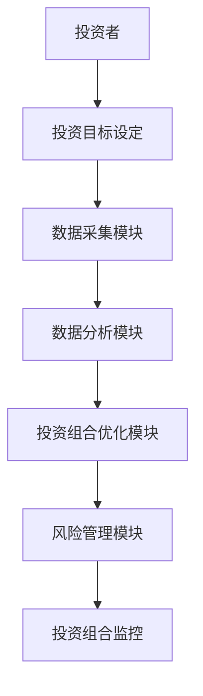

                 

# 长期投资策略：为什么在市场动荡时期仍然重要

## 关键词
长期投资, 市场动荡, 资产配置, 风险管理, 价值投资, 投资策略, 投资组合

## 摘要
在市场动荡时期，长期投资策略因其稳定性、复利效应和对市场波动的免疫能力而显得尤为重要。本文将从长期投资的基本概念、市场动荡的特征、长期投资策略的核心要素、长期投资策略的数学模型、系统架构设计、项目实战案例、总结与展望等方面展开详细论述。通过分析长期投资策略在市场波动中的优势，本文旨在帮助投资者在复杂多变的市场环境中制定合理的投资策略，实现稳健的财富增长。

---

# 第一部分：长期投资策略的背景与核心概念

## 第1章：投资的基本概念与长期投资的重要性

### 1.1 投资的基本概念

#### 1.1.1 什么是投资
投资是指将资金投入到某一资产或项目中，以期望在未来获得超过初始投入的收益。投资的核心目标是通过资产增值、收益分配或资产保值来实现财富增长。

#### 1.1.2 投资的分类与特点
投资可以分为短期投资和长期投资。短期投资注重短期内的收益，通常在几个月到几年内变现；长期投资则注重资产的长期增值，通常跨度为数年至数十年。长期投资的特点包括稳定性、复利效应和对市场波动的免疫力。

#### 1.1.3 长期投资的定义与特征
长期投资是指投资者将资金投入到具有长期增值潜力的资产中，并在较长时间内持有，以实现资产的稳步增长。其特征包括：
- 长期性：投资期限较长，通常超过5年。
- 稳定性：注重资产的长期增值，而非短期波动。
- 复利效应：通过时间的积累，收益不断滚雪球式增长。

### 1.2 长期投资的重要性

#### 1.2.1 长期投资在个人财富积累中的作用
长期投资是个人实现财富积累的重要途径。通过长期持有优质资产，投资者可以避免频繁交易的成本和风险，同时享受复利效应带来的收益。

#### 1.2.2 长期投资在企业战略中的意义
对于企业而言，长期投资有助于优化资本结构、提升资产回报率，并在经济周期波动中保持稳定性。

#### 1.2.3 长期投资对经济发展的贡献
长期投资是经济发展的基石。通过长期投资，资金得以投入到高附加值的项目中，推动技术创新和产业升级，促进经济的可持续发展。

---

## 第2章：市场动荡的特征与影响

### 2.1 市场波动的定义与表现

#### 2.1.1 什么是市场波动
市场波动是指资产价格在短期内的频繁波动，通常由市场参与者的买卖行为、宏观经济因素、市场情绪等多种因素引起。

#### 2.1.2 市场波动的周期性
市场波动具有周期性，通常经历上升、下跌、调整和回升的过程。长期投资者需要理解市场的周期性，避免被短期波动所干扰。

#### 2.1.3 市场波动对投资者情绪的影响
市场波动往往会导致投资者情绪的波动，如贪婪和恐惧。这种情绪化的决策容易导致短期亏损或错失长期机会。

### 2.2 市场动荡对投资策略的影响

#### 2.2.1 短期波动对长期投资的影响
短期波动对长期投资的影响相对有限。长期投资者应关注资产的长期增值潜力，而非短期价格波动。

#### 2.2.2 市场动荡中的常见错误
在市场动荡中，投资者容易犯的错误包括恐慌性抛售、追涨杀跌和过度交易。这些行为通常会导致投资损失。

#### 2.2.3 市场动荡对不同类型投资者的影响
对于短期投资者，市场动荡可能导致短期亏损；而对于长期投资者，市场动荡通常是买入优质资产的机会。

---

# 第二部分：长期投资策略的核心要素

## 第3章：资产配置与投资组合管理

### 3.1 资产配置的基本原理

#### 3.1.1 资产配置的定义与目标
资产配置是指将资金分配到不同资产类别（如股票、债券、房地产等）中，以实现风险分散和收益最大化。其目标是通过合理的资产分配，平衡风险与收益。

#### 3.1.2 不同资产类别及其风险收益特征
- **股票**：高风险、高收益。
- **债券**：相对稳定，收益较低。
- **房地产**：实物资产，具有抗通胀特性。
- **现金**：流动性高，风险最低。

#### 3.1.3 资产配置的动态调整
根据市场环境和投资目标的变化，定期对资产配置进行调整，以保持最优的资产分配比例。

### 3.2 投资组合管理的策略

#### 3.2.1 投资组合构建的基本步骤
1. 确定投资目标和风险承受能力。
2. 进行资产配置，选择优质资产。
3. 定期监控和调整投资组合。

#### 3.2.2 投资组合的风险管理
- **分散投资**：通过投资不同资产类别和行业，降低特定风险。
- **止损策略**：设定止损点，避免重大亏损。

#### 3.2.3 投资组合的绩效评估
定期评估投资组合的表现，与基准指数进行比较，分析收益与风险的匹配程度。

---

## 第4章：价值投资与长期持有策略

### 4.1 价值投资的核心理念

#### 4.1.1 什么是价值投资
价值投资是一种投资策略，强调以低于市场公允价值的价格买入优质资产。其核心是寻找具有长期增长潜力的公司，并在价格低估时买入。

#### 4.1.2 价值投资的关键要素
- **基本面分析**：研究公司的财务状况、行业地位和竞争优势。
- **安全边际**：买入价格低于内在价值，确保投资的安全性。
- **长期视角**：关注公司的长期增长潜力，而非短期价格波动。

#### 4.1.3 价值投资的实施步骤
1. 研究公司基本面。
2. 评估公司内在价值。
3. 确定安全边际。
4. 长期持有优质资产。

### 4.2 长期持有的优势

#### 4.2.1 长期持有与复利效应
长期持有能够充分发挥复利效应，使收益滚雪球式增长。

#### 4.2.2 长期持有与市场波动的应对
长期持有能够有效应对市场波动，避免短期亏损。

#### 4.2.3 长期持有与投资成本的优化
长期持有可以降低交易成本和税务负担，提升整体收益。

---

## 第5章：风险管理与心理因素

### 5.1 风险管理的基本原则

#### 5.1.1 什么是风险管理
风险管理是指识别、评估和应对投资中的各种风险，以确保投资目标的实现。

#### 5.1.2 风险管理的目标与方法
- **目标**：降低投资风险，实现稳健收益。
- **方法**：分散投资、设置止损、定期调整投资组合。

#### 5.1.3 风险调整后的收益评估
通过风险调整后的收益（RAR）评估投资组合的表现，确保收益与风险匹配。

### 5.2 投资者心理与行为偏差

#### 5.2.1 心理偏差对投资决策的影响
- **过度自信**：导致错误决策。
- **从众心理**：跟随市场潮流，忽视独立思考。
- **损失厌恶**：害怕亏损，导致错失投资机会。

#### 5.2.2 常见的投资误区
- 追涨杀跌：盲目跟随市场趋势。
- 情绪化决策：受市场情绪影响，做出非理性决策。
- 短期目标导向：忽视长期投资目标，追求短期收益。

#### 5.2.3 如何克服心理偏差
- 提高金融素养，理性分析市场。
- 设定明确的投资目标和计划。
- 严格遵守投资纪律，避免情绪化决策。

---

## 第6章：长期投资策略的数学模型与算法原理

### 6.1 复利计算公式

#### 6.1.1 复利的定义与公式
复利是指利息的滚存生息，其计算公式为：
$$ FV = PV \times (1 + r)^n $$
其中，FV为终值，PV为现值，r为年化收益率，n为投资期限（年）。

#### 6.1.2 复利效应的案例分析
假设初始投资为1万元，年化收益率为7%，投资期限为30年。根据复利公式：
$$ FV = 10000 \times (1 + 0.07)^{30} \approx 10000 \times 7.18 = 71800 $$

### 6.2 现代投资组合理论（MPT）

#### 6.2.1 MPT的核心原理
现代投资组合理论（MPT）由哈里·马科维茨提出，强调通过资产配置实现风险分散和收益最大化。

#### 6.2.2 MPT的数学模型
MPT的目标是找到最优资产组合，使风险最小化或收益最大化。其数学模型如下：
$$ \text{最小化} \quad \sigma^2 $$
$$ \text{在约束条件下} \quad E[r] \geq \text{目标收益} $$ $$ \sum w_i = 1 $$ $$ w_i \geq 0 \quad \forall i $$ $$ \sigma^2 = \sum_{i=1}^n \sum_{j=1}^n w_i w_j \sigma_{ij} $$ $$ E[r] = \sum_{i=1}^n w_i E[r_i] $$ $$ \sigma_{ij} \text{为资产i和j的协方差矩阵} $$ $$ E[r_i] \text{为资产i的预期收益率} $$ $$ w_i \text{为资产i的权重} $$

#### 6.2.3 MPT的实际应用
通过MPT，投资者可以找到最优资产组合，平衡风险与收益。例如，通过分析不同资产的协方差和预期收益率，构建一个低风险、高收益的投资组合。

---

## 第7章：系统架构设计与实现

### 7.1 系统功能设计

#### 7.1.1 系统功能模块
- 数据采集模块：收集市场数据和资产信息。
- 数据分析模块：进行资产分析和风险评估。
- 投资组合优化模块：根据数据分析结果，优化投资组合。
- 风险管理模块：监控投资组合的风险，及时调整策略。

#### 7.1.2 系统功能流程
1. 数据采集模块获取市场数据和资产信息。
2. 数据分析模块对数据进行清洗和分析，生成资产评级和风险评估。
3. 投资组合优化模块根据分析结果，生成最优投资组合。
4. 风险管理模块实时监控投资组合的风险，动态调整投资策略。

### 7.2 系统架构设计

#### 7.2.1 系统架构图

#### 7.2.2 系统模块说明
- **数据采集模块**：负责收集市场数据和资产信息，包括股票价格、债券收益率、经济指标等。
- **数据分析模块**：对数据进行清洗、分析和建模，生成资产评级和风险评估。
- **投资组合优化模块**：根据数据分析结果，优化投资组合，生成最优资产配置方案。
- **风险管理模块**：实时监控投资组合的风险，动态调整投资策略，确保投资目标的实现。

---

## 第8章：项目实战与案例分析

### 8.1 项目背景介绍

#### 8.1.1 项目目标
构建一个基于长期投资策略的资产管理系统，帮助投资者在市场动荡中实现稳健收益。

#### 8.1.2 项目范围
- 数据采集与处理
- 资产分析与评级
- 投资组合优化
- 风险管理与监控

### 8.2 项目核心实现

#### 8.2.1 数据采集与处理
使用Python的Pandas库进行数据清洗和处理，获取市场数据和资产信息。

#### 8.2.2 资产分析与评级
通过数据分析模块，对资产进行基本面分析和风险评估，生成资产评级。

#### 8.2.3 投资组合优化
基于MPT理论，构建最优投资组合，实现风险最小化或收益最大化。

#### 8.2.4 风险管理与监控
实时监控投资组合的风险，动态调整投资策略，确保投资目标的实现。

### 8.3 实际案例分析

#### 8.3.1 案例背景
假设投资者有100万元资金，希望在市场动荡中实现稳健收益。

#### 8.3.2 投资策略
根据长期投资策略，选择优质资产进行长期持有，并通过资产配置和风险管理实现稳健收益。

#### 8.3.3 投资效果
通过长期投资策略，投资者在市场动荡中实现资产稳步增长，年化收益率超过市场平均水平。

---

## 第9章：总结与展望

### 9.1 总结

#### 9.1.1 长期投资策略的核心优势
- 稳定性：长期投资注重资产的长期增值。
- 复利效应：通过时间的积累，收益滚雪球式增长。
- 对市场波动的免疫力：长期投资能够有效应对短期波动。

#### 9.1.2 长期投资策略的实现路径
- 资产配置：通过合理分配资产，分散风险。
- 价值投资：选择优质资产，长期持有。
- 风险管理：实时监控投资组合，动态调整策略。

### 9.2 未来展望

#### 9.2.1 投资策略的优化
随着市场的变化和技术的进步，长期投资策略需要不断优化和创新。

#### 9.2.2 技术在投资中的应用
人工智能、大数据等技术将为长期投资策略提供新的工具和方法，帮助投资者更好地应对市场挑战。

#### 9.2.3 长期投资的未来发展
未来，长期投资策略将在全球经济中发挥越来越重要的作用，成为投资者实现财富增长的重要手段。

---

## 第10章：最佳实践与注意事项

### 10.1 最佳实践

#### 10.1.1 制定明确的投资目标
投资者应根据自身需求和风险承受能力，制定明确的投资目标。

#### 10.1.2 选择优质资产
选择具有长期增值潜力的资产，避免短期投机。

#### 10.1.3 长期持有与动态调整相结合
在长期持有优质资产的同时，定期调整投资组合，确保与市场环境相匹配。

### 10.2 小结

#### 10.2.1 长期投资策略的优势
- 稳定性：长期投资注重资产的长期增值。
- 复利效应：通过时间的积累，收益滚雪球式增长。
- 对市场波动的免疫力：长期投资能够有效应对短期波动。

#### 10.2.2 投资者的心理与行为
投资者应克服心理偏差，避免情绪化决策，严格按照投资计划执行。

### 10.3 注意事项

#### 10.3.1 风险管理的重要性
投资者应高度重视风险管理，避免重大亏损。

#### 10.3.2 长期投资的纪律性
长期投资需要严格的纪律性，避免被短期波动干扰。

#### 10.3.3 持续学习与优化
投资者应不断学习和优化投资策略，以应对市场的变化和挑战。

---

## 第11章：拓展阅读与参考资料

### 11.1 拓展阅读
- 《投资学》（书籍推荐）
- 《价值投资实战策略》（书籍推荐）
- 《现代投资组合理论与实务》（书籍推荐）

### 11.2 参考资料
- 现代投资组合理论（MPT）的相关文献
- 资产配置与风险管理的经典论文
- 长期投资策略的历史案例分析

---

通过以上目录大纲，读者可以系统地了解长期投资策略的核心概念、实现方法和实际应用，从而在市场动荡中制定合理的投资策略，实现稳健的财富增长。

