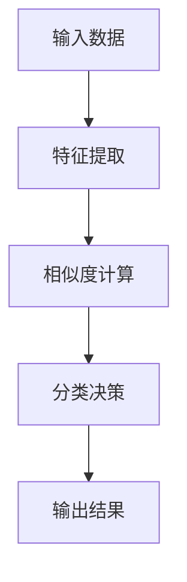

                 


# 零样本学习在AI Agent中的应用

> 关键词：零样本学习, AI Agent, 机器学习, 人工智能, 自然语言处理

> 摘要：零样本学习（Zero-shot Learning, ZSL）是指在没有特定类别标签的情况下，能够识别或分类新数据的能力。本文详细探讨了零样本学习在AI Agent中的应用，从核心概念、算法原理、系统架构到实际案例，全面解析零样本学习如何赋能AI Agent，使其具备更强的智能性和适应性。

---

## 第一部分: 零样本学习在AI Agent中的应用背景

### 第1章: 零样本学习与AI Agent概述

#### 1.1 零样本学习的基本概念

零样本学习是一种机器学习技术，允许模型在没有特定类别标签的情况下识别或分类新数据。与传统监督学习不同，零样本学习不需要大量标注数据，而是依赖于预训练模型和特征提取能力。

- **零样本学习的定义**：零样本学习是指在没有任何训练样本的情况下，通过已有知识和通用特征提取能力，对新类别进行分类或识别。
- **核心特点**：
  - 无需标注数据
  - 利用预训练模型
  - 适用于小样本或新类别

#### 1.2 AI Agent的基本概念

AI Agent是一种智能体，能够感知环境、执行任务、与用户交互。AI Agent的核心能力包括理解输入、推理、决策和执行。

- **AI Agent的定义**：AI Agent是一个能够感知环境、执行任务、与用户交互的智能实体。
- **核心功能**：
  - 理解输入（语言、图像等）
  - 推理和决策
  - 与用户交互
  - 执行任务
- **应用场景**：
  - 智能助手（如Siri、Alexa）
  - 智能客服
  - 自动化系统

#### 1.3 零样本学习在AI Agent中的重要性

零样本学习为AI Agent提供了更强的适应性和智能性，使其能够处理未知任务和新数据。

- **提升AI Agent能力**：通过零样本学习，AI Agent可以在没有标注数据的情况下，快速学习和处理新任务。
- **应用场景**：
  - 处理未知类别数据
  - 快速适应新任务
  - 处理多模态数据
- **未来发展影响**：零样本学习将推动AI Agent向更通用、更智能的方向发展。

---

## 第2章: 零样本学习的核心概念与原理

### 2.1 零样本学习的核心概念

零样本学习的核心在于利用预训练模型和特征提取能力，通过通用特征表示和分类方法，实现对未知类别的识别。

- **背景与问题描述**：传统监督学习需要大量标注数据，而零样本学习的目标是减少对标注数据的依赖。
- **解决方法**：利用预训练模型和特征提取，构建通用特征空间。
- **边界与外延**：零样本学习适用于小样本或无标签数据，但其性能可能受到预训练模型的限制。

### 2.2 零样本学习的核心要素

- **预训练模型**：零样本学习依赖于预训练模型，如BERT、ResNet等，这些模型提供了强大的特征提取能力。
- **特征提取与表示学习**：通过预训练模型提取数据的特征表示，并利用这些表示进行分类。
- **零样本分类方法**：基于度量的分类、生成模型、预训练语言模型等方法。

### 2.3 零样本学习与AI Agent的联系

- **赋能AI Agent**：零样本学习使AI Agent能够处理未知任务，提升其智能性和适应性。
- **应用场景**：AI Agent可以利用零样本学习处理多模态数据、小样本任务和动态变化的任务。
- **案例分析**：例如，在智能客服中，AI Agent可以通过零样本学习快速适应新客户的问题类型。

---

## 第3章: 零样本学习的核心算法原理

### 3.1 零样本学习的算法原理

- **基于度量的分类方法**：通过计算测试样本与训练样本之间的相似度，选择最相似的类别作为预测结果。
- **生成模型**：利用生成对抗网络等生成模型，生成与目标类别相关的特征表示。
- **预训练语言模型**：利用如BERT等预训练语言模型，提取文本的语义表示，并进行分类。

### 3.2 零样本学习的数学模型与公式

- **基于度量的分类模型**：
  $$ \text{相似度计算} = \frac{\vec{x} \cdot \vec{y}}{\|\vec{x}\| \|\vec{y}\|} $$
- **生成模型的零样本学习**：
  $$ p(x|y) = \text{生成模型} $$
- **基于预训练语言模型的零样本学习**：
  $$ p(y|x) = \frac{p(x|y)p(y)}{p(x)} $$

### 3.3 零样本学习的算法流程图



---

## 第4章: 系统分析与架构设计

### 4.1 系统功能设计

- **领域模型**：
  ```mermaid
  classDiagram
  class AI Agent {
    - 输入接口
    - 输出接口
    - 智能引擎
  }
  class 智能引擎 {
    - 预训练模型
    - 特征提取模块
    - 分类器
  }
  AI Agent --> 智能引擎
  ```

- **系统架构设计**：
  ```mermaid
  architectureDiagram
  AI Agent --> [输入] --> 输入模块
  输入模块 --> [处理] --> 特征提取模块
  特征提取模块 --> [分类] --> 分类器
  分类器 --> [输出] --> 输出模块
  ```

- **系统交互设计**：
  ```mermaid
  sequenceDiagram
  participant 用户
  participant AI Agent
  participant 预训练模型
  用户 -> AI Agent: 发送请求
  AI Agent -> 预训练模型: 提取特征
  预训练模型 -> AI Agent: 返回特征表示
  AI Agent -> 用户: 返回结果
  ```

---

## 第5章: 项目实战

### 5.1 项目概述

构建一个零样本学习的图像分类系统，利用预训练的ResNet模型，对新类别图像进行分类。

### 5.2 环境安装

- Python 3.8+
- PyTorch 1.9+
- torchvision 0.9+

### 5.3 核心代码实现

```python
import torch
import torch.nn as nn
import torch.nn.functional as F
from torchvision.models import resnet50

class ZeroShotClassifier(nn.Module):
    def __init__(self, num_classes):
        super().__init__()
        self.resnet = resnet50(pretrained=True)
        self.classifier = nn.Linear(2048, num_classes)
    
    def forward(self, x):
        features = self.resnet(x)
        return self.classifier(features)

def zero_shot_classification(images, model):
    with torch.no_grad():
        outputs = model(images)
        _, predicted = torch.max(outputs.data, 1)
        return predicted
```

### 5.4 实际案例分析

- **输入图像**：一张从未见过的新类别图像。
- **特征提取**：利用ResNet提取图像的特征表示。
- **分类**：通过预训练的分类器，预测图像的类别。

### 5.5 项目总结

- **代码解释**：上述代码展示了如何利用预训练的ResNet模型进行特征提取，并通过全连接层进行分类。
- **结果分析**：虽然零样本学习在某些情况下可能不如监督学习准确，但在小样本或无标签数据的情况下，其表现优于传统方法。

---

## 第6章: 总结与展望

### 6.1 最佳实践

- **数据预处理**：确保输入数据的质量和多样性。
- **模型选择**：选择适合任务的预训练模型和分类方法。
- **模型调优**：通过微调或数据增强提升性能。

### 6.2 小结

零样本学习为AI Agent提供了强大的能力，使其能够处理未知任务和小样本数据。随着技术的发展，零样本学习将在更多领域发挥重要作用。

### 6.3 注意事项

- 零样本学习的性能依赖于预训练模型的质量。
- 在实际应用中，需注意模型的泛化能力和计算资源消耗。

### 6.4 拓展阅读

- 探索更先进的零样本学习方法，如对比学习和自监督学习。
- 研究零样本学习在多模态数据中的应用。

---

通过本文的详细讲解，读者可以全面了解零样本学习在AI Agent中的应用，从理论到实践，掌握其实现方法和应用场景。未来，零样本学习将继续推动AI Agent的发展，使其在更多领域展现出强大的智能能力。

