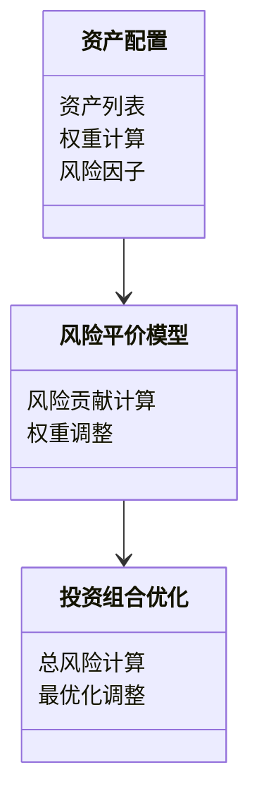
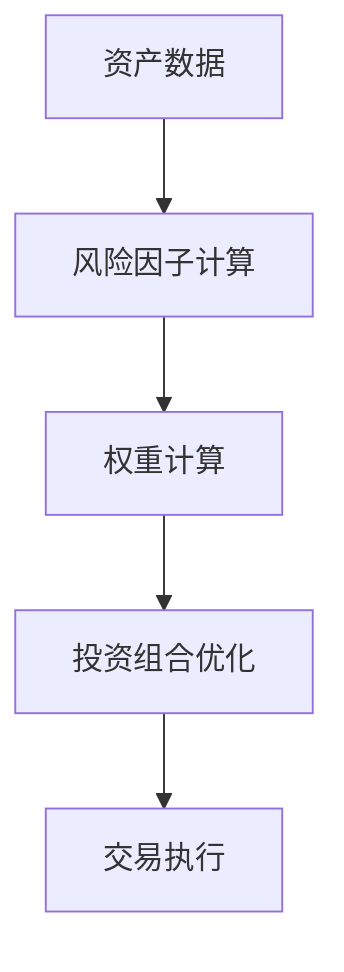
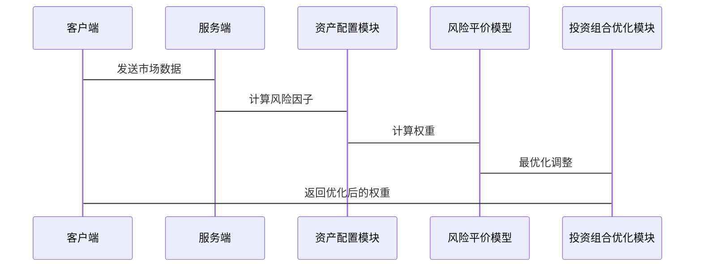

                 


# 雷·达里奥的风险平价投资策略

> 关键词：风险平价投资策略、雷·达里奥、桥水基金、资产配置、风险管理、投资组合优化

> 摘要：本文深入探讨了雷·达里奥的风险平价投资策略，分析其核心原理、资产配置方法、动态调整机制以及实际应用案例。通过详细阐述风险平价的数学模型、算法实现和系统架构设计，帮助读者全面理解这一创新的投资策略，并提供实际操作的指导和最佳实践建议。

---

# 第一部分: 风险平价投资策略的背景与核心概念

## 第1章: 风险平价投资策略概述

### 1.1 风险平价的核心概念

#### 1.1.1 风险平价的定义与背景

风险平价（Risk Parity）是一种资产配置方法，旨在通过平衡投资组合中各资产的风险贡献，而非传统的基于资产价值的配置方式。雷·达里奥（Ray Dalio）是风险平价策略的倡导者之一，他提出的风险平价方法在桥水基金（Bridgewater Associates）得到了广泛应用。

- **定义**：风险平价策略的核心思想是将投资组合中每种资产的风险贡献均衡化，确保每种资产对组合整体风险的贡献相等。

- **背景**：20世纪80年代，雷·达里奥在桥水基金开始探索和实践风险平价策略。这一策略在2008年金融危机后逐渐受到更多关注，因为它能够有效分散风险，降低投资组合的波动性。

#### 1.1.2 风险平价与传统投资策略的区别

| 特性                | 风险平价                | 传统资产配置             |
|---------------------|------------------------|--------------------------|
| 配置依据            | 风险贡献               | 资产价值或预期收益       |
| 风险分散            | 平衡各资产的风险贡献   | 依赖资产之间的相关性     |
| 适用场景            | 高波动性和不确定性市场 | 稳定性较高的市场         |

#### 1.1.3 风险平价在投资组合中的作用

- **风险分散**：通过平衡各资产的风险贡献，降低投资组合的整体波动性。
- **稳健收益**：在市场波动中，风险平价策略能够保持相对稳定的收益。
- **适应性**：能够根据市场环境动态调整资产权重，适应不同经济周期的变化。

### 1.2 雷·达里奥与桥水基金

#### 1.2.1 雷·达里奥的生平与投资理念

雷·达里奥是桥水基金的创始人，被誉为“对冲基金之王”。他提出的风险平价策略以“基于事实的投资”为核心，强调通过数据分析和模型构建来优化投资组合。

- **投资理念**：市场并非总是有效的，通过分析经济周期和资产的相关性，可以找到最优的资产配置组合。
- **哲学基础**：投资是“一场马拉松”，需要长期稳定的策略和纪律性的执行。

#### 1.2.2 桥水基金的风险平价策略实践

桥水基金将风险平价策略应用于多种资产类别，包括股票、债券、商品和货币等。通过分析这些资产的风险贡献，动态调整其在投资组合中的权重，从而实现风险分散和收益优化。

#### 1.2.3 风险平价策略的哲学基础

风险平价策略的核心哲学是“平等对待风险”，即每种资产对组合风险的贡献应当相等。这种理念强调了风险分散的重要性，而非单纯追求收益最大化。

---

## 第2章: 风险平价的投资哲学

### 2.1 风险平价的核心原则

#### 2.1.1 风险均衡的定义

风险均衡是指在投资组合中，每种资产的风险贡献相等。这种均衡通过调整各资产的权重来实现。

#### 2.1.2 投资组合的风险分配

- **风险因子**：每种资产都有其独特的风险因子，例如股票的风险因子可能与市场波动率相关。
- **风险贡献**：每种资产的风险贡献是其权重与风险因子的乘积。

#### 2.1.3 风险与收益的平衡

- **目标**：在风险可控的前提下，追求最大的收益。
- **方法**：通过优化模型，找到风险贡献最小化的同时实现收益最大化。

### 2.2 风险平价的数学模型

#### 2.2.1 风险平价的公式推导

风险平价的目标是最小化投资组合的总风险，同时满足各资产的风险贡献相等的约束。

- **目标函数**：最小化投资组合的总风险（方差）。
- **约束条件**：每种资产的风险贡献相等。

$$
\text{目标函数：} \quad \min \sum_{i=1}^n w_i^2 \sigma_i^2
$$

$$
\text{约束条件：} \quad \sum_{i=1}^n w_i^2 \sigma_i^2 = \text{常数}
$$

其中，\( w_i \) 是资产 \( i \) 的权重，\( \sigma_i \) 是资产 \( i \) 的波动率。

---

## 第3章: 风险平价的资产配置策略

### 3.1 风险平价的资产选择

#### 3.1.1 资产类别与风险因子的定义

- **资产类别**：股票、债券、商品、房地产等。
- **风险因子**：每种资产的风险因子反映了其对整体风险的贡献。

#### 3.1.2 不同资产类别的风险贡献

- **股票**：高波动性，高风险贡献。
- **债券**：低波动性，低风险贡献。
- **商品**：受通货膨胀影响，风险贡献与股票和债券相关性较低。

#### 3.1.3 资产配置的动态调整

- **动态调整的必要性**：市场环境的变化会影响各资产的风险贡献。
- **调整方法**：根据当前市场环境，重新计算各资产的风险贡献，并调整其权重。

### 3.2 风险平价的权重分配

#### 3.2.1 权重分配的数学模型

- **优化目标**：最大化收益，同时最小化风险。
- **优化约束**：每种资产的风险贡献相等。

$$
\text{优化目标：} \quad \max \sum_{i=1}^n w_i r_i
$$

$$
\text{约束条件：} \quad \sum_{i=1}^n w_i^2 \sigma_i^2 = \text{常数}
$$

其中，\( r_i \) 是资产 \( i \) 的预期收益。

#### 3.2.2 风险因子的标准化处理

- **标准化**：将每种资产的风险因子标准化，以便于比较和计算。
- **权重计算**：根据标准化后的风险因子，计算各资产的权重。

---

## 第4章: 风险平价的动态调整与再平衡

### 4.1 动态调整的必要性

#### 4.1.1 市场环境的变化对风险平价的影响

- **市场波动**：市场的波动性变化会影响各资产的风险贡献。
- **资产相关性**：资产之间的相关性变化会影响风险分散的效果。

#### 4.1.2 风险因子的波动性分析

- **风险因子的波动性**：每种资产的风险因子都有其自身的波动性，需要定期监控和调整。
- **调整时机**：在市场环境发生显著变化时，及时调整资产权重。

#### 4.1.3 投资组合的再平衡策略

- **定期再平衡**：定期检查投资组合的风险贡献，进行必要的调整。
- **动态再平衡**：根据市场环境的变化，实时调整资产权重。

### 4.2 动态调整的实现方法

#### 4.2.1 风险平价模型的更新机制

- **更新频率**：根据市场环境的变化，定期更新风险平价模型。
- **更新方法**：重新计算各资产的风险贡献，调整其权重。

#### 4.2.2 权重调整的数学公式

- **调整公式**：根据当前市场环境，重新计算各资产的风险贡献，并调整其权重。

$$
w_i = \frac{\sigma_i}{\sum_{j=1}^n \sigma_j}
$$

其中，\( \sigma_i \) 是资产 \( i \) 的当前风险贡献。

---

## 第5章: 风险平价策略的优缺点与适用场景

### 5.1 风险平价的优点

#### 5.1.1 风险分散的优势

- **降低波动性**：通过分散风险，降低投资组合的波动性。
- **增强稳定性**：在市场波动中，风险平价策略能够保持投资组合的稳定性。

#### 5.1.2 抗市场波动的能力

- **适应性**：风险平价策略能够根据市场环境动态调整，具有较强的适应性。
- **长期收益的稳定性**：通过分散风险，风险平价策略能够实现长期稳定的收益。

#### 5.1.3 长期收益的稳定性

- **长期视角**：风险平价策略注重长期收益的稳定性，而非短期收益的波动性。

### 5.2 风险平价的缺点

#### 5.2.1 短期波动的不可预测性

- **短期波动**：风险平价策略在短期内可能会出现较大的波动，难以预测。
- **市场极端情况**：在市场极端情况下，风险平价策略可能无法有效分散风险。

#### 5.2.2 市场极端情况下的表现

- **市场崩盘**：在市场崩盘时，风险平价策略可能会面临较大的损失。
- **流动性风险**：在极端情况下，部分资产可能难以快速变现。

#### 5.2.3 资产类别选择的局限性

- **资产选择**：风险平价策略的有效性依赖于资产类别的选择和风险因子的定义。
- **数据依赖性**：需要依赖历史数据来计算风险因子，可能在市场环境变化时失效。

### 5.3 风险平价的适用场景

#### 5.3.1 机构投资者

- **养老金**：风险平价策略适合用于养老金等长期资金的管理。
- **保险公司**：适合保险公司的资产配置，以分散风险并实现稳定的收益。

#### 5.3.2 对冲基金

- **对冲基金**：风险平价策略可以帮助对冲基金降低风险，提高收益。

#### 5.3.3 多资产投资

- **多资产投资**：风险平价策略适用于多资产投资组合的优化。

---

## 第6章: 风险平价策略的数学模型与算法实现

### 6.1 风险平价的数学模型

#### 6.1.1 风险平价的目标函数

- **目标函数**：最小化投资组合的总风险（方差）。
- **约束条件**：每种资产的风险贡献相等。

$$
\text{目标函数：} \quad \min \sum_{i=1}^n w_i^2 \sigma_i^2
$$

$$
\text{约束条件：} \quad \sum_{i=1}^n w_i^2 \sigma_i^2 = \text{常数}
$$

#### 6.1.2 风险平价的优化算法

- **拉格朗日乘数法**：通过引入拉格朗日乘数，将约束条件转化为优化目标的一部分。
- **数值优化**：使用数值优化算法（如梯度下降）求解最优权重。

---

## 第7章: 风险平价策略的系统架构设计

### 7.1 系统分析

#### 7.1.1 问题场景介绍

- **目标**：构建一个基于风险平价策略的投资管理系统。
- **需求**：能够实时监控市场环境，动态调整资产权重。

#### 7.1.2 项目介绍

- **项目名称**：风险平价投资管理系统。
- **项目目标**：实现风险平价策略的动态调整和投资组合优化。

### 7.2 系统功能设计

#### 7.2.1 领域模型



#### 7.2.2 系统架构



### 7.3 系统接口设计

#### 7.3.1 接口定义

- **输入**：市场数据（如资产价格、波动率）。
- **输出**：优化后的资产权重。

#### 7.3.2 交互流程图



---

## 第8章: 风险平价策略的项目实战

### 8.1 环境安装

- **Python**：安装Python 3.x。
- **库的安装**：安装NumPy、Pandas、Matplotlib、Scipy等库。

```bash
pip install numpy pandas matplotlib scipy
```

### 8.2 核心代码实现

#### 8.2.1 风险平价算法实现

```python
import numpy as np

def calculate_risk_parity(weights, returns):
    # 计算波动率
    sigma = np.std(returns, axis=0)
    # 计算风险贡献
    risk_contribution = weights * sigma
    # 计算总风险
    total_risk = np.sum(risk_contribution**2)
    # 返回风险贡献
    return risk_contribution, total_risk

def optimize_risk_parity(n_assets, returns):
    # 初始化权重
    initial_weights = np.array([1.0/n_assets]*n_assets)
    # 使用拉格朗日乘数法求解
    # （这里可以使用更复杂的优化算法，如CVXOPT）
    return initial_weights
```

#### 8.2.2 代码解读与分析

- **函数** `calculate_risk_parity`：计算各资产的风险贡献和总风险。
- **函数** `optimize_risk_parity`：使用拉格朗日乘数法优化资产权重，实现风险平价。

### 8.3 实际案例分析

#### 8.3.1 数据准备

```python
import pandas as pd

# 假设我们有三种资产：股票、债券、商品
data = {
    '股票': [0.1, 0.2, 0.05, 0.15, 0.08],
    '债券': [0.05, 0.08, 0.03, 0.06, 0.04],
    '商品': [0.08, 0.12, 0.05, 0.07, 0.06]
}
df = pd.DataFrame(data)
```

#### 8.3.2 应用风险平价策略

```python
n_assets = 3
returns = df.values
weights = optimize_risk_parity(n_assets, returns)
risk_contribution, total_risk = calculate_risk_parity(weights, returns)
print("风险贡献：", risk_contribution)
print("总风险：", total_risk)
```

---

## 第9章: 风险平价策略的总结与展望

### 9.1 最佳实践 Tips

- **定期再平衡**：定期检查投资组合的风险贡献，进行必要的调整。
- **资产选择**：选择多样化的资产类别，以降低风险平价策略的局限性。
- **风险管理**：在市场极端情况下，及时采取应对措施，降低风险。

### 9.2 小结

风险平价策略是一种创新的资产配置方法，通过平衡各资产的风险贡献，实现投资组合的稳健收益。雷·达里奥的风险平价策略在桥水基金的成功实践，证明了其有效性和适应性。

### 9.3 注意事项

- **数据依赖性**：风险平价策略依赖于历史数据，可能在市场环境变化时失效。
- **市场极端情况**：在市场崩盘等极端情况下，风险平价策略可能无法有效分散风险。

### 9.4 拓展阅读

- **书籍推荐**：《原则》——雷·达里奥
- **论文推荐**：《Risk Parity for Dummies》
- **在线课程**： Coursera上的“投资学基础”课程

---

# 结语

雷·达里奥的风险平价投资策略以其独特的哲学和数学模型，为投资组合管理提供了新的视角。通过本文的详细讲解，读者可以深入了解风险平价策略的核心原理、实现方法以及实际应用。希望本文能够为读者在投资领域提供有价值的参考和启发。

