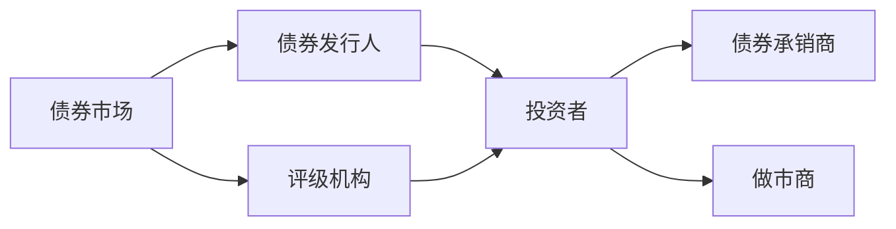

                 


# 霍华德·马克斯的债券价值投资：固定收益中的机会

> 关键词：债券投资，霍华德·马克斯，价值投资，固定收益，安全边际，信用分析

> 摘要：本文深入探讨霍华德·马克斯的债券价值投资策略，分析其在固定收益领域的机会。通过背景介绍、核心概念、算法原理、系统分析和项目实战，结合具体案例和代码示例，全面解析其投资理念，帮助读者掌握债券投资的精髓。

---

# 第一部分: 背景介绍

## 第1章: 债券市场的概述

### 1.1 债券市场的基本概念

#### 1.1.1 债券的定义与分类

债券是一种债务工具，发行人向投资者借款，并承诺按约定的利率支付利息，到期偿还本金。债券按发行者分类，主要包括政府债券、企业债券和垃圾债券；按期限分为短期、中期和长期债券；按是否附带 warrants 分为附息和不附息债券。

#### 1.1.2 债券市场的参与者

债券市场的参与者包括发行人（政府、企业）、投资者（机构和个人）、承销商（银行和证券公司）、评级机构（如穆迪、标普）和做市商。

#### 1.1.3 债券市场的功能与作用

债券市场是资金配置的重要渠道，帮助政府和企业融资，为投资者提供稳定收益。它具有价格发现功能，反映市场对风险和流动性的定价。

### 1.2 霍华德·马克斯的投资理念

#### 1.2.1 价值投资的基本概念

价值投资强调购买价格低于内在价值的资产，追求安全边际。马克斯在《投资的さú智慧》中提出，投资应关注市场的非理性，寻找被低估的机会。

#### 1.2.2 霍华德·马克斯的投资策略

马克斯专注于债券投资，寻找高息债券和被低估的企业债券。他强调逆向投资，在市场低迷时买入，在恐慌时寻找机会。

#### 1.2.3 债券投资中的机会与风险

债券投资的机会在于稳定的利息收入和本金偿还，风险来自利率波动、信用风险和流动性风险。马克斯通过分析财务报表和行业趋势，识别潜在风险和机会。

### 1.3 价值投资的核心原则

#### 1.3.1 价格与价值的差异

价值投资的核心是寻找价格低于内在价值的资产。马克斯认为，市场价格波动为投资者提供了以合理价格买入的机会。

#### 1.3.2 安全边际的概念

安全边际是资产价格与内在价值之间的差距，确保在市场波动中仍能获得收益。马克斯强调，安全边际是投资成功的关键。

#### 1.3.3 风险控制的重要性

价值投资注重风险管理，避免高风险投资。马克斯通过分散投资和严格筛选债券来控制风险，确保投资组合的稳定性。

---

## 1.4 本章小结

本章介绍了债券市场的基本概念、霍华德·马克斯的价值投资理念以及价值投资的核心原则。理解这些内容是后续分析的基础，帮助读者掌握债券投资的基本框架。

---

## 第2章: 核心概念与联系

### 2.1 核心概念的解释

#### 2.1.1 债券定价

债券定价是基于其未来现金流的现值，考虑票面利率、期限和市场利率。久期衡量价格对利率变化的敏感度，凸性则衡量久期的变化。

#### 2.1.2 信用分析

信用分析评估债券的违约风险，包括财务状况、行业地位和管理团队等因素。评级机构给出的信用评级为投资者提供参考。

#### 2.1.3 市场分析

市场分析包括宏观经济趋势和利率走势，影响债券价格。通货膨胀、GDP增长和就业数据等指标帮助预测市场变化。

### 2.2 核心概念之间的联系

#### 2.2.1 债券定价与信用分析的关系

债券定价受信用评级影响，高评级债券通常价格较高，但风险较低。信用分析帮助确定合理的定价区间，确保投资决策的科学性。

#### 2.2.2 信用分析与市场分析的结合

信用分析评估个体债券风险，市场分析提供宏观经济背景。两者结合帮助投资者识别具有竞争优势的债券，抓住市场机会。

### 2.3 Mermaid流程图: 实体关系图



---

## 第3章: 算法原理讲解

### 3.1 债券定价模型

#### 3.1.1 到期收益率的计算

到期收益率是使未来现金流现值等于债券面值的利率，计算公式为：

$$
y = \frac{C + (F - P)}{F \times t}
$$

其中，\( C \) 是每年的利息，\( F \) 是面值，\( P \) 是购买价格，\( t \) 是剩余期限。

#### 3.1.2 久期与凸性

久期衡量债券价格对利率变化的敏感度，计算公式为：

$$
D = - \frac{P}{(1 + y)} \times \frac{\partial P}{\partial y}
$$

凸性衡量久期随利率变化的变化，计算公式为：

$$
C = \frac{\partial^2 P}{\partial y^2}
$$

### 3.2 信用风险评估算法

#### 3.2.1 信用评分模型

使用逻辑回归模型评估债券违约概率，公式为：

$$
P(Y=1) = \frac{1}{1 + e^{-\beta X}}
$$

其中，\( X \) 是债券的特征变量，\( \beta \) 是模型参数。

#### 3.2.2 风险调整后的收益计算

风险调整后收益 = 名义收益 - 风险调整后的利率，公式为：

$$
R_{adj} = R - (R_f + \text{信用风险溢价})
$$

---

## 第4章: 系统分析与架构设计

### 4.1 投资管理系统介绍

#### 4.1.1 系统功能设计

系统包括数据采集、信用分析、风险评估和投资决策模块。使用Mermaid类图展示各模块关系。

#### 4.1.2 系统架构设计

采用分层架构，包括数据层、业务逻辑层和表现层。使用Mermaid架构图展示各层交互。

#### 4.1.3 系统接口设计

接口包括数据输入、分析结果输出和投资决策建议。使用Mermaid序列图展示系统交互流程。

---

## 第5章: 项目实战

### 5.1 环境安装

安装Python和相关库（pandas、numpy、scikit-learn），配置IDE环境。

### 5.2 核心代码实现

#### 5.2.1 债券定价代码

```python
import numpy as np

def calculate_duration(cash_flows, discount_rate):
    duration = 0
    for i in range(len(cash_flows)):
        duration += (i + 1) * cash_flows[i] / (1 + discount_rate)**(i + 1)
    duration /= (1 + discount_rate) * sum(cash_flows / (1 + discount_rate)**(i + 1))
    return duration

# 示例计算
cash_flows = [100, 100, 100, 100, 1000]
discount_rate = 0.05
print("久期:", calculate_duration(cash_flows, discount_rate))
```

#### 5.2.2 信用评分模型代码

```python
from sklearn.linear_model import LogisticRegression

# 假设X为特征矩阵，y为违约标签
model = LogisticRegression()
model.fit(X, y)
predicted_prob = model.predict_proba(X_test)
```

### 5.3 案例分析与解读

分析一家公司的债券，计算其久期和凸性，评估信用风险，制定投资策略。

### 5.4 项目小结

项目实战帮助读者理解理论在实际中的应用，掌握代码实现和案例分析的方法。

---

## 第6章: 最佳实践与小结

### 6.1 小结

总结全文，强调安全边际和风险控制的重要性，以及系统分析和项目实战的应用价值。

### 6.2 注意事项

提醒读者注意市场波动和信用风险，定期评估投资组合，及时调整策略。

### 6.3 扩展阅读

推荐进一步阅读霍华德·马克斯的著作和相关学术论文，深入研究债券投资策略。

---

# 第五部分: 最佳实践

## 第7章: 小结

总结霍华德·马克斯的投资理念，强调价值投资在固定收益领域的重要性。

## 第8章: 注意事项

提醒投资者注意风险，强调安全边际和分散投资的重要性。

## 第9章: 扩展阅读

推荐进一步阅读相关书籍和论文，深入研究债券投资策略。

---

# 结语

通过本文的学习，读者将掌握霍华德·马克斯的债券价值投资策略，能够在固定收益领域抓住投资机会，实现稳健收益。希望本文能为读者提供有价值的指导，帮助他们在复杂多变的市场中找到成功的投资策略。

