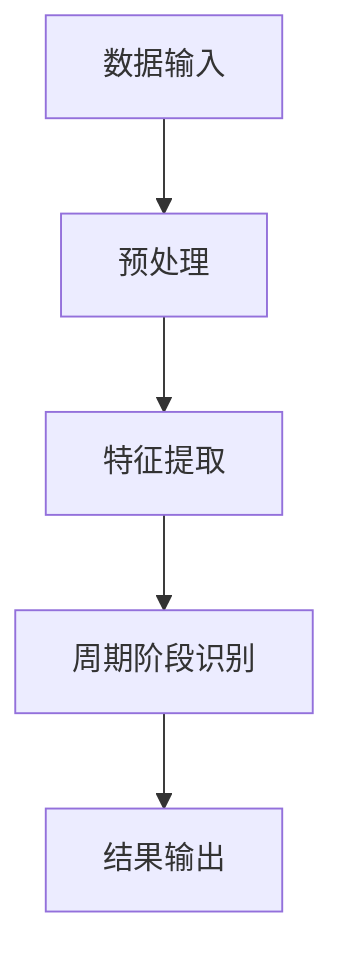
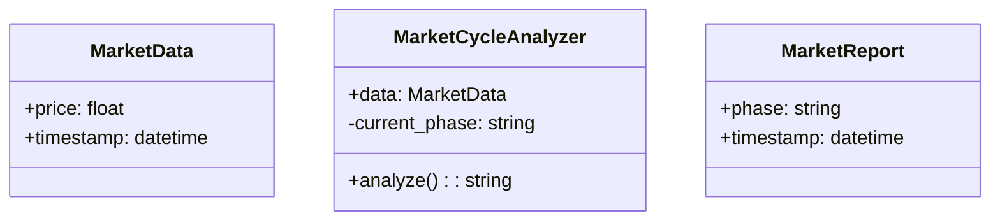

                 


# 霍华德·马克斯的市场周期理论

---

## 关键词：  
霍华德·马克斯、市场周期理论、投资者心理、周期分析、投资策略、价格波动、市场情绪

---

## 摘要：  
霍华德·马克斯的市场周期理论是投资领域的重要理论之一，它通过分析市场的周期性波动和投资者心理，帮助投资者在不同市场阶段做出更明智的投资决策。本文将从市场周期的基本概念、核心要素、数学模型、算法实现、实际案例分析等多个维度，系统地阐述霍华德·马克斯市场周期理论的核心思想及其在投资实践中的应用。通过本文的分析，读者可以深入理解市场周期的本质，掌握如何利用市场周期理论指导实际投资决策。

---

# 第一部分: 霍华德·马克斯市场周期理论概述

## 第1章: 市场周期理论的背景与核心概念

### 1.1 市场周期的基本定义与特征

#### 1.1.1 市场周期的定义  
市场周期是指市场在一段时间内价格、成交量等指标呈现规律性波动的现象。市场周期的核心特征包括周期性、波动性和不可预测性。

#### 1.1.2 市场周期的核心特征  
- **周期性**：市场波动呈现一定的周期性规律，不同周期阶段的特征明显不同。  
- **波动性**：市场价格在周期内呈现上升或下降的波动，反映了市场参与者的心理变化。  
- **不可预测性**：尽管市场周期有一定的规律性，但具体拐点和波动幅度难以准确预测。

#### 1.1.3 市场周期与经济周期的关系  
市场周期与经济周期密切相关，但两者并非完全一致。市场周期更多关注金融资产的价格波动，而经济周期关注整体经济的扩张与收缩。

---

### 1.2 霍华德·马克斯市场周期理论的背景

#### 1.2.1 霍华德·马克斯的投资者哲学  
霍华德·马克斯认为，市场的波动性和投资者心理是市场周期的核心驱动力。他强调逆向思维和长期投资的重要性。

#### 1.2.2 市场周期理论的提出动机  
马克斯提出市场周期理论的主要目的是帮助投资者更好地理解市场的波动性，并在市场周期的不同阶段做出更明智的投资决策。

#### 1.2.3 理论的适用范围与边界  
市场周期理论适用于金融市场的价格波动分析，但其结论和方法需要结合具体市场环境和投资者行为进行调整。

---

## 第2章: 市场周期的核心概念与联系

### 2.1 市场周期的核心要素

#### 2.1.1 市场参与者的心理特征  
- **乐观与悲观情绪**：市场参与者的情绪波动是市场周期的核心驱动力。  
- **群体心理**：投资者的群体心理在市场周期中起到了放大波动的作用。

#### 2.1.2 市场情绪的波动规律  
- **情绪指标**：通过市场情绪指标（如投资者信心指数）可以量化市场情绪的变化。  
- **情绪周期**：市场情绪呈现周期性波动，与市场周期高度相关。

#### 2.1.3 市场价格的波动机制  
- **价格与价值的关系**：市场价格围绕其内在价值波动，反映了市场参与者对价值的主观判断。  
- **市场波动的双重性**：价格波动既受基本面因素影响，也受投资者情绪的驱动。

---

### 2.2 市场周期阶段划分与对比

#### 2.2.1 不同市场周期阶段的特征对比  

| 阶段       | 市场情绪 | 价格波动 | 投资者行为 |
|------------|----------|----------|------------|
| 牛市顶部    | 过度乐观 | 波动剧烈 | 抢购        |
| 熊市底部    | 消极悲观 | 波动剧烈 | 抛售        |
| 稳定期      | 中性     | 波动较小 | 观望        |

#### 2.2.2 市场周期阶段的实体关系图  


---

## 第3章: 市场周期分析的算法原理

### 3.1 市场周期分析的算法框架

#### 3.1.1 动态时间序列分析  
动态时间序列分析是一种常用的方法，用于识别市场周期中的趋势和拐点。

#### 3.1.2 市场情绪指标构建  
通过构建市场情绪指标，可以量化市场情绪的变化，为市场周期分析提供数据支持。

#### 3.1.3 周期阶段识别算法  
周期阶段识别算法通过分析价格波动和市场情绪，自动识别市场所处的周期阶段。

---

### 3.2 市场周期分析算法的实现

#### 3.2.1 算法流程图  


#### 3.2.2 Python实现代码示例  

```python
import pandas as pd
import numpy as np

def market_cycle_analysis(data):
    # 数据预处理
    processed_data = data.dropna()
    # 特征提取
    features = processed_data['price'].values
    # 周期阶段识别
    cycles = identify_cycles(features)
    return cycles

def identify_cycles(features):
    # 示例算法实现
    cycles = []
    for i in range(len(features)):
        if i == 0:
            cycles.append('bull')
        elif features[i] > features[i-1]:
            cycles.append('bull')
        else:
            cycles.append('bear')
    return cycles
```

---

## 第4章: 市场周期的数学模型与公式

### 4.1 市场周期的数学模型

#### 4.1.1 价格波动模型  
$$P_{t} = \alpha + \beta P_{t-1} + \epsilon_{t}$$  
其中，$\epsilon_{t}$ 为随机误差项，$\alpha$ 和 $\beta$ 为模型参数。

#### 4.1.2 市场情绪指标构建公式  
$$M_{t} = \frac{P_{t} - P_{t-1}}{P_{t-1}}$$  
其中，$M_{t}$ 表示市场情绪指标，$P_{t}$ 和 $P_{t-1}$ 分别为当前和上一期的价格。

---

## 第5章: 系统分析与架构设计方案

### 5.1 问题场景介绍

#### 5.1.1 项目背景  
本文将基于霍华德·马克斯的市场周期理论，构建一个市场周期分析系统，用于实时监测市场周期阶段。

#### 5.1.2 系统功能设计  
- 数据采集与预处理  
- 市场情绪指标计算  
- 市场周期阶段识别  
- 结果可视化与报告生成

#### 5.1.3 领域模型设计  


#### 5.1.4 系统架构设计  


---

## 第6章: 项目实战

### 6.1 环境安装

#### 6.1.1 安装依赖  
- Python 3.8+  
- Pandas, NumPy, Matplotlib

#### 6.1.2 数据准备  
使用历史股票价格数据作为输入数据。

---

### 6.2 系统核心实现

#### 6.2.1 核心代码实现  

```python
import pandas as pd
import matplotlib.pyplot as plt

def visualize_market_cycle(data, cycles):
    plt.figure(figsize=(10, 6))
    plt.plot(data['price'], label='Price')
    plt.scatter(data.index, data['price'], c=cycles, cmap='viridis', label='Market Cycle')
    plt.xlabel('Time')
    plt.ylabel('Price')
    plt.legend()
    plt.show()
```

#### 6.2.2 代码应用解读  
通过上述代码，我们可以将市场周期阶段可视化，帮助投资者更好地理解市场波动。

---

## 第7章: 总结与展望

### 7.1 理论总结  
霍华德·马克斯的市场周期理论通过分析市场波动和投资者心理，为投资决策提供了重要的理论支持。

### 7.2 理论的局限性  
市场周期理论无法完全预测市场的极端事件，且其效果受市场环境的影响较大。

### 7.3 未来展望  
未来的研究可以结合人工智能技术，进一步提高市场周期分析的准确性和实时性。

---

## 参考文献  
1. 霍华德·马克斯《投资的艺术》  
2. 时间序列分析相关文献  
3. 市场情绪指标相关研究  

---

通过以上目录和内容设计，我们系统地阐述了霍华德·马克斯的市场周期理论，从理论背景到实际应用，为读者提供了全面的视角和深入的分析。

