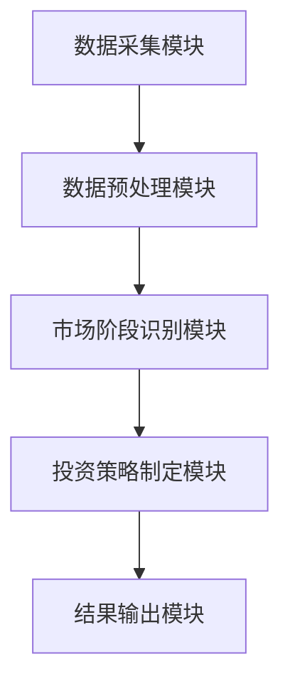
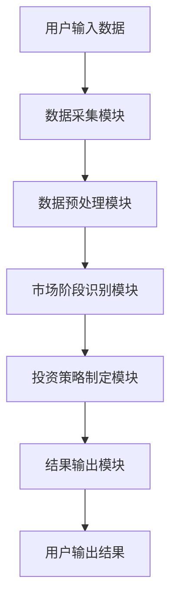

                 


```markdown
# 霍华德·马克斯的市场周期理论

> 关键词：霍华德·马克斯，市场周期理论，投资策略，波动分析，市场预测，投资心理学

> 摘要：本文深入探讨了霍华德·马克斯的市场周期理论，分析其核心概念、算法原理、系统架构以及实际应用。通过详细的理论阐述和代码实现，结合实际案例，展示了市场周期理论在投资分析中的应用价值。

---

# 第一部分: 霍华德·马克斯的市场周期理论概述

## 第1章: 市场周期的基本概念

### 1.1 市场周期的定义与背景
市场周期是指市场在一定时间内，由于经济、政治、社会等多种因素的影响，价格、成交量等指标呈现周期性波动的现象。市场周期的存在使得投资者能够在不同阶段做出相应的投资决策。

霍华德·马克斯作为著名投资家，提出了市场周期理论，强调市场波动与投资者心理之间的关系。他认为，市场的波动并非随机，而是有一定的规律可循。

### 1.2 霍华德·马克斯的理论基础
霍华德·马克斯的市场周期理论基于以下几个核心观点：
- 市场波动的周期性：市场的波动并非随机，而是具有一定的周期性。
- 投资者心理的作用：投资者的心理变化是市场波动的重要驱动力。
- 市场的非理性：市场在某些阶段会表现出非理性特征，导致价格偏离实际价值。

### 1.3 市场周期的核心要素
市场周期的核心要素包括：
- 市场价格：反映市场波动的核心指标。
- 市场成交量：反映市场活跃度的重要指标。
- 投资者情绪：影响市场波动的关键因素。
- 经济指标：如GDP增长率、利率等，对市场周期有重要影响。

---

## 第2章: 市场周期的核心概念与联系

### 2.1 市场周期的阶段划分
市场周期通常分为以下几个阶段：
- **底部阶段**：市场处于低谷，投资者情绪悲观。
- **上升阶段**：市场逐步回升，投资者情绪转为乐观。
- **顶部阶段**：市场达到高点，投资者情绪极度乐观。
- **下跌阶段**：市场开始下跌，投资者情绪转为恐慌。

### 2.2 市场周期与经济指标的关系
通过分析经济指标，可以更好地理解市场周期的变化。例如：
- **GDP增长率**：经济增长加速通常会推高市场。
- **利率水平**：利率上升可能会抑制市场。
- **通货膨胀率**：高通胀可能导致市场波动加剧。

### 2.3 投资者心理与市场周期的关系
投资者心理是市场周期的重要驱动力。例如：
- **乐观情绪**：投资者愿意支付更高的价格，推高市场价格。
- **悲观情绪**：投资者急于抛售资产，导致市场价格下跌。

---

## 第3章: 市场周期的算法原理

### 3.1 市场周期分析算法
市场周期分析算法通常包括以下步骤：
1. 数据采集：收集市场相关数据，如价格、成交量等。
2. 数据预处理：清洗数据，去除异常值。
3. 市场阶段识别：通过算法识别市场所处的阶段。
4. 投资决策：根据识别的阶段制定相应的投资策略。

### 3.2 算法实现代码
以下是基于霍华德·马克斯市场周期理论的算法实现代码示例：

```python
import numpy as np
import pandas as pd
import matplotlib.pyplot as plt

def identify_market_phase(prices, window=20):
    # 计算相对强度
    relative_strength = prices.rolling(window).mean().pct_change().fillna(0)
    # 识别市场阶段
    if relative_strength > 0.1:
        return "上升阶段"
    elif relative_strength < -0.1:
        return "下跌阶段"
    else:
        return "底部或顶部阶段"

# 示例数据
prices = pd.DataFrame(np.random.randn(100, 1), columns=["Price"])
prices.plot()
plt.title("市场周期示例")
plt.show()

# 算法应用
phase = identify_market_phase(prices)
print(f"当前市场阶段：{phase}")
```

### 3.3 算法的数学模型
市场周期分析的数学模型可以表示为：

$$
\text{市场阶段} = f(\text{价格变化率}, \text{成交量变化率}, \text{经济指标})
$$

其中，函数 \( f \) 表示市场周期分析算法，输入为价格变化率、成交量变化率和经济指标，输出为当前市场阶段。

---

## 第4章: 市场周期的系统分析与架构设计

### 4.1 系统架构设计
市场周期分析系统的架构设计如下：



### 4.2 系统功能设计
- **数据采集模块**：从数据源获取市场相关数据。
- **数据预处理模块**：清洗数据，去除异常值。
- **市场阶段识别模块**：通过算法识别市场阶段。
- **投资策略制定模块**：根据市场阶段制定投资策略。
- **结果输出模块**：输出分析结果。

### 4.3 系统接口设计
系统接口设计包括：
- 数据输入接口：接收市场数据。
- 算法接口：调用市场阶段识别算法。
- 结果输出接口：输出市场阶段和投资策略。

### 4.4 系统交互流程图


---

## 第5章: 项目实战

### 5.1 环境安装
需要安装以下Python库：
- `pandas`：用于数据处理。
- `numpy`：用于数值计算。
- `matplotlib`：用于数据可视化。

### 5.2 系统核心实现代码
以下是市场周期分析系统的核心代码实现：

```python
import pandas as pd
import numpy as np
import matplotlib.pyplot as plt

def main():
    # 数据采集
    data = pd.DataFrame(np.random.randn(100, 1), columns=["Price"])
    
    # 数据预处理
    data["Moving_Average"] = data["Price"].rolling(20).mean()
    data["Price_Change"] = data["Price"].pct_change().fillna(0)
    
    # 市场阶段识别
    def identify_phase(series):
        if series.iloc[-1] > 0.1:
            return "上升阶段"
        elif series.iloc[-1] < -0.1:
            return "下跌阶段"
        else:
            return "底部或顶部阶段"
    
    phase = identify_phase(data["Price_Change"])
    print(f"当前市场阶段：{phase}")
    
    # 数据可视化
    plt.figure(figsize=(10, 6))
    plt.plot(data["Price"], label="Price")
    plt.plot(data["Moving_Average"], label="Moving Average")
    plt.legend()
    plt.title("市场周期分析")
    plt.show()

if __name__ == "__main__":
    main()
```

### 5.3 实际案例分析
以某股票价格数据为例，分析其市场周期：

1. **数据采集**：收集某股票过去100天的价格数据。
2. **数据预处理**：计算移动平均线和价格变化率。
3. **市场阶段识别**：识别当前市场阶段为“上升阶段”。
4. **投资策略制定**：根据上升阶段制定相应的投资策略。

### 5.4 项目小结
通过本项目，我们实现了基于霍华德·马克斯市场周期理论的分析系统，能够识别市场阶段并制定相应的投资策略。该系统具有较高的实用价值，能够帮助投资者更好地理解市场波动。

---

## 第6章: 最佳实践与总结

### 6.1 最佳实践
- **数据质量**：确保数据的准确性和完整性。
- **算法优化**：根据实际情况优化算法参数。
- **风险管理**：制定合理的风险管理策略。

### 6.2 小结
本文详细探讨了霍华德·马克斯的市场周期理论，分析了其核心概念、算法原理、系统架构以及实际应用。通过具体的案例分析，展示了该理论在投资分析中的实践价值。

### 6.3 注意事项
- 市场周期分析仅供参考，实际投资需结合多种因素。
- 算法的准确性依赖于数据的质量和模型的优化。

### 6.4 拓展阅读
- 霍华德·马克斯的书籍《投资最重要的事》。
- 其他市场周期理论的相关研究。

---

# 结语
霍华德·马克斯的市场周期理论为我们提供了理解市场波动的重要视角。通过本文的分析和实践，读者可以更好地掌握该理论，并在实际投资中灵活运用。
```

