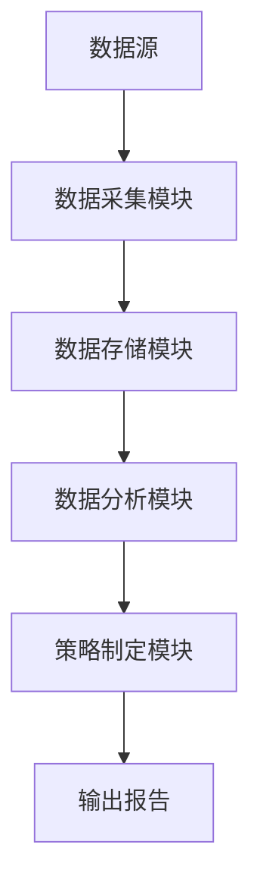

                 


# 霍华德·马克斯的市场周期识别技巧

## 关键词：
市场周期、逆向投资、霍华德·马克斯、投资策略、技术分析

## 摘要：
霍华德·马克斯的市场周期理论强调通过逆向思维识别市场周期，从而制定有效的投资策略。本文系统地介绍市场周期的定义、识别方法，详细讲解马克斯的核心理念，包括安全边际和逆向投资策略。通过技术分析和数学模型，结合Python代码实现，展示如何量化识别市场周期。最后，通过系统设计和项目实战，提供一个完整的市场周期识别系统，并总结最佳实践，帮助读者掌握市场周期识别技巧。

---

## 第一章：市场周期的定义与重要性

### 1.1 市场周期的基本概念

#### 1.1.1 市场周期的定义
市场周期是市场在经济发展过程中经历的波动阶段，通常包括繁荣、衰退、萧条和复苏四个阶段。每个阶段具有独特的特征，投资者需识别这些阶段以优化投资决策。

#### 1.1.2 市场周期的分类与特征
市场周期分为多个类型，如经济周期、股市周期等。每个阶段的特征包括价格波动、成交量变化和市场情绪的转变。

#### 1.1.3 市场周期的重要性
准确识别市场周期有助于投资者在市场低谷时买入，在高峰时卖出，从而实现超额收益。

### 1.2 市场周期的形成机制

#### 1.2.1 经济波动与市场周期的关系
经济波动直接影响市场周期，如GDP增长率、利率变化等因素导致市场的涨跌。

#### 1.2.2 市场参与者的心理与行为
投资者的心理变化，如贪婪和恐惧，推动市场的波动，形成周期性变化。

#### 1.2.3 市场信息不对称的影响
信息不对称导致市场参与者做出非理性决策，加剧市场的波动。

---

## 第二章：霍华德·马克斯的核心理念

### 2.1 逆向投资策略

#### 2.1.1 逆向投资的定义
逆向投资是在市场低迷时买入，市场高涨时卖出的投资策略，与市场情绪相反。

#### 2.1.2 马克斯的逆向投资理念
马克斯强调在市场恐慌时寻找价值，避免跟随市场情绪做出决策。

#### 2.1.3 逆向投资的实际应用
通过历史案例分析，展示逆向投资在市场周期中的成功应用。

### 2.2 安全边际概念

#### 2.2.1 安全边际的定义
安全边际是投资标的内在价值与市场价格之间的差距，确保投资的安全性。

#### 2.2.2 安全边际在市场周期中的作用
在市场低谷时，安全边际较大，提供较高的投资回报。

#### 2.2.3 安全边际的计算方法
通过分析财务数据和市场估值，计算投资标的的安全边际。

---

## 第三章：市场周期的量化分析

### 3.1 技术分析指标

#### 3.1.1 移动平均线（MA）
移动平均线用于平滑数据，识别价格趋势。例如，50天和200天均线常用于判断趋势方向。

#### 3.1.2 相对强弱指数（RSI）
RSI衡量资产的超买或超卖状态，帮助识别短期趋势反转。

#### 3.1.3 布林带
布林带用于衡量价格的波动范围，判断价格是否在正常范围内波动。

### 3.2 数学模型与算法

#### 3.2.1 市场周期的聚类分析
使用聚类算法将市场数据分为不同阶段，识别周期特征。

#### 3.2.2 时间序列分析
通过ARIMA模型预测未来市场走势，识别周期变化。

#### 3.2.3 机器学习模型
利用神经网络识别市场周期，捕捉复杂市场模式。

---

## 第四章：系统架构与实现

### 4.1 系统功能模块

#### 4.1.1 数据采集模块
从多个数据源获取市场数据，如股票价格、成交量等。

#### 4.1.2 数据分析模块
应用技术指标和机器学习模型，识别市场周期阶段。

#### 4.1.3 策略制定模块
根据分析结果，制定买入或卖出策略。

### 4.2 系统架构图
使用Mermaid绘制系统架构图，展示各模块的交互与数据流。



---

## 第五章：项目实战与案例分析

### 5.1 环境搭建

#### 5.1.1 数据源选择
使用Yahoo Finance获取历史数据。

#### 5.1.2 工具安装
安装Python、Pandas、Matplotlib和Scikit-learn。

### 5.2 核心代码实现

#### 5.2.1 数据采集代码
```python
import pandas_datareader as pdr

def get_stock_data(ticker, start, end):
    data = pdr.get_data_yahoo(ticker, start=start, end=end)
    return data
```

#### 5.2.2 技术指标计算
```python
def calculate_rsi(data, period=14):
    delta = data['Close'].diff()
    up = delta.where(delta > 0, 0)
    down = delta.where(delta < 0, 0)
    rs = up.rolling(period).mean() / down.rolling(period).mean()
    rsi = 100 - (100 - rs.rolling(period).mean())
    return rsi
```

### 5.3 案例分析

#### 5.3.1 历史数据回测
分析过去10年某股票的市场周期变化，验证模型的有效性。

#### 5.3.2 模型优化
根据回测结果，调整算法参数，提高识别准确率。

### 5.4 项目总结
总结项目成果，讨论模型的优点和局限性，提出改进建议。

---

## 第六章：最佳实践与总结

### 6.1 小结
霍华德·马克斯的市场周期理论提供了一套逆向投资的方法，结合量化分析和系统实现，能够有效识别市场周期，制定投资策略。

### 6.2 注意事项
- 数据质量影响结果准确性，需选择可靠数据源。
- 模型需定期更新，适应市场变化。
- 结合多种指标，提高识别的准确性。

### 6.3 拓展阅读
推荐相关书籍和文章，深入学习市场周期理论。

---

通过以上结构，文章系统地介绍了霍华德·马克斯的市场周期识别技巧，从理论到实践，为读者提供了全面的指导。

