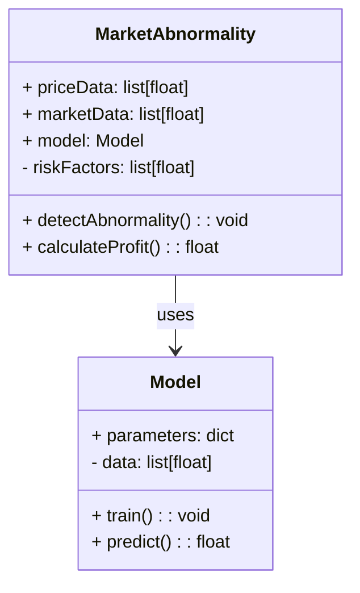
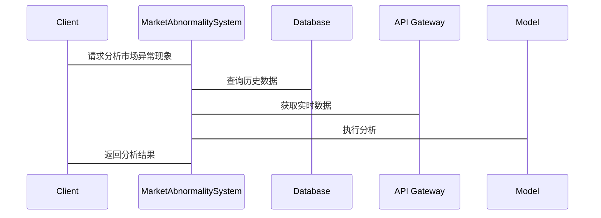

                 


# 《霍华德·马克斯的市场异常现象分析》

---

## 关键词  
霍华德·马克斯、市场异常现象、套利机会、资产定价、投资策略、低效市场

---

## 摘要  
本文将深入分析霍华德·马克斯的市场异常现象分析方法，探讨其投资哲学、套利机会评估模型以及资产定价策略。通过结合技术分析、统计模型和实际案例，本文将揭示市场异常现象的形成机制及其在投资实践中的应用。

---

# 第一部分：霍华德·马克斯的投资理念与市场异常现象概述

## 第1章：霍华德·马克斯的投资哲学

### 1.1 霍华德·马克斯的投资理念  
霍华德·马克斯是全球著名投资家，其投资理念的核心在于寻找市场中的“异常现象”。他认为，市场并非总是有效的，投资者可以通过识别价格偏离内在价值的机会来获利。马克斯在《投资致胜的思考过程》一书中强调，投资者应该关注市场的非理性行为和信息不对称现象。  

#### 1.1.1 价值投资的核心思想  
马克斯的价值投资理念可以概括为以下几点：  
1. **价格与价值的分离**：市场价格与内在价值之间存在差异，这种差异为投资者提供了套利机会。  
2. **逆向思维**：在市场恐慌时买入，在市场狂热时卖出。  
3. **Margin of Safety（安全边际）**：通过购买价格低于内在价值的资产来降低风险。  

#### 1.1.2 市场异常现象的定义与分类  
市场异常现象是指市场价格与内在价值之间的偏离，这种偏离可能是短期的，也可能是长期的。常见的市场异常现象包括：  
- 低效市场：某些资产的定价不反映其真实价值。  
- 套利机会：资产在不同市场或时间点的价格差异。  
- 资产定价错误：由于信息不对称或认知偏差导致的价格偏差。  

#### 1.1.3 马克斯投资哲学的核心要素  
1. **基本面分析**：马克斯强调通过基本面分析来识别低估资产。  
2. **套利机会**：通过寻找市场中的价格差异来获利。  
3. **长期视角**：投资的最终目标是实现长期收益，而非短期波动。  

---

### 1.2 市场异常现象的背景介绍  

#### 1.2.1 低效市场的形成原因  
低效市场通常由以下因素引起：  
- 市场参与者的信息不对称。  
- 投资者认知偏差（如过度自信、从众心理）。  
- 市场流动性不足。  

#### 1.2.2 套利机会的来源与类型  
套利机会来源于市场中的价格差异，常见的套利类型包括：  
- 跨市场套利：同一资产在不同市场或交易所的价格差异。  
- 股权套利：同一公司不同股票（如A股与H股）的价格差异。  
- 时间套利：同一资产在不同时间点的价格差异。  

#### 1.2.3 资产定价错误的常见形式  
资产定价错误通常由以下原因引起：  
- 市场参与者对资产真实价值的误判。  
- 信息传播的延迟或不完整。  
- 市场情绪的非理性影响。  

---

## 第2章：市场异常现象的识别与分析  

### 2.1 市场异常现象的类型  

#### 2.1.1 低效市场  
低效市场是指市场定价效率较低，资产价格无法充分反映其内在价值。例如，某些小市值股票可能因为市场关注度低而被低估。  

#### 2.1.2 套利机会  
套利机会是市场中价格差异的直接体现。例如，同一资产在不同市场的价格差异为套利者提供了机会。  

#### 2.1.3 资产定价错误  
资产定价错误通常由市场参与者的行为偏差或信息不对称引起。例如，某些投资者可能因过度乐观而高估某资产的价格。  

---

### 2.2 市场异常现象的特征分析  

#### 2.2.1 市场参与者的认知偏差  
认知偏差是市场异常现象的重要原因之一。例如，投资者的过度自信可能导致资产价格的过度波动。  

#### 2.2.2 市场信息的不对称性  
信息不对称是指市场参与者掌握的信息不一致，这可能导致资产价格的偏离。例如，某些 insider 信息可能使某些投资者获得超额收益。  

#### 2.2.3 市场波动的非理性特征  
市场的非理性波动通常是市场异常现象的表现。例如，市场的恐慌性抛售可能使某些资产价格大幅低于其内在价值。  

---

# 第三部分：市场异常现象的数学模型与算法原理  

## 第3章：市场异常现象的数学模型  

### 3.1 资产定价模型  

#### 3.1.1 CAPM模型  
CAPM（资本资产定价模型）是经典的资产定价模型，公式为：  
$$ E(R_i) = R_f + \beta_i (E(R_m) - R_f) $$  
其中，\( E(R_i) \) 是资产 \( i \) 的期望收益率，\( R_f \) 是无风险利率，\( \beta_i \) 是资产 \( i \) 的贝塔系数，\( E(R_m) \) 是市场期望收益率。  

#### 3.1.2 APT模型  
APT（套利定价理论）是另一种资产定价模型，假设存在多个风险因素，其公式为：  
$$ E(R_i) = R_f + \sum_{j=1}^n \lambda_j x_{i,j} $$  
其中，\( \lambda_j \) 是风险溢价，\( x_{i,j} \) 是资产 \( i \) 对风险因子 \( j \) 的暴露程度。  

#### 3.1.3 套利定价模型  
套利定价模型基于市场中存在套利机会的假设，认为资产价格应趋于其内在价值。  

---

### 3.2 市场异常现象的统计模型  

#### 3.2.1 时间序列分析模型  
时间序列分析模型用于研究资产价格的动态变化。例如，ARIMA模型可以用于预测资产价格的未来走势。  

#### 3.2.2 马尔可夫链模型  
马尔可夫链模型用于分析资产价格状态的转移概率，例如牛市、熊市之间的切换。  

#### 3.2.3 贝叶斯网络模型  
贝叶斯网络模型用于分析市场参与者的行为及其对资产价格的影响。  

---

## 第4章：市场异常现象的算法实现  

### 4.1 套利机会检测算法  

#### 4.1.1 基于差价的套利检测算法  
该算法通过比较同一资产在不同市场或时间点的价格差异来检测套利机会。例如：  
1. 数据收集：收集同一资产在不同市场或时间点的价格数据。  
2. 计算差异：计算价格差异。  
3. 判断机会：如果差异超过套利成本，则存在套利机会。  

#### 4.1.2 基于波动率的套利检测算法  
该算法通过分析资产价格的波动率来检测套利机会。例如：  
1. 计算资产价格的波动率。  
2. 比较波动率与历史波动率的差异。  
3. 判断机会：如果波动率显著高于历史水平，则可能存在套利机会。  

---

### 4.2 套利机会评估模型  

#### 4.2.1 套利空间的计算方法  
套利空间可以通过以下公式计算：  
$$ \text{套利空间} = \text{资产A价格} - \text{资产B价格} $$  

#### 4.2.2 套利风险的评估框架  
套利风险可以通过以下步骤评估：  
1. 评估市场的流动性风险。  
2. 评估市场的波动风险。  
3. 评估市场的政策风险。  

---

# 第四部分：系统分析与架构设计  

## 第5章：系统分析与架构设计方案  

### 5.1 问题场景介绍  
本文将构建一个基于霍华德·马克斯市场异常现象分析方法的投资系统，旨在通过技术手段识别市场中的套利机会。  

### 5.2 系统功能设计  

#### 5.2.1 领域模型（Mermaid 类图）  


#### 5.2.2 系统架构设计（Mermaid 架构图）  


#### 5.2.3 系统接口设计  
系统接口包括：  
1. 数据接口：用于获取市场数据。  
2. 分析接口：用于执行市场异常现象分析。  
3. 交易接口：用于根据分析结果执行交易。  

#### 5.2.4 系统交互设计（Mermaid 序列图）  


---

## 第6章：项目实战  

### 6.1 环境安装  
1. 安装 Python 和相关库（如 NumPy、Pandas、Scikit-learn）。  
2. 配置数据源（如 Yahoo Finance API）。  

### 6.2 核心实现源代码  

#### 6.2.1 数据收集与预处理  
```python
import pandas as pd
import numpy as np

# 数据收集
def collect_data(ticker, start_date, end_date):
    data = pd.DataFrame()
    # 假设使用 Yahoo Finance API 获取数据
    return data

# 数据预处理
def preprocess_data(data):
    data = data.dropna()
    data = (data - data.mean()) / data.std()
    return data
```

#### 6.2.2 套利机会检测  
```python
def detect_arbitrage_opportunity(data):
    diff = data['price1'] - data['price2']
    if diff > 0.01:  # 假设套利成本为1%
        return True
    else:
        return False
```

#### 6.2.3 模型训练与预测  
```python
from sklearn.linear_model import LinearRegression

def train_model(data):
    model = LinearRegression()
    model.fit(data[['feature1', 'feature2']], data['target'])
    return model

def predict_price(model, new_data):
    prediction = model.predict(new_data[['feature1', 'feature2']])
    return prediction
```

---

## 第7章：最佳实践与小结  

### 7.1 最佳实践 Tips  
1. 在实际投资中，套利机会往往短暂，需快速决策。  
2. 严格控制风险，避免过度杠杆。  
3. 结合技术分析和基本面分析，提高分析的准确性。  

### 7.2 小结  
本文通过霍华德·马克斯的市场异常现象分析方法，结合技术手段，揭示了市场中的套利机会和资产定价错误。通过系统设计和实际案例分析，本文为投资者提供了一种新的投资思路。

---

## 第8章：注意事项与拓展阅读  

### 8.1 注意事项  
1. 市场异常现象可能随时变化，需持续监控。  
2. 套利机会可能存在较高的交易成本和风险。  
3. 严格遵守法律法规，避免参与非法套利活动。  

### 8.2 拓展阅读  
1. 霍华德·马克斯的《投资致胜的思考过程》。  
2. 统计套利的相关书籍（如《套利机会识别与交易系统》）。  
3. 技术分析与量化投资的相关书籍。  

---

以上是《霍华德·马克斯的市场异常现象分析》的技术博客文章大纲。通过逐步分析市场异常现象的形成机制、数学模型、算法实现以及系统设计，本文为投资者提供了一种新的投资思路。

