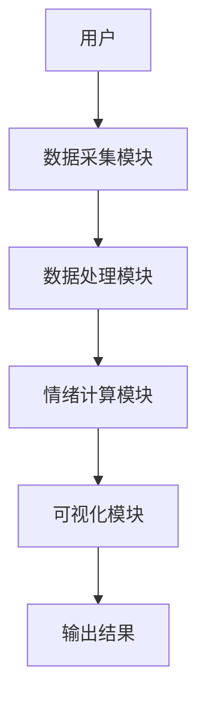

                 


# 霍华德·马克斯的市场情绪指标

## 关键词：市场情绪指标、投资者心理、量化分析、霍华德·马克斯、投资决策

## 摘要：市场情绪指标是投资决策中的重要工具，能够帮助投资者更好地理解市场波动和投资者心理。本文将深入分析霍华德·马克斯提出的市场情绪指标，探讨其理论基础、计算方法、系统架构与实现，以及在实际投资中的应用。文章从理论到实践，逐步解析市场情绪指标的核心概念、量化方法和系统设计，为投资者提供科学的决策支持。

---

# 第一章：市场情绪指标的背景与概念

## 1.1 市场情绪指标的定义与重要性

### 1.1.1 市场情绪指标的定义
市场情绪指标（Market Sentiment Index，MSI）是衡量市场参与者情绪和态度的量化工具。它通过分析投资者的行为、言论和市场数据，评估市场对未来走势的乐观或悲观程度。

### 1.1.2 市场情绪指标的重要性
- 帮助投资者识别市场的过度乐观或悲观情绪。
- 为投资决策提供参考，避免盲目跟风。
- 在市场波动中提供预警信号，降低投资风险。

### 1.1.3 市场情绪指标的核心要素
- 投资者情绪的量化。
- 市场行为的分析。
- 市场数据的整合与计算。

## 1.2 市场情绪指标的理论基础

### 1.2.1 投资者心理与行为分析
投资者心理是市场情绪指标的核心，包括以下几个方面：
- **乐观与悲观情绪**：投资者对未来市场的看法。
- **风险偏好**：投资者对风险的态度。
- **行为偏差**：投资者在决策中的常见偏差，如过度自信、从众心理等。

### 1.2.2 市场情绪与市场周期的关系
市场情绪指标在不同市场周期中的表现：
- **牛市**：市场情绪高涨，投资者乐观。
- **熊市**：市场情绪低落，投资者悲观。
- **震荡市**：市场情绪波动较大，投资者犹豫。

### 1.2.3 市场情绪指标的理论框架
- **投资者情绪模型**：将投资者情绪分为乐观、中性和悲观三种状态。
- **市场情绪周期**：从乐观到悲观再到乐观的循环。

---

# 第二章：市场情绪指标的计算与量化

## 2.1 市场情绪指标的计算方法

### 2.1.1 基于投资者情绪的指标计算
- **情绪得分**：通过调查、社交媒体分析等方式获取投资者情绪得分。
- **情绪指数**：将情绪得分标准化，得到情绪指数。

### 2.1.2 市场情绪指标的数学模型
$$ MSI = \frac{\sum (情绪得分 \times 权重)}{\sum 权重} $$

### 2.1.3 情绪指数的标准化处理
- 将情绪指数标准化到0-100的范围，0表示极度悲观，100表示极度乐观。

## 2.2 市场情绪指标的量化工具与技术

### 2.2.1 文本分析技术
- 使用自然语言处理（NLP）技术分析新闻、社交媒体和投资者评论。
- 示例：分析新闻标题的情绪倾向，计算情绪得分。

### 2.2.2 交易数据分析
- 通过分析交易量、价格波动等数据，推断市场情绪。
- 示例：交易量激增可能表示投资者情绪高涨。

### 2.2.3 数据可视化工具
- 使用图表展示市场情绪指数的变化趋势。

---

# 第三章：市场情绪指标的系统架构与实现

## 3.1 市场情绪分析系统的功能设计

### 3.1.1 系统功能模块划分
- 数据采集模块：采集投资者情绪数据。
- 数据处理模块：对数据进行清洗和预处理。
- 情绪计算模块：计算市场情绪指数。
- 可视化模块：展示市场情绪指数的变化趋势。

### 3.1.2 系统功能流程图


## 3.2 市场情绪分析系统的架构设计

### 3.2.1 系统架构图


---

# 第四章：市场情绪指标的实际应用与案例分析

## 4.1 项目实战：构建市场情绪分析系统

### 4.1.1 环境安装
- 安装Python、Pandas、Matplotlib、Numpy等工具。

### 4.1.2 核心代码实现
```python
import pandas as pd
import matplotlib.pyplot as plt

def calculate_market_sentiment(data):
    # 计算情绪指数
   情绪指数 = data['情绪得分'].mean()
    return 情绪指数

# 示例数据
data = {'情绪得分': [75, 80, 60, 85, 70]}
df = pd.DataFrame(data)

# 计算市场情绪指数
sentiment_index = calculate_market_sentiment(df)
print(f"市场情绪指数为：{sentiment_index}")

# 可视化
plt.bar(df.index, df['情绪得分'])
plt.title('市场情绪指数变化')
plt.show()
```

---

# 第五章：市场情绪指标的优化与改进

## 5.1 系统优化与改进方案

### 5.1.1 系统优化方向
- 提高数据采集的实时性。
- 增强情绪计算的准确性。
- 优化系统的可扩展性。

### 5.1.2 系统改进措施
- 引入更多的数据源，如社交媒体、新闻媒体。
- 使用机器学习算法提高情绪计算的准确性。
- 增加用户交互功能，提供个性化情绪分析。

---

# 第六章：市场情绪指标的最佳实践与注意事项

## 6.1 最佳实践

### 6.1.1 投资者心理分析
- 理解投资者心理，避免情绪化决策。

### 6.1.2 市场情绪指标的应用技巧
- 结合其他市场指标，如技术指标、基本面分析。

### 6.1.3 系统维护与更新
- 定期更新数据和算法，保持系统的准确性。

## 6.2 小结与总结

### 6.2.1 本章小结
市场情绪指标是投资决策中的重要工具，通过量化投资者情绪，帮助投资者更好地理解市场波动。

### 6.2.2 总结
本文详细介绍了霍华德·马克斯的市场情绪指标，从理论到实践，全面分析了其计算方法、系统架构和实际应用。市场情绪指标的应用能够帮助投资者做出更科学的投资决策，降低投资风险。

---

# 第七章：未来展望与拓展阅读

## 7.1 未来展望

### 7.1.1 市场情绪指标的未来发展
- 更多数据源的引入，如区块链数据。
- 更复杂的情绪分析模型，如深度学习。

### 7.1.2 技术进步对市场情绪指标的影响
- 人工智能技术的提升将使情绪分析更加精准。
- 区块链技术的应用将提高数据的安全性和实时性。

## 7.2 拓展阅读

### 7.2.1 相关书籍
- 《霍华德·马克斯的《投资最重要的事情》》
- 《市场情绪分析的理论与实践》

### 7.2.2 相关论文
- "投资者情绪与市场波动的关系研究"
- "基于大数据的市场情绪分析方法"

---

# 总结

市场情绪指标是投资决策中的重要工具，通过量化投资者情绪，帮助投资者更好地理解市场波动和投资机会。本文从理论到实践，详细分析了霍华德·马克斯提出的市场情绪指标，探讨了其计算方法、系统架构和实际应用。通过本文的分析，读者能够更好地理解市场情绪指标的核心概念，并将其应用于实际投资中，做出更科学的投资决策。

