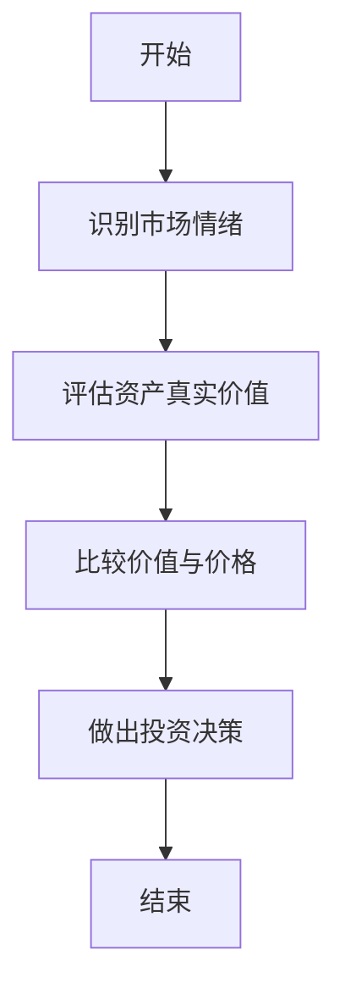

                 


---

# 霍华德·马克斯的逆向投资心理学

> 关键词：逆向投资，心理学，认知偏差，决策模型，投资哲学

> 摘要：本文深入探讨了霍华德·马克斯的逆向投资心理学，分析了投资者的认知偏差、行为偏差以及如何通过逆向思维进行投资决策。通过数学模型和系统架构的分析，结合实际案例，为投资者提供了实用的决策策略。

---

## 第一章: 逆向投资与心理学概述

### 1.1 逆向投资的定义与背景

#### 1.1.1 传统投资与逆向投资的对比
- 传统投资：基于市场趋势和价格波动进行投资。
- 逆向投资：在市场低迷时买入，市场高涨时卖出。

#### 1.1.2 逆向投资的核心理念
- 价值投资：寻找被市场低估的资产。
- 避免羊群效应：逆市场情绪进行决策。

#### 1.1.3 霍华德·马克斯的贡献
- 提出逆向投资的理论框架。
- 强调心理学在投资决策中的作用。

### 1.2 投资者心理学基础

#### 1.2.1 心理学与投资的关系
- 投资者的行为受心理因素影响。
- 认知偏差影响决策。

#### 1.2.2 投资者认知偏差的常见类型
- 简单认知偏差（Negativity Bias）：对负面信息更敏感。
- 确认偏差（Confirmation Bias）：倾向于寻找支持已有观点的信息。
- 锚定效应（Anchoring Effect）：过度依赖初始信息。

#### 1.2.3 心理账户与决策偏差
- 心理账户的分类。
- 决策偏差对投资决策的影响。

### 1.3 霍华德·马克斯的投资哲学

#### 1.3.1 马克斯的投资理念
- 价值与价格分离。
- 市场情绪与资产定价。

#### 1.3.2 逆向思维在投资中的应用
- 在市场恐慌时寻找机会。
- 在市场狂热时保持冷静。

#### 1.3.3 马克斯的成功案例分析
- 具体案例分析：马克斯如何通过逆向投资获利。

### 1.4 本章小结
总结逆向投资的核心理念和马克斯的投资哲学，为后续分析奠定基础。

---

## 第二章: 投资者认知偏差与行为偏差

### 2.1 认知偏差的分类与影响

#### 2.1.1 简单认知偏差（Negativity Bias）
- 对负面信息的过度关注。
- 对正面信息的忽视。

#### 2.1.2 确认偏差（Confirmation Bias）
- 过度寻找支持已有观点的信息。
- 忽略反驳信息。

#### 2.1.3 锚定效应（Anchoring Effect）
- 过度依赖初始信息。
- 判断时受锚定值影响。

### 2.2 行为偏差的分析

#### 2.2.1 过度自信（Overconfidence）
- 对自己判断的过度信任。
- 忽视市场变化的可能性。

#### 2.2.2 情绪驱动决策（Emotion-Driven Decisions）
- 恐慌和贪婪的情绪影响决策。
- 情绪化交易的危害。

#### 2.2.3 羊群效应（Herding Effect）
- 跟随市场 majority进行决策。
- 忽视独立思考的重要性。

### 2.3 马克斯对认知偏差的见解

#### 2.3.1 认知偏差对投资决策的影响
- 认知偏差导致错误判断。
- 市场情绪的波动加剧。

#### 2.3.2 如何克服认知偏差
- 提高自我认知。
- 建立合理的决策框架。

#### 2.3.3 马克斯的应对策略
- 通过逆向思维避免偏差。
- 坚持基本面分析。

### 2.4 本章小结
分析了认知偏差和行为偏差对投资的影响，并提出应对策略。

---

## 第三章: 逆向投资的决策模型

### 3.1 马克斯的决策模型

#### 3.1.1 价值与价格的分离
- 资产的真实价值与市场价格的分离。
- 寻找价值被低估的资产。

#### 3.1.2 市场情绪与资产定价
- 市场情绪对价格的影响。
- 如何利用市场情绪进行逆向投资。

#### 3.1.3 逆向思维的核心步骤
- 识别市场情绪。
- 评估资产价值。
- 比较价值与价格。
- 做出投资决策。

### 3.2 投资决策的数学模型

#### 3.2.1 期望效用理论（Expected Utility Theory）
- 定义：$$ EU = \sum p_i u(x_i) $$
- 解释：投资者根据概率和效用函数做出决策。

#### 3.2.2 非期望效用理论（Non-Expected Utility Theory）
- 定义：$$ R = \sum p_i r_i $$
- 解释：考虑非期望效用的影响。

#### 3.2.3 马克斯决策模型的数学表达
- 结合价值与价格的模型：$$ V = \sum v_i p_i $$

### 3.3 决策模型的mermaid流程图



### 3.4 本章小结
详细介绍了马克斯的决策模型及其数学表达，为实际应用提供理论基础。

---

## 第四章: 投资者心理与市场行为分析

### 4.1 投资者心理模型

#### 4.1.1 投资者心理模型的构建
- 确定投资者的心理特征。
- 构建心理模型的步骤。

#### 4.1.2 心理模型的验证与修正
- 使用数据验证模型。
- 根据实际情况修正模型。

#### 4.1.3 心理模型在投资中的应用
- 辅助投资决策。
- 识别市场趋势。

### 4.2 投资者行为分析

#### 4.2.1 投资者行为的分类
- 理性行为与非理性行为。
- 行为偏差的具体表现。

#### 4.2.2 行为偏差对市场的影响
- 市场波动的加剧。
- 价格的非理性波动。

#### 4.2.3 如何利用行为分析进行投资
- 识别市场情绪。
- 利用行为偏差获利。

### 4.3 系统分析与架构设计方案

#### 4.3.1 问题场景介绍
- 投资者心理与市场行为的关系。
- 行为分析的必要性。

#### 4.3.2 系统功能设计
- 领域模型mermaid类图：
  ```mermaid
  classDiagram
      class 投资者心理模型 {
          心理特征
          行为模式
          市场情绪
      }
      class 市场行为分析 {
          行为数据
          行为模式识别
          市场趋势预测
      }
      投资者心理模型 --> 市场行为分析
  ```

#### 4.3.3 系统架构设计
- 系统架构mermaid架构图：
  ```mermaid
  architecture
      客户端 --> 服务端
      服务端 --> 数据库
  ```

#### 4.3.4 系统接口设计
- API接口定义：提供心理模型和行为分析的数据接口。

#### 4.3.5 系统交互mermaid序列图
  ```mermaid
  sequenceDiagram
      投资者心理模型 -> 市场行为分析: 提供心理特征
      市场行为分析 -> 数据库: 查询行为数据
      数据库 --> 市场行为分析: 返回行为数据
      市场行为分析 -> 投资者心理模型: 提供行为模式识别结果
  ```

### 4.4 本章小结
通过系统分析和架构设计，为投资者心理与市场行为的深入分析提供技术支持。

---

## 第五章: 投资者心理与市场行为分析

### 5.1 项目实战

#### 5.1.1 环境安装
- 安装必要的软件和工具。

#### 5.1.2 系统核心实现源代码
- Python代码实现：
  ```python
  def market_emotion(price_data):
      # 计算市场情绪指数
      return emotion_index
  ```

#### 5.1.3 代码应用解读与分析
- 分析代码实现的具体步骤。
- 解释每个函数的作用。

#### 5.1.4 实际案例分析
- 案例：某市场的逆向投资机会。
- 分析过程：识别市场情绪，评估资产价值，做出投资决策。

#### 5.1.5 项目小结
- 总结项目成果。
- 提出改进建议。

### 5.2 最佳实践 tips

#### 5.2.1 投资者心理与市场行为的关联
- 理解认知偏差和行为偏差的影响。
- 通过逆向思维做出决策。

#### 5.2.2 小结
总结全文，强调逆向投资心理学的重要性。

#### 5.2.3 注意事项
- 避免过度依赖心理模型。
- 结合实际情况灵活运用。

#### 5.2.4 拓展阅读
- 推荐相关书籍和文章。

### 5.3 本章小结
通过项目实战和总结，为读者提供实际操作的指导和建议。

---

## 第六章: 总结与展望

### 6.1 总结
- 回顾全文，总结主要观点。
- 强调逆向投资心理学的重要性。

### 6.2 展望
- 未来研究方向。
- 逆向投资心理学的发展趋势。

### 6.3 本章小结
总结全文，为读者提供全面的思考和未来的方向。

---

# 结语

通过系统地分析霍华德·马克斯的逆向投资心理学，本文为投资者提供了深入的理论支持和实际操作的指导。希望读者能够通过本文的理解，更好地应用逆向思维进行投资决策。

--- 

This structured outline should help in writing a comprehensive and insightful blog post on Howard Marks'逆向投资心理学.

