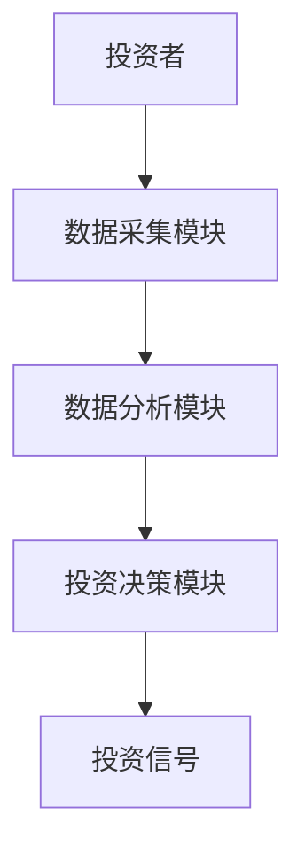

                 


```markdown
# 霍华德·马克斯的逆向投资：如何在市场恐慧中获利

> 关键词：逆向投资，霍华德·马克斯，市场恐慌，投资策略，风险管理

> 摘要：霍华德·马克斯的逆向投资策略在市场恐慌时期尤其有效。本文深入分析了逆向投资的核心概念、策略与方法，结合系统分析与架构设计，通过项目实战和案例分析，详细讲解了如何在市场恐慧中获利。文章还包括风险管理、数学模型和最佳实践，帮助读者掌握逆向投资的精髓。

---

## 第1章: 逆向投资的核心概念

### 1.1 逆向投资的定义与背景

#### 1.1.1 逆向投资的定义
逆向投资是一种投资策略，强调在市场恐慌或低迷时期买入，而在市场乐观或高涨时期卖出。与传统投资策略相反，逆向投资利用市场的非理性波动寻找投资机会。

#### 1.1.2 逆向投资的背景与现状
当前金融市场波动剧烈，投资者情绪受市场影响较大。逆向投资作为一种反周期策略，近年来受到越来越多投资者的关注，尤其是在市场恐慌时期。

#### 1.1.3 逆向投资与传统投资的区别
| 特性 | 逆向投资 | 传统投资 |
|------|----------|-----------|
| 投资时机 | 市场低谷 | 市场高点 |
| 风险承受 | 高       | 中/低     |
| 投资心理 | 逆势买入 | 顺势投资 |

### 1.2 霍华德·马克斯的投资哲学

#### 1.2.1 马克斯的投资理念
马克斯强调价值投资，认为市场的价格波动提供了逆向投资的机会。他的核心观点是“价格波动是机会的来源”。

#### 1.2.2 马克斯的市场观点
市场是由“市场先生”驱动的，投资者应关注市场的非理性波动，而非短期价格变动。

#### 1.2.3 马克斯的投资策略
马克斯的策略包括：
1. 识别市场的过度反应。
2. 投资那些被市场低估的资产。
3. 长期持有，避免频繁交易。

---

## 第2章: 市场恐慌与逆向投资

### 2.1 市场恐慌的定义与特征

#### 2.1.1 市场恐慌的定义
市场恐慌是指投资者因害怕损失而大量抛售资产，导致市场价格急剧下跌的现象。

#### 2.1.2 市场恐慌的特征
- 投资者情绪极度悲观。
- 市场流动性下降。
- 资产价格大幅偏离其内在价值。

#### 2.1.3 市场恐慌的周期性
市场恐慌通常出现在市场周期的低谷阶段，是周期性现象。

### 2.2 逆向投资的逻辑与优势

#### 2.2.1 逆向投资的逻辑
- 市场恐慌导致资产价格被低估。
- 投资者在恐慌时的非理性行为创造了买入机会。

#### 2.2.2 逆向投资的优势
- 逆向投资能够在市场底部买入，长期收益潜力大。
- 通过逆向投资，投资者可以分散风险，避免追涨杀跌的错误。

---

## 第3章: 逆向投资的策略与方法

### 3.1 逆向投资的策略制定

#### 3.1.1 确定投资目标
明确投资目标和风险承受能力，制定长期投资计划。

#### 3.1.2 选择投资标的
选择那些被市场低估且具有长期增长潜力的资产。

#### 3.1.3 定期审视投资组合
定期检查投资组合的表现，调整以适应市场变化。

### 3.2 逆向投资的实施步骤

#### 3.2.1 识别市场恐慌
通过市场情绪指标和历史数据分析识别市场恐慌。

#### 3.2.2 分析投资标的
对潜在投资标的进行基本面分析，评估其内在价值。

#### 3.2.3 逐步建仓
在市场恐慌时分批买入，避免一次性投入的风险。

---

## 第4章: 逆向投资的系统分析与架构设计

### 4.1 系统架构设计

#### 4.1.1 系统功能模块
- 数据采集模块：收集市场数据和投资者情绪指标。
- 数据分析模块：分析市场趋势和投资标的。
- 投资决策模块：生成投资策略和信号。

#### 4.1.2 系统架构图


### 4.2 算法原理与实现

#### 4.2.1 数据采集
- 通过API获取市场数据和情绪指标。
- 数据预处理：清洗、转换和存储。

#### 4.2.2 数据分析
- 使用统计分析和机器学习模型预测市场趋势。
- 识别市场恐慌的指标：恐慌指数、波动率等。

#### 4.2.3 投资决策
- 基于分析结果生成投资信号。
- 系统化投资策略：分批买入、止损设置等。

---

## 第5章: 项目实战与案例分析

### 5.1 项目实战

#### 5.1.1 环境安装
- 安装Python和相关库（如Pandas、NumPy、Scikit-learn）。
- 数据源：获取历史市场数据和情绪指标。

#### 5.1.2 核心代码实现
```python
import pandas as pd
import numpy as np
from sklearn import linear_model

# 数据加载
data = pd.read_csv('market_data.csv')

# 数据预处理
data_clean = data.dropna()

# 情绪指标计算
def calculate_panic_index(data):
    # 示例：计算恐慌指数
    return data['volatility'].mean() * 100

panic_index = calculate_panic_index(data_clean)
```

#### 5.1.3 代码解读与分析
- 数据预处理：清洗数据，删除缺失值。
- 情绪指标计算：基于波动率计算恐慌指数。
- 投资信号生成：根据恐慌指数决定买入或卖出。

### 5.2 案例分析

#### 5.2.1 历史案例
- 2008年金融危机：逆向投资在市场低谷买入，长期收益显著。

#### 5.2.2 实际案例
- 疫情期间市场恐慌：投资者在恐慌时买入，随后市场复苏带来收益。

---

## 第6章: 风险管理与最佳实践

### 6.1 风险管理

#### 6.1.1 风险识别
- 市场风险：资产价格波动。
- 流动性风险：市场流动性不足。

#### 6.1.2 风险控制
- 设置止损点：限制潜在损失。
- 分散投资：降低单一资产的风险。

### 6.2 最佳实践

#### 6.2.1 投资心态管理
- 避免情绪化决策。
- 保持耐心，长期持有。

#### 6.2.2 持续学习
- 关注市场动态和经济数据。
- 不断优化投资策略。

---

## 第7章: 总结与展望

### 7.1 总结
逆向投资是一种有效的投资策略，尤其在市场恐慌时期。通过系统的分析和科学的决策，投资者可以在市场恐慧中获利。

### 7.2 展望
未来，随着科技的发展，逆向投资将更加依赖于数据分析和人工智能，投资者需要不断学习和适应新的市场环境。

---

## 第8章: 注意事项与拓展阅读

### 8.1 注意事项
- 逆向投资需要充分的研究和准备。
- 投资者应根据自身情况制定策略。

### 8.2 拓展阅读
- 《The Most Successful Investment Strategies All Time》
- 《The Intelligent Investor》

---

通过以上步骤，我们可以全面理解霍华德·马克斯的逆向投资策略，并在实际操作中应用这些方法，抓住市场恐慧中的投资机会。
```

