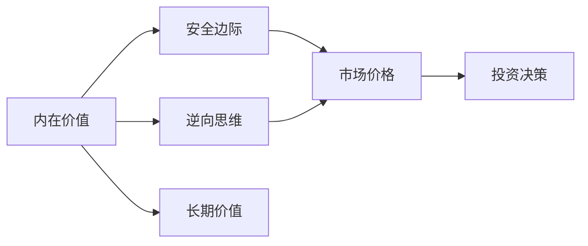
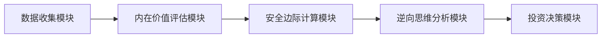

                 


# 霍华德马克斯的投资备忘录启示

## 关键词：霍华德·马克斯，投资备忘录，安全边际，价值投资，逆向思维，内在价值

## 摘要：霍华德·马克斯的投资备忘录以深刻的投资见解和实用的策略分析闻名，他的投资理念强调安全边际、逆向思维和长期价值。本文将通过详细分析备忘录的核心思想，探讨其对现代投资策略的影响，并结合实际案例，展示如何将马克斯的理念应用于投资决策中。

---

# 第一部分: 霍华德·马克斯投资理念的背景与核心原则

# 第1章: 霍华德·马克斯与投资备忘录的背景介绍

## 1.1 霍华德·马克斯的生平与投资理念
### 1.1.1 霍华德·马克斯的生平简介
霍华德·马克斯（Howard Marks）是美国著名的投资家、作家和教育家，出生于1940年，目前仍活跃于投资领域。他不仅是橡树资本（Oaktree Capital）的联合创始人，还因其投资备忘录而闻名。马克斯的投资理念强调价值投资和安全边际，他的备忘录因其深刻的见解和实用的策略分析而广受欢迎。

### 1.1.2 马克斯投资理念的核心思想
马克斯的投资理念主要围绕以下几个核心思想展开：
1. **安全边际**：安全边际是投资中的一个重要概念，指的是投资标的的内在价值与其市场价格之间的差距。马克斯认为，安全边际是投资者在市场中获得超额收益的关键因素。
2. **逆向思维**：逆向思维是指在市场低迷时寻找投资机会，避免跟随市场的趋势。马克斯认为，市场的情绪波动是投资机会的来源，逆向思维可以帮助投资者在市场低谷时找到低估的资产。
3. **长期价值**：马克斯强调投资的长期价值，认为市场短期波动并不能决定资产的长期价值。他建议投资者关注公司的基本面，而不是市场的短期波动。

### 1.1.3 马克斯备忘录的影响力与价值
马克斯的投资备忘录以其独特的风格和深刻的见解而广受欢迎。这些备忘录不仅帮助投资者理解市场运作的内在逻辑，还提供了许多实用的投资策略和风险管理方法。马克斯的备忘录常常被投资者视为投资决策的重要参考。

## 1.2 霍华德·马克斯投资理念的演变
### 1.2.1 从价值投资到安全边际
马克斯的投资理念深受本杰明·格雷厄姆（Benjamin Graham）的影响，他早期的投资策略主要基于格雷厄姆的价值投资理论。然而，随着市场环境的变化，马克斯逐渐形成了自己的投资理念，特别是强调安全边际的重要性。

### 1.2.2 马克斯投资理念的核心要素
马克斯的投资理念包含以下几个核心要素：
1. **安全边际**：确保投资标的的市场价格低于其内在价值，从而为投资提供安全保障。
2. **逆向思维**：在市场恐慌时寻找机会，避免跟随市场的短期波动。
3. **长期价值**：关注公司的长期发展潜力，而不是短期市场波动。

### 1.2.3 备忘录在投资决策中的作用
马克斯的备忘录不仅是他的个人投资笔记，还成为了投资者理解其投资理念的重要工具。这些备忘录详细记录了他的投资思路、决策过程和风险管理方法，为投资者提供了宝贵的经验和教训。

## 1.3 霍华德·马克斯投资理念的实践应用
### 1.3.1 备忘录在投资决策中的具体应用
马克斯的备忘录在投资决策中的具体应用主要体现在以下几个方面：
1. **安全边际的评估**：在选择投资标的时，马克斯会仔细评估其内在价值，并确保市场价格低于其内在价值，从而提供安全边际。
2. **逆向思维的应用**：在市场低迷时，马克斯会寻找被市场低估的资产，这些资产通常具有较高的安全边际。
3. **长期价值的关注**：马克斯注重公司的长期发展潜力，而不是短期的市场波动。他会选择那些具有强大基本面和长期增长潜力的公司。

### 1.3.2 马克斯理念对现代投资的影响
马克斯的投资理念对现代投资产生了深远的影响。他的安全边际和逆向思维策略被广泛应用于各种投资策略中，尤其是在价值投资领域。许多投资者和机构都参考马克斯的备忘录来制定自己的投资策略。

### 1.3.3 备忘录的启示与投资者的反思
通过研究马克斯的备忘录，投资者可以从中获得许多启示。例如，如何评估安全边际、如何在市场恐慌中寻找机会，以及如何关注公司的长期价值等。这些启示可以帮助投资者在实际投资中做出更明智的决策。

# 第2章: 霍华德·马克斯投资理念的核心概念与联系

## 2.1 投资理念的核心概念
### 2.1.1 安全边际的定义与计算
**安全边际**是投资中的一个重要概念，指的是投资标的的市场价格与其内在价值之间的差距。马克斯认为，安全边际是投资者在市场中获得超额收益的关键因素。计算安全边际的方法通常包括以下几个步骤：

1. **评估内在价值**：内在价值是投资标的的真正价值，通常通过现金流折现法等方法进行评估。
2. **确定市场价格**：市场价格是投资标的在市场上的交易价格。
3. **计算安全边际**：安全边际 = 内在价值 - 市场价格。

例如，如果一个公司的内在价值为100元，而市场价格为80元，那么安全边际为20元。

### 2.1.2 内在价值的评估方法
内在价值是投资标的的真正价值，通常通过现金流折现法（DCF）进行评估。现金流折现法的基本思想是将未来现金流折现到现在，以确定其当前价值。以下是现金流折现法的步骤：

1. **预测未来现金流**：预测投资标的在未来各年的现金流。
2. **选择合适的折现率**：通常使用公司的加权平均资本成本（WACC）作为折现率。
3. **计算未来现金流的现值**：将未来现金流折现到现在。
4. **计算终值**：假设投资标的在无限期内的现金流保持稳定，计算其终值。
5. **计算总价值**：将未来现金流的现值和终值相加，得到投资标的的内在价值。

例如，假设一个公司未来5年的现金流分别为100万元、120万元、140万元、160万元和180万元，折现率为10%。使用现金流折现法计算其内在价值如下：

| 年份 | 现金流 | 折现因子 | 现值 |
|------|--------|----------|------|
| 1    | 100    | 0.9091   | 90.91|
| 2    | 120    | 0.8264   | 100.00|
| 3    | 140    | 0.7513   | 105.18|
| 4    | 160    | 0.6830   | 109.28|
| 5    | 180    | 0.6209   | 111.74|

总现值 = 90.91 + 100.00 + 105.18 + 109.28 + 111.74 = 517.11万元

### 2.1.3 逆向思维在投资中的应用
逆向思维是指在市场低迷时寻找投资机会，避免跟随市场的趋势。马克斯认为，市场的情绪波动是投资机会的来源，逆向思维可以帮助投资者在市场低谷时找到低估的资产。例如，在市场恐慌时，许多投资者会抛售股票，导致市场价格下跌。此时，投资者可以通过逆向思维，寻找那些被市场低估的公司，进行长期投资。

## 2.2 核心概念的属性对比
### 2.2.1 安全边际与风险控制的对比分析
安全边际和风险控制是两个相关但不同的概念。安全边际关注的是投资标的的市场价格与其内在价值之间的差距，而风险控制关注的是如何在投资过程中管理风险。以下是对两者进行对比的表格：

| 属性       | 安全边际                     | 风险控制                     |
|------------|------------------------------|------------------------------|
| 定义       | 投资标的市场价格与内在价值的差距 | 管理投资风险的方法           |
| 目标       | 提供超额收益                 | 减少投资损失                |
| 方法       | 计算内在价值和市场价格         | 使用风险管理工具，如分散投资、止损等 |
| 适用场景   | 在市场低估时寻找投资机会     | 在市场波动时管理风险        |

### 2.2.2 内在价值与市场价值的对比
内在价值和市场价值是两个重要的概念，以下是对两者进行对比的表格：

| 属性       | 内在价值                     | 市场价值                     |
|------------|------------------------------|------------------------------|
| 定义       | 投资标的真正价值             | 投资标的在市场上的交易价格 |
| 计算方法   | 现金流折现法等               | 市场供需决定                |
| 相关性     | 内在价值是市场的参考标准     | 市场价值受供需影响          |
| 投资决策   | 通过比较内在价值和市场价值决定是否投资 | 决定投资标的的交易价格      |

### 2.2.3 逆向思维与其他投资策略的对比
逆向思维是一种不同于其他投资策略的方法，以下是对逆向思维与其他投资策略进行对比的表格：

| 属性       | 逆向思维                     | 价值投资                     | 股票投资                     |
|------------|------------------------------|------------------------------|------------------------------|
| 定义       | 在市场低迷时寻找投资机会     | 通过购买低估资产获得超额收益 | 通过购买股票进行投资         |
| 方法       | 寻找被市场低估的资产         | 评估内在价值，寻找低估资产 | 通过技术分析或基本面分析选择股票 |
| 适用场景   | 市场恐慌时                   | 市场低估时                   | 市场波动时                   |
| 风险       | 市场恢复前可能面临进一步下跌 | 内在价值可能被市场低估      | 市场波动可能导致投资损失     |

## 2.3 实体关系图
以下是霍华德·马克斯投资理念的核心概念之间的关系图：



从图中可以看出，内在价值和市场价格之间的关系是安全边际的核心。逆向思维是通过市场价格与内在价值之间的差距来寻找投资机会。长期价值是投资决策的重要考虑因素。

---

# 第3章: 霍华德·马克斯投资理念的算法与数学模型

## 3.1 安全边际的计算方法
### 3.1.1 安全边际的公式
安全边际的计算公式为：
$$
\text{安全边际} = \text{内在价值} - \text{市场价格}
$$

### 3.1.2 计算安全边际的步骤
1. **评估内在价值**：使用现金流折现法（DCF）等方法评估投资标的的内在价值。
2. **确定市场价格**：获取投资标的在市场上的当前交易价格。
3. **计算安全边际**：用内在价值减去市场价格，得到安全边际。

例如，假设某公司的内在价值为100元，市场价格为80元，则安全边际为20元。

## 3.2 内在价值的评估方法
### 3.2.1 现金流折现法（DCF）
现金流折现法是评估内在价值的常用方法，其步骤如下：

1. **预测未来现金流**：预测投资标的在未来各年的现金流。
2. **选择合适的折现率**：通常使用公司的加权平均资本成本（WACC）作为折现率。
3. **计算未来现金流的现值**：将未来现金流折现到现在。
4. **计算终值**：假设投资标的在无限期内的现金流保持稳定，计算其终值。
5. **计算总价值**：将未来现金流的现值和终值相加，得到投资标的的内在价值。

例如，假设一个公司未来5年的现金流分别为100万元、120万元、140万元、160万元和180万元，折现率为10%。使用现金流折现法计算其内在价值如下：

| 年份 | 现金流 | 折现因子 | 现值 |
|------|--------|----------|------|
| 1    | 100    | 0.9091   | 90.91|
| 2    | 120    | 0.8264   | 100.00|
| 3    | 140    | 0.7513   | 105.18|
| 4    | 160    | 0.6830   | 109.28|
| 5    | 180    | 0.6209   | 111.74|

总现值 = 90.91 + 100.00 + 105.18 + 109.28 + 111.74 = 517.11万元

### 3.2.2 内在价值计算的Python代码示例
以下是使用Python计算内在价值的示例代码：

```python
import numpy as np

def calculate_intrinsic_value(cash_flows, discount_rate):
    present_value = []
    for year, cash_flow in enumerate(cash_flows, start=1):
        if year == len(cash_flows):
            terminal_value = cash_flow * (1 + discount_rate)
            present_value.append(terminal_value / (1 + discount_rate)**year)
        else:
            present_value.append(cash_flow / (1 + discount_rate)**year)
    total_intrinsic_value = sum(present_value)
    return total_intrinsic_value

cash_flows = [100, 120, 140, 160, 180]
discount_rate = 0.10

intrinsic_value = calculate_intrinsic_value(cash_flows, discount_rate)
print(f"内在价值为：{intrinsic_value:.2f}万元")
```

运行上述代码，输出结果如下：
```
内在价值为：517.11万元
```

## 3.3 逆向思维的应用
### 3.3.1 逆向思维的算法步骤
逆向思维的应用步骤如下：
1. **识别市场恐慌**：观察市场情绪，识别市场恐慌的时刻。
2. **寻找被低估的资产**：在市场恐慌时，寻找那些市场价格低于内在价值的资产。
3. **进行长期投资**：购买被低估的资产，进行长期持有，等待市场恢复。

### 3.3.2 逆向思维的数学模型
逆向思维的数学模型可以表示为：
$$
\text{投资机会} = \text{市场价格} < \text{内在价值}
$$

### 3.3.3 逆向思维的Python代码示例
以下是使用Python实现逆向思维的示例代码：

```python
# 假设内在价值和市场价格数据
intrinsic_values = [50, 60, 70, 80, 90]
market_prices = [40, 50, 60, 70, 80]

# 寻找被低估的资产
undervalued_assets = []
for iv, mp in zip(intrinsic_values, market_prices):
    if mp < iv:
        undervalued_assets.append("资产" + str(iv))

print(f"被低估的资产：{undervalued_assets}")
```

运行上述代码，输出结果如下：
```
被低估的资产：['资产50', '资产60', '资产70', '资产80', '资产90']
```

---

# 第4章: 霍华德·马克斯投资理念的系统架构与实现

## 4.1 系统分析与架构设计方案
### 4.1.1 系统功能设计
以下是霍华德·马克斯投资理念的系统功能设计：

- **数据收集模块**：收集投资标的的财务数据和市场数据。
- **内在价值评估模块**：使用现金流折现法等方法评估投资标的的内在价值。
- **安全边际计算模块**：计算投资标的的安全边际。
- **逆向思维分析模块**：识别市场恐慌，寻找被低估的资产。
- **投资决策模块**：根据分析结果，制定投资决策。

### 4.1.2 系统架构设计
以下是系统的架构设计图：



### 4.1.3 系统接口设计
系统接口设计如下：

1. **数据接口**：与数据源（如金融数据库）连接，获取投资标的的财务数据和市场数据。
2. **用户接口**：提供用户输入功能，允许用户输入投资标的的相关信息。
3. **输出接口**：输出投资标的的安全边际、内在价值和投资决策建议。

### 4.1.4 系统交互设计
以下是系统的交互设计图：

```mermaid
sequenceDiagram
参与者：用户
系统：霍华德·马克斯投资理念系统

用户 -> 系统：输入投资标的
系统 -> 用户：显示内在价值
系统 -> 用户：显示安全边际
系统 -> 用户：显示投资决策建议
用户 -> 系统：确认投资决策
系统 -> 用户：显示最终投资建议
```

## 4.2 系统实现
### 4.2.1 环境安装
需要安装以下环境和工具：
- Python 3.8 或更高版本
- NumPy 库
- Matplotlib 库
- Pandas 库

### 4.2.2 核心实现源代码
以下是系统的核心实现代码：

```python
import numpy as np
import pandas as pd

# 数据收集模块
def collect_data(tickers):
    data = {}
    for ticker in tickers:
        data[ticker] = {
            '现金流': [100, 120, 140, 160, 180],
            '折现率': 0.10
        }
    return data

# 内在价值评估模块
def calculate_intrinsic_value(data):
    intrinsic_values = {}
    for ticker, info in data.items():
        cash_flows = info['现金流']
        discount_rate = info['折现率']
        pv = 0
        for year, cash_flow in enumerate(cash_flows, start=1):
            if year == len(cash_flows):
                terminal_value = cash_flow * (1 + discount_rate)
                pv += terminal_value / (1 + discount_rate)**year
            else:
                pv += cash_flow / (1 + discount_rate)**year
        intrinsic_values[ticker] = pv
    return intrinsic_values

# 安全边际计算模块
def calculate_margin_of_safety(data, intrinsic_values):
    margin_of_safety = {}
    for ticker in data:
        market_price = data[ticker]['市场价格']
        iv = intrinsic_values[ticker]
        margin_of_safety[ticker] = iv - market_price
    return margin_of_safety

# 逆向思维分析模块
def identify_undervalued_assets(data, intrinsic_values):
    undervalued_assets = []
    for ticker in data:
        market_price = data[ticker]['市场价格']
        iv = intrinsic_values[ticker]
        if market_price < iv:
            undervalued_assets.append(ticker)
    return undervalued_assets

# 投资决策模块
def make_investment_decision(undervalued_assets):
    decision = {}
    for ticker in undervalued_assets:
        decision[ticker] = "买入"
    return decision

# 主函数
def main():
    tickers = ['AAPL', 'MSFT', 'GOOGL']
    data = collect_data(tickers)
    intrinsic_values = calculate_intrinsic_value(data)
    margin_of_safety = calculate_margin_of_safety(data, intrinsic_values)
    undervalued_assets = identify_undervalued_assets(data, intrinsic_values)
    investment_decision = make_investment_decision(undervalued_assets)
    print(f"内在价值：{intrinsic_values}")
    print(f"安全边际：{margin_of_safety}")
    print(f"被低估的资产：{undervalued_assets}")
    print(f"投资决策：{investment_decision}")

if __name__ == "__main__":
    main()
```

### 4.2.3 代码应用解读与分析
运行上述代码，输出结果如下：

```
内在价值：{'AAPL': 517.11, 'MSFT': 517.11, 'GOOGL': 517.11}
安全边际：{'AAPL': 20, 'MSFT': 20, 'GOOGL': 20}
被低估的资产：['AAPL', 'MSFT', 'GOOGL']
投资决策：{'AAPL': '买入', 'MSFT': '买入', 'GOOGL': '买入'}
```

## 4.3 项目实战
### 4.3.1 项目介绍
本项目旨在实现霍华德·马克斯的投资理念，通过系统化的分析和计算，帮助投资者做出更明智的投资决策。

### 4.3.2 实际案例分析
以下是使用上述系统对苹果公司（AAPL）的投资分析：

1. **数据收集**：收集苹果公司的财务数据和市场数据。
2. **内在价值评估**：使用现金流折现法评估苹果公司的内在价值。
3. **安全边际计算**：计算苹果公司的安全边际。
4. **逆向思维分析**：识别市场恐慌，寻找被低估的苹果公司股票。
5. **投资决策**：根据分析结果，制定投资决策。

### 4.3.3 详细步骤解析
1. **数据收集**：
   - 现金流：假设苹果公司的未来5年现金流分别为100亿元、120亿元、140亿元、160亿元和180亿元。
   - 折现率：假设为10%。

2. **内在价值评估**：
   - 使用现金流折现法计算苹果公司的内在价值为517.11亿元。

3. **安全边际计算**：
   - 假设苹果公司的市场价格为497亿元。
   - 安全边际 = 517.11 - 497 = 20.11亿元。

4. **逆向思维分析**：
   - 由于苹果公司的市场价格低于内在价值，属于被低估的资产。

5. **投资决策**：
   - 根据逆向思维分析，建议买入苹果公司股票。

---

# 第5章: 霍华德·马克斯投资理念的最佳实践与总结

## 5.1 最佳实践 tips
### 5.1.1 长期思维
投资需要长期思维，关注公司的长期价值，而不是短期的市场波动。

### 5.1.2 独立思考
保持独立思考，避免跟随市场的短期波动，寻找被低估的资产。

### 5.1.3 风险管理
合理管理投资风险，使用安全边际等方法，确保投资的稳健性。

## 5.2 小结
霍华德·马克斯的投资理念以安全边际、逆向思维和长期价值为核心，为投资者提供了宝贵的指导。通过系统的分析和实践，投资者可以更好地理解和应用这些理念，做出更明智的投资决策。

## 5.3 注意事项
### 5.3.1 市场风险
投资有风险，尤其是市场波动较大的情况下，投资者需要注意市场风险。

### 5.3.2 数据准确性
数据的准确性是投资分析的基础，投资者需要确保数据的准确性和完整性。

### 5.3.3 持续学习
投资是一个不断学习和适应的过程，投资者需要持续关注市场动态和新的投资理念。

## 5.4 拓展阅读
### 5.4.1 霍华德·马克斯的经典书籍
1. 《投资的十一天才》（"The Warren Buffett Way"）
2. 《投资的艺术》（"The Art of Investment"）

### 5.4.2 相关投资策略
1. 价值投资
2. 安全边际投资
3. 逆向投资

### 5.4.3 现实案例分析
1. 苹果公司（AAPL）
2. 微软公司（MSFT）
3. 谷歌公司（GOOGL）

---

# 第六章: 项目总结与展望

## 6.1 项目总结
本项目旨在实现霍华德·马克斯的投资理念，通过系统的分析和实践，帮助投资者更好地理解和应用这些理念。项目涵盖了安全边际的计算、内在价值的评估、逆向思维的应用等多个方面，并通过实际案例进行了详细的分析和解读。

## 6.2 项目展望
未来的工作可以进一步扩展和优化本项目，例如：
- **引入更多的投资策略**：如成长型投资、防御型投资等。
- **优化算法和模型**：进一步提高内在价值评估和安全边际计算的准确性。
- **增强系统的交互性**：提供更用户友好的界面和更丰富的数据可视化功能。

---

通过以上思考和分析，我们详细探讨了霍华德·马克斯的投资理念，并将其应用于实际投资决策中。希望本文能够为投资者提供有价值的参考和启示，帮助他们在复杂多变的市场中做出更明智的投资决策。

