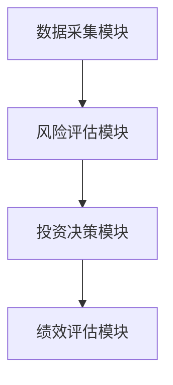

                 


# 霍华德·马克斯的风险控制策略

> 关键词：风险控制，霍华德·马克斯，安全边际，价值投资，逆向投资

> 摘要：本文详细阐述了霍华德·马克斯的风险控制策略，分析了其核心概念、数学模型和系统架构，并通过实际案例展示了其在投资中的应用。文章旨在帮助读者理解如何通过安全边际和逆向投资来实现稳健的投资回报。

---

## 第一部分: 霍华德·马克斯的风险控制策略概述

### 第1章: 风险控制的核心概念与背景

#### 1.1 风险控制的重要性
- **风险控制的定义与内涵**：风险是指投资损失的可能性，控制风险意味着在不确定的市场中降低潜在损失。
- **风险控制在投资中的作用**：通过合理分散投资、设定止损点和选择优质资产，投资者可以降低风险，提高收益的稳定性。
- **霍华德·马克斯的背景与投资理念**：马克斯是价值投资的倡导者，强调安全边际和逆向投资，认为市场恐慌时是买入优质资产的好时机。

#### 1.2 霍华德·马克斯的核心策略
- **价值投资与风险控制的关系**：价值投资关注资产的内在价值，通过寻找价格低于内在价值的资产来降低风险。
- **安全边际的定义与计算**：安全边际是内在价值与市场价格的差额，公式为$$\text{安全边际} = \text{内在价值} - \text{市场价格}$$。
- **风险厌恶与投资决策**：马克斯认为，投资者应避免过度冒险，选择那些风险可控且收益可期的资产。

---

### 第2章: 霍华德·马克斯的风险控制框架

#### 2.1 风险控制的核心要素
- **投资目标与风险承受能力**：明确投资目标和风险承受能力是制定风险控制策略的基础。
- **资产配置与风险分散**：通过分散投资于不同资产类别和行业，降低特定资产的风险。
- **定价模型与内在价值评估**：使用DCF模型等方法评估资产的内在价值，确定其市场价格是否具有吸引力。

#### 2.2 霍华德·马克斯的风险控制流程
- **从基本面分析到风险评估**：基本面分析是评估资产内在价值的基础，而风险评估则是确定安全边际的关键。
- **安全边际的量化方法**：通过计算安全边际，投资者可以判断资产是否具有足够的安全空间。
- **风险调整后的投资决策**：在考虑风险的情况下做出投资决策，避免因过度追求收益而忽视风险。

---

### 第3章: 霍华德·马克斯的风险控制策略与数学模型

#### 3.1 安全边际的数学公式
- **安全边际计算公式**：
$$ \text{安全边际} = \text{内在价值} - \text{市场价格} $$
- **示例**：某资产的内在价值为$100，市场价格为$80，安全边际为$20，表示该资产具有较高的安全空间。

#### 3.2 风险调整后的回报模型
- **风险调整后的回报公式**：
$$ \text{风险调整后的回报} = \text{预期回报} - \text{风险溢价} $$
- **示例**：预期回报为10%，风险溢价为5%，则风险调整后的回报为5%。

#### 3.3 投资组合的风险分散模型
- **投资组合的方差计算**：
$$ \text{方差} = \sum_{i=1}^{n} w_i^2 \sigma_i^2 + \sum_{i \neq j} w_i w_j \sigma_{ij} $$
- **示例**：假设有两只资产，权重分别为0.5和0.5，方差分别为0.25和0.25，协方差为0.1，投资组合的方差为：
$$ 0.5^2 \times 0.25 + 0.5^2 \times 0.25 + 2 \times 0.5 \times 0.5 \times 0.1 = 0.125 + 0.05 = 0.175 $$

---

### 第4章: 霍华德·马克斯策略的系统架构与实现

#### 4.1 系统架构设计
- **系统功能模块划分**：
  - 数据采集模块：收集资产的市场数据和基本面信息。
  - 风险评估模块：计算安全边际和风险溢价。
  - 投资决策模块：基于风险评估结果做出投资决策。
  - 绩效评估模块：评估投资组合的风险调整后回报。

- **系统架构图（Mermaid）**：


#### 4.2 算法实现
- **安全边际计算算法**：
```python
def calculate_safety_margin(intrinsic_value, market_price):
    return intrinsic_value - market_price
```

- **风险调整后回报计算算法**：
```python
def calculate_risk_adjusted_return(expected_return, risk_premium):
    return expected_return - risk_premium
```

---

### 第5章: 项目实战

#### 5.1 环境安装
- **安装Python和相关库**：使用Python进行数据处理和计算，安装`numpy`和`pandas`库。

#### 5.2 核心实现源代码
```python
import numpy as np
import pandas as pd

# 示例数据
data = {
    '资产': ['A', 'B', 'C'],
    '内在价值': [100, 150, 120],
    '市场价格': [80, 120, 110]
}

df = pd.DataFrame(data)

# 计算安全边际
df['安全边际'] = df['内在价值'] - df['市场价格']

print(df)
```

#### 5.3 实际案例分析
- **案例分析**：假设某资产的内在价值为150，市场价格为120，计算其安全边际为30。这表示该资产具有较高的安全空间，适合进行投资。

#### 5.4 代码应用解读与分析
- **代码功能**：上述代码展示了如何使用Python计算资产的安全边际，帮助投资者识别具有吸引力的资产。

---

### 第6章: 最佳实践与小结

#### 6.1 小结
霍华德·马克斯的风险控制策略强调安全边际和逆向投资，通过基本面分析和风险评估来制定投资决策。投资者应注重资产的内在价值，避免过度冒险。

#### 6.2 注意事项
- 定期评估投资组合的风险和收益，根据市场变化进行调整。
- 结合宏观经济环境和行业趋势，选择具有长期增长潜力的资产。

#### 6.3 拓展阅读
- 《投资最重要的事情》——霍华德·马克斯
- 《风险管理与投资组合优化》——现代投资组合理论的相关书籍

---

通过以上分析和阐述，霍华德·马克斯的风险控制策略为投资者提供了稳健的投资方法，帮助他们在不确定的市场中降低风险，实现长期稳定的收益。

