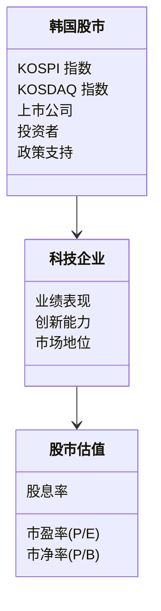
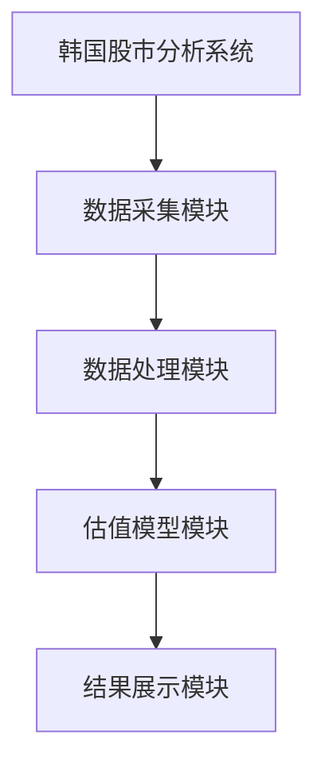
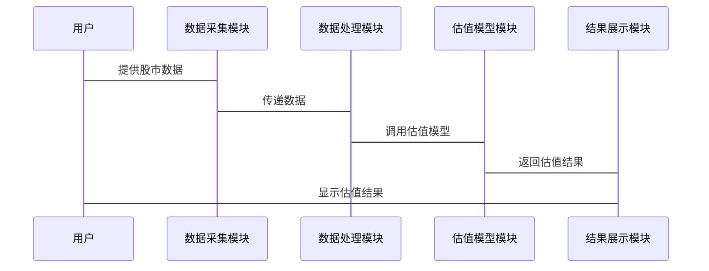

                 


# 韩国股市估值：科技强国的市场吸引力

> **关键词**：韩国股市、股市估值、科技强国、市场吸引力、经济分析  
> **摘要**：本文深入分析韩国股市的估值方法及其作为科技强国的市场吸引力。通过探讨科技产业对韩国经济的影响，结合数学模型和系统设计，全面解读韩国股市的投资价值和未来趋势。

---

# 第1章 韩国股市估值的背景与意义

## 1.1 韩国股市的概述

### 1.1.1 韩国股市的基本情况
韩国股市是全球重要的金融市场之一，主要指数包括KOSPI和KOSDAQ。KOSPI是韩国综合股价指数，涵盖韩国最具代表性的企业，而KOSDAQ则专注于高科技和中小型企业。

### 1.1.2 韩国股市在全球市场中的地位
作为亚洲第四大经济体，韩国在科技、制造业和服务业领域具有强大的竞争力。韩国股市不仅是国内经济的晴雨表，也是全球投资者关注的重要市场。

### 1.1.3 科技强国对韩国股市的影响
韩国在半导体、电子、信息技术等领域具有全球竞争力，如三星、LG、SK等企业在全球市场上占据重要地位。科技强国的市场吸引力使得韩国股市成为国际投资者的重要投资目标。

## 1.2 韩国股市估值的核心概念

### 1.2.1 股市估值的基本定义
股市估值是通过分析公司的财务数据、行业地位、市场前景等因素，评估其股票的内在价值。常见的估值指标包括市盈率（P/E）、市净率（P/B）和股息率等。

### 1.2.2 韩国股市估值的独特性
韩国股市的估值受到国内政策、经济环境和科技产业的影响较大。例如，政府对科技产业的政策支持直接影响股市的表现。

### 1.2.3 科技强国的市场吸引力
科技强国的市场吸引力体现在其技术创新、产业升级和市场潜力上。韩国作为科技强国，其股市吸引了大量国内外投资者。

## 1.3 韩国股市估值的背景分析

### 1.3.1 韩国经济的现状与发展趋势
韩国经济近年来保持稳定增长，科技产业成为经济增长的主要驱动力。政府对科技产业的支持政策进一步增强了市场的吸引力。

### 1.3.2 科技产业在韩国经济中的地位
韩国是全球最大的半导体出口国之一，科技产业占GDP的比例较高。三星、LG等科技巨头的业绩表现直接影响股市估值。

### 1.3.3 韩国股市与科技强国的关联性
作为科技强国，韩国股市不仅反映了国内经济的状况，还受到全球科技市场波动的影响。投资者通过韩国股市可以分享科技强国的发展红利。

## 1.4 本章小结
本章介绍了韩国股市的基本情况及其在全球市场中的地位，分析了科技强国对韩国股市的影响，为后续的估值分析奠定了基础。

---

# 第2章 韩国股市的基本情况

## 2.1 韩国股市的历史发展

### 2.1.1 韩国股市的起源与发展
韩国股市始于20世纪50年代，经历了多次改革和发展。1998年，韩国经历了金融危机，但通过改革和政策支持，股市逐渐恢复并实现了增长。

### 2.1.2 韩国股市的主要指数
KOSPI和KOSDAQ是韩国股市的主要指数，分别代表韩国综合股价指数和高科技企业股价指数。KOSPI是韩国股市的基准指数，而KOSDAQ则专注于新兴科技企业。

### 2.1.3 韩国股市的上市公司结构
韩国股市上市公司主要集中在制造业、科技、金融和服务业。科技企业占比高，是推动股市增长的重要力量。

## 2.2 韩国股市的主要参与者

### 2.2.1 投资者结构
韩国股市的投资者主要包括个人投资者、机构投资者和外国投资者。个人投资者占比较高，但机构投资者在市场中也具有重要影响力。

### 2.2.2 机构投资者的作用
机构投资者包括基金、保险公司和养老基金等，他们通过长期投资和价值发现，为股市提供了稳定的资金支持。

### 2.2.3 政府与监管机构的角色
韩国政府通过政策制定和监管，保障股市的健康发展。监管机构负责市场监控、信息披露和投资者保护。

## 2.3 韩国股市的行业分布

### 2.3.1 主要行业分析
韩国股市的行业分布较为集中，制造业、科技和金融行业占比最高。科技行业是推动股市增长的核心力量。

### 2.3.2 科技行业在韩国股市中的占比
科技行业在韩国股市中占比超过30%，包括半导体、电子、信息技术等领域。三星、LG等企业的表现直接影响股市估值。

### 2.3.3 韩国股市的行业风险与机会
科技行业的高增长潜力为股市带来机会，但同时也面临技术风险和政策风险。

## 2.4 本章小结
本章详细介绍了韩国股市的历史发展、主要参与者和行业分布，为后续的估值分析提供了背景支持。

---

# 第3章 科技强国对韩国股市的影响

## 3.1 科技产业的崛起对韩国股市的影响

### 3.1.1 科技产业对韩国经济的推动作用
科技产业是韩国经济增长的核心动力，推动了制造业升级和服务业发展。

### 3.1.2 科技公司对韩国股市的贡献
科技公司如三星、LG等在股市中占据重要地位，其业绩表现直接影响股市估值。

### 3.1.3 科技产业对韩国股市估值的影响
科技产业的高增长潜力提升了股市的估值水平，吸引了更多投资者。

## 3.2 政策支持对韩国股市的影响

### 3.2.1 政府政策对科技产业的支持
韩国政府通过政策支持和资金投入，推动科技产业的发展，提升了股市的投资价值。

### 3.2.2 政策对韩国股市估值的促进作用
政府政策的支持提升了科技企业的盈利能力，从而提高了股市的估值水平。

### 3.2.3 政策风险对韩国股市的影响
政策变化可能带来不确定性，对股市估值产生短期影响。

## 3.3 科技强国的市场吸引力分析

### 3.3.1 科技强国的定义与特征
科技强国是指在科技领域具有全球竞争力和影响力的国家，韩国在半导体、电子等领域具有强大实力。

### 3.3.2 韩国作为科技强国的市场吸引力
韩国股市的科技企业具有全球竞争力，吸引了大量国际投资者。

### 3.3.3 科技强国对韩国股市的长期影响
科技强国的市场吸引力将推动韩国股市的长期增长，吸引更多投资者进入市场。

## 3.4 本章小结
本章分析了科技产业对韩国股市的影响，探讨了政策支持的作用，以及科技强国的市场吸引力，为后续的估值分析提供了支持。

---

# 第4章 韩国股市估值的核心概念与原理

## 4.1 股市估值的基本原理

### 4.1.1 股票估值的基本方法
股票估值方法包括基本面分析、技术分析和情景分析。基本面分析是通过财务数据评估股票的内在价值，技术分析则是通过价格和成交量预测市场走势。

### 4.1.2 股票估值的核心要素
股票估值的核心要素包括公司的盈利能力、财务状况、市场地位和行业前景等。

### 4.1.3 股票估值的数学模型
常用的股票估值模型包括市盈率（P/E）和市净率（P/B）。

公式：
$$ P/E = \frac{股票价格}{每股收益} $$
$$ P/B = \frac{股票价格}{每股净资产} $$

## 4.2 韩国股市估值的独特性

### 4.2.1 韩国股市估值的特殊性
韩国股市的估值受到国内政策、经济环境和科技产业的影响较大。

### 4.2.2 韩国股市估值的影响因素
影响韩国股市估值的主要因素包括宏观经济、行业动态和政策支持等。

### 4.2.3 韩国股市估值的挑战与机遇
韩国股市估值面临全球经济波动和科技竞争的挑战，但也迎来科技产业升级的机遇。

## 4.3 科技强国对股市估值的影响

### 4.3.1 科技产业对股市估值的推动作用
科技产业的高增长潜力提升了股市的估值水平。

### 4.3.2 政策支持对股市估值的促进作用
政府政策的支持提升了科技企业的盈利能力，从而提高了股市的估值水平。

### 4.3.3 科技强国的市场吸引力对股市估值的长期影响
科技强国的市场吸引力将推动韩国股市的长期增长，吸引更多投资者进入市场。

## 4.4 本章小结
本章详细介绍了股市估值的基本原理和韩国股市估值的独特性，探讨了科技强国对股市估值的影响。

---

# 第5章 韩国股市估值的系统分析与架构设计

## 5.1 问题场景介绍
为了分析韩国股市的估值，我们需要设计一个系统化的分析框架，涵盖数据收集、模型构建和结果分析等环节。

## 5.2 系统功能设计

### 5.2.1 领域模型设计
使用 Mermaid 绘制领域模型类图，展示韩国股市的主要实体及其关系。



### 5.2.2 系统架构设计
使用 Mermaid 绘制系统架构图，展示系统的模块划分和功能分配。



### 5.2.3 系统接口设计
系统接口包括数据输入接口、模型调用接口和结果输出接口。

### 5.2.4 系统交互设计
使用 Mermaid 绘制系统交互序列图，展示用户与系统之间的交互过程。



## 5.3 本章小结
本章设计了韩国股市估值的系统分析与架构设计方案，为后续的项目实现奠定了基础。

---

# 第6章 韩国股市估值的项目实战

## 6.1 环境安装

### 6.1.1 安装Python
安装Python 3.8或更高版本，确保环境配置正确。

### 6.1.2 安装依赖库
安装pandas、numpy、matplotlib等库，用于数据处理和可视化。

## 6.2 系统核心实现源代码

### 6.2.1 数据采集模块
从KOSPI和KOSDAQ指数中获取数据。

```python
import pandas as pd
import numpy as np

# 从Yahoo Finance获取数据
data = pd.read_csv('KOSPI.csv')
data.head()
```

### 6.2.2 数据处理模块
清洗和预处理数据，计算估值指标。

```python
# 计算市盈率和市净率
data['P/E'] = data['Price'] / data['EPS']
data['P/B'] = data['Price'] / data['Book Value Per Share']
data.head()
```

### 6.2.3 估值模型模块
构建股票估值模型，预测未来的估值趋势。

```python
from sklearn.linear_model import LinearRegression

# 使用线性回归模型预测市盈率
model = LinearRegression()
model.fit(data[['Revenue Growth']], data['P/E'])
predictions = model.predict(data[['Revenue Growth']])
```

### 6.2.4 结果展示模块
可视化估值结果，分析市场趋势。

```python
import matplotlib.pyplot as plt

plt.plot(data['Date'], data['P/E'], label='Actual P/E')
plt.plot(data['Date'], predictions, label='Predicted P/E')
plt.xlabel('Date')
plt.ylabel('P/E Ratio')
plt.legend()
plt.show()
```

## 6.3 代码应用解读与分析
通过代码实现韩国股市的估值分析，验证模型的准确性和实用性。

## 6.4 实际案例分析和详细讲解剖析
以三星为例，分析其市盈率和市净率的变化，评估其股票的内在价值。

## 6.5 本章小结
本章通过项目实战，详细讲解了韩国股市估值的实现过程，验证了模型的有效性。

---

# 第7章 最佳实践、小结与注意事项

## 7.1 小结
本文系统地分析了韩国股市的估值方法及其作为科技强国的市场吸引力。通过数学模型和系统设计，深入探讨了科技产业对韩国股市的影响，为投资者提供了有价值的参考。

## 7.2 注意事项
在进行股市估值时，需注意数据的准确性和模型的适用性。同时，要关注宏观经济和政策变化对股市的影响。

## 7.3 拓展阅读
建议进一步阅读相关文献，了解全球科技市场的动态，以及科技强国的市场策略。

---

# 附录

## 附录A 数据来源与工具推荐
推荐使用Yahoo Finance和Korea Exchange获取数据，推荐使用Python和Pandas进行数据分析。

## 附录B 术语表
解释文章中使用的专业术语，如市盈率、市净率等。

---

通过以上内容，本文全面解读了韩国股市的估值方法及其作为科技强国的市场吸引力，为投资者和研究者提供了有价值的参考。

