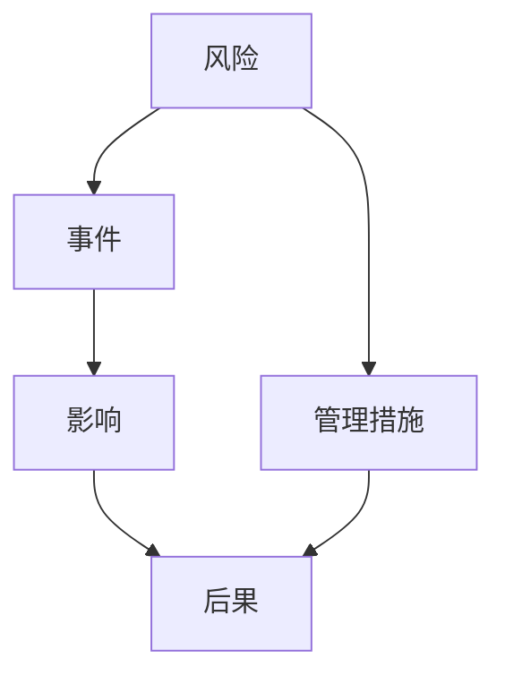

                 


# 风险管理与评估

**关键词**：风险管理、风险评估、风险矩阵、定量分析、系统性风险、机器学习、数字化转型

**摘要**：本文系统地探讨了风险管理与评估的核心概念、方法、工具和技术。从风险管理的基本原理出发，深入分析了风险识别、评估和应对的策略，结合实际案例和系统架构设计，为读者提供了全面的理论与实践指南。文章还展望了风险管理的未来发展趋势，为读者提供了深刻的行业洞察。

---

## 第一部分: 风险管理与评估基础

### 第1章: 风险管理的基本概念

#### 1.1 风险管理的定义与目标
- **风险管理的定义**：风险管理是指识别、评估和应对可能影响组织目标的不确定因素的过程。
- **风险管理的目标**：
  - 降低潜在风险的影响。
  - 优化决策过程，确保目标的实现。
  - 提高组织的抗风险能力。
- **风险管理的必要性**：
  - 企业面临内外部不确定性，风险管理是确保稳定运营的关键。
  - 风险管理是制定战略规划的基础。

#### 1.2 风险管理的框架与标准
- **风险管理的框架**：
  - COBIT（控制目标）：企业风险管理框架。
  - ISO 31000：风险管理国际标准。
- **风险管理的行业差异**：
  - 金融行业：注重市场和信用风险。
  - 制造业：关注供应链和操作风险。

#### 1.3 风险的特征与分类
- **风险的特征**：
  - 不确定性：风险的出现时间和概率不确定。
  - 潜在性：风险可能带来机会或威胁。
  - 可变性：风险的影响随着环境变化而变化。
- **风险的分类**：
  - 战略风险：与企业战略相关。
  - 操作风险：与日常运营相关。
  - 金融风险：与财务和投资相关。
  - 市场风险：与市场波动相关。

---

### 第2章: 风险管理的核心概念与联系

#### 2.1 风险管理的核心原理
- **风险识别的原理**：通过系统分析和数据收集，识别潜在风险。
- **风险评估的原理**：量化风险的概率和影响。
- **风险应对的原理**：制定应对策略，降低风险影响。

#### 2.2 核心概念的属性特征对比
- **风险与机会的对比**：
  - 风险：可能带来损失。
  - 机会：可能带来收益。
- **风险与不确定性的对比**：
  - 风险：可量化和管理的不确定性。
  - 不确定性：更广泛的概念，无法完全量化。
- **风险与危机的对比**：
  - 风险：潜在的威胁。
  - 危机：已经发生的重大威胁。

#### 2.3 ER实体关系图架构


---

## 第二部分: 风险评估方法

### 第3章: 风险评估的定性方法

#### 3.1 定性评估的基本原理
- **定性评估的定义**：通过定性分析，识别和描述风险的特征。
- **定性评估的步骤**：
  1. 确定风险的性质（如战略风险、操作风险）。
  2. 分析风险的影响（如声誉、财务损失）。
  3. 评估风险的优先级。

#### 3.2 常见的定性评估工具
- **SWOT分析**：
  - 优势：内部优势。
  - 劣势：内部劣势。
  - 机会：外部机会。
  - �威脅：外部威脅。
- **风险矩阵**：
  - 横轴：风险概率（低、中、高）。
  - 纵轴：风险影响（低、中、高）。
  - 矩阵象限：优先级分类。

### 第4章: 风险评估的定量方法

#### 4.1 概率和影响矩阵
- **概率公式**：
  $$ P = \frac{\text{历史发生次数}}{\text{总样本数}} $$
- **影响公式**：
  $$ I = \text{影响程度} \times \text{影响范围} $$
- **风险值计算**：
  $$ R = P \times I $$

#### 4.2 数据收集与处理
- **数据来源**：
  - 历史数据。
  - 专家意见。
  - 行业基准。

---

## 第三部分: 风险管理的工具与技术

### 第5章: 数据分析与机器学习

#### 5.1 数据分析工具
- **工具介绍**：
  - Python：pandas、numpy。
  - R：用于统计分析。
  - Tableau：可视化工具。

#### 5.2 机器学习算法
- **算法选择**：
  - XGBoost：分类问题。
  - Random Forest：特征重要性分析。
  - 神经网络：复杂模式识别。

#### 5.3 算法实现
```python
import xgboost as xgb

# 训练模型
model = xgb.XGBClassifier()
model.fit(X_train, y_train)

# 预测
y_pred = model.predict(X_test)
```

---

## 第四部分: 系统性风险分析与应对策略

### 第6章: 系统性风险分析

#### 6.1 系统性风险识别
- **系统性风险的定义**：影响整个系统的风险。
- **系统性风险的来源**：
  - 金融危机。
  - 供应链中断。

#### 6.2 系统性风险的应对策略
- **压力测试**：
  - 模拟极端情况，评估系统承受能力。
- **风险管理策略**：
  - 风险规避：避免高风险活动。
  - 风险转移：通过保险或外包转移风险。

---

## 第五部分: 风险管理的案例与实践

### 第7章: 风险管理的案例分析

#### 7.1 金融行业案例
- **案例背景**：2008年金融危机。
- **风险管理措施**：
  - 建立压力测试模型。
  - 加强监管和风险监控。

#### 7.2 制造业案例
- **案例背景**：供应链中断风险。
- **风险管理措施**：
  - 多元化供应商。
  - 建立应急库存。

### 第8章: 风险管理的实践总结

#### 8.1 最佳实践 tips
- **数据驱动**：利用数据分析和机器学习优化风险管理。
- **持续改进**：定期更新风险管理策略。

---

## 第六部分: 风险管理的未来趋势与挑战

### 第9章: 未来趋势与挑战

#### 9.1 数字化转型的影响
- **数字化转型**：数据驱动的风险管理。
- **人工智能**：提升风险预测能力。

#### 9.2 全球化与风险管理
- **全球化**：跨国运营带来的复杂性。
- **风险管理**：需要跨文化协同。

---

### 结语
风险管理与评估是组织成功的关键因素。通过系统的方法和先进技术，我们可以更有效地识别和应对风险，确保组织的可持续发展。未来，随着技术的进步和全球化的深入，风险管理将变得更加复杂和重要。

--- 

**总结**：本文全面探讨了风险管理与评估的核心概念、方法和工具，结合实际案例和系统设计，为读者提供了深入的理论与实践指南。

