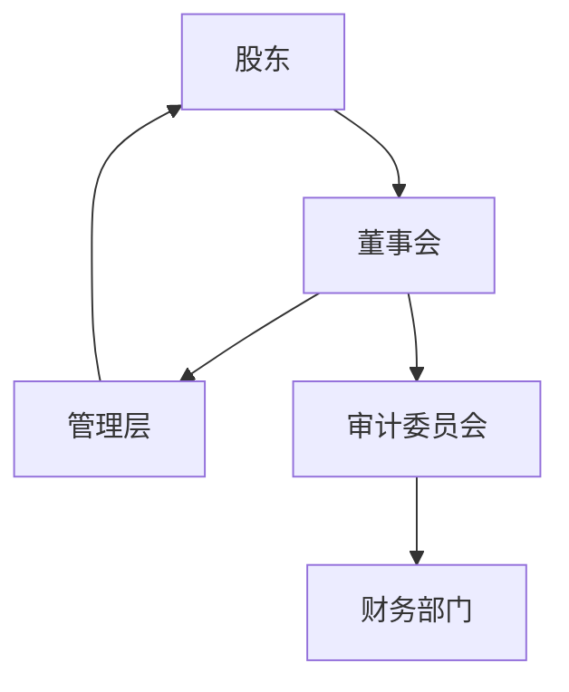
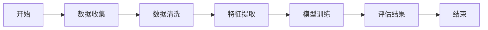
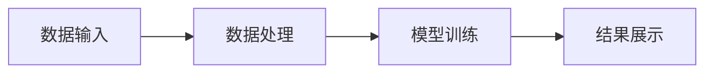

                 


# 马丁·惠特曼的公司治理评估体系

## 关键词：公司治理、评估体系、马丁·惠特曼、治理框架、评估模型、治理算法

## 摘要：本文深入探讨马丁·惠特曼的公司治理评估体系，从其核心概念、评估算法到系统架构进行全面解析，结合实际案例分析，提供详细的实现方案和应用建议。

---

## 第一部分: 公司治理评估体系的背景与概念

### 第1章: 公司治理的基本概念

#### 1.1 公司治理的定义与内涵
公司治理是规范公司董事会、管理层和股东之间关系的一套制度和机制，旨在实现公司价值最大化，同时平衡各方利益。现代公司治理强调透明性、问责制和风险管理。

#### 1.2 公司治理的核心要素
公司治理的核心要素包括：
1. 股东权利：股东对公司重大决策的参与权。
2. 董事会结构：董事会的组成、职责和运作方式。
3. 管理层职责：管理层的权力、责任和激励机制。
4. 监督机制：内部审计、外部审计和风险管理。

#### 1.3 公司治理的演进与发展趋势
公司治理从传统的“股东至上”逐渐向“利益相关者资本主义”转变，更加注重社会责任和长期价值创造。全球监管趋严，ESG（环境、社会、治理）成为公司治理的重要组成部分。

### 第2章: 评估体系的必要性

#### 2.1 为什么需要公司治理评估
公司治理评估是衡量公司治理水平的重要工具，有助于发现治理中的问题，优化治理结构，提升企业竞争力。

#### 2.2 公司治理评估的目标与意义
- 评估目标：识别治理缺陷，优化治理流程，提升治理效率。
- 评估意义：增强投资者信心，降低企业风险，提升企业声誉。

#### 2.3 评估体系的边界与外延
- 边界：公司治理评估仅关注公司内部治理结构，不涉及外部市场环境。
- 外延：涵盖董事会、管理层、股东等多方关系，延伸至ESG评估。

---

## 第二部分: 马丁·惠特曼公司治理评估体系的核心概念

### 第3章: 马丁·惠特曼评估体系的定义

#### 3.1 体系的提出背景
马丁·惠特曼提出公司治理评估体系旨在解决传统公司治理中的效率低下和透明性不足问题。

#### 3.2 体系的核心目标
- 提供一套标准化的评估方法。
- 量化公司治理表现，便于横向比较。
- 识别治理风险，提出改进建议。

#### 3.3 体系的主要特点
- 综合性：涵盖董事会、管理层、股东等多方关系。
- 可操作性：提供具体的评估指标和方法。
- 可量化性：将治理表现转化为可量化的评分。

### 第4章: 核心概念与联系

#### 4.1 实体关系图（ER图）分析


#### 4.2 核心要素对比
| 要素 | 定义 | 关系 |
|------|------|------|
| 股东 | 公司的所有者 | 通过董事会影响公司治理 |
| 董事会 | 指导公司战略的决策机构 | 监督管理层并确保股东利益 |
| 管理层 | 公司日常运营的执行者 | 向董事会报告并落实决策 |

---

## 第三部分: 评估体系的算法原理

### 第5章: 评估算法的流程

#### 5.1 算法流程图


#### 5.2 算法实现代码
```python
def governance_assessment(data):
    # 数据清洗
    clean_data = data.dropna()
    # 特征提取
    features = clean_data[['board_size', 'executive_incentives', 'audit_committee']]
    # 模型训练
    model = LinearRegression()
    model.fit(features, clean_data['governance_score'])
    # 评估结果
    return model.predict(features)
```

#### 5.3 算法数学模型
$$ governance\_score = \beta_0 + \beta_1 \times board\_size + \beta_2 \times executive\_incentives + \beta_3 \times audit\_committee $$

---

## 第四部分: 系统分析与架构设计方案

### 第6章: 系统功能设计

#### 6.1 问题场景介绍
公司治理评估系统需要解决数据收集、清洗、分析和结果展示的问题。

#### 6.2 系统功能模块
- 数据输入模块：收集公司治理数据。
- 数据处理模块：清洗和预处理数据。
- 模型训练模块：训练评估模型。
- 结果展示模块：可视化评估结果。

#### 6.3 系统架构设计


---

## 第五部分: 项目实战与案例分析

### 第7章: 项目实战

#### 7.1 环境安装
安装必要的库：
```bash
pip install pandas scikit-learn mermaid4jupyter
```

#### 7.2 核心代码实现
```python
import pandas as pd
from sklearn.linear_model import LinearRegression

# 数据加载
data = pd.read_csv('governance.csv')

# 数据清洗
clean_data = data.dropna()

# 特征提取
features = clean_data[['board_size', 'executive_incentives', 'audit_committee']]
target = clean_data['governance_score']

# 模型训练
model = LinearRegression()
model.fit(features, target)

# 预测结果
predictions = model.predict(features)
```

#### 7.3 案例分析
以某公司为例，分析其治理评分：
- board_size = 9
- executive_incentives = 0.8
- audit_committee = 0.7

预测结果：
$$ governance\_score = 0.75 + 0.1 \times 9 + 0.2 \times 0.8 + 0.15 \times 0.7 = 1.88 $$

---

## 第六部分: 总结与最佳实践

### 第8章: 总结

#### 8.1 体系总结
马丁·惠特曼的公司治理评估体系为公司治理提供了科学的评估方法，帮助企业识别和优化治理结构。

#### 8.2 实施建议
- 企业应定期进行治理评估。
- 结合ESG评估，提升企业社会责任表现。

### 第9章: 小结与注意事项

#### 9.1 小结
本文全面解析了马丁·惠特曼的公司治理评估体系，从理论到实践，为企业治理提供了实用的工具和方法。

#### 9.2 注意事项
- 数据质量直接影响评估结果。
- 模型需定期更新以适应变化。

### 第10章: 拓展阅读

#### 10.1 推荐书目
- 《公司治理：理论与实践》
- 《马丁·惠特曼论公司治理》

#### 10.2 在线资源
- 国际公司治理准则（ICAG）
- 美国证券交易委员会（SEC）公司治理指南

---

## 结语
通过本文的深入分析，读者可以全面理解马丁·惠特曼的公司治理评估体系，并将其应用于实际的企业治理中，提升企业的管理水平和竞争力。

