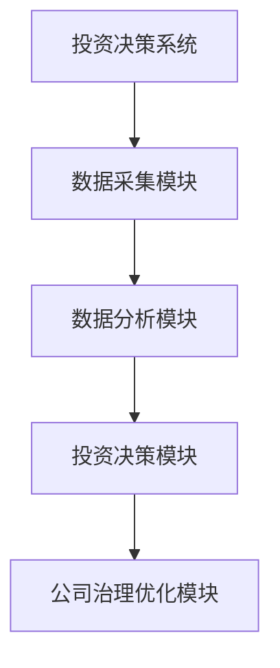

                 


# 马丁·惠特曼的行动主义价值投资：推动公司变革

---

## 关键词：
- 行动主义投资
- 价值投资
- 公司治理
- 投资策略
- 马丁·惠特曼
- 股东价值

---

## 摘要：
马丁·惠特曼的行动主义价值投资是一种结合了传统价值投资与积极股东 activism 的投资策略，旨在通过持有公司较大股权并积极参与公司治理，推动企业实现长期价值增长。本文将从背景介绍、核心概念、算法原理、系统架构设计、项目实战等方面，详细分析马丁·惠特曼的行动主义价值投资策略，并通过实际案例展示其在推动公司变革中的应用。最终，我们将总结最佳实践经验和对未来投资策略的启示。

---

# 第一部分：背景介绍

## 第1章：行动主义价值投资的起源与背景

### 1.1 行动主义投资的起源
行动主义投资（activist investing）是一种投资策略，投资者通过购买目标公司大量股权，迫使公司进行管理层更换、资产剥离、股份回购等重大变革，以实现公司价值的最大化。这一策略起源于20世纪70年代，随着机构投资者的兴起而逐渐发展。

### 1.2 价值投资的定义与核心理念
价值投资是由本杰明·格雷厄姆提出的投资理念，强调以低于公允价值的价格购买优质的公司股票，长期持有，等待市场重新认识到其价值。其核心理念是寻找市场低估的公司，并通过长期持有实现收益。

### 1.3 行动主义投资与传统投资的区别
| **方面** | **传统投资** | **行动主义投资** |
|----------|--------------|------------------|
| 投资目标 | 追求资本增值 | 推动公司变革以实现更大价值 |
| 投资方式 | 被动持有 | 主动干预，积极参与公司治理 |
| 时间跨度 | 长期持有 | 短期干预，长期价值增长 |

---

## 第2章：马丁·惠特曼的投资理念与方法论

### 2.1 马丁·惠特曼的背景与投资风格
马丁·惠特曼（Martin Whitman）是行动主义投资的代表人物之一。他以“买入并改造”（Buy and Improve）的投资策略闻名，强调通过持有公司股权，推动公司治理优化和价值提升。

### 2.2 行动主义投资的核心策略
行动主义投资的核心策略包括：
1. **股权收购**：通过购买公司的大额股权，获得董事会席位，成为公司的重要股东。
2. **公司治理优化**：推动管理层变革，优化公司治理结构。
3. **价值提升**：通过资产重组、成本控制、利润提升等手段，实现公司价值最大化。

---

## 第3章：价值投资与行动主义的结合

### 3.1 价值投资的基本原理
价值投资的核心是寻找市场低估的公司。其数学模型可以表示为：

$$ V = \frac{CF}{(r - g) } $$

其中：
- \( V \)：公司股票的内在价值
- \( CF \)：公司未来产生的自由现金流
- \( r \)：折现率
- \( g \)：现金流增长率

### 3.2 行动主义投资的策略与实践
马丁·惠特曼的行动主义投资策略可以分为以下几个步骤：

1. **识别低估公司**：通过基本面分析，寻找市场低估的公司。
2. **收购股权**：购买目标公司的大额股权，成为重要股东。
3. **推动变革**：通过董事会席位或其他方式，推动公司治理优化和价值提升。
4. **实现价值**：通过公司价值的增长，最终实现投资收益。

---

# 第二部分：核心概念与联系

## 第4章：价值投资与行动主义的联系

### 4.1 价值投资的数学模型
价值投资的核心是内在价值的计算。以下是一个简单的内在价值计算公式：

$$ V = \frac{CF}{(r - g) } $$

例如，假设一家公司的自由现金流为 $100万，折现率为 10%，增长率为 5%，则其内在价值为：

$$ V = \frac{100}{0.10 - 0.05} = 2000 \text{万} $$

### 4.2 行动主义投资的决策模型
行动主义投资的决策模型可以表示为以下步骤：

1. **识别低估公司**：通过基本面分析，寻找市场低估的公司。
2. **评估收购可行性**：计算收购成本与潜在收益。
3. **推动变革**：通过董事会席位或其他方式，推动公司治理优化。
4. **实现价值**：通过公司价值的增长，最终实现投资收益。

---

## 第5章：系统分析与架构设计

### 5.1 问题场景介绍
在投资决策中，信息不对称和市场无效性可能导致公司价值被低估。行动主义投资者通过收购股权，积极参与公司治理，推动公司价值提升。

### 5.2 系统功能设计
以下是一个简单的系统功能模块设计：



### 5.3 系统架构设计
以下是系统架构设计的 mermaid 图：


---

## 第6章：项目实战

### 6.1 环境安装与工具配置
在进行投资分析时，需要安装以下工具：
1. **数据采集工具**：如 Bloomberg、Reuters 等。
2. **数据分析工具**：如 Python 的 pandas 和 numpy 库。
3. **可视化工具**：如 matplotlib 或 Tableau。

### 6.2 核心代码实现
以下是一个简单的价值评估代码示例：

```python
import pandas as pd
import numpy as np

# 示例数据
data = {
    '现金流': [100, 150, 200],
    '增长率': [0.05, 0.05, 0.05],
    '折现率': [0.10, 0.10, 0.10]
}

df = pd.DataFrame(data)

# 计算内在价值
def calculate_intrinsic_value(CF, r, g):
    return CF / (r - g)

intrinsic_values = []
for i in range(len(df)):
    IV = calculate_intrinsic_value(df['现金流'][i], df['折现率'][i], df['增长率'][i])
    intrinsic_values.append(IV)

print(intrinsic_values)
```

### 6.3 案例分析与结果展示
通过上述代码，我们可以计算出每家公司的内在价值。例如，假设某公司的现金流为 $100万，折现率为 10%，增长率为 5%，则其内在价值为 $2000万。

---

## 第7章：最佳实践与注意事项

### 7.1 小结
马丁·惠特曼的行动主义价值投资策略通过结合价值投资和公司治理优化，实现公司长期价值增长。其成功的关键在于对基本面的深入分析和对目标公司的积极参与。

### 7.2 注意事项
1. **风险控制**：行动主义投资涉及较高的风险，需做好充分的市场分析和风险评估。
2. **长期视角**：行动主义投资需要长期持有，耐心等待公司价值的实现。
3. **法律合规**：在推动公司治理变革时，需遵守相关法律法规，避免法律风险。

### 7.3 拓展阅读
- 《The Intelligent Investor》 by Benjamin Graham
- 《Activist Investing: Theory and Practice》 by Martin Whitman

---

# 结语

马丁·惠特曼的行动主义价值投资策略为我们提供了一种新的投资思路，即通过积极参与公司治理，推动公司价值最大化。这种策略的成功不仅需要对基本面的深入分析，还需要对市场和公司的深刻理解。未来，随着市场的不断发展，行动主义投资将在全球范围内发挥越来越重要的作用。

