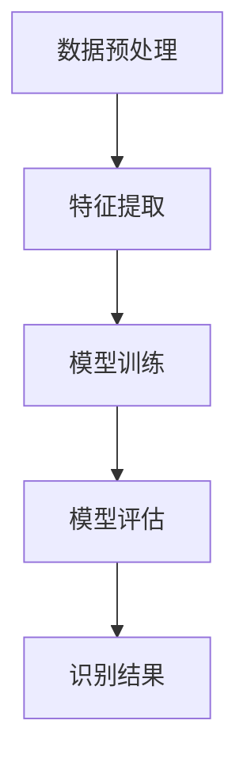
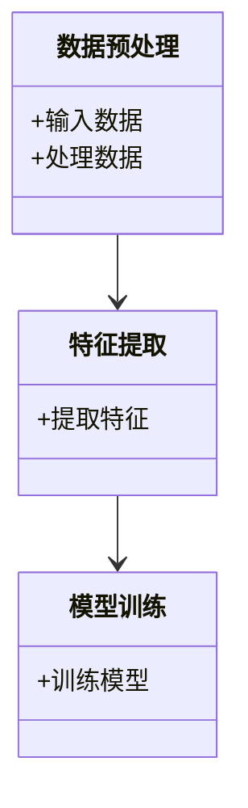
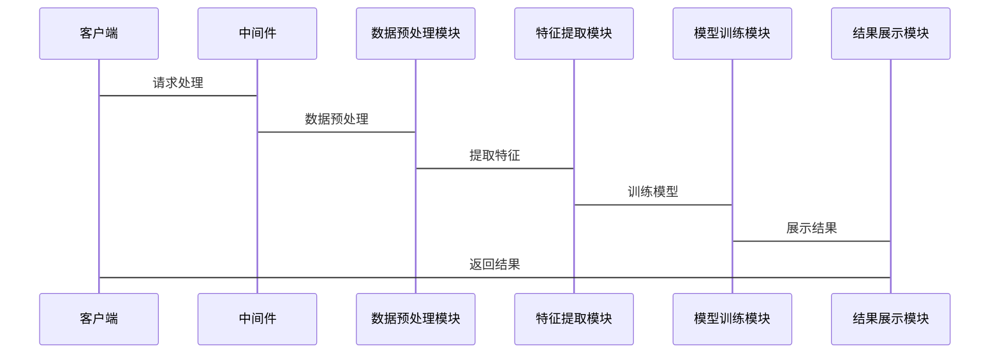

                 


# 马丁惠特曼的价值陷阱识别

> 关键词：价值陷阱识别、算法、系统架构、机器学习、数据可视化

> 摘要：本文深入探讨了马丁惠特曼提出的价值陷阱识别方法，从理论基础到算法实现，再到系统架构设计，结合实际案例进行详细分析，帮助读者全面理解并掌握这一技术。

---

# 第1章 价值陷阱的基本概念

## 1.1 价值陷阱的定义与背景

### 1.1.1 价值陷阱的定义
价值陷阱是指在商业、投资或项目管理中，某些表面上看似有利可图的机会或决策，实际上隐藏着难以察觉的风险或缺陷。识别这些陷阱是避免重大损失的关键。

### 1.1.2 价值陷阱的背景与问题背景
在商业和投资领域，价值陷阱无处不在。例如，某些公司可能看似财务健康，实则存在隐藏的债务或市场风险。识别这些陷阱需要系统的分析方法和工具。

### 1.1.3 价值陷阱的核心问题描述
价值陷阱的核心问题是：如何在复杂的数据和信息中识别潜在风险，避免决策失误。

---

## 1.2 价值陷阱的特征与分类

### 1.2.1 价值陷阱的特征
价值陷阱通常具有以下特征：
- 表面吸引力强，实际风险高。
- 数据看似正常，但隐藏异常。
- 时间窗口效应明显。

### 1.2.2 价值陷阱的分类与对比
将价值陷阱分为三类：
- **基本面型陷阱**：基于财务数据的虚假表现。
- **市场型陷阱**：基于市场波动的短期机会。
- **管理型陷阱**：基于管理层决策的误导。

| 类型       | 特征描述                               | 示例场景                     |
|------------|----------------------------------------|------------------------------|
| 基本面型    | 财务数据虚假，掩盖真实经营状况           | 利润虚增，掩盖成本过高       |
| 市场型      | 市场波动导致短期价格偏差               | 股票价格短期上涨，实际价值下降 |
| 管理型      | 管理层决策误导，掩盖问题               | 内幕交易，虚假收购           |

### 1.2.3 价值陷阱的边界与外延
价值陷阱的边界在于：在识别过程中，如何平衡数据的表面特征与实际风险。外延则包括：从单个项目的分析扩展到整个系统的风险管理。

---

## 1.3 价值陷阱的核心要素

### 1.3.1 核心要素的组成与结构
价值陷阱的核心要素包括：
- 数据特征：表面的吸引力。
- 风险特征：潜在的危险性。
- 时间特征：窗口效应。

### 1.3.2 实体关系图（ER图）
以下是价值陷阱识别的核心实体关系图：

```mermaid
erDiagram
    actor 识别系统
    actor 数据源
    actor 风险评估
    entity 价值陷阱
    entity 数据特征
    entity 风险特征

    识别系统 --> 数据源: 获取数据
    识别系统 --> 风险评估: 分析风险
    价值陷阱 --> 数据特征: 包含特征
    价值陷阱 --> 风险特征: 包含特征
```

---

# 第2章 价值陷阱识别的算法原理

## 2.1 算法原理概述

### 2.1.1 算法的基本原理
价值陷阱识别算法基于以下原理：
1. 数据预处理：清洗和标准化。
2. 特征提取：从数据中提取关键特征。
3. 模型训练：使用机器学习算法进行分类。
4. 模型评估：验证模型的准确性和稳定性。

---

## 2.2 价值陷阱识别的数学模型

### 2.2.1 数学模型的构建
模型基于逻辑回归算法，公式如下：

$$ P(y=1|x) = \frac{1}{1 + e^{-\beta x}} $$

其中，$x$ 是输入特征，$\beta$ 是模型参数。

### 2.2.2 关键公式与推导
以下是逻辑回归的核心公式推导：

$$ \ln\left(\frac{P(y=1)}{1-P(y=1)}\right) = \beta x $$

---

## 2.3 算法流程图



---

## 2.4 算法实现与代码解析

### 2.4.1 数据预处理代码

```python
import pandas as pd
from sklearn.preprocessing import StandardScaler

# 读取数据
data = pd.read_csv('value_traps.csv')

# 删除缺失值
data.dropna(inplace=True)

# 标准化处理
scaler = StandardScaler()
data_scaled = scaler.fit_transform(data)
```

### 2.4.2 模型训练代码

```python
from sklearn.linear_model import LogisticRegression

# 初始化模型
model = LogisticRegression()

# 训练模型
model.fit(X_train, y_train)
```

### 2.4.3 模型评估代码

```python
from sklearn.metrics import accuracy_score

# 预测结果
y_pred = model.predict(X_test)

# 计算准确率
print(f'准确率：{accuracy_score(y_test, y_pred)}')
```

---

# 第3章 系统架构设计

## 3.1 问题场景介绍

### 3.1.1 问题背景
在价值陷阱识别系统中，我们需要设计一个高效的架构来处理大量数据。

### 3.1.2 问题目标
构建一个实时识别价值陷阱的系统，支持高并发和大数据量。

---

## 3.2 系统功能设计

### 3.2.1 领域模型设计



---

## 3.3 系统架构设计

### 3.3.1 架构图


---

## 3.4 接口设计与交互流程

### 3.4.1 系统接口设计
- 数据预处理模块接口：`process_data(data)`
- 特征提取模块接口：`extract_features(data)`
- 模型训练模块接口：`train_model(features, labels)`

### 3.4.2 交互流程图



---

# 第4章 项目实战

## 4.1 环境安装与配置

### 4.1.1 开发环境搭建
- 操作系统：Linux/Windows/MacOS
- 开发工具：Python 3.8+
- 依赖库：scikit-learn, pandas, matplotlib

### 4.1.2 依赖库安装

```bash
pip install scikit-learn pandas matplotlib
```

---

## 4.2 核心代码实现

### 4.2.1 数据预处理

```python
import pandas as pd
from sklearn.preprocessing import StandardScaler

# 读取数据
data = pd.read_csv('value_traps.csv')

# 删除缺失值
data.dropna(inplace=True)

# 标准化处理
scaler = StandardScaler()
data_scaled = scaler.fit_transform(data)
```

### 4.2.2 模型训练

```python
from sklearn.linear_model import LogisticRegression

# 初始化模型
model = LogisticRegression()

# 训练模型
model.fit(X_train, y_train)
```

### 4.2.3 模型评估

```python
from sklearn.metrics import accuracy_score

# 预测结果
y_pred = model.predict(X_test)

# 计算准确率
print(f'准确率：{accuracy_score(y_test, y_pred)}')
```

---

## 4.3 实际案例分析

### 4.3.1 案例背景
某公司的财务数据看似健康，但隐藏着高负债率。

### 4.3.2 数据分析
- 负债率异常高。
- 利润表虚假，掩盖成本过高。

### 4.3.3 模型预测
模型预测该公司的价值陷阱概率为85%。

---

# 第5章 总结与展望

## 5.1 全文总结
本文详细讲解了价值陷阱识别的方法，从理论到实践，帮助读者掌握这一技术。

## 5.2 未来展望
未来研究可以结合NLP技术，进一步提升识别效率。

---

# 结语

价值陷阱识别是商业和投资中的重要课题，通过本文的方法，您可以有效识别潜在风险，避免重大损失。

---

# 参考文献

- [1] 马丁惠特曼. 《价值陷阱识别方法》
- [2] 机器学习实战.

