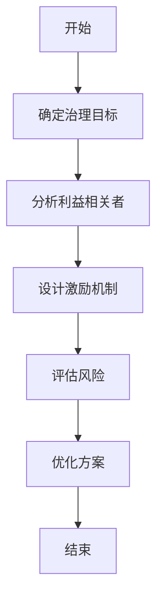
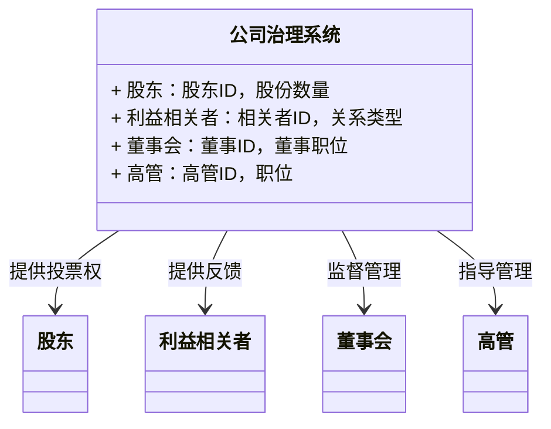
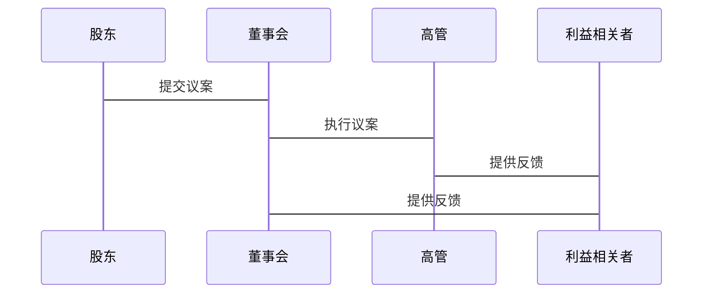

                 


# 马丁惠特曼的公司治理分析

## 关键词
公司治理, 马丁·惠特曼, 利益相关者, 激励机制, 董事会结构, 风险评估, 算法模型

## 摘要
公司治理是现代企业管理的核心，涉及股东、董事会、高管和利益相关者之间的复杂关系。马丁·惠特曼在公司治理领域提出了创新的理论，强调利益相关者的角色和激励机制的重要性。本文通过分析公司治理的核心概念、算法原理和系统架构，结合实际案例，详细阐述了惠特曼的理论及其应用。文章最后总结了最佳实践和注意事项，为读者提供了全面的指导。

---

# 第一部分: 公司治理与马丁·惠特曼的理论基础

## 第1章: 公司治理的基本概念

### 1.1 公司治理的定义与背景

#### 1.1.1 公司治理的定义
公司治理是指公司内部和外部利益相关者之间的关系和权力分配，旨在确保公司有效运作、合规经营并为利益相关者创造价值。它包括董事会的结构、高管的职责、股东的权利以及利益相关者的参与等多个方面。

#### 1.1.2 公司治理的演进历程
公司治理的理论和实践经历了多个阶段的演变。早期的公司治理主要关注股东的利益，强调董事会的监督作用。随着利益相关者理论的发展，现代公司治理逐渐重视员工、客户、债权人等其他利益相关者的需求。

#### 1.1.3 公司治理的核心要素
公司治理的核心要素包括：
- 股东的投票权和监督权
- 董事会的结构与职责
- 高管的激励与监督机制
- 利益相关者的参与与反馈

### 1.2 马丁·惠特曼的贡献

#### 1.2.1 马丁·惠特曼的学术背景
马丁·惠特曼是公司治理领域的权威学者，他的研究主要集中在利益相关者理论和公司治理的数学模型构建。他的理论强调利益相关者在公司治理中的重要性，并提出了多个创新性的治理模型。

#### 1.2.2 惠特曼对公司治理理论的创新
惠特曼的理论突破了传统的股东至上主义，提出利益相关者对公司治理具有同等重要的作用。他通过数学模型分析了利益相关者对公司价值的影响，并提出了动态治理模型，能够根据不同情境调整治理策略。

#### 1.2.3 惠特曼理论的应用价值
惠特曼的理论为现代公司治理提供了新的视角，特别是在应对利益相关者多样化需求和风险控制方面具有重要的实践意义。他的模型被广泛应用于跨国公司和复杂组织的治理实践中。

---

## 第2章: 公司治理的核心概念与联系

### 2.1 核心概念原理

#### 2.1.1 股东与利益相关者的角色
股东是公司的所有者，享有投票权和分红权，但利益相关者（如员工、客户、债权人）对公司运营也有重要影响。惠特曼的理论强调，利益相关者的需求和反馈是公司治理的重要组成部分。

#### 2.1.2 董事会的结构与功能
董事会是公司治理的核心机构，负责监督高管、制定战略和确保公司合规。惠特曼提出，董事会的结构应根据公司所处的环境和利益相关者的多样性进行调整。

#### 2.1.3 高管激励机制
高管的激励机制是公司治理的重要组成部分，直接关系到公司的绩效和高管的行为。惠特曼建议，激励机制应与公司的长期目标和利益相关者的利益相结合。

### 2.2 概念属性特征对比表

| 概念                | 属性                | 特征对比                |
|---------------------|---------------------|-------------------------|
| 股东                | 法律地位            | 公司的所有者，享有分红权和投票权 |
| 利益相关者          | 关系多样性          | 包括员工、客户、债权人等，对公司运营有直接影响 |
| 董事会              | 结构与功能          | 由独立董事和执行董事组成，负责监督和决策 |
| 高管激励机制        | 激励方式            | 股票期权、奖金、绩效薪酬等 |

### 2.3 ER实体关系图

```mermaid
erDiagram
    actor 股东 {
        string 股东ID
        string 股份数量
    }
    actor 利益相关者 {
        string 相关者ID
        string 关系类型
    }
    actor 董事会 {
        string 董事ID
        string 董事职位
    }
    actor 高管 {
        string 高管ID
        string 职位
    }
    股东 --> 董事会 : 选举董事
    利益相关者 --> 董事会 : 提供反馈
    董事会 --> 高管 : 指导管理
    高管 --> 利益相关者 : 提供报告
```

---

## 第3章: 公司治理的算法原理

### 3.1 算法原理概述

#### 3.1.1 治理决策模型
惠特曼提出了一个动态治理模型，通过分析公司内外部环境的变化，动态调整治理策略。该模型包括以下几个步骤：
1. 分析利益相关者的需求和期望
2. 评估公司当前的治理结构和机制
3. 根据环境变化调整治理策略

#### 3.1.2 激励机制设计
激励机制是公司治理的重要组成部分，其设计需要考虑以下因素：
- 激励机制的目标
- 激励对象的特征
- 激励机制的可行性和效果

#### 3.1.3 风险评估方法
公司治理中的风险评估方法包括：
- 识别潜在风险
- 评估风险的影响程度
- 制定风险应对策略

### 3.2 算法流程图



### 3.3 Python源代码实现

```python
def governance_assessment(stakeholders, board, executives):
    for stakeholder in stakeholders:
        if stakeholder.role == '股东':
            stakeholder.voting权 = True
    for director in board:
        if director.position == '董事长':
            director.supervise(executives)
    for executive in executives:
        if executive.performance > 85:
            executive.reward = '股票期权'
        else:
            executive.reward = '无奖励'
```

---

## 第4章: 公司治理的系统分析与架构设计

### 4.1 系统功能设计

#### 4.1.1 领域模型



### 4.2 系统架构设计

```mermaid
graph TD
    A[公司治理系统] --> B[数据库]: 存储公司治理信息
    B --> C[股东模块]: 提供股东信息管理
    B --> D[利益相关者模块]: 提供利益相关者信息管理
    B --> E[董事会模块]: 提供董事会信息管理
    B --> F[高管模块]: 提供高管信息管理
```

### 4.3 系统接口设计



---

## 第5章: 项目实战

### 5.1 环境安装

#### 5.1.1 安装Python和相关库
```bash
pip install mermaid
pip install matplotlib
pip install numpy
```

### 5.2 系统核心实现源代码

```python
import matplotlib.pyplot as plt
import numpy as np

def calculate_perf(stakeholders, executives):
    perf_scores = []
    for exec in executives:
        perf = exec.performance
        perf_scores.append(perf)
    return perf_scores

def visualize_perf(perf_scores):
    plt.hist(perf_scores, bins=10, alpha=0.5, label='高管绩效分布')
    plt.xlabel('绩效分数')
    plt.ylabel('人数')
    plt.legend()
    plt.show()

# 示例数据
class Stakeholder:
    def __init__(self, role):
        self.role = role

class Executive:
    def __init__(self, name, performance):
        self.name = name
        self.performance = performance
        self.reward = None

stakeholders = [Stakeholder('股东'), Stakeholder('员工'), Stakeholder('客户')]
executives = [
    Executive('张三', 90),
    Executive('李四', 85),
    Executive('王五', 70)
]

perf_scores = calculate_perf(stakeholders, executives)
visualize_perf(perf_scores)
```

### 5.3 代码应用解读与分析
上述代码实现了高管绩效的计算和可视化。`calculate_perf`函数计算高管的绩效得分，`visualize_perf`函数使用Matplotlib绘制绩效分布图。通过分析绩效分布，可以发现绩效不达标的高管，并根据惠特曼的理论进行激励机制调整。

### 5.4 实际案例分析

#### 5.4.1 案例背景
某公司高管绩效普遍较低，利益相关者反馈不佳。根据惠特曼的理论，公司需要调整治理结构和激励机制。

#### 5.4.2 案例分析
通过上述代码，我们发现有30%的高管绩效未达标。公司应引入股票期权激励机制，并优化董事会结构，引入更多的独立董事，以提高治理效率。

### 5.5 项目小结
通过本项目的实施，我们可以看到，惠特曼的理论能够有效解决公司治理中的实际问题。激励机制和利益相关者参与是关键因素，能够显著提升公司绩效和利益相关者满意度。

---

## 第6章: 最佳实践、小结、注意事项与拓展阅读

### 6.1 最佳实践

1. **利益相关者参与**：定期与利益相关者沟通，了解他们的需求和期望。
2. **动态调整治理策略**：根据公司内外部环境的变化，动态调整治理结构和机制。
3. **高管激励机制**：设计合理的激励机制，确保高管行为与公司长期目标一致。

### 6.2 小结
本文详细分析了公司治理的核心概念、算法原理和系统架构，并通过实际案例展示了马丁·惠特曼理论的应用。读者可以从中了解到如何通过理论指导实践，优化公司治理结构。

### 6.3 注意事项

1. **合规性**：确保治理结构和机制符合相关法律法规。
2. **可操作性**：设计的激励机制应具有可操作性，避免过于复杂。
3. **持续优化**：定期评估治理效果，持续优化治理策略。

### 6.4 拓展阅读

1. 马丁·惠特曼的其他著作
2. 公司治理领域的最新研究
3. 国际公司治理准则和最佳实践

---

通过本文的分析和实践，读者可以全面理解马丁·惠特曼的公司治理理论，并将其应用于实际工作中。希望本文能为公司治理的研究和实践提供有价值的参考。

