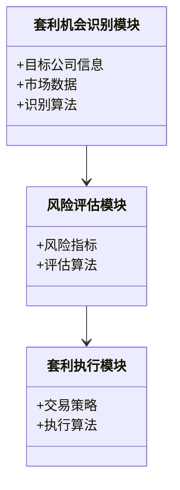

                 


# 马丁惠特曼的并购套利策略

## 关键词：并购套利、金融投资、套利策略、马丁惠特曼、金融数学模型

## 摘要

本文深入探讨了马丁惠特曼的并购套利策略，从背景介绍、套利策略的核心概念、数学模型、系统架构设计到项目实战，全面解析了并购套利的理论与实践。文章结合了金融理论与技术实现，通过详细的分析和实例，展示了如何利用数学模型和系统架构来优化套利策略，帮助读者理解并购套利的基本原理和实际应用。

---

## 第一部分：并购套利的背景与基础

### 第1章：并购套利的定义与背景

#### 1.1 并购套利的定义

并购套利是指在企业并购过程中，利用价格差异和市场不完美性，通过套利交易从价格差异中获利的一种投资策略。套利者通过识别和利用市场中的定价错误，能够在不承担额外风险的情况下获得收益。

#### 1.2 并购套利的历史发展

并购套利的起源可以追溯到20世纪60年代，随着企业并购活动的增加，套利者开始利用市场信息不对称和定价差异进行投资。马丁惠特曼作为并购套利领域的先驱，提出了许多创新的策略和数学模型，为现代套利理论奠定了基础。

#### 1.3 并购套利的基本原理

套利的基本原理在于利用市场中的定价错误。当市场中某项资产的价格被高估或低估时，套利者可以通过买入低估资产并卖出高估资产，从而在价格回归合理水平时获利。并购套利则专注于企业并购过程中的定价差异，利用这些差异进行套利。

---

## 第二部分：套利策略的核心概念

### 第2章：套利机会的识别与评估

#### 2.1 套利机会的识别

套利机会的识别是并购套利的核心步骤。套利者需要分析市场中的各种信息，识别出可能存在的定价错误。以下是一些常见的套利机会识别方法：

1. **市场信息不对称**：利用 insider information 或未公开信息。
2. **事件驱动**：如并购消息、管理层变动等。
3. **价差分析**：比较相关资产的价格差异。

#### 2.2 套利风险评估

套利者在识别套利机会后，需要对风险进行全面评估。主要的风险包括市场风险、流动性风险和操作风险。套利者需要通过风险评估模型来确定套利交易的可行性和潜在收益。

### 第3章：套利策略的数学模型

#### 3.1 套利定价模型

套利定价模型（APT）是套利理论的重要组成部分，用于估计资产的合理价格。APT通过引入多个因素，如市场风险、利率风险等，来解释资产价格的波动。其数学公式如下：

$$ E(r_i) = \beta_i (E(r_m) - r_f) + r_f $$

其中：
- \( E(r_i) \) 是资产 i 的预期收益率。
- \( \beta_i \) 是资产 i 的贝塔系数。
- \( E(r_m) \) 是市场组合的预期收益率。
- \( r_f \) 是无风险利率。

#### 3.2 事件驱动套利模型

事件驱动套利模型基于特定事件的发生来预测资产价格的变化。例如，并购消息的公布可能会导致相关资产价格的波动。套利者可以通过分析事件的影响，制定套利策略。

$$ \text{收益} = \text{事件发生后的价格变化} - \text{事件发生前的价格} $$

---

## 第三部分：套利策略的系统架构设计

### 第4章：系统功能设计

#### 4.1 领域模型设计

领域模型设计是系统架构设计的第一步，用于明确系统的功能模块和它们之间的关系。以下是并购套利系统的主要领域模型：

- **套利机会识别模块**：负责识别市场中的套利机会。
- **风险评估模块**：评估套利交易的风险。
- **套利执行模块**：执行套利交易。

Mermaid 类图如下：



#### 4.2 系统架构设计

系统架构设计决定了系统的整体结构和功能模块的划分。以下是并购套利系统的架构设计：

- **客户端**：用户界面，用于输入和查看数据。
- **中间件**：处理客户端请求并转发给后端服务。
- **后端服务**：包括套利机会识别、风险评估和套利执行模块。

Mermaid 架构图如下：


---

## 第四部分：项目实战

### 第5章：项目实战

#### 5.1 环境安装

为了实现并购套利策略，读者需要安装以下工具和库：

- Python 3.8+
- Jupyter Notebook
- Pandas、NumPy、Scipy 等数据分析库
- Matplotlib 或 Seaborn 用于可视化
- AlphaStream 或其他数据源接口

#### 5.2 核心代码实现

以下是实现套利定价模型的Python代码示例：

```python
import numpy as np
import pandas as pd

def calculate_apt(rf, rm, beta, r_i):
    """
    计算资产 i 的预期收益率
    """
    return rf + beta * (rm - rf)

# 示例数据
rf = 0.05
rm = 0.12
beta = 1.2
r_i = calculate_apt(rf, rm, beta, None)

print(f"预期收益率为：{r_i}")
```

#### 5.3 案例分析

以下是一个简单的套利案例分析：

假设市场预期收益率为12%，无风险利率为5%，某资产的贝塔系数为1.2。根据套利定价模型：

$$ E(r_i) = 0.05 + 1.2 \times (0.12 - 0.05) = 0.134 $$

如果该资产的当前市场价格为100元，预期收益率为13.4%，略高于市场平均水平，可能是一个套利机会。

---

## 第五部分：最佳实践与小结

### 第6章：最佳实践与小结

#### 6.1 小结

本文详细介绍了马丁惠特曼的并购套利策略，从理论到实践，从模型到代码，全面解析了套利策略的核心概念和实现方法。通过套利定价模型和事件驱动套利模型的分析，读者可以理解如何利用市场定价错误进行投资。

#### 6.2 注意事项

- 套利者需要具备扎实的金融知识和编程能力。
- 套利交易存在风险，需谨慎操作。
- 套利策略需要结合市场环境和具体情况进行调整。

#### 6.3 拓展阅读

建议读者进一步阅读以下内容，以深入理解并购套利：

- 《套利策略与金融市场》
- 《Python金融数据分析》
- 《事件驱动投资策略》

---

通过本文的分析和实践，读者可以掌握马丁惠特曼的并购套利策略，并在实际投资中灵活运用这些方法。

