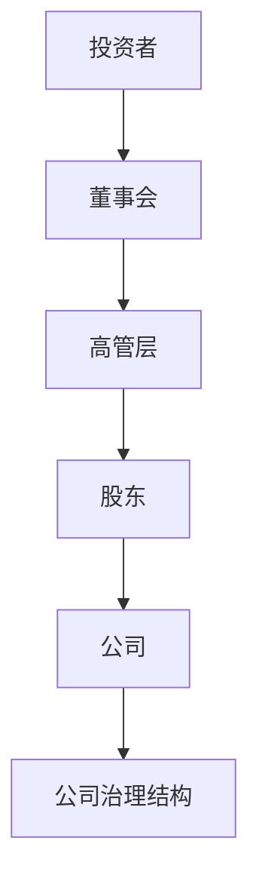
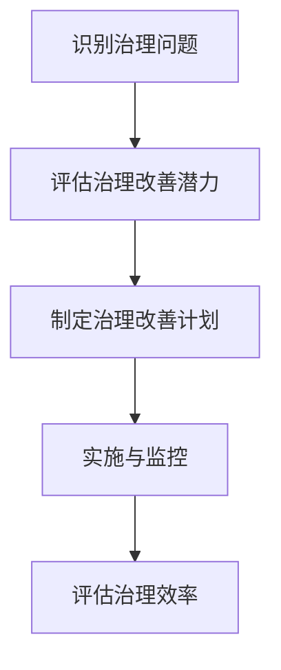
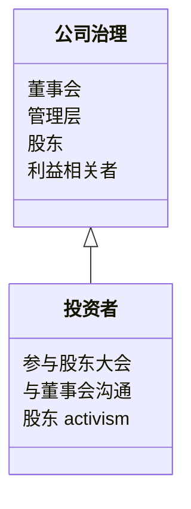
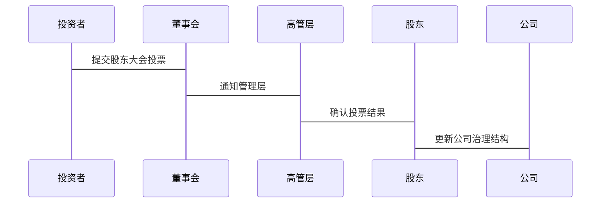

                 


# 马克·莫比乌斯的公司治理改善投资

## 关键词：公司治理，投资策略，治理机制，股东价值，董事会结构

## 摘要：本文从投资者的视角，深入探讨公司治理改善投资的核心策略。通过分析公司治理的现状、问题及解决路径，结合马克·莫比乌斯的投资实践，提出一套系统化的治理改善方法论。通过数学模型、算法原理和实际案例的分析，揭示公司治理改善对投资回报的积极影响，为投资者提供实用的指导和建议。

---

# 第一部分：公司治理改善投资的背景与核心概念

## 第1章：公司治理改善投资的背景与问题背景

### 1.1 公司治理改善投资的背景

#### 1.1.1 全球公司治理现状概述
公司治理是现代企业运行的核心机制，涉及股东、董事会、管理层和利益相关者之间的权利分配与制衡。近年来，全球范围内公司治理问题频发，如管理层滥用职权、董事会失职、透明度不足等，这些问题不仅影响企业的长期发展，也损害了投资者的利益。

#### 1.1.2 投资视角下的公司治理问题
从投资角度来看，公司治理的优劣直接影响企业的经营效率和投资回报。研究表明，治理良好的企业往往具有更高的ROE（净资产收益率）和股价表现。然而，许多企业在治理方面存在明显缺陷，如董事会独立性不足、管理层激励机制不合理等，这些问题成为投资者关注的重点。

#### 1.1.3 马克·莫比乌斯的治理改善投资理念
马克·莫比乌斯是全球著名的价值投资者，他强调通过改善公司治理来提升企业的长期价值。他认为，治理改善不仅是企业自身发展的需要，也是投资者实现超额收益的重要途径。莫比乌斯的投资策略注重买入那些治理结构存在问题但具有改善潜力的企业，并通过股东 activism 等方式推动治理优化。

### 1.2 公司治理问题的背景分析

#### 1.2.1 公司治理的核心问题
公司治理的核心问题在于如何平衡不同利益相关者的利益，确保管理层的决策符合股东和利益相关者的共同利益。常见的问题包括：
1. **代理问题**：管理层可能追求自身利益而非股东利益。
2. **透明度不足**：企业信息披露不充分，投资者难以评估企业的真实价值。
3. **董事会失职**：董事会缺乏独立性和专业性，无法有效监督管理层。
4. **激励机制不合理**：管理层的激励机制可能导致短期行为，忽视企业长期发展。

#### 1.2.2 投资者与公司治理的关系
投资者是公司治理的重要参与者，通过股东大会、董事会和管理层的互动，投资者可以影响企业的战略决策、管理层薪酬、资本分配等关键问题。良好的公司治理能够增强投资者信心，降低投资风险，从而吸引更多资金流入。

#### 1.2.3 全球公司治理挑战与机遇
全球范围内，公司治理问题普遍存在，但不同地区有不同的特点。例如，新兴市场的企业治理问题更为突出，而发达市场的治理相对成熟。投资者可以通过识别治理不佳的企业，通过治理改善投资实现超额收益。

### 1.3 公司治理改善投资的目标与意义

#### 1.3.1 投资者视角的公司治理目标
从投资者的角度来看，公司治理改善的目标是：
1. 提高企业经营效率和盈利能力。
2. 增强企业透明度和信息披露质量。
3. 优化董事会结构，确保董事会独立性和专业性。
4. 建立合理的管理层激励机制，避免短期行为。

#### 1.3.2 公司治理改善对投资回报的影响
研究表明，治理改善能够显著提升企业的经营效率和股价表现。通过改善公司治理，企业可以更好地应对市场风险，提升投资者信心，从而获得更高的估值溢价。

#### 1.3.3 公司治理改善的长期价值
公司治理改善不仅能够提升短期收益，还能为企业的长期发展奠定基础。通过优化治理结构，企业可以更好地应对行业变化和市场波动，增强企业的抗风险能力。

### 1.4 本章小结
本章从投资者的视角，分析了公司治理改善投资的背景和核心问题。通过探讨公司治理的核心问题、投资者与公司治理的关系，以及全球公司治理的挑战与机遇，为后续的治理改善策略奠定了基础。

---

## 第2章：公司治理改善投资的核心概念与联系

### 2.1 公司治理的核心概念

#### 2.1.1 公司治理的定义与内涵
公司治理是指通过公司章程、董事会、管理层和利益相关者的互动，确保企业决策符合股东和利益相关者利益的机制。公司治理的核心在于权力分配、制衡和监督。

#### 2.1.2 股东、董事会与管理层的角色
1. **股东**：股东是企业的所有者，通过股东大会行使对企业重大决策的影响力。
2. **董事会**：董事会是股东的代表，负责监督和指导管理层的决策，确保管理层的行为符合股东利益。
3. **管理层**：管理层负责企业的日常运营，执行董事会的决策，并向董事会报告企业经营状况。

#### 2.1.3 公司治理的结构与功能
公司治理的结构包括董事会、审计委员会、提名委员会和薪酬委员会等。其功能在于确保企业决策的透明性、合理性和合规性。

### 2.2 公司治理改善投资的原理

#### 2.2.1 投资者如何影响公司治理
投资者可以通过以下方式影响公司治理：
1. **参与股东大会**：通过投票或提出议案，影响企业的重大决策。
2. **与董事会沟通**：通过与董事会成员的沟通，推动治理结构的优化。
3. **股东 activism**：通过收购或增持股份，成为企业的控股股东，直接推动治理改善。

#### 2.2.2 公司治理改善的路径与方法
1. **优化董事会结构**：增加独立董事的比例，确保董事会的独立性和专业性。
2. **完善激励机制**：通过股票期权、限制性股票等方式，激励管理层关注企业的长期发展。
3. **提高透明度**：要求企业加强信息披露，提高财务报表的透明度和准确性。

#### 2.2.3 投资者与公司治理的协同效应
投资者与公司治理的协同效应体现在以下几个方面：
1. **提升企业价值**：通过治理改善，提升企业的经营效率和市场竞争力。
2. **降低投资风险**：良好的公司治理能够降低企业的经营风险，提升投资者的 confidence。
3. **实现超额收益**：通过治理改善投资，投资者可以实现超额收益。

### 2.3 核心概念的属性对比分析

#### 2.3.1 股东与利益相关者的对比
| 属性       | 股东                     | 利益相关者               |
|------------|--------------------------|--------------------------|
| 定义       | 企业的所有者             | 包括债权人、员工、客户等  |
| 权利       | 表决权、分红权           | 监督权、知情权           |
| 影响         | 通过股东大会影响企业决策 | 通过合同或协议影响企业行为 |

#### 2.3.2 董事会结构与治理效率的对比
| 属性       | 独立董事会结构           | 非独立董事会结构         |
|------------|--------------------------|--------------------------|
| 独立性       | 独立性强                 | 独立性弱                 |
| 专业性       | 专业性强                 | 专业性弱                 |
| 监督效果     | 监督效果好               | 监督效果差               |

#### 2.3.3 不同公司治理模式的对比
| 模式         | 英美模式                 | 德日模式                 |
|-------------|--------------------------|--------------------------|
| 董事会结构   | 独立董事比例高           | 董事会成员多为内部人员   |
| 股权结构     | 股权分散                 | 股权集中                 |
| 法律环境     | 偏好股东权益保护         | 偏好债权人保护           |

### 2.4 ER实体关系图


### 2.5 本章小结
本章从核心概念的角度，分析了公司治理的结构与功能，探讨了投资者如何通过影响公司治理结构来实现投资目标。通过对比分析和实体关系图，进一步明确了公司治理改善投资的关键要素。

---

## 第3章：公司治理改善投资的算法原理与数学模型

### 3.1 算法原理概述

#### 3.1.1 公司治理改善的算法框架
公司治理改善的算法框架包括以下几个步骤：
1. **识别治理问题**：通过分析企业的财务报表、治理结构和管理层行为，识别企业治理中的问题。
2. **评估治理改善的潜力**：通过数学模型评估治理改善对投资回报的潜在影响。
3. **制定治理改善计划**：根据问题和潜力分析，制定具体的治理改善计划。
4. **实施与监控**：通过股东 activism 等方式实施治理改善，并持续监控改善效果。

#### 3.1.2 投资者决策的数学模型
投资者决策的数学模型可以表示为：
$$
\text{投资价值} = \text{企业价值} + \text{治理改善潜力} \times \text{改善概率}
$$

#### 3.1.3 公司治理效率的评估指标
公司治理效率的评估指标包括：
1. **董事会独立性**：独立董事比例。
2. **管理层激励机制**：股票期权占比。
3. **透明度**：信息披露质量。
4. **股东权利保护**：股东诉讼权。

### 3.2 数学模型与公式

#### 3.2.1 公司治理效率评估公式
$$
E = \frac{S}{T}
$$
其中，$E$ 表示治理效率，$S$ 表示治理改善的成果，$T$ 表示治理投入。

#### 3.2.2 投资回报与治理改善的关系
$$
R = r \times E
$$
其中，$R$ 表示投资回报，$r$ 表示无风险利率，$E$ 表示治理效率。

### 3.3 算法流程图


### 3.4 本章小结
本章通过数学模型和算法流程图，详细阐述了公司治理改善投资的算法原理。通过公式和流程图的展示，进一步明确了治理改善投资的逻辑和步骤。

---

## 第4章：公司治理改善投资的系统分析与架构设计方案

### 4.1 问题场景介绍

#### 4.1.1 公司治理改善的典型问题
1. **董事会结构不合理**：独立董事比例低，董事会成员缺乏专业性。
2. **管理层激励机制不合理**：管理层激励过度依赖短期业绩，忽视长期发展。
3. **透明度不足**：企业信息披露不充分，投资者难以评估企业真实价值。

#### 4.1.2 投资者如何应对这些问题
1. **参与股东大会**：通过投票或提出议案，推动治理结构优化。
2. **与董事会沟通**：通过与董事会成员的沟通，推动治理改善。
3. **股东 activism**：通过收购或增持股份，成为控股股东，直接推动治理改善。

### 4.2 系统功能设计

#### 4.2.1 领域模型


#### 4.2.2 系统架构设计


### 4.3 接口设计

#### 4.3.1 API接口设计
1. **股东大会投票接口**：投资者通过API提交股东大会投票。
2. **董事会沟通接口**：投资者通过API与董事会成员进行沟通。

#### 4.3.2 交互序列图


### 4.4 本章小结
本章通过系统分析与架构设计方案，详细阐述了公司治理改善投资的系统结构和功能设计。通过领域模型和架构图的展示，进一步明确了治理改善投资的系统实现方式。

---

## 第5章：公司治理改善投资的项目实战

### 5.1 项目环境安装

#### 5.1.1 系统环境要求
1. 操作系统：Windows 10 或更高版本，或macOS 10.15 或更高版本。
2. 开发工具：Visual Studio Code 或其他代码编辑器。
3. 依赖管理工具：pip（Python 包管理工具）。

#### 5.1.2 安装步骤
1. 安装 Python：从官方网站下载并安装 Python 3.8 或更高版本。
2. 安装 pip：运行命令 `python -m pip install --upgrade pip`。
3. 安装依赖包：运行命令 `pip install requests pandas numpy`。

### 5.2 核心代码实现

#### 5.2.1 公司治理效率评估代码
```python
import pandas as pd
import numpy as np

def calculate_governance_efficiency(s, t):
    return s / t

# 示例数据
s = 80
t = 40
efficiency = calculate_governance_efficiency(s, t)
print(f"治理效率：{efficiency}")
```

#### 5.2.2 投资回报计算代码
```python
def calculate_investment_return(r, e):
    return r * e

# 示例数据
r = 0.05
e = 0.8
return_ = calculate_investment_return(r, e)
print(f"投资回报：{return_}")
```

### 5.3 代码解读与分析

#### 5.3.1 公司治理效率评估代码解读
1. **输入参数**：`s` 表示治理改善的成果，`t` 表示治理投入。
2. **计算逻辑**：通过公式 `s / t` 计算治理效率。
3. **输出结果**：返回治理效率值。

#### 5.3.2 投资回报计算代码解读
1. **输入参数**：`r` 表示无风险利率，`e` 表示治理效率。
2. **计算逻辑**：通过公式 `r * e` 计算投资回报。
3. **输出结果**：返回投资回报值。

### 5.4 实际案例分析

#### 5.4.1 案例背景
假设某企业治理效率为 0.7，无风险利率为 5%。

#### 5.4.2 计算过程
1. **治理效率评估**：`s = 70`, `t = 100`，`efficiency = 70 / 100 = 0.7`。
2. **投资回报计算**：`r = 0.05`, `e = 0.7`，`return = 0.05 * 0.7 = 0.035`。

#### 5.4.3 分析结果
投资回报率为 3.5%，高于无风险利率，说明治理改善投资具有较高的潜力。

### 5.5 项目小结
本章通过实际案例分析，展示了公司治理改善投资的实现过程。通过代码实现和案例分析，进一步验证了治理改善投资的可行性和有效性。

---

## 第6章：公司治理改善投资的最佳实践

### 6.1 最佳实践 tips

#### 6.1.1 投资者如何选择治理改善投资的目标企业
1. **关注治理问题**：选择治理结构存在问题但具有改善潜力的企业。
2. **评估改善潜力**：通过数学模型评估治理改善对投资回报的影响。
3. **考虑行业特点**：不同行业的治理问题和改善路径不同，投资者需结合行业特点进行选择。

#### 6.1.2 如何与董事会有效沟通
1. **明确沟通目标**：明确沟通的核心问题和目标。
2. **准备充分资料**：通过数据分析和案例研究，提供有力支持。
3. **建立信任关系**：通过长期互动建立与董事会的信任关系。

#### 6.1.3 如何监控治理改善效果
1. **定期评估**：通过定期评估治理效率，监控改善效果。
2. **调整策略**：根据评估结果，调整治理改善策略。
3. **持续关注**：持续关注企业的治理动态，及时发现和解决问题。

### 6.2 小结
通过本文的分析，我们可以看到，公司治理改善投资不仅能够提升企业的经营效率和市场竞争力，还能为投资者带来超额收益。投资者通过识别治理问题、制定改善计划并持续监控改善效果，能够实现长期的收益目标。

### 6.3 注意事项

#### 6.3.1 投资者需关注的风险
1. **治理改善失败风险**：治理改善可能失败，导致投资损失。
2. **市场波动风险**：市场波动可能影响投资回报。
3. **法律风险**：治理改善可能涉及复杂的法律问题。

#### 6.3.2 如何降低风险
1. **充分尽职调查**：通过尽职调查，评估企业的治理问题和改善潜力。
2. **制定应急预案**：制定应对治理改善失败的应急预案。
3. **分散投资**：通过分散投资降低单一投资的风险。

### 6.4 拓展阅读

#### 6.4.1 推荐书籍
1. 《公司治理：理论与实践》
2. 《价值投资：莫比乌斯的智慧》

#### 6.4.2 推荐文章
1. Mark Mobius: The Importance of Corporate Governance in Value Investing
2. Shareholder Activism: A Guide for Investors

### 6.5 本章小结
本章通过最佳实践和注意事项，为投资者提供了实用的指导和建议。通过拓展阅读，进一步扩展了读者的知识储备。

---

## 结语

公司治理改善投资是投资者实现超额收益的重要途径。通过本文的分析，我们了解了公司治理改善投资的核心概念、算法原理和系统设计方案。通过实际案例分析和最佳实践的总结，我们进一步掌握了治理改善投资的实现方法和注意事项。未来，随着公司治理问题的日益突出，投资者在治理改善投资方面将发挥越来越重要的作用。

