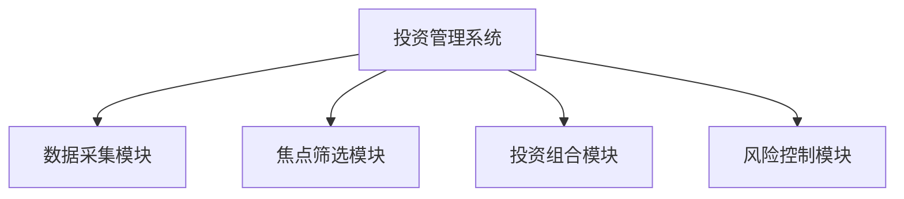

                 

# 马里奥·加贝利的焦点价值投资：集中持股的艺术

> 关键词：焦点价值投资，集中持股，价值投资策略，投资组合优化，风险控制，投资管理系统

> 摘要：本文深入探讨了马里奥·加贝利的焦点价值投资方法，剖析了其背后的核心理念、数学模型、算法原理和系统架构。通过实际案例分析，展示了如何通过集中持股的艺术实现投资组合的优化与风险控制。

---

## 第一部分：焦点价值投资的背景与核心理念

### 第1章：价值投资的起源与演变

#### 1.1 价值投资的定义与核心理念
- 价值投资是一种以基本面分析为基础的投资策略，强调以低于内在价值的价格买入优质资产。
- 其核心理念是寻找市场低估的企业，长期持有，等待价值回归。

#### 1.2 马里奥·加贝利的背景与投资风格
- 马里奥·加贝利是价值投资领域的代表性人物，以其独特的“焦点价值投资”策略闻名。
- 他的投资风格强调集中持股，专注于少数优质企业，长期持有，追求超额收益。

#### 1.3 焦点价值投资的核心理念
- **聚焦少数优质企业**：通过深入研究，筛选出具有持续竞争优势和良好治理的企业。
- **长期持有**：避免频繁交易，降低交易成本，享受企业长期增长的成果。
- **安全边际**：以合理的价格买入，确保有一定的安全边际，降低投资风险。

---

### 第2章：焦点价值投资的核心概念与联系

#### 2.1 价值投资的核心概念
- **内在价值**：企业未来现金流的现值，是投资决策的核心依据。
- **市场价值**：市场价格与内在价值的关系，市场短期可能偏离内在价值，但长期会回归。
- **安全边际**：买入价格低于内在价值，确保投资的安全性。

#### 2.2 焦点价值投资的核心要素
- **焦点企业**：具有持续竞争优势、良好治理和稳定财务状况的企业。
- **集中持股**：将大部分资金集中在少数优质企业上，提高投资收益。
- **长期投资**：通过长期持有，享受企业成长的复利效应。

#### 2.3 焦点价值投资与集中持股的关系
- 集中持股是焦点价值投资的核心策略，通过聚焦优质企业，减少投资组合的波动性。
- 集中持股要求投资者对所选企业有深刻的理解和信心，避免短期市场波动的干扰。

---

## 第二部分：焦点价值投资的数学模型与算法原理

### 第3章：价值投资的数学模型

#### 3.1 内在价值的计算公式
- 内在价值公式：
  $$ V = \sum_{t=1}^{\infty} \frac{CF_t}{(1 + r)^t} $$
  其中，\( CF_t \) 是第 \( t \) 年的自由现金流，\( r \) 是贴现率。

- 示例：假设某企业未来5年的现金流分别为100、120、130、140、150万元，贴现率为8%。
  $$ V = \frac{100}{1.08} + \frac{120}{1.08^2} + \frac{130}{1.08^3} + \frac{140}{1.08^4} + \frac{150}{1.08^5} \approx 350 \text{万元} $$

#### 3.2 安全边际的计算
- 安全边际 = 内在价值 - 市场价格
- 示例：内在价值为350万元，市场价格为300万元，安全边际为50万元。

### 第4章：焦点企业筛选算法

#### 4.1 焦点企业筛选标准
- **行业地位**：龙头企业，具有竞争优势。
- **财务健康**：低负债率，稳定的现金流。
- **盈利能力**：ROE（净资产收益率）>15%。
- **管理团队**：优秀的管理层，良好的治理结构。

#### 4.2 焦点企业评分系统
- 采用加权评分法，权重分别为：财务状况（40%）、行业地位（30%）、盈利能力（20%）、管理团队（10%）。

---

## 第三部分：焦点价值投资的系统架构与设计

### 第5章：投资管理系统架构

#### 5.1 系统功能模块划分
- 数据采集模块：收集企业财务数据、市场数据。
- 焦点筛选模块：根据算法筛选焦点企业。
- 投资组合模块：生成投资组合，动态调整。
- 风险控制模块：监控投资组合风险，制定应对策略。

#### 5.2 系统架构设计

---

## 第四部分：焦点价值投资的项目实战

### 第6章：项目背景与目标

#### 6.1 项目背景
- 某投资机构希望采用焦点价值投资策略，优化投资组合，降低风险。

#### 6.2 项目目标
- 筛选焦点企业，构建投资组合，定期监控调整。

### 第7章：系统核心实现

#### 7.1 数据采集模块
- 使用爬虫技术采集企业财务数据，存储于数据库中。

#### 7.2 焦点筛选模块
- 根据评分系统筛选出优质企业，生成投资组合。

### 第8章：实际案例分析

#### 8.1 投资组合构建
- 选择5家优质企业，集中持股，占比分别为40%、30%、20%、5%、5%。

#### 8.2 投资组合监控
- 定期评估企业基本面，动态调整投资比例，确保投资组合安全。

---

## 总结与展望

### 总结
- 马里奥·加贝利的焦点价值投资是一种高效的投资策略，通过集中持股优质企业，实现长期稳定的收益。
- 本文从理论、算法、系统架构和实战案例四个方面，全面剖析了焦点价值投资的核心要素和实现方法。

### 展望
- 未来，随着技术的进步，焦点价值投资可以通过更先进的数据分析和算法优化，进一步提升投资效率和收益。

---

通过本文的分析，读者可以深入理解焦点价值投资的核心理念和实现方法，并将其应用于实际投资中。

