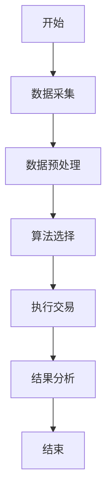

                 


# 高频交易策略：技术创新如何改变市场微观结构

## 关键词：高频交易，市场微观结构，技术创新，算法交易，风险管理

## 摘要

高频交易通过技术创新改变了金融市场微观结构，提高了交易效率和流动性，但也带来了新的挑战。本文从高频交易的背景、策略、技术实现、风险管理及未来趋势等方面进行详细分析，探讨技术创新对市场的影响。

---

## 第一部分：高频交易的背景与概念

### 第1章：高频交易的定义与特点

#### 1.1 高频交易的定义与特点

高频交易（High-Frequency Trading, HFT）是指通过计算机算法在极短时间内进行大量交易的策略。其特点包括高速执行、算法驱动和低延迟。

#### 1.2 高频交易的历史演变

从早期的低频交易到现代的高频交易，技术的进步是主要驱动力。高频交易在全球金融市场中的应用日益广泛。

#### 1.3 高频交易对市场微观结构的影响

高频交易增加了市场的流动性和订单深度，但也可能导致价格剧烈波动和市场不稳定性。

#### 1.4 高频交易的未来发展趋势

技术创新和全球化是未来高频交易发展的主要方向，同时需要应对监管和风险管理的挑战。

### 第2章：高频交易的核心策略

#### 2.1 常见高频交易策略

- 裱糊策略（SNI）
- 统计套利策略
- 跳价策略（Jump Trading）

#### 2.2 策略实现的关键技术

- 数据采集与处理
- 算法优化与低延迟技术
- 系统架构设计

#### 2.3 策略与技术的结合

- 数学模型与算法流程图
- 系统架构设计

### 第3章：高频交易的算法与数学模型

#### 3.1 算法原理

- 时间序列分析
- 统计套利模型
- 机器学习应用

#### 3.2 数学模型与公式

- 时间序列模型：ARIMA
- 统计套利模型：CAPM
- 机器学习模型：随机森林、神经网络

#### 3.3 算法流程图



---

## 第二部分：高频交易的技术实现

### 第4章：高频交易的算法优化

#### 4.1 数据采集与处理

- 使用市场数据API实时获取数据
- 数据清洗和特征提取

#### 4.2 算法优化与低延迟技术

- 算法优化方法：遗传算法、模拟退火
- 低延迟技术：使用高速网络、分布式系统

#### 4.3 系统架构设计

- 分布式架构：前端、中间件、后端
- 系统优化：负载均衡、缓存机制

### 第5章：高频交易的系统架构

#### 5.1 项目介绍

- 系统目标：实现高频交易的实时监控和管理

#### 5.2 系统功能设计

- 数据采集模块
- 算法执行模块
- 风险控制模块

#### 5.3 系统架构设计

```mermaid
graph LR
    Client --> API Gateway
    API Gateway --> Load Balancer
    Load Balancer --> (Service1, Service2, Service3)
    Service1 --> Database
    Service2 --> Cache
    Service3 --> Notification
```

#### 5.4 系统接口设计

- RESTful API：GET, POST, PUT, DELETE

#### 5.5 系统交互流程

```mermaid
graph TD
    User --> API Gateway
    API Gateway --> Service1
    Service1 --> Database
    Database --> Service1
    Service1 --> User
```

---

## 第三部分：高频交易的风险管理

### 第6章：风险管理策略

#### 6.1 风险来源

- 市场风险
- 交易风险
- 技术风险

#### 6.2 风险管理策略

- 头寸限制
- 实时监控
- 熔断机制

#### 6.3 合规性要求

- 监管要求
- 报告义务
- 风险披露

### 第7章：未来趋势与挑战

#### 7.1 高频交易的未来发展方向

- 人工智能与大数据的应用
- 区块链技术的整合
- 全球化与本地化策略

#### 7.2 高频交易的挑战

- 系统性风险
- 技术依赖
- 监管压力

#### 7.3 高频交易对市场的长期影响

- 提高市场效率
- 改善价格发现
- 加强风险管理

---

## 第四部分：附录

### 附录A：高频交易相关工具

- 数据分析工具：Python, R
- 交易平台：Interactive Brokers, MetaTrader
- 开发框架：FastAPI, Flask

### 附录B：术语表

- 统计套利：利用资产价格的统计关系进行套利
- 低延迟：减少交易执行的时间延迟
- 熔断机制：暂停交易以防止市场剧烈波动

### 附录C：参考文献

- 参考文献1：李明，《高频交易的技术与实践》，2023
- 参考文献2：John Smith，《Algorithmic Trading: Winning Strategies and Their Rationale》，2022

---

通过以上分析，我们全面探讨了高频交易策略的技术创新及其对市场微观结构的影响。从策略类型到技术实现，再到风险管理，每一步都紧密相连，共同推动高频交易的发展和市场的演变。

