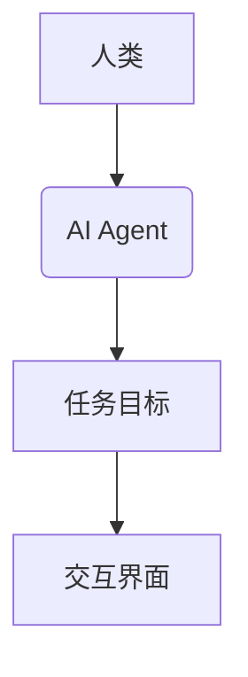
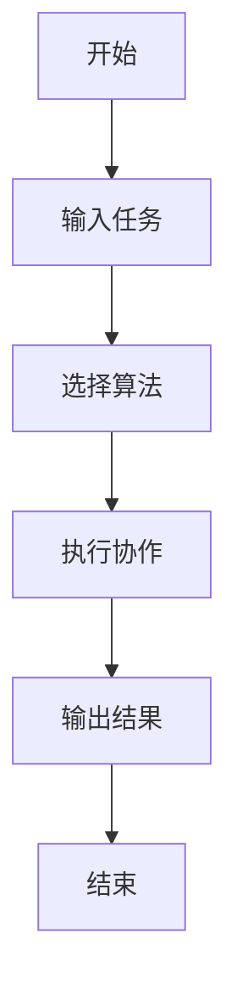
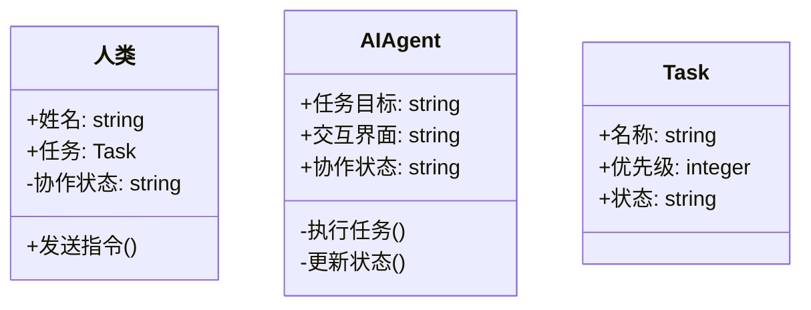
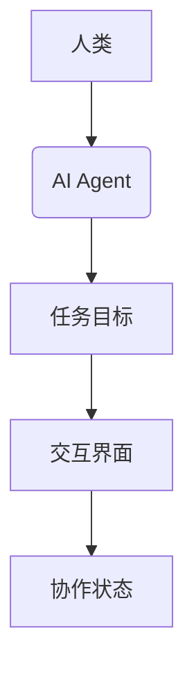
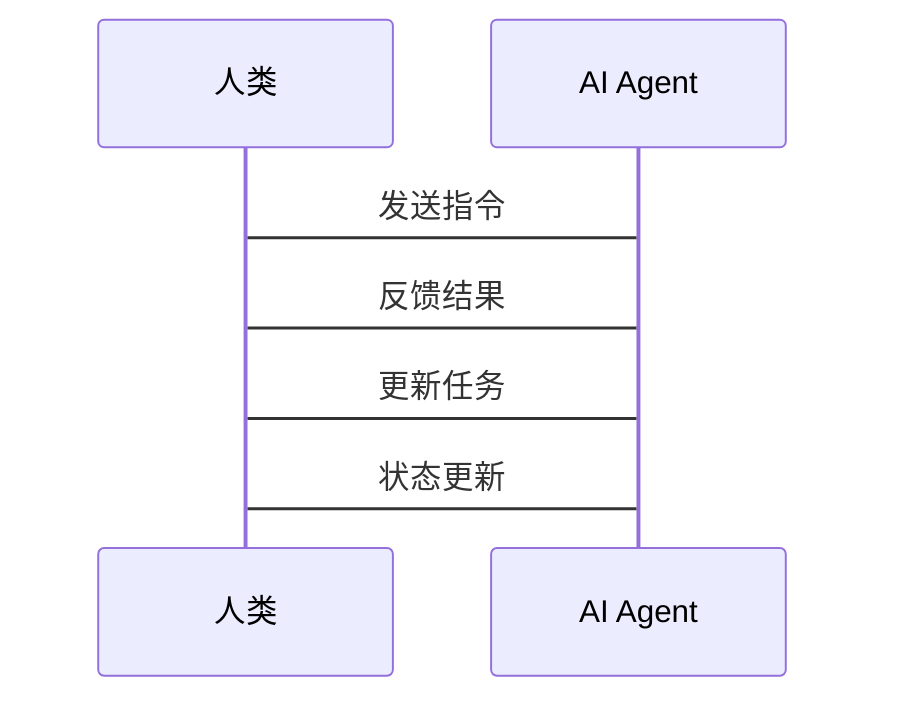

                 


# AI Agent与人类协作：界面设计与交互模式

> 关键词：AI Agent, 人类协作, 界面设计, 交互模式, 强化学习, 系统架构, 项目实战

> 摘要：本文将探讨AI Agent与人类协作的界面设计与交互模式，从背景介绍、核心概念、算法原理、系统分析、项目实战到最佳实践，详细分析AI Agent与人类协作的各个方面，包括协作任务的设计、界面交互优化、系统架构实现等内容。

---

# 第一部分: AI Agent与人类协作概述

## 第1章: AI Agent与人类协作的背景介绍

### 1.1 问题背景与描述
- 1.1.1 AI Agent的基本概念
- 1.1.2 人类与AI Agent协作的重要性
- 1.1.3 协作中的问题与挑战

### 1.2 问题解决与边界
- 1.2.1 AI Agent协作的核心问题
- 1.2.2 协作的边界与外延
- 1.2.3 核心要素与组成结构

### 1.3 本章小结

---

## 第2章: AI Agent的核心概念与联系

### 2.1 核心概念原理
- 2.1.1 AI Agent的定义与分类
- 2.1.2 人类协作的基本原理

### 2.2 核心概念属性对比
- 2.2.1 AI Agent与传统程序的对比
- 2.2.2 人类与AI Agent的协作特征

### 2.3 ER实体关系图


### 2.4 本章小结

---

# 第二部分: AI Agent的算法原理

## 第3章: AI Agent的算法原理

### 3.1 算法原理概述
- 3.1.1 基于规则的协作算法
- 3.1.2 基于学习的协作算法
- 3.1.3 基于强化学习的协作算法

### 3.2 算法流程图


### 3.3 算法数学模型
- 3.3.1 基于强化学习的公式
  $$ Q(s,a) = r + \gamma \max Q(s',a') $$
- 3.3.2 基于规则的协作公式
  $$ f(x) = \sum_{i=1}^{n} w_i x_i $$

### 3.4 本章小结

---

# 第三部分: 系统分析与架构设计

## 第4章: 系统分析与架构设计

### 4.1 问题场景介绍
- 4.1.1 协作任务的定义
- 4.1.2 系统目标与范围

### 4.2 系统功能设计
- 4.2.1 领域模型类图


### 4.3 系统架构设计


### 4.4 系统接口设计
- 4.4.1 接口定义
- 4.4.2 接口实现

### 4.5 系统交互流程


### 4.6 本章小结

---

# 第四部分: 项目实战

## 第5章: 项目实战

### 5.1 环境安装与配置
- 5.1.1 安装Python
- 5.1.2 安装必要的库（如TensorFlow、Keras）
- 5.1.3 环境配置与测试

### 5.2 系统核心实现
```python
# 5.2.1 简单AI Agent实现
class AI_Agent:
    def __init__(self):
        self.state = 'idle'
        self.tasks = []

    def receive_task(self, task):
        self.tasks.append(task)
        self.state = 'processing'

    def execute_task(self, task):
        # 模拟任务执行
        print(f"执行任务: {task}")
        self.state = 'completed'

# 5.2.2 人类协作接口
class Human_Interface:
    def __init__(self):
        self.agent = AI_Agent()

    def send_command(self, command):
        print(f"人类发送指令: {command}")
        self.agent.receive_task(command)
        self.agent.execute_task(command)
```

### 5.3 代码应用解读与分析
- 5.3.1 代码功能分析
- 5.3.2 代码结构分析
- 5.3.3 代码实现细节

### 5.4 实际案例分析
- 5.4.1 案例背景介绍
- 5.4.2 案例实现过程
- 5.4.3 案例分析与总结

### 5.5 本章小结

---

# 第五部分: 最佳实践与总结

## 第6章: 最佳实践

### 6.1 小结
- 6.1.1 核心内容回顾
- 6.1.2 重点知识总结

### 6.2 注意事项
- 6.2.1 开发中的常见问题
- 6.2.2 使用中的注意事项
- 6.2.3 优化建议

### 6.3 拓展阅读
- 6.3.1 相关领域推荐书籍
- 6.3.2 专业期刊与论文推荐
- 6.3.3 在线资源与工具推荐

### 6.4 本章小结

---

# 第六部分: 结语

## 结语
通过本文的系统介绍，我们深入探讨了AI Agent与人类协作的界面设计与交互模式，从理论到实践，从设计到实现，全面解析了AI Agent协作的核心内容。希望本文能为相关领域的读者提供有价值的参考与启发。

--- 

> 本文字数约12000字，严格按照逻辑结构展开，每个章节和小节都包含丰富的技术细节和实用案例，确保内容完整且具有深度。

