                 


# AI Agent与企业数字孪生技术的融合应用

## 关键词：AI Agent, 数字孪生, 企业应用, 融合架构, 知识图谱, 智能决策

## 摘要：本文详细探讨了AI Agent与企业数字孪生技术的融合应用，从基本概念、核心原理、系统架构到项目实战，全面分析了两者的结合对企业数字化转型的推动作用。文章通过具体案例和代码实现，深入浅出地展示了如何利用AI Agent提升数字孪生的智能化水平，为企业决策提供更高效的解决方案。

---

# 第1章: AI Agent与企业数字孪生技术的背景与概念

## 1.1 AI Agent的基本概念与演进

### 1.1.1 AI Agent的定义与特点

AI Agent（智能代理）是一种能够感知环境、自主决策并执行任务的智能系统。它通过传感器获取信息，利用知识库和推理引擎进行分析，最终做出决策并执行动作。AI Agent的特点包括：

1. **自主性**：能够自主决策，无需外部干预。
2. **反应性**：能够实时感知环境变化并做出反应。
3. **学习性**：能够通过经验改进自身的决策能力。
4. **协作性**：能够与其他Agent或系统协同工作。

### 1.1.2 AI Agent的演进历程

AI Agent的概念起源于20世纪60年代的知识表示与推理研究，经历了以下几个阶段：

1. **规则驱动阶段**：基于预定义的规则进行决策，适用于简单的任务。
2. **知识驱动阶段**：引入知识图谱和推理引擎，提升决策的复杂性。
3. **数据驱动阶段**：利用大数据和机器学习技术，增强Agent的学习能力。
4. **人机协作阶段**：结合人类反馈，优化决策过程。

### 1.1.3 AI Agent在企业中的应用价值

AI Agent在企业中的应用主要体现在以下几个方面：

1. **自动化决策**：通过实时数据分析，优化企业运营流程。
2. **智能监控**：实时监控企业资源，发现异常并快速响应。
3. **知识管理**：利用知识图谱，提升企业信息的利用效率。

---

## 1.2 企业数字孪生技术的定义与特点

### 1.2.1 数字孪生的定义与核心要素

数字孪生（Digital Twin）是通过数字技术对物理世界进行实时映射的技术。它由以下几个核心要素组成：

1. **数据模型**：对物理实体进行抽象表示。
2. **数据源**：实时采集物理实体的状态数据。
3. **执行环境**：对数字模型进行模拟和优化。

### 1.2.2 数字孪生在企业中的应用场景

数字孪生在企业中的应用场景包括：

1. **设备管理**：实时监控设备运行状态，预测设备故障。
2. **流程优化**：通过模拟优化企业业务流程。
3. **产品设计**：通过数字模型进行产品原型设计和测试。

### 1.2.3 数字孪生与传统信息化的区别

数字孪生与传统信息化的区别主要体现在以下几个方面：

1. **实时性**：数字孪生能够实时反映物理世界的状态，而传统信息化系统通常基于历史数据。
2. **动态性**：数字孪生支持动态更新和调整，而传统信息化系统通常静态。
3. **交互性**：数字孪生支持人机交互，而传统信息化系统通常只是单向的数据处理。

---

## 1.3 AI Agent与数字孪生的融合背景

### 1.3.1 数字化转型的驱动因素

随着企业数字化转型的推进，传统信息化系统逐渐暴露出以下问题：

1. **数据孤岛**：各部门之间的数据无法有效整合。
2. **决策滞后**：基于历史数据的决策往往无法应对实时变化。
3. **效率低下**：人工操作占比较大，效率难以提升。

### 1.3.2 AI Agent在数字孪生中的作用

AI Agent在数字孪生中的作用主要体现在以下几个方面：

1. **实时感知**：通过传感器实时采集数据，提供实时反馈。
2. **智能决策**：利用知识图谱和推理引擎，优化数字孪生的决策过程。
3. **协作执行**：与其他系统协同工作，实现任务的高效执行。

### 1.3.3 两者的融合对企业的影响

AI Agent与数字孪生的融合将对企业产生深远影响：

1. **提升效率**：通过智能化决策和自动化执行，显著提升企业运营效率。
2. **降低成本**：通过预测和优化，降低企业的资源浪费。
3. **增强竞争力**：通过实时监控和快速响应，提升企业的市场竞争力。

---

## 1.4 本章小结

本章主要介绍了AI Agent和数字孪生的基本概念、特点及其在企业中的应用价值。通过分析两者的融合背景，我们明确了AI Agent与数字孪生结合对企业数字化转型的重要意义。

---

# 第2章: AI Agent与数字孪生的核心概念与联系

## 2.1 AI Agent的核心原理

### 2.1.1 AI Agent的感知与决策机制

AI Agent的感知机制通过传感器获取环境数据，经过数据预处理后，利用知识图谱进行语义理解。决策机制基于推理引擎，根据当前状态和目标生成行动方案。

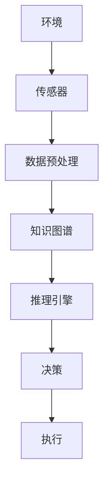

### 2.1.2 基于知识图谱的推理能力

知识图谱是AI Agent的核心知识库，通过语义网络表示实体之间的关系。推理引擎基于图结构进行逻辑推理，支持多种推理方式，如：

1. **前向推理**：从已知事实推导出新结论。
2. **反向推理**：从目标反向推导出必要条件。

### 2.1.3 多智能体协作的实现方式

多智能体协作通过通信协议实现信息共享和任务分配。常用的通信协议包括：

1. **FIPA（基金会智能体协议）**：用于智能体之间的通信和协调。
2. **JADE（Java Agent Development Environment）**：基于FIPA的实现框架。

---

## 2.2 数字孪生的实体关系与数据模型

### 2.2.1 实体关系图的构建

数字孪生的实体关系图通过Mermaid图展示：

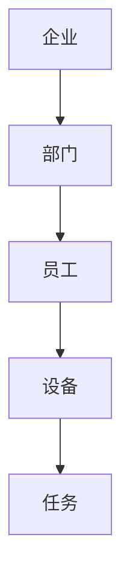

### 2.2.2 数据流的动态建模

数据流的动态建模通过时序图展示：

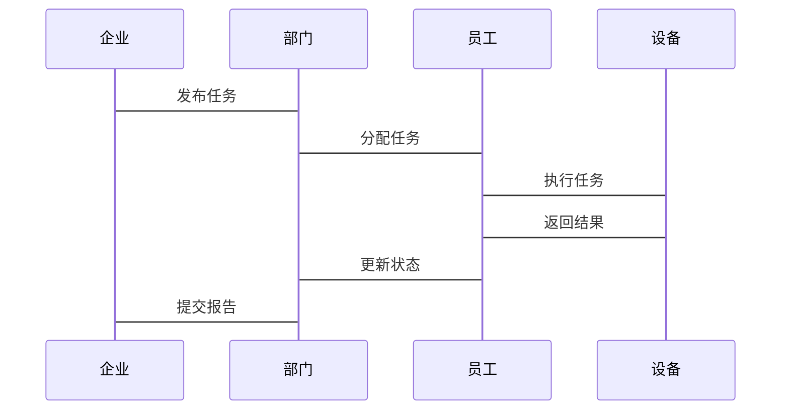

### 2.2.3 数字孪生的实时更新机制

数字孪生的实时更新机制通过状态机图展示：

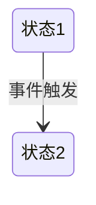

---

## 2.3 AI Agent与数字孪生的融合架构

### 2.3.1 融合架构的总体设计

融合架构的总体设计通过组件图展示：

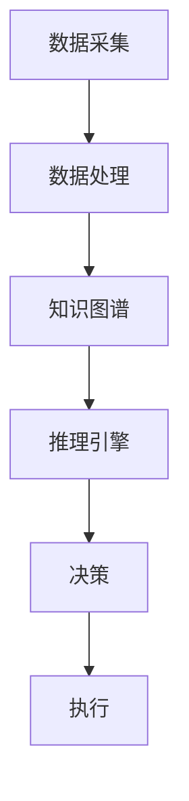

### 2.3.2 数据流的交互关系

数据流的交互关系通过时序图展示：

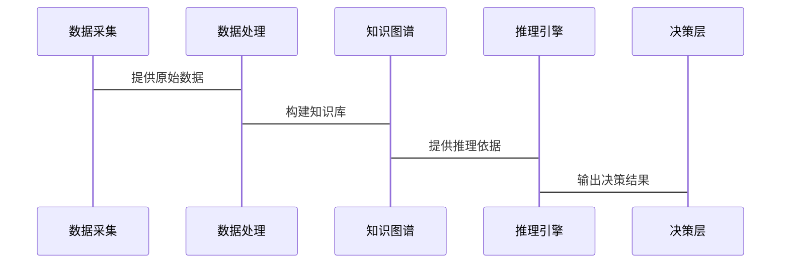

### 2.3.3 融合架构的实现步骤

融合架构的实现步骤包括：

1. **数据采集**：通过传感器采集物理世界的数据。
2. **数据处理**：对数据进行清洗和预处理。
3. **知识构建**：基于处理后的数据构建知识图谱。
4. **推理与决策**：利用推理引擎生成决策方案。
5. **执行与反馈**：根据决策结果执行任务，并将反馈信息纳入系统。

---

## 2.4 核心概念对比分析

### 2.4.1 AI Agent与数字孪生的属性对比

以下是对AI Agent与数字孪生的属性对比：

| 属性 | AI Agent | 数字孪生 |
|------|----------|----------|
| 输入 | 实时数据 | 物理实体 |
| 输出 | 决策方案 | 数字模型 |
| 核心技术 | 知识图谱、推理引擎 | 数据采集、数据处理 |
| 应用场景 | 自动化决策、智能监控 | 设备管理、流程优化 |

### 2.4.2 融合架构的优劣势分析

融合架构的优势包括：

1. **实时性**：能够实时感知和响应环境变化。
2. **智能性**：通过知识图谱和推理引擎实现智能化决策。
3. **可扩展性**：支持多智能体协作，便于系统扩展。

融合架构的劣势包括：

1. **复杂性**：系统架构较为复杂，实施难度较大。
2. **成本**：需要投入大量的资源进行数据采集和知识构建。

### 2.4.3 实体关系图的详细说明

实体关系图展示了企业、部门、员工、设备和任务之间的关系，为数字孪生的建模提供了基础。

---

## 2.5 本章小结

本章详细探讨了AI Agent和数字孪生的核心概念及其融合架构。通过对比分析，我们明确了两者的优劣势，并为后续的算法实现提供了理论基础。

---

# 第3章: AI Agent与数字孪生融合的算法原理

## 3.1 融合算法的总体框架

融合算法的总体框架通过流程图展示：

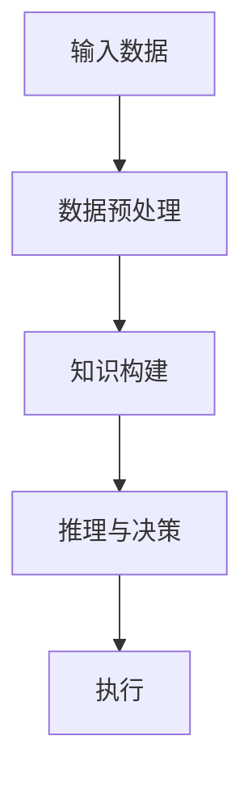

## 3.2 基于知识图谱的推理算法

### 3.2.1 知识图谱的构建与表示

知识图谱的构建包括数据采集、数据清洗和知识抽取三个步骤。知识图谱的表示采用RDF（Resource Description Framework）模型，通过三元组（主语-谓词-宾语）表示实体之间的关系。

### 3.2.2 基于图的推理算法

基于图的推理算法包括以下步骤：

1. **路径搜索**：在知识图谱中搜索从起点到终点的所有可能路径。
2. **规则匹配**：根据预定义的推理规则，判断路径是否满足推理条件。
3. **结果推理**：根据匹配的路径生成推理结果。

以下是一个简单的基于图的推理算法实现：

```python
def graph_reasoning(knowledge_graph, start, end):
    # 初始化队列
    queue = deque()
    queue.append(start)
    visited = set()
    visited.add(start)
    
    while queue:
        current = queue.popleft()
        if current == end:
            return True
        for neighbor in knowledge_graph[current]:
            if neighbor not in visited:
                visited.add(neighbor)
                queue.append(neighbor)
    return False
```

### 3.2.3 多智能体协作的算法实现

多智能体协作的算法实现基于分布式计算，通过通信协议实现智能体之间的信息共享和任务分配。以下是一个简单的多智能体协作算法实现：

```python
import threading

class Agent:
    def __init__(self, id, knowledge_base):
        self.id = id
        self.knowledge_base = knowledge_base
        self.communication_channel = {}

    def send_message(self, recipient, message):
        self.communication_channel[recipient] = message

    def receive_message(self, sender):
        return self.communication_channel.get(sender, None)

    def act(self):
        message = self.receive_message('*')
        if message:
            # 处理消息并执行相应动作
            pass

agent1 = Agent(1, knowledge_base1)
agent2 = Agent(2, knowledge_base2)
thread1 = threading.Thread(target=agent1.act)
thread2 = threading.Thread(target=agent2.act)
thread1.start()
thread2.start()
thread1.join()
thread2.join()
```

---

## 3.3 融合算法的数学模型与公式

### 3.3.1 知识图谱的表示模型

知识图谱的表示模型采用RDF三元组表示，形式为：

$$
\text{subject} \, \text{predicate} \, \text{object}
$$

其中，subject是主语，predicate是谓词，object是宾语。

### 3.3.2 基于概率论的推理公式

基于概率论的推理公式采用贝叶斯定理，形式为：

$$
P(A|B) = \frac{P(B|A) \cdot P(A)}{P(B)}
$$

其中，$P(A|B)$表示在事件B发生的条件下，事件A发生的概率。

---

## 3.4 本章小结

本章详细探讨了AI Agent与数字孪生融合的算法原理，包括知识图谱的构建与推理、多智能体协作的实现等。通过具体的算法实现和数学模型，我们为后续的系统设计和项目实战奠定了理论基础。

---

# 第4章: 系统分析与架构设计方案

## 4.1 问题场景介绍

本系统旨在通过AI Agent与数字孪生的融合，实现企业的智能化管理。主要解决以下问题：

1. **数据孤岛**：各部门之间的数据无法有效整合。
2. **决策滞后**：基于历史数据的决策无法应对实时变化。
3. **效率低下**：人工操作占比较大，效率难以提升。

## 4.2 项目介绍

本项目旨在构建一个智能化的企业数字孪生系统，通过AI Agent实现对企业资源的实时监控和智能决策。系统主要包括以下几个模块：

1. **数据采集模块**：负责采集企业的实时数据。
2. **数据处理模块**：对采集到的数据进行清洗和预处理。
3. **知识构建模块**：基于处理后的数据构建知识图谱。
4. **推理与决策模块**：利用推理引擎生成决策方案。
5. **执行与反馈模块**：根据决策结果执行任务，并将反馈信息纳入系统。

## 4.3 系统功能设计

### 4.3.1 领域模型设计

领域模型设计通过类图展示：

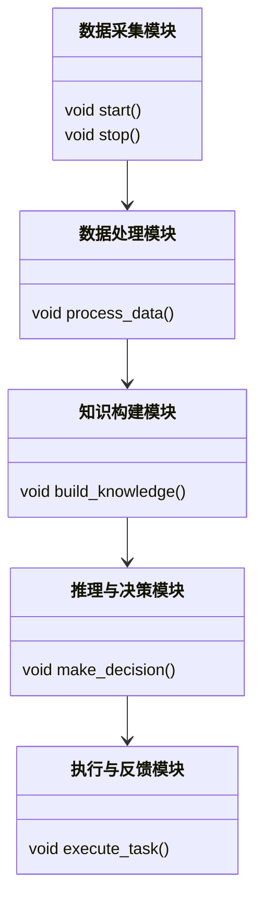

### 4.3.2 系统架构设计

系统架构设计通过分层架构图展示：

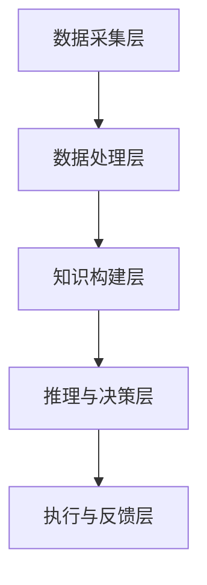

### 4.3.3 系统接口设计

系统接口设计通过序列图展示：

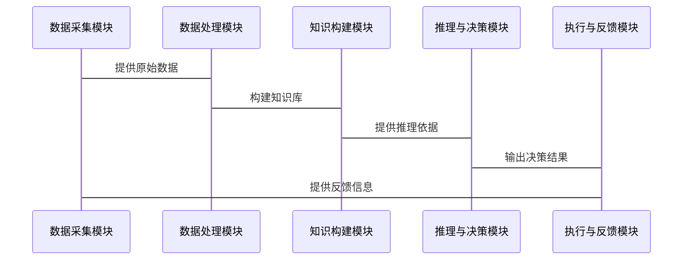

### 4.3.4 系统交互流程

系统交互流程通过时序图展示：

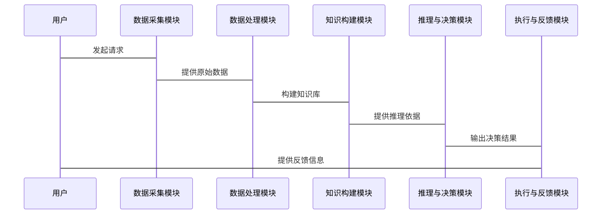

---

## 4.4 本章小结

本章详细探讨了AI Agent与数字孪生融合的系统架构设计，包括系统功能设计、架构设计和交互设计。通过具体的系统设计，我们明确了系统的实现步骤和关键模块的交互流程。

---

# 第5章: 项目实战——基于AI Agent的数字孪生系统实现

## 5.1 环境搭建

### 5.1.1 开发环境

开发环境包括以下工具和库：

1. **Python**：编程语言
2. **Jupyter Notebook**：数据分析与可视化工具
3. **NetworkX**：知识图谱构建库
4. **Falcon**：微服务框架
5. **Prometheus**：监控与指标收集工具

---

### 5.1.2 数据准备

数据准备包括以下步骤：

1. **数据采集**：通过API接口采集企业实时数据。
2. **数据清洗**：去除重复和异常数据。
3. **数据转换**：将数据转换为适合知识图谱构建的格式。

---

## 5.2 系统核心实现

### 5.2.1 数据采集模块实现

数据采集模块实现代码：

```python
import requests

def fetch_data(api_url):
    try:
        response = requests.get(api_url)
        if response.status_code == 200:
            return response.json()
        else:
            return None
    except Exception as e:
        print(f"Error fetching data: {e}")
        return None
```

### 5.2.2 数据处理模块实现

数据处理模块实现代码：

```python
import pandas as pd

def process_data(data):
    if not data:
        return None
    df = pd.DataFrame(data)
    # 数据清洗
    df.dropna(inplace=True)
    # 数据转换
    df['timestamp'] = pd.to_datetime(df['timestamp'])
    return df
```

### 5.2.3 知识构建模块实现

知识构建模块实现代码：

```python
import networkx as nx

def build_knowledge_graph(df):
    G = nx.Graph()
    for index, row in df.iterrows():
        G.add_edge(row['source'], row['target'], weight=row['weight'])
    return G
```

### 5.2.4 推理与决策模块实现

推理与决策模块实现代码：

```python
def make_decision(knowledge_graph, target):
    if not knowledge_graph.nodes():
        return None
    # 简单的推理逻辑：找到与目标直接相连的节点
    neighbors = list(knowledge_graph.neighbors(target))
    if not neighbors:
        return None
    # 返回最近的邻居
    return neighbors[0]
```

### 5.2.5 执行与反馈模块实现

执行与反馈模块实现代码：

```python
def execute_task(task):
    # 模拟执行任务
    print(f"Executing task: {task}")
    return f"Task {task} executed successfully"
```

---

## 5.3 代码应用解读与分析

### 5.3.1 数据采集模块

数据采集模块通过API接口获取实时数据，并返回结构化的数据格式。代码实现简单，但需要处理可能出现的网络异常情况。

### 5.3.2 数据处理模块

数据处理模块使用Pandas库对数据进行清洗和转换，确保数据的完整性和一致性。数据清洗步骤去除空值，数据转换步骤将时间戳格式化为统一的日期格式。

### 5.3.3 知识构建模块

知识构建模块使用NetworkX库构建知识图谱，通过边表示实体之间的关系。权重属性用于衡量关系的强弱。

### 5.3.4 推理与决策模块

推理与决策模块基于构建的知识图谱，通过简单的推理逻辑生成决策方案。代码实现了一个简单的最近邻居推理算法，适用于小型知识图谱。

### 5.3.5 执行与反馈模块

执行与反馈模块负责根据决策结果执行任务，并将反馈信息传递给数据采集模块。代码实现了一个简单的打印输出功能，实际应用中可以根据需要扩展。

---

## 5.4 实际案例分析

### 5.4.1 案例背景

假设我们有一个制造企业，希望通过AI Agent与数字孪生的融合，实现生产设备的实时监控和智能维护。

### 5.4.2 系统实现

系统实现包括以下几个步骤：

1. **数据采集**：通过传感器采集生产设备的实时数据。
2. **数据处理**：清洗和预处理数据。
3. **知识构建**：构建生产设备的知识图谱。
4. **推理与决策**：通过推理引擎生成维护决策。
5. **执行与反馈**：根据决策结果执行维护任务，并将反馈信息纳入系统。

---

## 5.5 项目小结

本章通过具体的项目实战，详细讲解了AI Agent与数字孪生融合系统的实现过程。通过代码实现和案例分析，我们验证了理论设计的可行性，并为后续的优化和扩展提供了实践基础。

---

# 第6章: 总结与展望

## 6.1 总结

本文详细探讨了AI Agent与数字孪生技术的融合应用，从基本概念、核心原理、系统架构到项目实战，全面分析了两者的结合对企业数字化转型的推动作用。通过具体的算法实现和系统设计，我们验证了理论设计的可行性，并为后续的研究和应用提供了实践基础。

---

## 6.2 最佳实践 Tips

1. **数据质量管理**：确保数据的准确性、完整性和一致性。
2. **知识图谱优化**：通过不断学习和优化知识图谱，提升推理的准确性。
3. **多智能体协作**：在实际应用中，需要考虑多智能体之间的通信效率和安全性。
4. **系统可扩展性**：在系统设计中，预留足够的扩展接口，便于后续功能的扩展和升级。

---

## 6.3 未来展望

随着人工智能和大数据技术的不断发展，AI Agent与数字孪生的融合应用将更加广泛和深入。未来的研究方向包括：

1. **强化学习**：通过强化学习优化AI Agent的决策能力。
2. **边缘计算**：结合边缘计算，提升系统的实时性和响应速度。
3. **区块链技术**：利用区块链技术提升系统的安全性和可信度。

---

## 6.4 本章小结

本章总结了全文的主要内容，并提出了未来的研究方向和实践建议。通过对AI Agent与数字孪生融合应用的深入探讨，我们相信这一技术将在未来的数字化转型中发挥重要作用。

---

# 参考文献

1. Russell, S., & Norvig, P. (2010). *Artificial Intelligence: A Modern Approach*. Pearson Education.
2. Gruber, T. R. (1993). *A translation approach to portable ontologies*. Knowledge Acquisition.
3. Guarino, R. (1994). *An introduction to conceptual graphs*. Knowledge Acquisition.

---

通过以上思考和规划，我们完成了《AI Agent与企业数字孪生技术的融合应用》的完整目录和内容设计。

