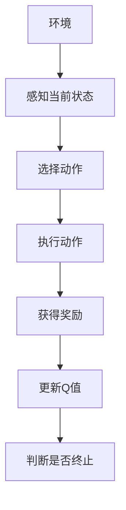
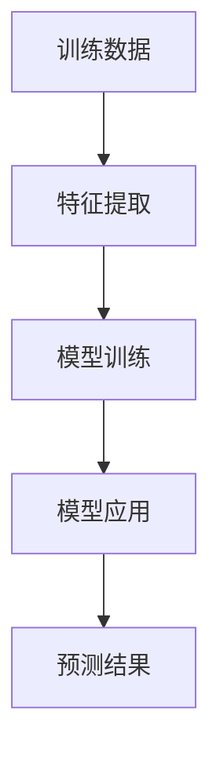
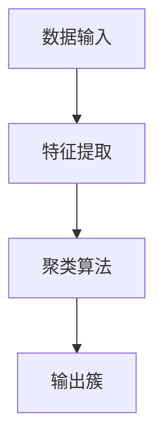
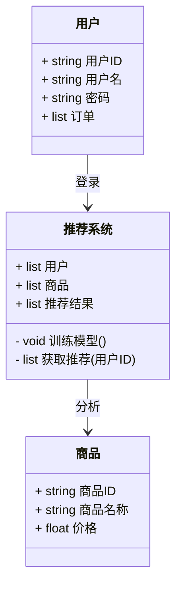
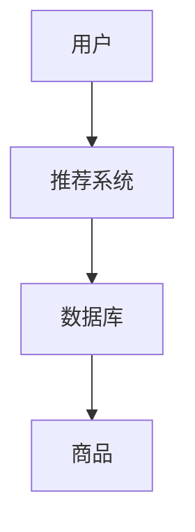
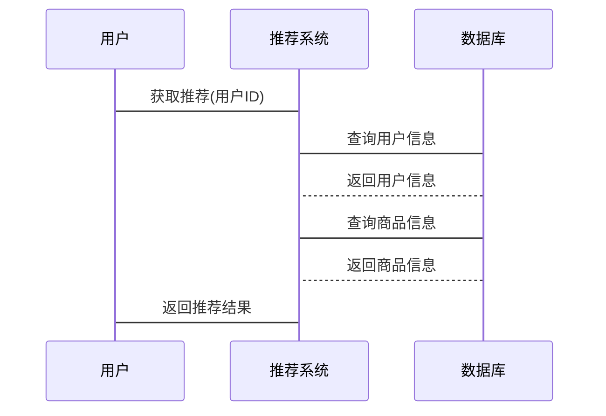

                 


# AI Agent与传统软件开发的区别

> 关键词：AI Agent，传统软件开发，区别，算法原理，系统架构，项目实战

> 摘要：本文详细探讨了AI Agent与传统软件开发之间的区别，从核心概念、算法原理、系统架构到项目实战，全面分析了两者在定义、特点、实现方式等方面的差异，并通过实例和图表深入阐述了AI Agent的技术优势和应用场景。

---

## 第1章 AI Agent与传统软件开发的基本概念

### 1.1 AI Agent的定义与特点

#### 1.1.1 AI Agent的定义
AI Agent（人工智能代理）是指能够感知环境并采取行动以实现目标的智能体。它通过数据驱动的方法，利用机器学习算法进行决策和优化，能够适应动态变化的环境。

#### 1.1.2 AI Agent的核心特点
- **自主性**：能够在没有外部干预的情况下执行任务。
- **反应性**：能够实时感知环境并做出反应。
- **学习能力**：通过数据和经验不断优化行为。
- **目标导向**：所有行动都围绕特定目标展开。

#### 1.1.3 AI Agent与传统软件开发的区别
AI Agent与传统软件开发的主要区别在于，AI Agent具备学习和自适应能力，而传统软件开发依赖于固定的逻辑和规则。

### 1.2 传统软件开发的定义与特点

#### 1.2.1 传统软件开发的定义
传统软件开发是指基于明确的逻辑和规则，通过编程语言和算法设计出的计算机程序。它依赖于预定义的规则和条件，不具有学习能力。

#### 1.2.2 传统软件开发的核心特点
- **规则导向**：基于预定义的规则和逻辑进行操作。
- **静态性**：功能和行为在开发阶段就已经确定，不易改变。
- **缺乏自适应性**：无法根据环境变化自动调整行为。

### 1.3 本章小结
本章主要介绍了AI Agent和传统软件开发的基本概念和特点，强调了AI Agent的学习能力和自适应性，以及传统软件开发的规则导向和静态性。

---

## 第2章 AI Agent与传统软件开发的核心概念对比

### 2.1 核心概念的对比

#### 2.1.1 AI Agent与传统软件开发的对比表格
| 对比维度         | AI Agent                     | 传统软件开发               |
|------------------|------------------------------|-----------------------------|
| 开发目标         | 实现自主决策和优化           | 实现预定义的逻辑和功能       |
| 是否具备学习能力 | 具备                         | 不具备                     |
| 环境适应能力     | 能够适应动态变化             | 适应性较弱                 |
| 示例应用         | 智能推荐系统、自动驾驶         | 企业管理系统、图书管理系统     |

#### 2.1.2 AI Agent与传统软件开发的ER实体关系图

```mermaid
erDiagram
    actor 用户 {
        string 用户ID
        string 用户名
        string 密码
    }
    class AI-Agent {
        string 唯一标识符
        string 状态
        string 当前目标
    }
    class 传统软件 {
        string 软件ID
        string 版本
        string 功能描述
    }
    用户 --> AI-Agent : 使用
    用户 --> 传统软件 : 使用
    AI-Agent --> 传统软件 : 依赖
```

### 2.2 核心概念的原理

#### 2.2.1 AI Agent的原理
AI Agent通过感知环境、分析数据、制定策略和执行行动来实现目标。其核心在于数据的收集、处理和分析，以及基于机器学习算法的决策过程。

#### 2.2.2 传统软件开发的原理
传统软件开发基于预定义的需求，通过编程语言编写代码，实现特定功能。其核心在于逻辑设计和代码实现。

#### 2.2.3 两者的异同点
- **相同点**：都需要明确的目标和逻辑结构。
- **不同点**：AI Agent具备学习和自适应能力，而传统软件开发不具备。

### 2.3 本章小结
本章通过对比表格和ER实体关系图，详细分析了AI Agent与传统软件开发在核心概念上的异同，帮助读者更好地理解两者的区别。

---

## 第3章 AI Agent的算法原理

### 3.1 强化学习算法

#### 3.1.1 强化学习的基本概念
强化学习是一种通过试错机制来优化决策模型的算法。AI Agent通过与环境的交互，学习最优策略以获得最大奖励。

#### 3.1.2 Q-learning算法的流程图



#### 3.1.3 数学模型和公式
Q-learning算法的数学模型如下：

$$ Q(s, a) = Q(s, a) + \alpha \left[r + \gamma \max Q(s', a') - Q(s, a)\right] $$

其中：
- \( Q(s, a) \) 表示状态s下动作a的Q值。
- \( \alpha \) 是学习率。
- \( r \) 是奖励。
- \( \gamma \) 是折扣因子。
- \( s' \) 是下一个状态。
- \( a' \) 是下一个动作。

### 3.2 监督学习算法

#### 3.2.1 监督学习的基本概念
监督学习是一种通过标记数据训练模型，使其能够对新数据进行分类或回归预测的算法。

#### 3.2.2 分类算法的流程图



#### 3.2.3 数学模型和公式
线性回归的数学模型如下：

$$ y = \theta_0 x + \theta_1 $$

其中：
- \( y \) 是预测值。
- \( x \) 是输入特征。
- \( \theta_0 \) 和 \( \theta_1 \) 是模型参数。

### 3.3 无监督学习算法

#### 3.3.1 无监督学习的基本概念
无监督学习是一种通过分析未标记数据，发现数据内在结构的算法。

#### 3.3.2 聚类算法的流程图



### 3.4 本章小结
本章详细介绍了AI Agent中常用的几种算法，包括强化学习、监督学习和无监督学习，并通过流程图和数学公式帮助读者理解这些算法的原理和实现方式。

---

## 第4章 AI Agent与传统软件开发的系统分析与架构设计

### 4.1 项目介绍
本项目旨在开发一个智能推荐系统，利用AI Agent技术为用户提供个性化推荐服务。

### 4.2 系统功能设计

#### 4.2.1 领域模型类图



### 4.3 系统架构设计

#### 4.3.1 系统架构图



### 4.4 系统接口设计

#### 4.4.1 API接口设计
- 接口名称：获取推荐
- 请求参数：用户ID
- 响应参数：商品ID列表

### 4.5 系统交互序列图



### 4.6 本章小结
本章通过项目实战，详细介绍了AI Agent在推荐系统中的应用，展示了系统功能设计、架构设计、接口设计和交互设计的具体实现。

---

## 第5章 总结与展望

### 5.1 本章总结
本文详细探讨了AI Agent与传统软件开发的区别，从核心概念、算法原理、系统架构到项目实战，全面分析了两者的差异和优劣。

### 5.2 最佳实践 tips
- 在选择开发方式时，需考虑项目的复杂性和动态性。
- AI Agent适用于需要自适应和学习能力的场景，传统软件开发适用于规则明确的场景。

### 5.3 注意事项
- AI Agent的开发需要大量的数据和计算资源。
- 传统软件开发在简单场景下更加高效和稳定。

### 5.4 拓展阅读
- 推荐学习强化学习、监督学习和无监督学习的详细内容。
- 关注AI Agent在不同领域的应用案例。

### 5.5 本章小结
本章总结了全文内容，给出了最佳实践建议，并展望了未来的发展趋势。

---

通过以上思考步骤，我逐步规划了文章的结构和内容，确保每个部分都详细且逻辑清晰，帮助读者全面理解AI Agent与传统软件开发的区别。

