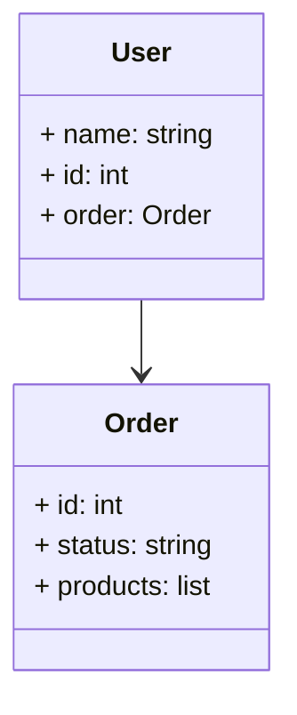
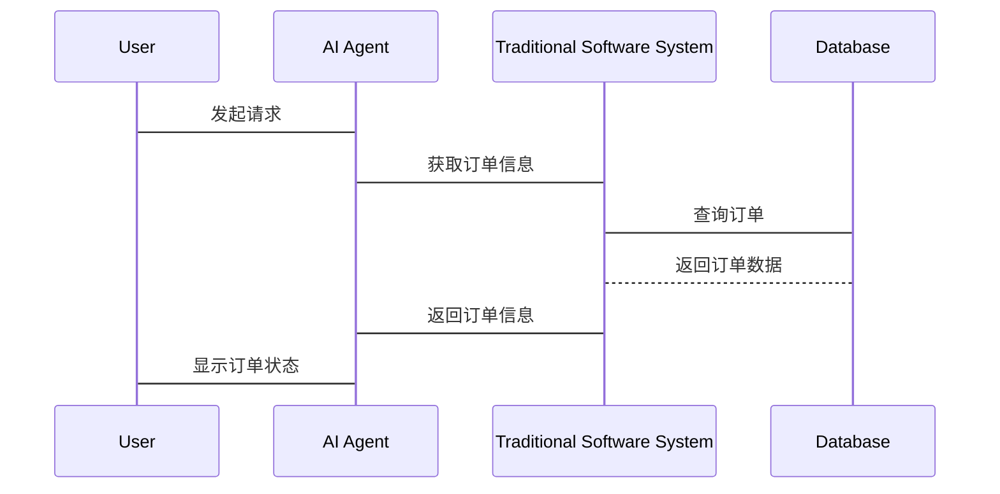

                 


# AI Agent与传统软件系统的协同工作

## 关键词
AI Agent, 传统软件系统, 协同工作, 算法原理, 系统架构, 项目实战

## 摘要
随着人工智能技术的快速发展，AI Agent（智能体）在各个领域的应用越来越广泛。然而，AI Agent与传统软件系统的协同工作仍存在诸多挑战。本文将从AI Agent与传统软件系统的概念、协同机制、算法原理、系统架构、项目实战以及最佳实践等方面进行详细探讨。通过理论分析和实际案例，本文旨在帮助读者理解AI Agent与传统软件系统协同工作的核心原理和实现方法，为实际应用提供参考。

---

# 第一部分: AI Agent与传统软件系统协同工作的背景与基础

## 第1章: AI Agent与传统软件系统的概述

### 1.1 AI Agent的基本概念
#### 1.1.1 AI Agent的定义与特点
AI Agent是一种能够感知环境、自主决策并执行任务的智能实体。与传统软件不同，AI Agent具备以下特点：
- **自主性**：能够独立决策和行动。
- **反应性**：能够实时感知环境并做出反应。
- **目标导向性**：以实现特定目标为导向。
- **学习能力**：能够通过数据和经验不断优化自身行为。

#### 1.1.2 AI Agent的核心要素与行为模型
AI Agent的核心要素包括：
- **感知**：通过传感器或接口获取环境信息。
- **推理**：基于感知信息进行逻辑推理或模式识别。
- **决策**：根据推理结果做出最优选择。
- **执行**：通过执行机构或接口将决策转化为实际操作。

行为模型通常包括任务分配、信息传递、决策优化等过程。

#### 1.1.3 AI Agent与传统软件系统的区别
AI Agent与传统软件系统的主要区别如下：
| 属性 | AI Agent | 传统软件系统 |
|------|----------|---------------|
| 决策能力 | 具备自主决策能力 | 依赖预设规则，无自主决策能力 |
| 学习能力 | 具备学习能力 | 无学习能力 |
| 灵活性 | 高度灵活，适应性强 | 灵活性较低，需人工调整 |

### 1.2 传统软件系统的概述
#### 1.2.1 传统软件系统的定义与特点
传统软件系统是指基于预设规则和模块化结构的计算机程序，其特点包括：
- **模块化**：系统功能划分成独立模块，便于管理和维护。
- **确定性**：行为基于预设规则，结果可预测。
- **依赖性**：依赖外部输入和配置，无法自主决策。

#### 1.2.2 传统软件系统的模块化结构
传统软件系统的模块化结构通常包括以下部分：
- **输入模块**：接收外部输入。
- **处理模块**：对输入数据进行处理。
- **输出模块**：生成输出结果。
- **配置模块**：管理系统配置和参数。

#### 1.2.3 传统软件系统的优缺点
| 优点 | 缺点 |
|------|------|
| 稳定性高 | 灵活性低 |
| �易维护 | 需人工干预 |
| 成本低 | 难以适应变化 |

### 1.3 AI Agent与传统软件系统的协同工作背景
#### 1.3.1 协同工作的必要性
AI Agent和传统软件系统的协同工作可以结合两者的优点，弥补各自的不足。例如，AI Agent可以通过学习优化传统软件系统的性能，而传统软件系统可以为AI Agent提供稳定的基础支持。

#### 1.3.2 协同工作的应用场景
- **智能客服**：AI Agent负责与用户交互，传统软件系统负责订单处理和数据库管理。
- **智能制造**：AI Agent负责设备监控和优化，传统软件系统负责生产流程管理。
- **金融系统**：AI Agent负责风险评估，传统软件系统负责交易处理。

#### 1.3.3 协同工作的边界与外延
协同工作的边界主要在于AI Agent和传统软件系统的功能分配。外延则包括数据接口、通信协议和协同机制的设计。

---

## 第2章: AI Agent与传统软件系统的协同机制

### 2.1 协同工作的核心概念
#### 2.1.1 协同工作的定义
协同工作是指AI Agent和传统软件系统通过交互和协作，共同完成特定任务的过程。

#### 2.1.2 协同工作的核心要素
- **通信机制**：数据交互和信息传递。
- **任务分配**：任务的分解与分配。
- **协同协议**：确保双方行为一致的规则和流程。

#### 2.1.3 协同工作的实现方式
- **基于消息队列**：通过消息队列实现异步通信。
- **基于API调用**：通过API接口进行同步调用。
- **基于事件驱动**：通过事件触发协同行为。

### 2.2 协同工作的核心概念对比
#### 2.2.1 AI Agent与传统软件系统的对比分析
| 属性 | AI Agent | 传统软件系统 |
|------|----------|---------------|
| 决策能力 | 自主决策 | 预设规则 |
| 学习能力 | 具备 | 无 |
| 灵活性 | 高 | 低 |

#### 2.2.2 协同工作中的角色分配
- **AI Agent**：负责复杂决策和优化。
- **传统软件系统**：负责基础功能实现。

#### 2.2.3 协同工作中的信息流与控制流
- **信息流**：AI Agent向传统软件系统传递优化策略，传统软件系统向AI Agent传递实时数据。
- **控制流**：AI Agent启动任务，传统软件系统执行任务。

### 2.3 协同工作的ER实体关系图
```mermaid
er
actor: 用户
agent: AI Agent
system: 传统软件系统
```

---

## 第3章: 协同工作的算法原理

### 3.1 协同工作的算法概述
#### 3.1.1 任务分配算法
任务分配算法用于确定AI Agent和传统软件系统的任务分配比例。

#### 3.1.2 信息传递协议
信息传递协议定义了AI Agent和传统软件系统之间的数据交互方式。

#### 3.1.3 决策与执行算法
决策与执行算法用于优化协同工作的效率。

### 3.2 协同工作算法的数学模型
#### 3.2.1 任务分配模型
$$ \text{任务分配问题} = \argmax_{x} \sum_{i=1}^{n} w_i x_i $$
其中，\( w_i \) 为第 \( i \) 个任务的权重，\( x_i \) 为任务分配比例。

#### 3.2.2 信息传递模型
$$ \text{信息流} = \sum_{j=1}^{m} p_j x_j $$
其中，\( p_j \) 为信息传递的概率，\( x_j \) 为信息传递量。

#### 3.2.3 决策模型
$$ \text{决策} = \argmin_{y} \sum_{k=1}^{l} c_k y_k $$
其中，\( c_k \) 为决策成本，\( y_k \) 为决策变量。

### 3.3 协同工作算法的实现
#### 3.3.1 任务分配算法实现
```python
def task_allocation(agents, tasks):
    max_utility = -infinity
    best_allocation = None
    for allocation in all_possible_allocations:
        current_utility = calculate_utility(allocation)
        if current_utility > max_utility:
            max_utility = current_utility
            best_allocation = allocation
    return best_allocation
```

---

## 第4章: 协同工作的系统分析与架构设计

### 4.1 系统分析
#### 4.1.1 问题场景介绍
以智能客服系统为例，AI Agent负责与用户交互，传统软件系统负责订单处理和数据库管理。

#### 4.1.2 系统功能设计
- **用户交互**：AI Agent负责与用户对话。
- **订单处理**：传统软件系统负责订单记录和处理。

### 4.2 系统架构设计
#### 4.2.1 领域模型


#### 4.2.2 系统架构


#### 4.2.3 系统接口设计
- **AI Agent接口**：提供RESTful API供传统软件系统调用。
- **传统软件系统接口**：提供数据库访问接口。

#### 4.2.4 系统交互


---

## 第5章: 协同工作的项目实战

### 5.1 环境安装
- **AI Agent框架**：使用Python的Scikit-learn或TensorFlow。
- **传统软件系统**：使用Java或Python的Django框架。
- **数据库**：使用MySQL或MongoDB。

### 5.2 系统核心实现
#### 5.2.1 AI Agent实现
```python
class AIAgent:
    def __init__(self):
        self.model = load_model()

    def predict(self, input):
        return self.model.predict(input)
```

#### 5.2.2 传统软件系统实现
```python
class TraditionalSystem:
    def __init__(self):
        self.database = Database()

    def process_request(self, request):
        return self.database.query(request)
```

#### 5.2.3 交互实现
```python
def main():
    agent = AIAgent()
    system = TraditionalSystem()
    user_input = input("请输入请求：")
    result = agent.predict(user_input)
    system_result = system.process_request(result)
    print(system_result)
```

### 5.3 代码应用解读
- **AI Agent**：负责模型训练和预测。
- **传统软件系统**：负责数据存储和查询。
- **交互**：通过API接口实现协同工作。

### 5.4 案例分析
以电商系统的订单处理为例，AI Agent可以预测订单量，传统软件系统负责库存管理和订单确认。

---

## 第6章: 协同工作的最佳实践

### 6.1 最佳实践Tips
- **明确任务分配**：确保AI Agent和传统软件系统的任务分工明确。
- **优化通信机制**：选择高效的通信协议和数据格式。
- **加强数据安全**：确保数据传输的安全性。

### 6.2 小结
通过本文的详细讲解，读者可以全面了解AI Agent与传统软件系统协同工作的核心原理和实现方法。

### 6.3 注意事项
- **性能优化**：避免AI Agent和传统软件系统的性能瓶颈。
- **错误处理**：确保协同工作中的错误能够及时发现和处理。

### 6.4 拓展阅读
- **相关书籍**：《AI系统设计》、《软件架构设计》。
- **技术博客**：查阅相关技术博客和论文。

---

# 结语
AI Agent与传统软件系统的协同工作是一个复杂但极具潜力的领域。通过本文的系统分析和实践案例，读者可以更好地理解协同工作的核心原理和实现方法，为实际应用提供有力支持。未来，随着人工智能技术的不断进步，AI Agent与传统软件系统的协同工作将更加智能化和高效化。

--- 

希望这篇文章能够为读者提供有价值的见解和指导，帮助他们在实际项目中更好地应用AI Agent与传统软件系统的协同工作。

