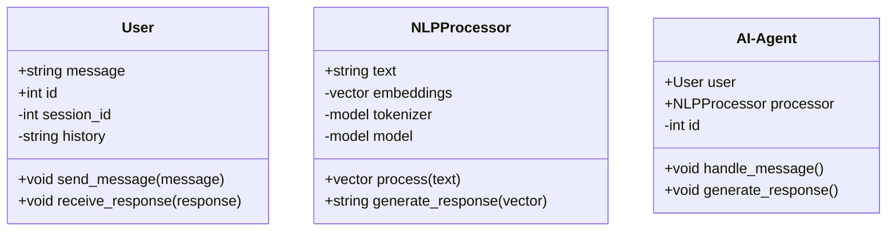
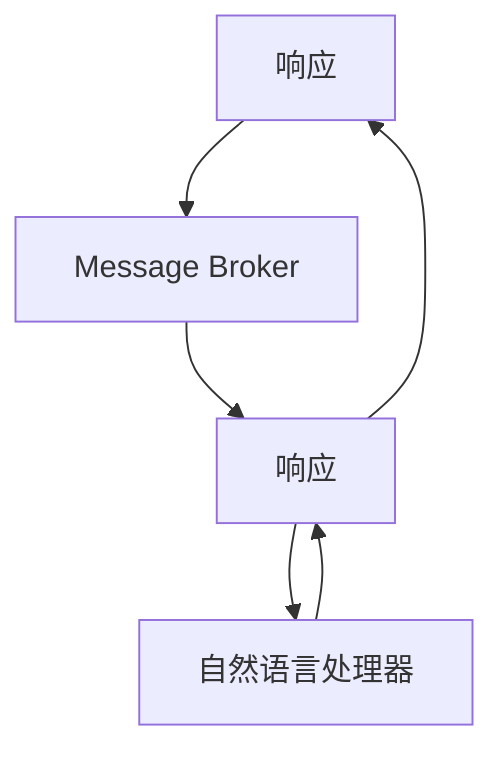
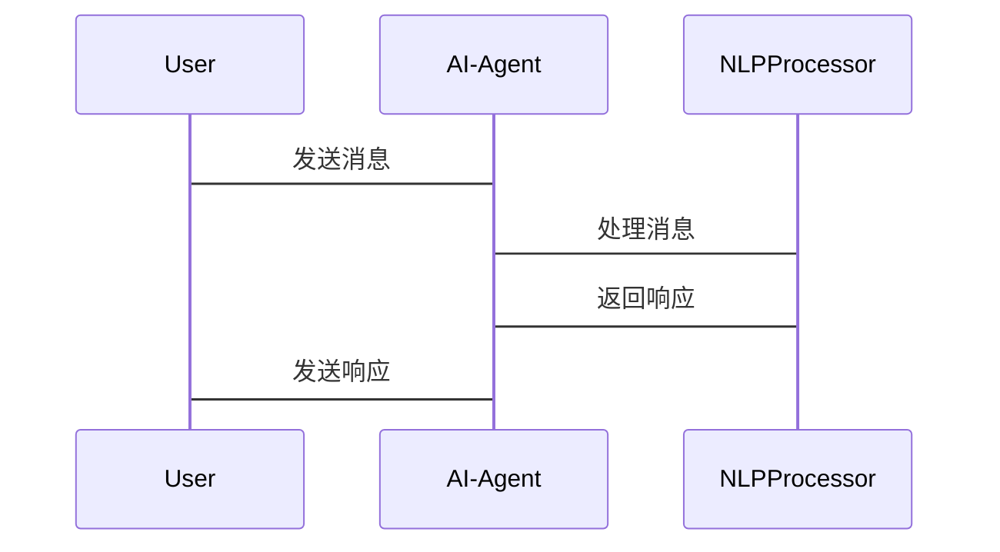

                 


# AI Agent中的自然语言处理应用

## 关键词：AI Agent, 自然语言处理, 智能交互, 对话系统, 机器学习

## 摘要：本文深入探讨了自然语言处理在AI Agent中的应用，从基础概念到算法原理，再到系统设计和实战案例，全面解析如何利用NLP技术提升AI Agent的智能交互能力。

---

# 第1章: AI Agent与自然语言处理基础

## 1.1 AI Agent的基本概念

### 1.1.1 AI Agent的定义与分类
- **定义**: AI Agent是一种能够感知环境并采取行动以实现目标的智能实体。
- **分类**: 可分为简单反射型、基于模型的反应型、目标驱动型和效用驱动型。

### 1.1.2 自然语言处理的定义与作用
- **定义**: NLP是研究计算机如何处理和理解人类语言的学科。
- **作用**: 使AI Agent能够理解并生成人类语言，实现人机交互。

### 1.1.3 AI Agent与自然语言处理的结合
- **结合方式**: NLP为AI Agent提供语言理解与生成能力，AI Agent为NLP提供应用场景。

## 1.2 AI Agent中的自然语言处理应用背景

### 1.2.1 自然语言处理技术的发展历程
- **早期阶段**: 基于规则的NLP系统。
- **发展阶段**: 统计学习方法的应用。
- **当前阶段**: 深度学习驱动的NLP技术。

### 1.2.2 AI Agent在智能交互中的需求
- **需求分析**: 用户希望AI Agent能够理解意图、上下文和情感。

### 1.2.3 当前技术背景与挑战
- **技术背景**: 大模型和微调技术的应用。
- **挑战**: 数据稀疏性、计算资源需求高。

## 1.3 自然语言处理在AI Agent中的核心价值

### 1.3.1 提升用户体验的关键作用
- **准确性**: 正确理解用户意图。
- **实时性**: 快速响应用户需求。

### 1.3.2 实现智能交互的技术支撑
- **意图识别**: 理解用户需求。
- **对话生成**: 自然语言的生成。

### 1.3.3 企业级应用的潜力与前景
- **潜力**: 企业级服务、垂直领域应用。
- **前景**: 普及化、个性化服务。

## 1.4 本章小结

---

# 第2章: 自然语言处理的核心概念

## 2.1 自然语言处理的主要任务

### 2.1.1 语言理解任务

#### 分类：
- **文本分类**: 情感分析、垃圾邮件检测。
- **信息抽取**: 命名实体识别、关系抽取。
- **语义理解**: 语义角色标注、问答系统。

### 2.1.2 语言生成任务

#### 分类：
- **文本生成**: 文本摘要、机器翻译。
- **对话生成**: 基于规则、统计和深度学习的方法。

### 2.1.3 语言应用任务

#### 分类：
- **文本纠错**: 语法纠错、拼写检查。
- **文本摘要**: 信息提取、摘要生成。
- **问答系统**: 基于规则、检索和生成式问答。

## 2.2 AI Agent中的NLP任务分类

### 2.2.1 信息抽取

#### 任务：
- **命名实体识别**: 从文本中提取人名、地名等实体。
- **关系抽取**: 发现文本中的关系。
- **事件抽取**: 提取事件信息。

### 2.2.2 意图识别

#### 任务：
- **用户意图分析**: 识别用户的真实需求。
- **情感分析**: 判断用户情感倾向。

### 2.2.3 对话生成

#### 任务：
- **对话系统设计**: 构建对话模型。
- **对话策略优化**: 提高对话流畅性。

## 2.3 自然语言处理的关键技术

### 2.3.1 词嵌入技术

#### 常见模型：
- **Word2Vec**: 通过上下文预测词向量。
- **GLOVE**: 基于全局词向量的潜在语义表示。
- **FastText**: 快速训练词嵌入模型。

### 2.3.2 语法分析

#### 技术：
- **句法分析**: 分析句子结构。
- **语义分析**: 理解句子含义。

### 2.3.3 上下文理解

#### 技术：
- **上下文表示**: 利用上下文信息生成向量表示。
- **注意力机制**: 聚焦重要信息。

## 2.4 本章小结

---

# 第3章: 自然语言处理的核心算法原理

## 3.1 词嵌入算法

### 3.1.1 Word2Vec模型

#### 结构：
- **CBOW模型**: 根据上下文预测中间词。
- **Skip-Gram模型**: 根据中间词预测上下文。

#### 代码实现：
```python
class Word2Vec:
    def __init__(self, vocabulary):
        self.vocabulary = vocabulary
        self.embedding_dim = 100
        self.embeddings = {word: np.random.rand(100) for word in vocabulary}
```

### 3.1.2 GLOVE模型

#### 优缺点：
- **优点**: 能够捕捉长距离依赖关系。
- **缺点**: 计算资源消耗较大。

### 3.1.3 FastText模型

#### 优点：
- 训练速度快。
- 对稀有词处理好。

## 3.2 语言模型

### 3.2.1 RNN与LSTM

#### RNN结构：
- **简单RNN**: 用于序列建模。
- **LSTM**: 解决长序列训练中的梯度消失问题。

#### 代码实现：
```python
class LSTMCell:
    def __init__(self, input_size, hidden_size):
        self.input_size = input_size
        self.hidden_size = hidden_size
        self.W = np.random.randn(input_size, hidden_size)
        self.U = np.random.randn(hidden_size, hidden_size)
```

### 3.2.2 Transformer架构

#### 结构：
- **编码器**: 多头自注意力机制和前馈网络。
- **解码器**: 自注意力和交叉注意力机制。

### 3.2.3 BERT模型

#### 优缺点：
- **优点**: 预训练效果好。
- **缺点**: 计算资源需求高。

## 3.3 对话生成算法

### 3.3.1 基于规则的对话生成

#### 优缺点：
- **优点**: 实现简单。
- **缺点**: 对复杂场景处理能力有限。

### 3.3.2 基于统计的对话生成

#### 技术：
- **统计语言模型**: 基于概率的生成方式。

### 3.3.3 基于深度学习的对话生成

#### 优缺点：
- **优点**: 处理能力强。
- **缺点**: 需要大量训练数据。

## 3.4 本章小结

---

# 第4章: AI Agent中的自然语言

## 4.1 项目背景

### 问题描述：
- **目标**: 构建一个基于NLP的AI Agent。

### 项目介绍：
- **核心功能**: 用户交互、意图识别、对话生成。

## 4.2 系统功能设计

### 4.2.1 领域模型设计

#### 类图：


### 4.2.2 系统架构设计

#### 体系结构：


### 4.2.3 系统接口设计

#### 接口描述：
- **输入接口**: 接收用户消息。
- **输出接口**: 发送AI Agent的响应。

### 4.2.4 系统交互设计

#### 流程图：


## 4.3 本章小结

---

# 第5章: 项目实战

## 5.1 项目背景

### 问题场景：
- **目标**: 实现一个简单的对话系统。

## 5.2 系统核心实现

### 5.2.1 环境安装

#### 命令：
```bash
pip install transformers torch
```

### 5.2.2 核心代码实现

#### 模型加载：
```python
from transformers import AutoTokenizer, AutoModelForMaskedLM

tokenizer = AutoTokenizer.from_pretrained('bert-base-uncased')
model = AutoModelForMaskedLM.from_pretrained('bert-base-uncased')
```

#### 对话生成：
```python
def generate_response(user_input):
    inputs = tokenizer(user_input, return_tensors='np')
    outputs = model.generate(inputs.input_ids, max_length=50)
    return tokenizer.decode(outputs[0], skip_special_tokens=True)
```

## 5.3 代码应用解读与分析

### 5.3.1 代码解读：
- **模型加载**: 使用预训练模型。
- **对话生成**: 通过模型生成响应。

## 5.4 实际案例分析

### 案例分析：
- **输入**: "What is AI Agent?"
- **输出**: "AI Agent是一种能够感知环境并采取行动以实现目标的智能实体。"

## 5.5 项目小结

---

# 第6章: 最佳实践和小结

## 6.1 本章小结

### 总结：
- 自然语言处理是AI Agent实现智能交互的核心技术。
- 通过NLP技术，AI Agent能够理解并生成人类语言，实现人机交互。

## 6.2 注意事项

### 技术方面：
- 数据质量：确保数据多样性和代表性。
- 模型调优：优化模型参数和超参数。
- 安全隐私：保护用户数据隐私。

### 实际应用：
- 需要结合具体场景进行模型微调。
- 需要注意模型的可解释性。

## 6.3 拓展阅读

### 推荐资源：
- 书籍：《自然语言处理入门》
- 论文：《BERT: Pre-training of Deep Bidirectional Transformers for NLP》
- 在线资源：Hugging Face的Transformers库。

## 6.4 本章小结

---

# 第7章: 附录

## 7.1 工具与资源

### 常用工具：
- **NLP库**: NLTK、spaCy、Hugging Face Transformers。
- **框架**: TensorFlow、PyTorch。

### 数据集：
- **公开数据集**: CoNLL、SQuAD、BERT dataset。

## 7.2 参考文献

### 推荐书籍：
- 《Deep Learning for NLP》。
- 《自然语言处理的原理与实践》。

### 论文推荐：
- Transformer论文。
- BERT论文。

## 7.3 本章小结

---

# 结语

通过本文的详细讲解，读者可以全面理解自然语言处理在AI Agent中的应用，并能够结合实际项目进行实践。未来，随着技术的进步，NLP在AI Agent中的应用将更加广泛和深入。

