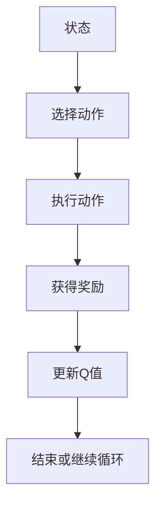
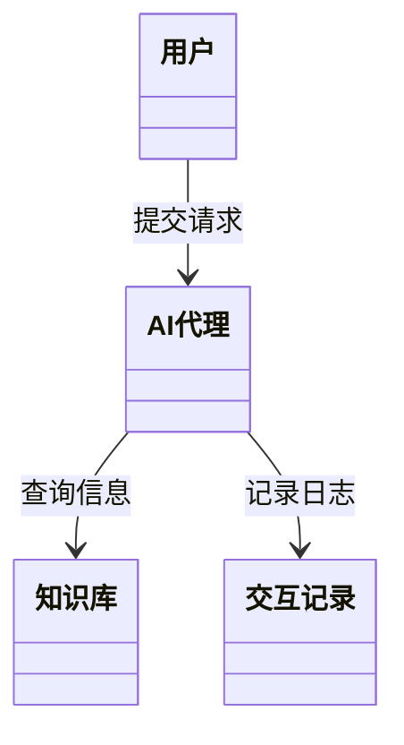
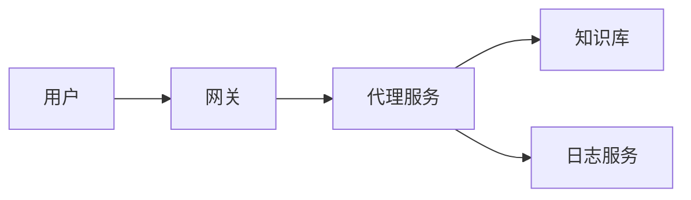
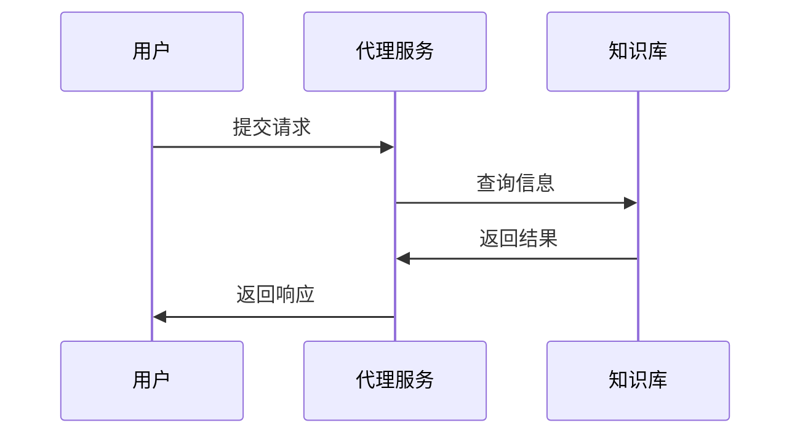

                 


# AI Agent商业化：从原型到产品的转化之路

## 关键词：AI Agent, 商业化, 人工智能, 系统架构, 技术实现

## 摘要：  
本文详细探讨了AI Agent从原型到商业产品的转化过程，涵盖了核心概念、算法原理、系统架构设计、项目实战等关键环节。通过具体案例分析和理论结合，揭示了AI Agent商业化中的技术挑战与解决方案，为开发者和企业提供了实用的指导和建议。

---

## 第1章: AI Agent概述

### 1.1 AI Agent的基本概念

#### 1.1.1 什么是AI Agent
AI Agent（人工智能代理）是一种能够感知环境、自主决策并执行任务的智能实体。它可以是一个软件程序、机器人或其他智能系统，通过与用户或环境交互，完成特定目标。

#### 1.1.2 AI Agent的核心特征
- **自主性**：能够在没有外部干预的情况下运行。
- **反应性**：能够实时感知环境并做出响应。
- **目标导向**：所有行为都围绕实现特定目标展开。
- **学习能力**：通过数据和经验不断优化性能。

#### 1.1.3 AI Agent与传统软件的区别
| 特性                | AI Agent                            | 传统软件                          |
|---------------------|------------------------------------|-----------------------------------|
| **自主性**          | 高                                   | 低                                 |
| **学习能力**        | 高                                   | 无                                 |
| **决策能力**        | 强                                   | 依赖规则                           |
| **适应性**          | 高                                   | 低                                 |

### 1.2 AI Agent的技术发展史

#### 1.2.1 AI Agent的起源
AI Agent的概念起源于20世纪60年代的专家系统研究，早期主要用于解决特定领域的简单问题。

#### 1.2.2 从规则驱动到学习驱动的演进
- **规则驱动阶段**：基于预定义的规则进行决策，适用于简单任务。
- **机器学习阶段**：引入机器学习算法，提升复杂问题的解决能力。
- **强化学习阶段**：通过奖励机制优化决策策略，实现自主优化。

#### 1.2.3 当前AI Agent的技术现状
现代AI Agent结合了多种技术，如自然语言处理（NLP）、计算机视觉和强化学习，能够处理复杂任务，如自动驾驶和智能客服。

### 1.3 AI Agent的商业化现状

#### 1.3.1 商业化AI Agent的典型应用领域
- **智能客服**：通过NLP技术提供24/7的客户服务。
- **推荐系统**：根据用户行为推荐个性化内容。
- **自动驾驶**：利用计算机视觉和强化学习实现无人驾驶。

#### 1.3.2 当前市场的主要参与者
- **科技巨头**：如谷歌、亚马逊和微软，提供AI Agent技术。
- **创业公司**：专注于特定领域的AI Agent开发。
- **行业应用者**：如银行和医疗行业，将AI Agent整合到业务流程中。

#### 1.3.3 商业化面临的挑战与机遇
- **挑战**：技术复杂性、数据隐私和伦理问题。
- **机遇**：技术创新和市场需求推动商业化进程。

### 1.4 本章小结
本章介绍了AI Agent的基本概念、技术发展史和商业化现状，为后续内容打下基础。

---

## 第2章: AI Agent商业化的核心概念与联系

### 2.1 核心概念原理

#### 2.1.1 AI Agent的定义与分类
- **定义**：AI Agent是具有感知和行动能力的智能系统。
- **分类**：
  - **简单反射型**：基于预定义规则响应。
  - **基于模型的反射型**：利用环境模型进行决策。
  - **目标驱动型**：围绕目标自主行动。
  - **实用驱动型**：优化目标达成的效用。

#### 2.1.2 AI Agent的主要功能模块
- **感知模块**：接收输入并解析信息。
- **推理模块**：分析信息并生成决策。
- **行动模块**：执行决策并输出结果。
- **学习模块**：优化模型以提升性能。

#### 2.1.3 AI Agent与人类用户的交互机制
- **同步交互**：实时对话。
- **异步交互**：通过邮件或消息进行。
- **非交互式**：通过预设条件触发。

### 2.2 核心概念属性特征对比表

| 属性               | AI Agent                            | 传统软件                          |
|--------------------|------------------------------------|-----------------------------------|
| **自主性**         | 高                                   | 低                                 |
| **学习能力**       | 高                                   | 无                                 |
| **决策能力**       | 强                                   | 依赖规则                           |
| **适应性**         | 高                                   | 低                                 |

### 2.3 ER实体关系图

```mermaid
er
    actor: 用户
    agent: AI代理
    action: 用户请求
    knowledge: 知识库
    interaction: 交互记录
    relation: 用户-请求
    relation: 代理-响应
    relation: 代理-知识库
    relation: 用户-交互记录
```

### 2.4 本章小结
本章详细介绍了AI Agent的核心概念、功能模块和交互机制，并通过图表展示了其结构。

---

## 第3章: AI Agent的核心算法原理

### 3.1 决策树算法

#### 3.1.1 决策树的基本原理
决策树是一种基于树状结构的分类模型，通过属性划分数据，实现预测或分类。

#### 3.1.2 ID3算法的实现流程
1. 计算信息增益。
2. 选择信息增益最大的属性作为根节点。
3. 递归构建子树，直到叶子节点。

#### 3.1.3 决策树的优缺点分析
- **优点**：易于理解和实现。
- **缺点**：易受噪声数据影响，过拟合风险。

### 3.2 强化学习算法

#### 3.2.1 强化学习的基本概念
强化学习是一种通过试错机制优化决策策略的方法，通过奖励机制指导模型行为。

#### 3.2.2 Q-Learning算法
1. 初始化Q值表。
2. 选择动作并执行。
3. 计算奖励并更新Q值。

#### 3.2.3 Q-Learning算法流程图



#### 3.2.4 强化学习的应用场景
- **游戏AI**：如AlphaGo。
- **机器人控制**：实现自主导航。

### 3.3 本章小结
本章介绍了决策树和强化学习的核心算法及其应用，展示了它们在AI Agent中的重要性。

---

## 第4章: AI Agent系统分析与架构设计

### 4.1 问题场景介绍

#### 4.1.1 项目背景
假设我们正在开发一个智能客服AI Agent，用于处理用户咨询。

### 4.1.2 项目介绍
目标：提供高效、个性化的客户服务。

### 4.2 系统功能设计

#### 4.2.1 领域模型类图



### 4.3 系统架构设计

#### 4.3.1 系统架构图



### 4.4 系统接口设计

#### 4.4.1 接口描述
- **用户接口**：HTTP API。
- **知识库接口**：RESTful API。

### 4.5 系统交互流程图



### 4.6 本章小结
本章通过实际案例，展示了AI Agent的系统架构设计和交互流程。

---

## 第5章: AI Agent项目实战

### 5.1 环境安装

#### 5.1.1 安装Python和依赖
```bash
pip install python3 python-ml
```

### 5.1.2 安装机器学习库
```bash
pip install scikit-learn
```

### 5.2 系统核心实现

#### 5.2.1 决策树实现代码
```python
from sklearn.tree import DecisionTreeClassifier
import pandas as pd

# 数据预处理
data = pd.read_csv('data.csv')
X = data.drop('target', axis=1)
y = data['target']

# 训练模型
model = DecisionTreeClassifier()
model.fit(X, y)
```

#### 5.2.2 强化学习实现代码
```python
import numpy as np

# 初始化Q值表
Q = np.zeros((状态空间, 动作空间))

# Q-Learning算法
def q_learning(env):
    for episode in range(1000):
        state = env.reset()
        while not done:
            action = np.argmax(Q[state, :])
            new_state, reward, done = env.step(action)
            Q[state, action] += reward

# 训练模型
q_learning(env)
```

### 5.3 实际案例分析

#### 5.3.1 知识库构建
- **数据收集**：从客服记录中提取常见问题。
- **数据预处理**：去除噪声数据。
- **模型训练**：使用训练好的决策树模型进行分类。

#### 5.3.2 系统实现
- **用户交互**：通过HTTP API接收请求。
- **知识库查询**：检索相关信息并返回响应。
- **日志记录**：记录每次交互日志。

### 5.4 项目小结
本章通过具体案例，展示了如何将AI Agent从原型转化为实际产品，包括环境安装、核心实现和案例分析。

---

## 第6章: 最佳实践与注意事项

### 6.1 最佳实践

#### 6.1.1 模型优化
- **数据增强**：增加训练数据的多样性。
- **超参数调整**：通过网格搜索优化模型性能。

#### 6.1.2 系统安全
- **数据加密**：保护用户隐私。
- **访问控制**：限制敏感数据的访问权限。

#### 6.1.3 可扩展性
- **模块化设计**：便于功能扩展。
- **负载均衡**：提高系统的可用性。

### 6.2 注意事项

#### 6.2.1 数据隐私
- 遵守相关法律法规，保护用户数据。

#### 6.2.2 系统性能
- 优化算法和架构设计，提高处理速度。

#### 6.2.3 用户体验
- 提供友好直观的交互界面，降低使用门槛。

### 6.3 未来发展方向

#### 6.3.1 多模态交互
- 结合视觉和语音技术，提升用户体验。

#### 6.3.2 自适应学习
- 引入在线学习算法，实现持续优化。

#### 6.3.3 跨领域应用
- 推动AI Agent在更多领域的应用，如教育和医疗。

### 6.4 拓展阅读
- 推荐书籍：《机器学习实战》、《深度学习》。
- 推荐博客：[AI Agent技术博客](https://example.com)

### 6.5 本章小结
本章总结了AI Agent商业化中的最佳实践和注意事项，并展望了未来的发展方向。

---

## 第7章: 总结与展望

### 7.1 总结
本文详细探讨了AI Agent从原型到产品的转化过程，涵盖核心概念、算法原理、系统架构和项目实战等多个方面，为开发者和企业提供了实用的指导。

### 7.2 展望
随着技术的进步和市场需求的增长，AI Agent将在更多领域得到广泛应用，推动智能化转型。

---

## 关键词总结：
AI Agent, 商业化, 人工智能, 系统架构, 技术实现

---

通过本文的详细讲解，读者可以全面理解AI Agent的商业化过程，并掌握从原型到产品的关键步骤和技术要点。希望本文对您在AI Agent的开发和商业化过程中有所帮助！

