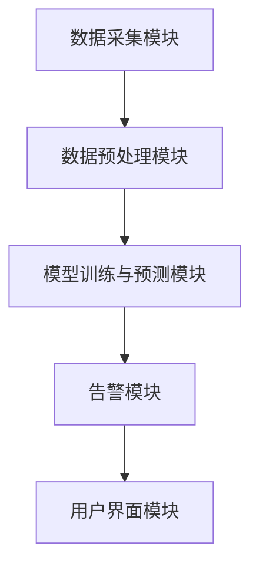
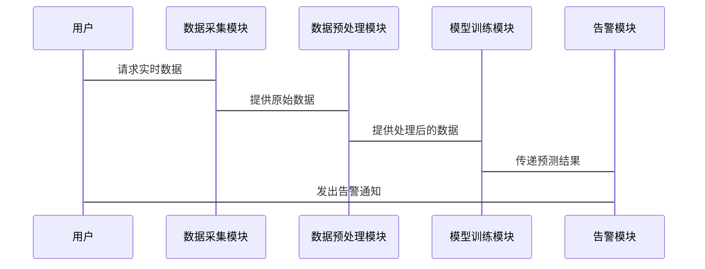

                 


### 第4章 故障预测算法的设计与实现

#### 4.3 系统架构与实现

##### 4.3.1 系统设计概述
系统架构设计需要考虑可扩展性、可靠性和高效性。以下是系统的总体架构：

##### 4.3.2 模块划分与功能
系统分为数据采集模块、数据预处理模块、模型训练与预测模块、告警模块和用户界面模块。

##### 4.3.3 系统架构图


##### 4.3.4 系统接口设计
- 内部接口：
  - 数据采集模块与数据预处理模块之间通过文件或数据库接口通信。
  - 数据预处理模块与模型训练模块通过数据接口传递特征向量。
- 外部接口：
  - 用户通过HTTP接口与系统交互，获取实时监控数据和预测结果。

##### 4.3.5 系统交互流程


### 项目实战

#### 4.4 项目实战

##### 4.4.1 环境搭建
安装必要的库和工具：
```bash
pip install numpy pandas scikit-learn tensorflow matplotlib
```

##### 4.4.2 核心代码实现

###### 数据采集模块
```python
import pandas as pd
import requests

def fetch_data(url):
    response = requests.get(url)
    data = response.json()
    return pd.DataFrame(data)
```

###### 数据预处理模块
```python
from sklearn.preprocessing import StandardScaler

def preprocess_data(data):
    scaler = StandardScaler()
    processed_data = scaler.fit_transform(data)
    return processed_data
```

###### 模型训练模块
```python
from sklearn.ensemble import RandomForestClassifier
from sklearn.metrics import accuracy_score

def train_model(X_train, y_train):
    model = RandomForestClassifier()
    model.fit(X_train, y_train)
    return model

def evaluate_model(model, X_test, y_test):
    y_pred = model.predict(X_test)
    print(f"Accuracy: {accuracy_score(y_test, y_pred)}")
```

###### 告警模块
```python
def trigger_alarm(threshold, current_value):
    if current_value > threshold:
        print("告警：系统可能出现故障")
    else:
        print("系统运行正常")
```

##### 4.4.3 案例分析
假设我们有一个服务器集群的监控数据，包括CPU使用率、内存使用率、磁盘I/O等指标。使用上述代码进行数据采集、预处理、模型训练和预测，最后触发告警。

##### 4.4.4 项目总结
通过该项目，我们展示了如何利用AI Agent进行故障预测，从数据采集到模型训练，再到告警触发，整个流程实现了智能化的运维监控。

### 最佳实践 Tips

- 在数据采集阶段，确保数据的实时性和准确性。
- 数据预处理阶段，注意处理缺失值和异常值，避免影响模型训练。
- 模型选择时，根据具体问题选择合适的算法，如时间序列预测可选用LSTM。
- 定期更新模型，以应对系统环境的变化，保持预测的准确性。

### 小结
通过本章的学习和实践，我们了解了AI Agent在IT运维中的应用，特别是在故障预测方面的实现。从算法设计到系统架构，再到项目实战，全面掌握了AI Agent的核心技术及其在实际运维中的应用。

### 注意事项
- 确保系统架构的可扩展性，以便未来增加更多功能模块。
- 数据安全和隐私保护也是系统设计中不可忽视的部分，特别是在处理敏感数据时。
- 定期监控系统性能，及时优化数据处理流程和模型训练效率。

### 拓展阅读
- 《机器学习实战》
- 《深度学习入门：基于Python的理论与实现》
- 《系统设计精要：构建可扩展的分布式系统》

通过以上内容，我们完成了从理论到实践的完整讲解，希望读者能够通过本书掌握AI Agent在IT运维中的应用，并在实际工作中发挥其优势。

