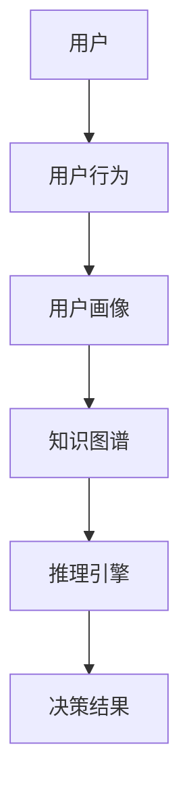
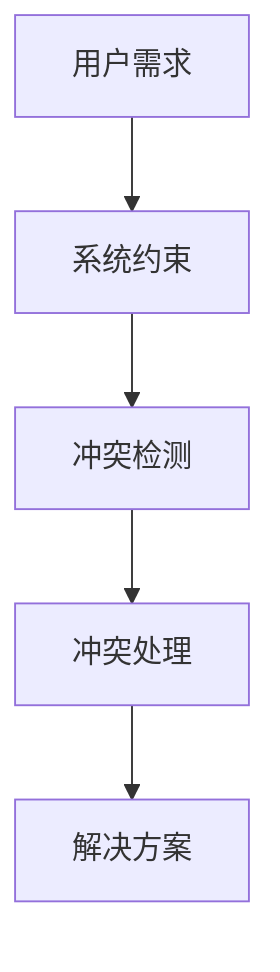
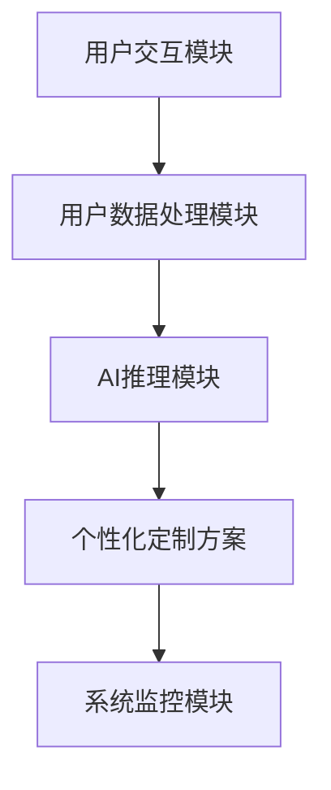

                 


```markdown
# AI Agent在产品个性化定制中的创新应用

> 关键词：AI Agent, 产品个性化定制, 智能推荐系统, 动态配置, 用户画像

> 摘要：本文深入探讨了AI Agent在产品个性化定制中的创新应用，结合实际案例分析了AI Agent的核心原理、系统架构设计及实现方案，详细讲解了如何利用AI技术实现产品的智能化定制，为产品开发者和研究人员提供了理论与实践相结合的参考。

---

## 第一部分: AI Agent与产品个性化定制的背景

### 第1章: AI Agent与产品个性化定制概述

#### 1.1 AI Agent的基本概念
- **1.1.1 AI Agent的定义**
  - AI Agent（人工智能代理）是能够感知环境、自主决策并执行任务的智能体。
- **1.1.2 AI Agent的核心特征**
  - 智能性：能够理解上下文并做出决策。
  - 自主性：无需外部干预即可执行任务。
  - 反应性：实时感知环境变化并调整行为。
- **1.1.3 AI Agent与传统软件的区别**
  - 传统软件依赖于预定义规则，而AI Agent具备学习和自适应能力。

#### 1.2 产品个性化定制的背景与需求
- **1.2.1 个性化定制的定义**
  - 根据用户需求和偏好，提供定制化的产品或服务。
- **1.2.2 个性化定制的市场需求**
  - 消费者对个性化体验的需求日益增长。
  - 企业通过个性化定制提升客户满意度和忠诚度。
- **1.2.3 个性化定制的技术挑战**
  - 如何高效采集和分析用户数据。
  - 如何实时响应用户的个性化需求。

#### 1.3 AI Agent在产品个性化定制中的作用
- **1.3.1 AI Agent如何实现个性化定制**
  - 通过用户数据分析和行为预测，生成个性化的产品配置。
- **1.3.2 AI Agent的优势与价值**
  - 提高产品定制效率。
  - 降低人工干预成本。
  - 提升用户体验和满意度。
- **1.3.3 AI Agent的应用场景**
  - 电商中的个性化推荐。
  - 软件系统中的动态配置。

#### 1.4 本章小结
- 介绍了AI Agent的基本概念及其在产品个性化定制中的重要性。
- 强调了AI Agent在提升个性化定制效率和用户体验方面的潜力。

---

## 第二部分: AI Agent的核心原理与技术

### 第2章: AI Agent的核心原理

#### 2.1 AI Agent的感知机制
- **2.1.1 数据采集与处理**
  - 数据来源：用户行为数据、反馈数据、环境数据。
  - 数据处理：数据清洗、特征提取、数据建模。
- **2.1.2 用户行为分析**
  - 行为分析方法：基于规则的分析、统计分析、机器学习分析。
  - 用户行为建模：用户画像、行为轨迹分析。
- **2.1.3 上下文理解**
  - 上下文信息：用户当前的操作环境、时间、地点。
  - 上下文建模：基于知识图谱的上下文表示。

#### 2.2 AI Agent的决策机制
- **2.2.1 知识表示与推理**
  - 知识表示方法：符号逻辑表示、向量表示。
  - 知识推理：基于规则的推理、基于概率的推理。
- **2.2.2 决策算法**
  - 常见决策算法：基于规则的决策树、强化学习、遗传算法。
  - 决策模型：Q-learning、DQN（Deep Q-Network）。
- **2.2.3 多目标优化**
  - 多目标优化问题：如何在多个目标之间找到平衡。
  - 优化方法：加权和法、帕累托最优法。

#### 2.3 AI Agent的执行机制
- **2.3.1 动作规划**
  - 动作规划算法：基于A*算法、RRT（Rapidly-exploring Random Tree）。
  - 动作序列生成：根据决策结果生成执行步骤。
- **2.3.2 执行监控**
  - 执行监控方法：实时跟踪执行状态、检测异常。
  - 监控工具：基于日志分析的监控系统。
- **2.3.3 反馈机制**
  - 反馈收集：用户反馈、系统反馈。
  - 反馈处理：调整决策策略、优化知识库。

#### 2.4 知识图谱构建与推理（附图）


#### 2.5 本章小结
- 详细讲解了AI Agent的感知、决策和执行机制。
- 通过知识图谱和推理引擎，展示了如何实现智能化的决策过程。

---

## 第三部分: 产品个性化定制的需求分析

### 第3章: 个性化定制的需求建模

#### 3.1 用户画像的构建
- **3.1.1 用户画像的定义**
  - 用户画像：基于用户行为数据构建的用户特征模型。
- **3.1.2 用户画像的构建方法**
  - 数据采集：用户基本信息、行为数据、偏好数据。
  - 数据分析：特征提取、聚类分析、分类模型。
- **3.1.3 用户画像的更新与维护**
  - 实时更新：基于最新的用户行为数据。
  - 定期优化：根据反馈调整画像模型。

#### 3.2 个性化需求的动态变化
- **3.2.1 需求变化的驱动因素**
  - 用户自身变化：兴趣转移、需求层次变化。
  - 外部环境变化：市场变化、产品更新。
- **3.2.2 需求变化的预测与响应**
  - 预测方法：时间序列分析、机器学习模型。
  - 响应策略：动态调整产品配置、实时推荐。
- **3.2.3 动态需求的处理策略**
  - 弹性设计：系统具备动态调整的能力。
  - 分阶段实现：逐步满足用户需求。

#### 3.3 个性化定制的约束条件
- **3.3.1 约束条件的分类**
  - 用户约束：用户偏好、预算限制。
  - 系统约束：系统资源限制、执行时间限制。
  - 业务约束：业务规则、法律法规。
- **3.3.2 约束条件的建模**
  - 约束建模方法：基于规则的建模、基于约束编程的建模。
  - 约束表达式：逻辑表达式、数学不等式。
- **3.3.3 约束条件的处理方法**
  - 约束求解：基于回溯算法、遗传算法。
  - 约束优化：优先级排序、权衡优化。

#### 3.4 用户需求与系统约束的冲突处理（附图）


#### 3.5 本章小结
- 探讨了用户需求的动态变化及其对个性化定制的影响。
- 提出了如何建模和处理个性化定制中的约束条件。

---

## 第四部分: AI Agent在产品个性化定制中的创新应用

### 第4章: AI Agent的应用场景与实现方案

#### 4.1 智能推荐系统
- **4.1.1 智能推荐的定义**
  - 基于用户行为和偏好，推荐个性化的产品或服务。
- **4.1.2 推荐算法实现**
  - 基于协同过滤的推荐算法。
  - 基于内容的推荐算法。
  - 基于深度学习的推荐算法。
- **4.1.3 推荐系统的优化**
  - 处理数据稀疏性：基于矩阵填充的方法。
  - 提高推荐准确率：基于深度学习的模型优化。

#### 4.2 动态配置系统
- **4.2.1 动态配置的定义**
  - 根据用户需求实时调整产品配置。
- **4.2.2 动态配置的实现**
  - 基于规则的配置生成。
  - 基于机器学习的配置生成。
  - 基于知识图谱的配置生成。
- **4.2.3 动态配置的优化**
  - 配置生成的效率优化。
  - 配置结果的可解释性优化。

#### 4.3 个性化定价策略
- **4.3.1 个性化定价的定义**
  - 根据用户需求和市场情况，动态调整产品价格。
- **4.3.2 个性化定价的实现**
  - 基于用户画像的定价模型。
  - 基于市场供需的定价模型。
  - 基于机器学习的定价模型。
- **4.3.3 定价策略的优化**
  - 定价策略的实时调整。
  - 定价策略的效果评估。

#### 4.4 应用案例分析
- **4.4.1 智能音箱的个性化定制**
  - 根据用户的听歌习惯推荐音乐。
  - 根据用户的使用场景调整音量。
- **4.4.2 智能App的个性化定制**
  - 根据用户的使用习惯推荐功能。
  - 根据用户的反馈优化界面布局。

#### 4.5 本章小结
- 展示了AI Agent在智能推荐、动态配置和个性化定价等场景中的应用。
- 通过实际案例分析，验证了AI Agent在产品个性化定制中的创新性和实用性。

---

## 第五部分: 系统架构设计与实现

### 第5章: 系统架构设计

#### 5.1 系统组成与功能模块
- **5.1.1 系统组成**
  - 用户交互模块：接收用户输入，输出个性化定制结果。
  - 数据采集模块：采集用户行为数据、环境数据。
  - AI Agent模块：处理数据，生成个性化定制方案。
  - 系统管理模块：管理系统配置，监控系统运行状态。
- **5.1.2 功能模块划分**
  - 用户数据处理模块：负责用户数据的采集、存储和处理。
  - AI推理模块：负责基于用户数据生成个性化定制方案。
  - 系统监控模块：负责系统运行状态的监控和异常处理。

#### 5.2 系统架构设计（附图）


#### 5.3 系统设计原则
- **模块化设计**：每个功能模块独立开发，便于维护和扩展。
- **高可用性**：系统具备容错能力，确保服务不中断。
- **可扩展性**：系统架构设计具备扩展性，方便后续功能的添加。

#### 5.4 系统实现方案
- **数据采集与处理**
  - 数据采集：使用Flask框架搭建Web服务，接收用户数据。
  - 数据处理：使用Python的pandas库进行数据清洗和特征提取。
- **AI推理与决策**
  - 决策算法：基于强化学习的DQN算法。
  - 推理引擎：使用TensorFlow框架搭建深度学习模型。
- **系统接口设计**
  - API接口：提供RESTful API接口，供前端调用。
  - 接口文档：使用Swagger进行接口文档的自动生成和管理。

#### 5.5 本章小结
- 详细讲解了系统架构设计的各个部分。
- 展示了如何通过模块化设计和高可用性设计实现系统的稳定运行。

---

## 第六部分: 项目实战与应用

### 第6章: 项目实战

#### 6.1 项目背景与目标
- **项目背景**
  - 某电商平台希望通过AI Agent实现产品的个性化推荐。
- **项目目标**
  - 提供个性化的商品推荐服务。
  - 提高用户的购买转化率。

#### 6.2 项目环境搭建
- **开发工具**
  - Python 3.8+
  - TensorFlow 2.0+
  - Flask 1.0+
- **数据集**
  - 使用公开的电商数据集（如亚马逊商品数据集）。

#### 6.3 系统核心功能实现
- **用户数据采集**
  ```python
  import pandas as pd
  from flask import Flask, request, jsonify

  app = Flask(__name__)

  @app.route('/api/user_data', methods=['POST'])
  def collect_user_data():
      data = request.json
      # 数据存储逻辑
      return jsonify({'status': 'success', 'message': '数据已接收'})
  ```

- **AI Agent推理**
  ```python
  import tensorflow as tf
  from tensorflow.keras import layers

  model = tf.keras.Sequential([
      layers.Dense(64, activation='relu'),
      layers.Dense(1, activation='sigmoid')
  ])
  model.compile(optimizer='adam', loss='binary_crossentropy', metrics=['accuracy'])
  model.fit(x_train, y_train, epochs=10, batch_size=32)
  ```

- **个性化推荐展示**
  ```python
  @app.route('/api/recommend', methods=['GET'])
  def generate_recommendation():
      user_id = request.args.get('user_id')
      # 推荐逻辑
      return jsonify({'recommendations': recommendations})
  ```

#### 6.4 项目部署与测试
- **系统部署**
  - 使用Docker容器化部署。
  - 使用Kubernetes进行集群管理。
- **系统测试**
  - 功能测试：验证各功能模块是否正常运行。
  - 性能测试：测试系统在高并发情况下的表现。
  - 安全测试：测试系统的安全性，防止数据泄露。

#### 6.5 项目总结与优化
- **项目总结**
  - 成功实现了个性化推荐系统。
  - 提高了用户的购买转化率。
- **系统优化**
  - 优化推荐算法，提高推荐准确率。
  - 优化系统架构，提高系统的扩展性。

#### 6.6 本章小结
- 通过项目实战，展示了如何利用AI Agent实现产品的个性化定制。
- 详细讲解了项目的开发过程和实现细节。

---

## 第七部分: 总结与展望

### 第7章: 总结与展望

#### 7.1 项目总结
- **技术总结**
  - 成功实现了AI Agent在产品个性化定制中的应用。
  - 提高了产品的智能化水平和用户体验。
- **经验总结**
  - 系统设计要充分考虑模块化和扩展性。
  - 数据处理要注重数据质量和实时性。

#### 7.2 项目展望
- **技术创新**
  - 结合更多AI技术，如生成式AI、元学习，进一步提升AI Agent的能力。
- **应用拓展**
  - 将AI Agent技术应用到更多领域，如医疗、教育、金融等。
- **生态构建**
  - 构建AI Agent技术的开源社区，促进技术的共享和进步。

#### 7.3 本章小结
- 总结了项目的实施过程和取得的成果。
- 展望了AI Agent技术的未来发展和应用前景。

---

## 参考文献
- [1] Russell, S. J., & Norvig, P. (2010). Artificial Intelligence: A Modern Approach.
- [2] LeCun, Y., Bengio, Y., & Hinton, G. (2015). Deep learning.
- [3] Denny, P. (2019). Building Machine Learning Pipelines.

---

## 附录
- **附录A**: 项目源代码
- **附录B**: 系统架构图
- **附录C**: 数据处理流程图

---

通过以上目录结构，您可以逐步展开每个部分的具体内容，结合实际案例和技术细节，撰写一篇完整且有深度的技术博客文章。
</think>

```markdown
# {{此处是文章标题}}

> 关键词：{{此处列出文章的5-7个核心关键词}}

> 摘要：{{此处给出文章的核心内容和主题思想}}
</think>

```markdown
# AI Agent在产品个性化定制中的创新应用

> 关键词：AI Agent, 产品个性化定制, 智能推荐系统, 动态配置, 用户画像

> 摘要：本文深入探讨了AI Agent在产品个性化定制中的创新应用，结合实际案例分析了AI Agent的核心原理、系统架构设计及实现方案，详细讲解了如何利用AI技术实现产品的智能化定制，为产品开发者和研究人员提供了理论与实践相结合的参考。
```

