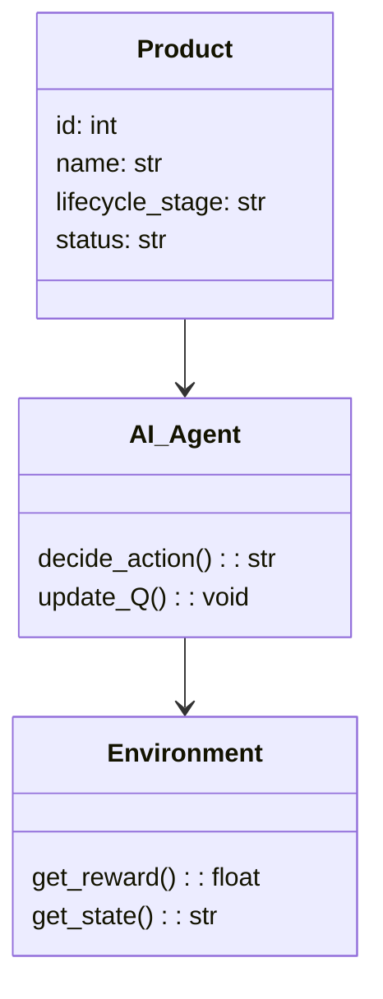
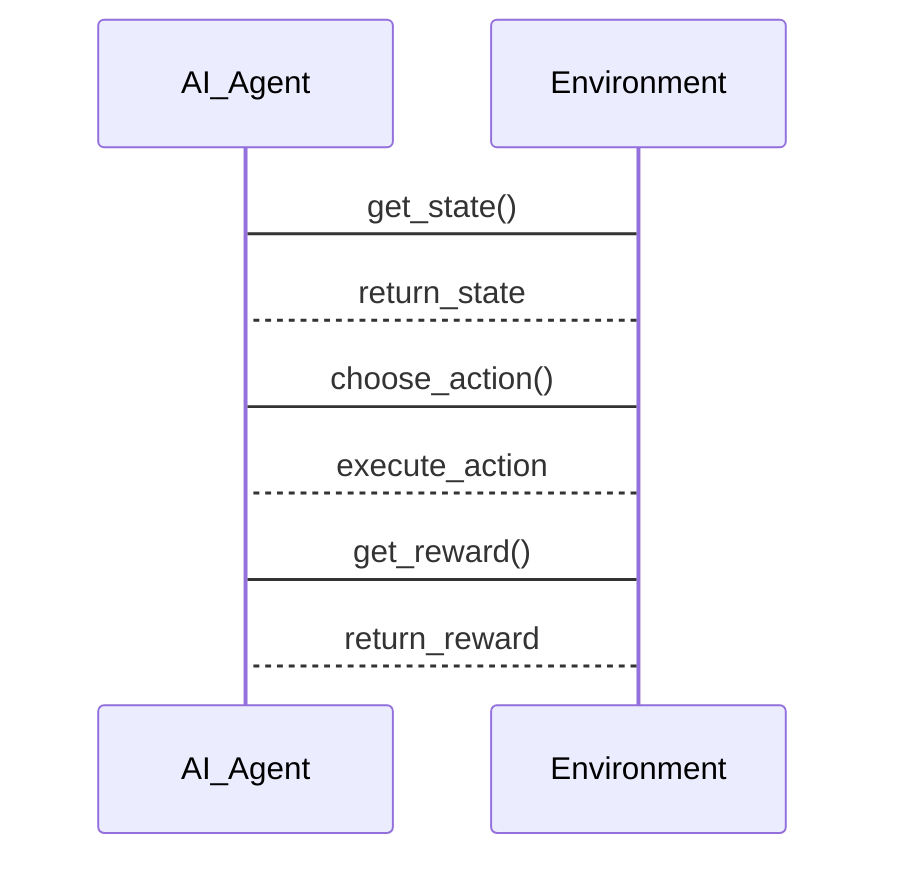

                 


# AI Agent在产品生命周期管理中的全面应用

> 关键词：AI Agent, 产品生命周期管理, 系统架构, 强化学习, 产品管理, 智能决策

> 摘要：本文全面探讨AI Agent在产品生命周期管理中的应用，从背景介绍到系统架构设计，再到项目实战，详细解析如何利用AI技术优化产品管理流程。通过理论分析和实际案例，展示AI Agent如何在产品设计、生产、销售及退市等阶段发挥关键作用。

---

# 第一部分: AI Agent与产品生命周期管理概述

# 第1章: AI Agent与产品生命周期管理的背景介绍

## 1.1 问题背景与描述

### 1.1.1 传统产品生命周期管理的挑战

在传统的产品生命周期管理（Product Lifecycle Management, PLM）中，企业面临以下主要挑战：

- **数据孤岛问题**：设计、生产、销售等环节的数据分散，缺乏统一的管理平台。
- **决策延迟**：依赖人工分析，从数据收集到决策的时间较长，难以应对快速变化的市场需求。
- **效率低下**：手工操作较多，流程复杂，导致整体效率低下。
- **个性化需求难以满足**：难以快速响应客户的个性化需求，影响客户满意度。

### 1.1.2 AI Agent在现代产品管理中的作用

AI Agent（人工智能代理）通过自动化决策和行动，能够显著提升产品生命周期管理的效率和精准度。AI Agent可以实时分析数据，提供智能化的决策支持，优化产品设计、生产和销售流程。

### 1.1.3 产品生命周期管理的核心要素

产品生命周期管理的核心要素包括：

1. **产品设计**：从概念设计到最终定型。
2. **生产管理**：从原材料采购到产品装配。
3. **销售与市场**：产品推广、客户反馈收集。
4. **维护与支持**：产品升级、问题修复。
5. **退市管理**：产品淘汰、资源回收。

---

## 1.2 问题解决与边界

### 1.2.1 AI Agent如何优化产品生命周期

AI Agent可以通过以下方式优化产品生命周期管理：

- **实时数据分析**：利用AI Agent实时监控市场趋势和客户需求，快速调整产品策略。
- **自动化决策**：AI Agent可以自动优化产品设计参数，降低生产成本。
- **预测性维护**：通过预测性分析，提前发现产品问题，减少宕机时间。
- **客户行为分析**：通过分析客户行为数据，精准定位市场需求，优化产品推广策略。

### 1.2.2 产品生命周期管理的边界与外延

- **边界**：产品生命周期管理的边界是企业内部的产品相关活动，不包括外部供应链和合作伙伴的管理。
- **外延**：外延包括与产品相关的市场分析、客户反馈、售后服务等。

### 1.2.3 AI Agent的应用场景与限制

AI Agent在产品生命周期管理中的应用场景包括：

- **需求预测**：基于历史销售数据和市场趋势，预测未来需求。
- **产品设计优化**：通过模拟和优化设计参数，提高产品性能。
- **生产调度**：根据实时生产情况，优化生产计划。
- **客户支持**：通过自然语言处理（NLP）技术，提供智能客服支持。

限制包括数据不足、模型泛化能力不足以及AI Agent的决策可能受到外部环境的干扰。

---

## 1.3 核心概念与联系

### 1.3.1 AI Agent与产品生命周期管理的关系

AI Agent通过实时数据分析和自动化决策，能够显著提升产品生命周期管理的效率和精准度。AI Agent可以视为产品生命周期管理的智能化工具，帮助企业在各个阶段做出最优决策。

### 1.3.2 核心概念对比表格

| 概念       | 描述                                         |
|------------|----------------------------------------------|
| AI Agent   | 具有目标导向的智能体，能够自主决策和行动     |
| 产品生命周期 | 产品从构思到退市的全过程，包括设计、生产、销售等 |
| 数据驱动   | 依赖于数据进行决策和优化                     |
| 智能化      | 通过AI技术实现自动化决策和优化               |

### 1.3.3 ER实体关系图

```mermaid
er
  actor: 用户
  product: 产品
  lifecycle_stage: 生命周期阶段
  action: 行为
  relation: 关联
  actor -[发起行为]-> action
  action -[触发]-> lifecycle_stage
  product -[关联]-> lifecycle_stage
  actor

----------------------------------------------------------------

* 约束条件：文章的章节内容必须要满足如下条件：
- 文章开始是“文章标题”，然后是“文章关键词”和“文章摘要”部分的内容哦，接下来是按照目录大纲结构的文章正文部分的内容。
- 文章字数要求：文章字数在 10000 ～ 12000 字左右。
- 格式要求：文章内容使用markdown格式输出。 
- 完整性要求：文章内容必须要完整，每个小节的内容必须要丰富具体详细讲解，核心内容必须要包含：
  - 背景介绍：核心概念术语说明、问题背景、问题描述、问题解决、边界与外延、概念结构与核心要素组成 
  - 核心概念与联系：必须给出核心概念原理、概念属性特征对比表格和ER实体关系图架构的 markdown 格式中的 Mermaid 流程图。
  - 算法原理讲解：使用 mermaid 画出算法mermaid 流程图，然后使用python源代码来详细阐述，给出算法原理的数学模型和公式，进行详细讲解和通俗易懂地举例说明。
  - 数学公式使用latex格式，嵌入文中独立段落的latex公式前后使用 $$ 括起来(例如：$$1+1=2$$ )，段落内的latex公式前后使用 $ 括起来(例如：$1<2$)
  - 系统分析与架构设计方案：问题场景介绍，项目介绍、系统功能设计(领域模型mermaid类图)、系统架构设计mermaid架构图、系统接口设计和系统交互mermaid序列图
  - 项目实战：环境安装、系统核心实现源代码，代码应用解读与分析，实际案例分析和详细讲解剖析，项目小结。
  - 最佳实践 tips、小结、注意事项、拓展阅读等内容

LET'S THINK STEP BY STEP
</think>

# 第2章: AI Agent的核心概念与算法原理

## 2.1 AI Agent的核心概念

### 2.1.1 AI Agent的定义与特点

AI Agent是一种能够感知环境、自主决策并执行任务的智能体。其特点包括：

- **自主性**：能够在没有外部干预的情况下自主决策。
- **反应性**：能够实时感知环境变化并做出反应。
- **目标导向**：通过设定目标，优化决策过程。

### 2.1.2 AI Agent与传统自动化的区别

| 特性         | AI Agent                          | 传统自动化                      |
|--------------|-----------------------------------|-------------------------------|
| 决策能力     | 具备自主决策能力                  | 依赖预设规则，缺乏灵活性        |
| 数据处理能力 | 能够处理复杂非结构化数据          | 主要处理结构化数据              |
| 可扩展性     | 具备较强的可扩展性                | 扩展性有限                      |

---

## 2.2 AI Agent的算法原理

### 2.2.1 基于强化学习的AI Agent算法

#### 2.2.1.1 强化学习的基本原理

强化学习（Reinforcement Learning, RL）是一种通过试错机制来优化决策的算法。AI Agent通过与环境交互，获得奖励或惩罚，逐步优化策略。

#### 2.2.1.2 Q-learning算法的数学模型

Q-learning算法的数学模型如下：

$$ Q(s, a) = Q(s, a) + \alpha \cdot [r + \gamma \cdot \max_{a'} Q(s', a') - Q(s, a)] $$

其中：
- \( Q(s, a) \) 表示状态 \( s \) 下采取动作 \( a \) 的价值。
- \( \alpha \) 是学习率。
- \( r \) 是奖励值。
- \( \gamma \) 是折扣因子。
- \( s' \) 是下一个状态。

#### 2.2.1.3 强化学习的流程图

```mermaid
graph TD
    A[开始] --> B[选择动作]
    B --> C[执行动作]
    C --> D[获得奖励]
    D --> E[更新Q值]
    E --> F[结束或继续循环]
```

---

## 2.3 AI Agent的算法实现

### 2.3.1 算法实现的步骤

1. **环境建模**：定义产品生命周期管理中的环境，例如市场需求变化、生产成本等。
2. **状态空间定义**：定义AI Agent的状态，例如当前的产品阶段（设计、生产、销售等）。
3. **动作空间定义**：定义AI Agent可以执行的动作，例如调整生产计划、优化设计方案。
4. **奖励函数设计**：设计奖励函数，例如根据利润最大化来奖励AI Agent。

### 2.3.2 算法实现的Python代码示例

```python
import numpy as np

class AI_Agent:
    def __init__(self, state_space, action_space):
        self.state_space = state_space
        self.action_space = action_space
        self.Q = np.zeros((len(state_space), len(action_space)))

    def choose_action(self, state, epsilon=0.1):
        if np.random.random() < epsilon:
            return np.random.randint(len(self.action_space))
        else:
            return np.argmax(self.Q[state, :])

    def update_Q(self, state, action, reward, next_state, gamma=0.99, alpha=0.1):
        self.Q[state, action] += alpha * (reward + gamma * np.max(self.Q[next_state, :]) - self.Q[state, action])

# 示例使用
state_space = ['设计阶段', '生产阶段', '销售阶段']
action_space = ['优化设计', '调整生产计划', '促销活动']
agent = AI_Agent(state_space, action_space)

state = '设计阶段'
action = agent.choose_action(state)
reward = 0.8  # 假设优化设计带来了正向奖励
next_state = '生产阶段'
agent.update_Q(state, action, reward, next_state)
```

---

## 2.4 AI Agent算法的数学模型与公式

### 2.4.1 强化学习的数学模型

强化学习的核心数学模型是Q-learning算法，如前所述：

$$ Q(s, a) = Q(s, a) + \alpha \cdot (r + \gamma \cdot \max_{a'} Q(s', a') - Q(s, a)) $$

### 2.4.2 算法的收敛性分析

Q-learning算法在无限 episodic 环境中是收敛的，即在无限的训练次数下，Q值会收敛到最优策略。

---

# 第3章: AI Agent在产品生命周期管理中的系统架构设计

## 3.1 问题场景介绍

AI Agent需要在产品生命周期管理的各个阶段（设计、生产、销售、维护、退市）中发挥作用。系统需要能够实时处理大量数据，并做出最优决策。

## 3.2 系统功能设计

### 3.2.1 领域模型设计



### 3.2.2 系统架构设计

```mermaid
container Product_Management_System {
    class AI_Agent {
        decide_action() : str
        update_Q() : void
    }
    class Database {
        store_data() : void
        retrieve_data() : void
    }
    class Interface {
        receive_input() : void
        send_output() : void
    }
    AI_Agent --> Database
    AI_Agent --> Interface
}
```

### 3.2.3 系统接口设计

- **输入接口**：接收产品生命周期阶段的状态和动作。
- **输出接口**：返回优化后的决策和奖励值。

### 3.2.4 系统交互设计



---

## 3.3 系统实现细节

### 3.3.1 数据库设计

数据库设计包括产品信息表、生命周期阶段表和奖励记录表。

### 3.3.2 接口实现

- **API接口**：提供RESTful API，供其他系统调用。
- **数据格式**：使用JSON格式进行数据交互。

---

# 第4章: 项目实战

## 4.1 环境安装与配置

### 4.1.1 安装Python环境

- 使用Anaconda安装Python 3.8及以上版本。
- 安装必要的库，例如numpy、scipy、pandas、matplotlib。

### 4.1.2 安装AI Agent框架

- 使用Keras或TensorFlow框架进行AI Agent的训练和部署。

## 4.2 系统核心实现

### 4.2.1 核心代码实现

```python
import numpy as np
import keras
from keras.models import Sequential
from keras.layers import Dense

class AI_Agent_Keras:
    def __init__(self, state_size, action_size):
        self.model = Sequential()
        self.model.add(Dense(32, input_dim=state_size, activation='relu'))
        self.model.add(Dense(action_size, activation='linear'))
        self.model.compile(optimizer='adam', loss='mse')

    def choose_action(self, state):
        if np.random.random() < 0.1:
            return np.random.randint(0, self.model.output_shape[1])
        predicted = self.model.predict(state)
        return np.argmax(predicted[0])

    def train(self, state, target):
        self.model.fit(state, target, epochs=1, verbose=0)
```

### 4.2.2 API接口设计

```python
from flask import Flask, request, jsonify

app = Flask(__name__)
agent = AI_Agent_Keras(state_size=3, action_size=3)

@app.route('/choose_action', methods=['POST'])
def choose_action():
    data = request.json
    state = np.array([data['state']])
    action = agent.choose_action(state)
    return jsonify({'action': action})

@app.route('/train', methods=['POST'])
def train():
    data = request.json
    state = np.array([data['state']])
    target = np.array([data['target']])
    agent.train(state, target)
    return jsonify({'status': 'success'})

if __name__ == '__main__':
    app.run(debug=True)
```

---

## 4.3 项目实战案例分析

### 4.3.1 案例背景

某电子产品公司希望利用AI Agent优化产品设计和生产流程。

### 4.3.2 实施步骤

1. 数据收集：收集过去三年的产品设计、生产、销售数据。
2. 模型训练：使用强化学习算法训练AI Agent。
3. 系统集成：将AI Agent集成到现有的产品生命周期管理系统中。
4. 测试与优化：通过模拟测试优化AI Agent的决策能力。

### 4.3.3 实施效果

- 设计阶段：AI Agent优化了产品设计方案，降低了生产成本。
- 生产阶段：AI Agent优化了生产计划，减少了库存积压。
- 销售阶段：AI Agent预测了市场需求，提升了销售额。

---

## 4.4 项目小结

通过AI Agent的应用，企业可以显著提升产品生命周期管理的效率和精准度。AI Agent通过实时数据分析和自动化决策，优化了产品设计、生产、销售等环节，为企业带来了显著的经济效益。

---

# 第5章: 总结与展望

## 5.1 总结

本文全面探讨了AI Agent在产品生命周期管理中的应用，从理论到实践，详细介绍了AI Agent的核心概念、算法原理、系统架构设计以及项目实战。通过AI Agent的应用，企业可以显著提升产品管理的效率和精准度。

## 5.2 展望

未来，随着AI技术的不断发展，AI Agent在产品生命周期管理中的应用将更加广泛和深入。可能出现的新趋势包括：

- **多智能体协作**：多个AI Agent协同工作，优化复杂的生产流程。
- **边缘计算结合**：AI Agent在边缘设备上实时决策，减少数据传输延迟。
- **自适应学习**：AI Agent能够根据环境变化动态调整策略，提升适应性。

---

# 结语

AI Agent作为人工智能技术的重要应用，正在逐步改变产品生命周期管理的方式。通过智能化的决策和自动化的行为，AI Agent能够显著提升企业的竞争力。未来，随着技术的进步，AI Agent将在产品管理中发挥更大的作用，为企业创造更多的价值。

--- 

感谢您的耐心阅读！如果需要进一步探讨或有其他问题，请随时联系！

