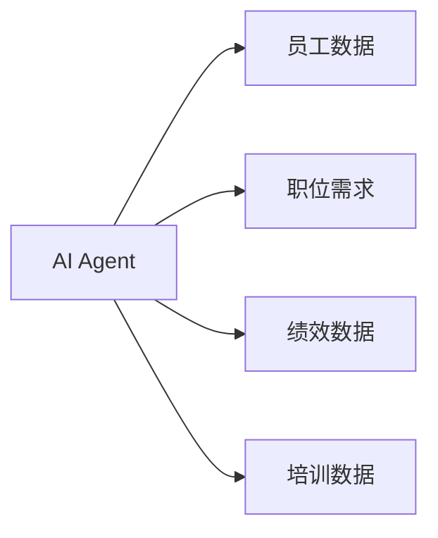
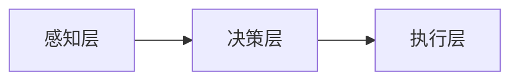
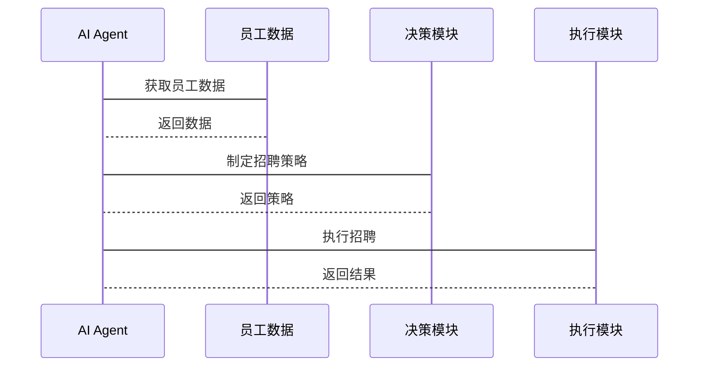

                 


# AI Agent在人力资源管理中的应用

> 关键词：AI Agent, 人力资源管理, 智能招聘, 绩效管理, 数据分析, 强化学习

> 摘要：本文系统地探讨了AI Agent在人力资源管理中的应用，涵盖了从基础概念到高级算法的各个方面，分析了AI Agent在招聘、培训、绩效管理等关键环节的具体应用场景，并结合实际案例展示了AI Agent的优势和挑战。文章还详细介绍了AI Agent的算法原理、系统设计、项目实现等内容，为读者提供全面的视角和深入的见解。

---

# 第一章: AI Agent与人力资源管理的背景介绍

## 1.1 AI Agent的基本概念

### 1.1.1 AI Agent的定义
AI Agent（人工智能代理）是一种能够感知环境、自主决策并执行任务的智能系统。它通过与用户或系统的交互，能够理解需求并提供相应的解决方案。

### 1.1.2 AI Agent的核心特征
- **自主性**：AI Agent能够在没有外部干预的情况下独立运行。
- **反应性**：能够实时感知环境并做出响应。
- **学习能力**：通过数据和反馈不断优化自身的决策能力。
- **协作性**：能够与人类或其他系统协同工作。

### 1.1.3 AI Agent与传统HR系统的区别
传统的HR系统通常是基于规则的系统，主要完成数据录入、报表生成等任务。而AI Agent能够通过机器学习算法，从大量数据中提取模式并做出智能化决策。

## 1.2 人力资源管理的数字化转型

### 1.2.1 传统人力资源管理的局限性
- **效率低下**：人工处理招聘、绩效管理等任务耗时且容易出错。
- **缺乏个性化**：难以满足员工的个性化需求。
- **数据孤岛**：各部门数据分散，难以形成统一的决策依据。

### 1.2.2 数字化转型的必要性
随着企业对效率和灵活性的要求不断提高，传统的HR管理模式已无法满足需求。数字化转型能够帮助企业实现数据驱动的管理，提高决策的准确性和效率。

### 1.2.3 AI Agent在数字化转型中的作用
AI Agent能够通过自动化和智能化的方式，帮助HR部门实现招聘、培训、绩效管理等工作的高效执行。

## 1.3 AI Agent在HR中的应用背景

### 1.3.1 全球化与人才竞争
全球化使得企业之间的竞争更加激烈，人才成为核心资源。AI Agent能够帮助企业快速筛选和招聘优秀人才。

### 1.3.2 技术驱动的管理变革
人工智能、大数据等技术的发展，为HR管理提供了新的工具和方法。AI Agent能够通过数据驱动的方式，优化HR管理的各个环节。

### 1.3.3 数据驱动的决策趋势
企业越来越依赖数据进行决策。AI Agent能够通过分析大量数据，提供科学的决策支持。

---

# 第二章: AI Agent的核心概念与原理

## 2.1 AI Agent的核心概念

### 2.1.1 感知模块
AI Agent的感知模块负责收集和处理环境中的数据，例如员工的绩效数据、招聘需求等。

### 2.1.2 决策模块
决策模块是AI Agent的核心，负责根据感知到的数据，通过算法做出决策。例如，AI Agent可以通过强化学习算法，优化招聘策略。

### 2.1.3 执行模块
执行模块负责将决策转化为实际操作，例如自动发布招聘信息、安排培训计划等。

## 2.2 AI Agent的算法原理

### 2.2.1 强化学习算法
强化学习是一种通过试错方式优化决策的算法。例如，AI Agent可以通过强化学习，优化招聘流程中的排序策略。

### 2.2.2 监督学习算法
监督学习是一种基于标注数据进行预测的算法。例如，AI Agent可以通过监督学习，预测员工的绩效表现。

### 2.2.3 自然语言处理技术
自然语言处理技术（NLP）用于理解和生成人类语言。例如，AI Agent可以通过NLP技术，分析员工的反馈并提出改进建议。

## 2.3 AI Agent的实体关系图



---

# 第三章: AI Agent在人力资源管理中的应用场景

## 3.1 智能招聘

### 3.1.1 简历筛选
AI Agent可以通过自然语言处理技术，自动筛选简历，识别与岗位要求匹配的候选人。

### 3.1.2 面试安排
AI Agent可以根据候选人的日程安排，自动安排面试时间。

### 3.1.3 岗位匹配
AI Agent可以通过分析候选人的技能和经验，推荐最适合的岗位。

## 3.2 员工培训与发展

### 3.2.1 个性化培训计划
AI Agent可以根据员工的技能差距，制定个性化的培训计划。

### 3.2.2 技能提升建议
AI Agent可以通过分析员工的学习数据，提出技能提升建议。

### 3.2.3 职业路径规划
AI Agent可以根据员工的能力和兴趣，制定职业发展路径。

## 3.3 绩效管理

### 3.3.1 绩效目标设定
AI Agent可以根据岗位要求和员工的能力，制定绩效目标。

### 3.3.2 绩效数据分析
AI Agent可以通过分析绩效数据，识别高绩效员工和低绩效员工。

### 3.3.3 绩效反馈与改进
AI Agent可以提供绩效反馈，并根据反馈结果，优化绩效管理流程。

## 3.4 员工关系管理

### 3.4.1 员工满意度分析
AI Agent可以通过分析员工反馈，识别员工满意度低的环节。

---

# 第四章: AI Agent的算法原理与实现

## 4.1 强化学习算法

### 4.1.1 Q-learning算法
Q-learning是一种经典的强化学习算法，适用于离线环境下的策略优化。其核心公式如下：

$$ Q(s, a) = r + \gamma \max Q(s', a') $$

其中，$s$ 是当前状态，$a$ 是当前动作，$r$ 是奖励，$\gamma$ 是折扣因子，$s'$ 是下一状态。

### 4.1.2 实现步骤
1. 初始化Q表。
2. 选择动作。
3. 执行动作，获取奖励。
4. 更新Q值。

```python
import numpy as np

class QLearningAgent:
    def __init__(self, state_space, action_space, gamma=0.9):
        self.gamma = gamma
        self.Q = np.zeros((state_space, action_space))

    def choose_action(self, state, epsilon=0.1):
        if np.random.random() < epsilon:
            return np.random.randint(0, action_space)
        else:
            return np.argmax(self.Q[state, :])

    def update_Q(self, state, action, reward, next_state):
        self.Q[state, action] = reward + self.gamma * np.max(self.Q[next_state, :])
```

---

# 第五章: AI Agent的系统设计与实现

## 5.1 系统架构设计

### 5.1.1 分层架构
AI Agent的系统架构通常采用分层架构，包括感知层、决策层和执行层。



### 5.1.2 模块划分
- 感知模块：负责数据采集和处理。
- 决策模块：负责策略制定和优化。
- 执行模块：负责任务执行和反馈收集。

## 5.2 系统接口设计

### 5.2.1 输入接口
- 数据接口：员工数据、职位需求等。

### 5.2.2 输出接口
- 招聘结果：推荐候选人。
- 培训计划：个性化培训方案。

## 5.3 系统交互流程

### 5.3.1 序列图


---

# 第六章: AI Agent的项目实战

## 6.1 项目背景与目标

### 6.1.1 项目背景
某企业希望优化招聘流程，提高招聘效率。

### 6.1.2 项目目标
实现AI Agent在招聘流程中的应用，包括简历筛选和岗位匹配。

## 6.2 项目实现

### 6.2.1 环境安装
需要安装Python、TensorFlow、Scikit-learn等库。

### 6.2.2 核心代码实现
```python
import pandas as pd
from sklearn.metrics.pairwise import cosine_similarity

def compute_similarity(job_description, resume_text):
    # 计算文本相似度
    return cosine_similarity(job_description, resume_text)
```

### 6.2.3 代码解读
- `compute_similarity`函数用于计算职位描述和简历文本的相似度，使用余弦相似度算法。

## 6.3 案例分析

### 6.3.1 应用场景
某公司招聘数据分析师，AI Agent通过分析简历，筛选出最适合的候选人。

### 6.3.2 实施步骤
1. 收集职位描述和简历数据。
2. 计算简历与职位描述的相似度。
3. 根据相似度排序，推荐候选人。

---

# 第七章: 最佳实践与未来展望

## 7.1 最佳实践

### 7.1.1 数据质量管理
确保数据的准确性和完整性，是AI Agent发挥效用的基础。

### 7.1.2 模型优化
定期更新模型，根据反馈优化算法，提高决策的准确性。

## 7.2 未来展望

### 7.2.1 AI Agent与区块链结合
区块链技术可以提高数据的安全性和可信度，进一步增强AI Agent的能力。

### 7.2.2 多模态技术的应用
结合图像识别、语音识别等多模态技术，AI Agent能够更好地理解员工的需求。

---

# 附录

## 附录A: 术语表
- AI Agent：人工智能代理
- 强化学习：Reinforcement Learning
- 自然语言处理：Natural Language Processing

## 附录B: 工具推荐
- Python：数据处理和算法实现
- TensorFlow：深度学习框架
- Scikit-learn：机器学习库

## 附录C: 参考文献
1. Russell, S. & Norvig, P. (2010). Artificial Intelligence: A Modern Approach.
2. Goodfellow, I., Bengio, Y., & Courville, A. (2016). Deep Learning.

---

# 结语

AI Agent在人力资源管理中的应用，不仅提高了企业的管理效率，还为员工提供了更好的服务。随着技术的不断进步，AI Agent将在HR领域发挥越来越重要的作用。

