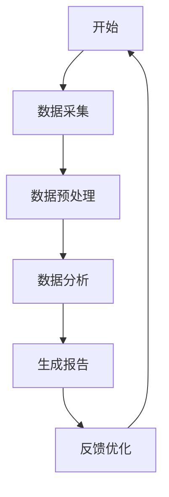
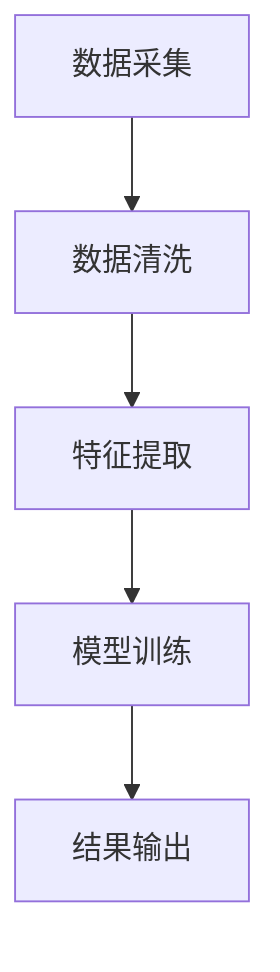
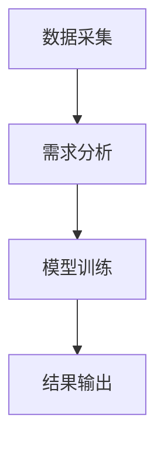
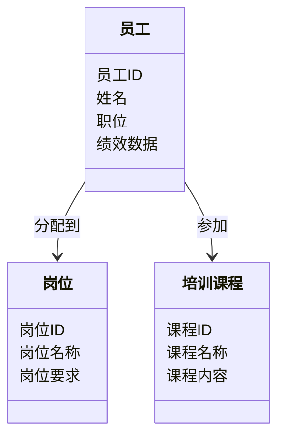
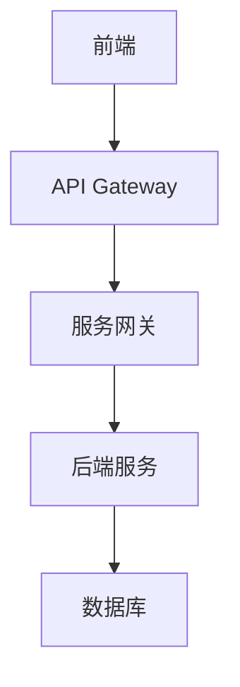
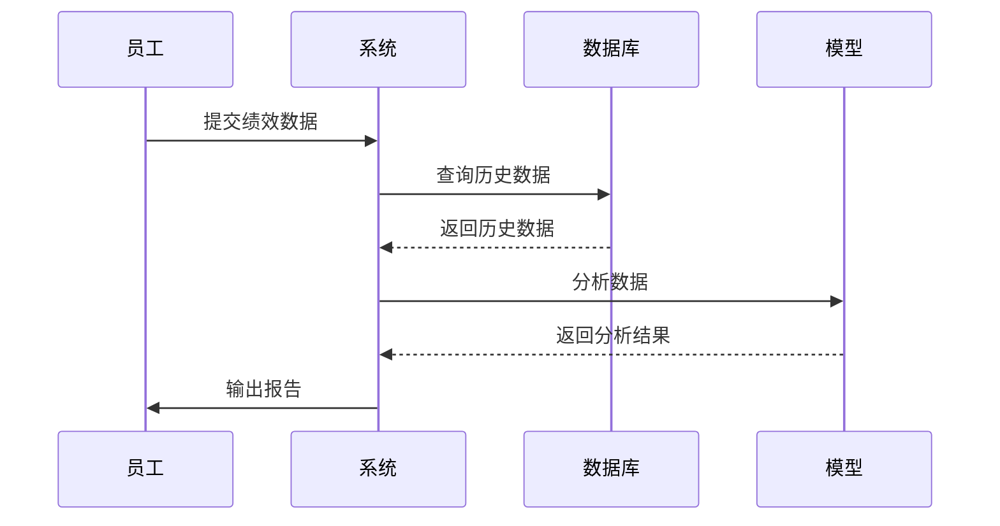

                 


# AI Agent在人力资源管理中的应用：员工绩效分析与培训需求识别

## 关键词
- AI Agent
- 人力资源管理
- 员工绩效分析
- 培训需求识别
- 人工智能
- 机器学习

## 摘要
AI Agent在现代人力资源管理中发挥着越来越重要的作用，特别是在员工绩效分析与培训需求识别方面。本文系统介绍了AI Agent的基本概念、工作原理及其在人力资源管理中的具体应用。通过分析绩效分析和培训需求识别的传统方法及其局限性，本文详细阐述了AI Agent如何利用自然语言处理、机器学习等技术，实现高效、精准的员工绩效评估和个性化培训需求识别。文章还通过实际案例展示了AI Agent在系统中的集成与实现，并提供了系统的架构设计、项目实战和最佳实践建议，为HR部门的智能化转型提供了理论和实践指导。

---

## 第1章: AI Agent与人力资源管理的背景介绍

### 1.1 AI Agent的基本概念
#### 1.1.1 什么是AI Agent
AI Agent（人工智能代理）是指能够感知环境、自主决策并执行任务的智能实体。它通过数据输入、分析、推理和学习，提供智能化的解决方案。

#### 1.1.2 AI Agent的核心特点
- **自主性**：AI Agent能够独立执行任务，无需人工干预。
- **反应性**：能够实时感知环境变化并做出响应。
- **学习能力**：通过数据学习和优化，提升任务执行效率。

#### 1.1.3 AI Agent与传统管理工具的区别
| **维度** | **传统管理工具** | **AI Agent** |
|----------|------------------|--------------|
| **数据处理** | 线性规则处理     | 数据驱动决策 |
| **灵活性** | 固定流程        | 高度灵活     |
| **学习能力** | 无               | 可自适应学习 |

### 1.2 人力资源管理中的问题背景
#### 1.2.1 员工绩效分析的难点
- 数据分散：员工绩效数据来源多样，难以统一管理。
- 主观性高：传统绩效评估依赖主观评价，可能存在偏差。
- 动态变化：员工绩效受多种因素影响，需要实时分析。

#### 1.2.2 培训需求识别的传统方法及其局限性
- **问卷调查**：耗时且难以捕捉隐性需求。
- **经验判断**：依赖管理人员经验，主观性强。
- **数据孤岛**：各部门数据分散，难以整合分析。

#### 1.2.3 传统方法与现代需求的矛盾
随着企业规模扩大和业务复杂化，传统管理方法难以满足高效、精准的管理需求，亟需智能化解决方案。

---

## 第2章: AI Agent在人力资源管理中的核心概念

### 2.1 AI Agent的核心原理
#### 2.1.1 AI Agent的工作流程


#### 2.1.2 AI Agent的输入输出模型
- **输入**：员工行为数据、绩效指标、历史数据。
- **输出**：绩效评估结果、个性化培训建议。

#### 2.1.3 AI Agent的决策机制
AI Agent通过机器学习模型对输入数据进行分析，生成决策建议，并通过反馈机制不断优化模型。

### 2.2 AI Agent与人力资源管理的结合
#### 2.2.1 AI Agent在绩效分析中的角色
- 数据分析：从大量数据中提取关键指标。
- 智能评估：基于机器学习模型生成客观评估结果。
- 反馈优化：根据评估结果提供改进建议。

#### 2.2.2 AI Agent在培训需求识别中的应用
- 个性化分析：根据员工技能差距提供定制化培训方案。
- 预测需求：基于历史数据预测未来培训需求。

#### 2.2.3 AI Agent与其他管理工具的协同
通过API接口与现有HR系统集成，实现数据共享和功能协同。

---

## 第3章: AI Agent在绩效分析中的应用

### 3.1 绩效分析的基本原理
#### 3.1.1 绩效分析的定义与目标
- **定义**：通过数据驱动的方法评估员工的工作表现。
- **目标**：识别高绩效员工，发现潜力员工，优化团队配置。

#### 3.1.2 绩效分析的关键指标
| **指标** | **定义** | **计算公式** |
|----------|-----------|--------------|
| KPI | 关键绩效指标 | $$ \text{KPI} = \frac{\text{实际完成值}}{\text{目标值}} \times 100 $$ |
| 行为指标 | 员工行为数据 | $$ \text{行为指标} = \sum (\text{任务完成度} \times \text{权重}) $$ |

#### 3.1.3 绩效分析的流程与方法


### 3.2 AI Agent在绩效分析中的具体应用
#### 3.2.1 数据采集与处理
- **数据来源**：员工任务完成情况、考勤记录、绩效评估表。
- **数据清洗**：去除异常值和缺失数据。

#### 3.2.2 数据分析与建模
- **机器学习模型**：使用随机森林或支持向量机进行分类。
- **数学模型**：构建回归模型预测绩效结果。

#### 3.2.3 结果输出与反馈
- **可视化报告**：生成图表展示绩效分布。
- **个性化反馈**：针对每位员工提供改进建议。

---

## 第4章: AI Agent在培训需求识别中的应用

### 4.1 培训需求识别的基本原理
#### 4.1.1 培训需求识别的定义与目标
- **定义**：通过分析员工技能与岗位要求的差距，识别培训需求。
- **目标**：提升员工能力，优化团队整体素质。

#### 4.1.2 培训需求识别的关键指标
| **指标** | **定义** | **计算公式** |
|----------|-----------|--------------|
| 技能差距 | 员工现有技能与岗位要求的差距 | $$ \text{技能差距} = \text{岗位要求} - \text{员工技能} $$ |
| 学习效果 | 培训后的技能提升程度 | $$ \text{学习效果} = \frac{\text{培训后技能} - \text{培训前技能}}{\text{培训前技能}} \times 100 $$ |

#### 4.1.3 培训需求识别的流程与方法


### 4.2 AI Agent在培训需求识别中的具体应用
#### 4.2.1 数据采集与处理
- **数据来源**：员工技能测试结果、岗位要求、历史培训数据。
- **数据清洗**：处理无效数据和重复数据。

#### 4.2.2 数据分析与建模
- **自然语言处理**：分析培训材料，提取关键知识点。
- **机器学习模型**：使用聚类算法识别技能差距。

#### 4.2.3 个性化培训方案
- **定制化建议**：根据员工技能差距推荐具体培训课程。
- **效果评估**：通过测试评估培训效果。

---

## 第5章: 系统分析与架构设计

### 5.1 系统功能设计
#### 5.1.1 领域模型设计


#### 5.1.2 系统架构设计


### 5.2 系统接口设计
- **API接口**：提供RESTful API，支持数据查询和更新。
- **交互流程**：员工提交数据，系统处理并返回结果。

### 5.3 系统交互设计


---

## 第6章: 项目实战

### 6.1 环境安装
- **工具安装**：安装Python、TensorFlow、Pandas、Scikit-learn。
- **数据准备**：收集员工绩效数据和培训需求数据。

### 6.2 系统核心实现
#### 6.2.1 绩效分析模块
```python
import pandas as pd
from sklearn.ensemble import RandomForestClassifier

# 数据加载
data = pd.read_csv('performance.csv')

# 特征工程
features = data[['任务完成度', '出勤率', '反馈评分']]
labels = data['绩效等级']

# 模型训练
model = RandomForestClassifier()
model.fit(features, labels)

# 预测结果
new_data = pd.DataFrame({'任务完成度': [0.85], '出勤率': [0.9], '反馈评分': [85]})
predicted = model.predict(new_data)
print(predicted)
```

#### 6.2.2 培训需求识别模块
```python
import numpy as np
from sklearn.cluster import KMeans

# 数据加载
data = pd.read_csv('skill_gap.csv')

# 数据预处理
X = data[['技能1', '技能2', '技能3']].values

# 模型训练
model = KMeans(n_clusters=3)
model.fit(X)

# 预测结果
new_data = np.array([[0.6, 0.7, 0.5]])
predicted = model.predict(new_data)
print(predicted)
```

### 6.3 案例分析
通过实际案例分析，展示AI Agent在绩效分析和培训需求识别中的具体应用，包括数据处理、模型训练和结果输出。

---

## 第7章: 最佳实践与小结

### 7.1 最佳实践
- **数据质量**：确保数据准确性和完整性。
- **模型可解释性**：选择易于解释的模型，便于结果分析。
- **持续优化**：定期更新模型，适应业务变化。

### 7.2 小结
本文详细介绍了AI Agent在人力资源管理中的应用，特别是绩效分析和培训需求识别方面。通过理论分析和实际案例，展示了AI Agent如何提升管理效率和精准度。

### 7.3 展望
未来，AI Agent将在人力资源管理中发挥更大作用，推动企业智能化转型。

---

通过以上章节的详细阐述，本文为读者提供了全面的理论和实践指导，帮助他们在实际工作中更好地应用AI Agent，提升人力资源管理的效率和效果。

