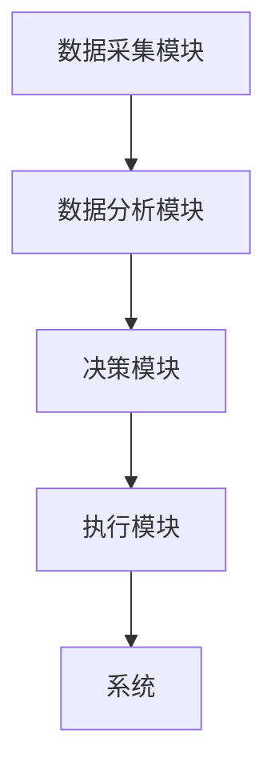
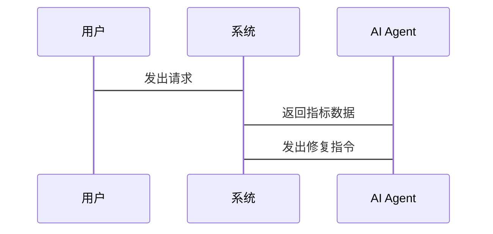

                 


# AI Agent在企业IT运维中的应用：故障预测与修复

## 关键词
- AI Agent
- 企业IT运维
- 故障预测
- 自动化修复
- 机器学习
- 异常检测

## 摘要
本文探讨AI Agent在企业IT运维中的应用，重点分析故障预测与修复的实现。通过理论分析和实际案例，介绍机器学习算法、异常检测和自动化修复技术，展示如何构建AI驱动的运维系统，提升企业IT系统的稳定性和效率。

---

# 第一部分：AI Agent在企业IT运维中的应用概述

## 第1章：AI Agent的基本概念与背景

### 1.1 AI Agent的定义与核心概念

#### 1.1.1 AI Agent的定义
AI Agent（人工智能代理）是能够感知环境、自主决策并采取行动以实现目标的智能体。在IT运维中，AI Agent通过分析系统数据，预测故障并执行修复操作。

#### 1.1.2 AI Agent的核心概念与属性
- **自主性**：无需人工干预，自主执行任务。
- **反应性**：实时感知环境变化并调整行为。
- **主动性**：主动采取行动以实现目标。
- **社交能力**：与系统、用户和其他系统进行交互。

#### 1.1.3 AI Agent与传统运维工具的区别
传统运维工具依赖人工配置和脚本，而AI Agent具备自主学习和决策能力，能够处理复杂场景。

### 1.2 企业IT运维中的故障预测与修复需求

#### 1.2.1 企业IT运维的痛点与挑战
- 系统复杂性增加，故障排查耗时费力。
- 人工运维效率低下，难以应对突发事件。
- 故障停机时间长，影响业务连续性。

#### 1.2.2 故障预测与修复的重要性
- 提高系统可用性，减少停机时间。
- 降低运维成本，提升效率。
- 加快故障响应速度，优化用户体验。

#### 1.2.3 AI Agent在IT运维中的应用价值
- 实现自动化故障预测和修复。
- 提供智能化运维解决方案。
- 降低人为错误，提升系统稳定性。

---

## 第2章：AI Agent的核心原理与技术基础

### 2.1 AI Agent的核心原理

#### 2.1.1 AI Agent的感知机制
通过收集系统指标、日志和事件数据，AI Agent利用传感器和数据采集工具获取环境信息。

#### 2.1.2 AI Agent的决策机制
基于收集的数据，AI Agent运用机器学习模型进行分析，生成预测结果并制定修复策略。

#### 2.1.3 AI Agent的执行机制
根据决策结果，AI Agent执行自动化操作，如调用API或触发预定义的修复脚本。

### 2.2 AI Agent的关键技术

#### 2.2.1 机器学习算法在故障预测中的应用
- **时间序列分析**：使用ARIMA或LSTM模型预测系统指标趋势。
- **异常检测**：通过Isolation Forest或One-Class SVM识别异常数据点。

#### 2.2.2 自然语言处理在故障修复中的应用
- 分析错误日志，提取关键信息，生成修复建议。

#### 2.2.3 知识图谱在故障诊断中的应用
- 建立故障与解决方案的知识关联，辅助诊断和修复决策。

---

## 第3章：AI Agent在故障预测与修复中的应用

### 3.1 故障预测的实现

#### 3.1.1 基于时间序列的故障预测方法
- 使用ARIMA模型进行历史数据分析，预测未来指标走势。

```python
from statsmodels.tsa.arima_model import ARIMA

# 训练模型
model = ARIMA(train_data, order=(5,1,0))
model_fit = model.fit()

# 预测未来值
forecast = model_fit.forecast(steps=5)
```

#### 3.1.2 基于异常检测的故障预测方法
- 运用Isolation Forest算法识别异常点。

```python
from sklearn.ensemble import IsolationForest

# 训练模型
clf = IsolationForest(random_state=42)
clf.fit(X_train)

# 预测异常
y_pred = clf.predict(X_test)
```

#### 3.1.3 基于机器学习的故障预测模型
- 构建深度学习模型，如LSTM网络，进行序列预测。

```python
from keras.models import Sequential
from keras.layers import LSTM, Dense

# 定义模型
model = Sequential()
model.add(LSTM(64, input_shape=(timesteps, features)))
model.add(Dense(1))
model.compile(optimizer='adam', loss='mean_squared_error')
```

### 3.2 故障修复的实现

#### 3.2.1 自动化修复的流程与策略
- 根据预测结果，执行预定义的修复步骤，如重启服务或调整配置。

#### 3.2.2 基于知识图谱的修复决策
- 利用知识图谱关联故障与解决方案，辅助决策。

#### 3.2.3 基于自然语言处理的修复建议
- 分析错误日志，生成修复建议。

---

## 第4章：系统架构与设计

### 4.1 系统整体架构

#### 4.1.1 系统模块划分
- 数据采集模块：收集系统指标和日志。
- 数据分析模块：运行机器学习模型进行预测。
- 决策模块：生成修复策略。
- 执行模块：执行修复操作。

#### 4.1.2 系统功能设计
- 故障预测：实时监控系统状态，预测潜在故障。
- 自动修复：根据预测结果，自动执行修复操作。
- 可视化界面：提供系统状态和修复进展的可视化。

#### 4.1.3 系统架构图



### 4.2 系统接口与交互设计

#### 4.2.1 系统接口设计
- 数据接口：与监控系统对接，获取指标数据。
- 执行接口：调用修复脚本或API。

#### 4.2.2 系统交互流程



---

## 第5章：项目实战

### 5.1 项目背景与目标
在一个企业级IT系统中，部署AI Agent进行故障预测与修复，减少人工干预，提高系统稳定性。

### 5.2 环境配置与安装

#### 5.2.1 安装依赖
```bash
pip install numpy pandas scikit-learn tensorflow keras
```

#### 5.2.2 数据采集
使用Prometheus采集系统指标，并存储到InfluxDB中。

### 5.3 核心代码实现

#### 5.3.1 数据预处理
```python
import pandas as pd

data = pd.read_csv('metrics.csv')
data = data.dropna()
```

#### 5.3.2 模型训练与预测
```python
from keras.models import load_model

model = load_model('fault_prediction.h5')
predictions = model.predict(test_data)
```

#### 5.3.3 自动化修复
```python
import subprocess

def restart_service():
    subprocess.run('systemctl restart my_service', shell=True)
```

### 5.4 案例分析与结果展示
通过实际案例展示AI Agent在故障预测与修复中的应用效果，对比传统方法，验证系统的有效性和稳定性。

### 5.5 项目总结
总结项目实施的经验，分析系统性能，提出改进建议，展望未来发展方向。

---

## 第6章：最佳实践与未来趋势

### 6.1 最佳实践

#### 6.1.1 数据质量的重要性
确保数据准确性和完整性，提升模型预测精度。

#### 6.1.2 模型的可解释性
选择可解释的模型，便于故障分析和修复决策。

#### 6.1.3 安全性与稳定性
确保AI Agent的运行安全，避免引入新的风险。

### 6.2 未来发展趋势

#### 6.2.1 结合边缘计算
在边缘设备上部署AI Agent，实现更快速的响应。

#### 6.2.2 强化学习的应用
利用强化学习优化决策过程，提升修复策略的有效性。

#### 6.2.3 多模态数据融合
结合系统指标、日志和业务数据，提高预测准确性。

---

## 附录

### 附录A：参考文献
- [1] 李明. 《人工智能基础》. 北京: 人民邮电出版社, 2020.
- [2] 张伟. 《机器学习实战》. 北京: 清华大学出版社, 2021.

### 附录B：工具与库
- TensorFlow: https://www.tensorflow.org/
- Scikit-learn: https://scikit-learn.org/
- Prometheus: https://prometheus.io/

---

通过以上内容，本文详细介绍了AI Agent在企业IT运维中的应用，从理论到实践，系统阐述了故障预测与修复的实现方法。希望对读者理解AI在运维中的价值有所帮助。

