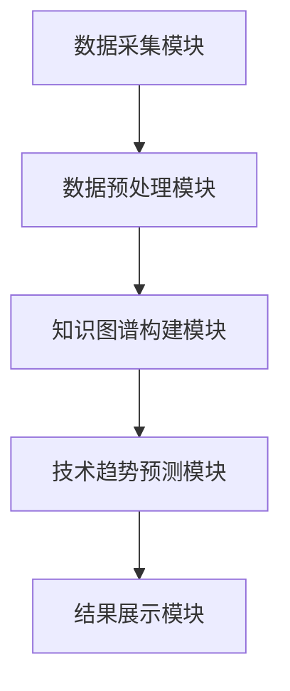
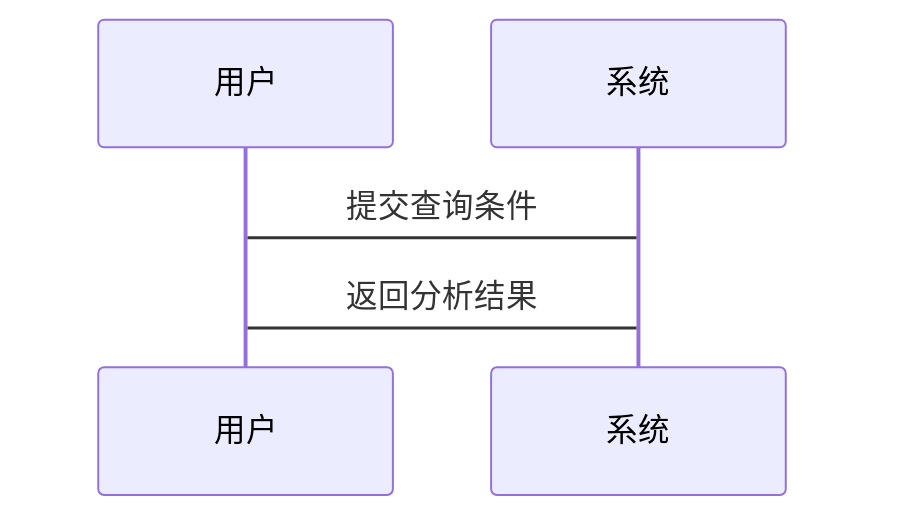

                 


# AI Agent在企业专利分析与技术趋势预测中的应用

> 关键词：AI Agent, 专利分析, 技术趋势预测, 自然语言处理, 机器学习, 知识图谱

> 摘要：本文探讨了AI Agent在企业专利分析与技术趋势预测中的应用，详细介绍了AI Agent的基本概念、专利分析的基础知识、技术趋势预测的方法，以及AI Agent在这些领域的具体应用。通过结合实际案例和系统架构设计，本文展示了如何利用AI Agent提升专利分析的效率和准确性，为企业提供有力的技术支持。

---

# 第一章: AI Agent与企业专利分析概述

## 1.1 AI Agent的基本概念

### 1.1.1 AI Agent的定义与特点
AI Agent（人工智能代理）是指具有感知环境、理解和执行任务能力的智能实体。AI Agent可以通过学习和推理，帮助用户完成复杂的任务，具有以下特点：
- **自主性**：能够自主决策和行动。
- **反应性**：能够实时感知环境并做出反应。
- **学习能力**：能够通过数据和经验不断优化自身性能。

### 1.1.2 AI Agent的核心技术基础
AI Agent的核心技术包括：
- **机器学习**：用于模式识别和预测。
- **自然语言处理**：用于文本理解和生成。
- **知识图谱**：用于构建结构化的知识库。
- **推理引擎**：用于逻辑推理和决策。

### 1.1.3 AI Agent在企业中的应用价值
AI Agent在企业中的应用价值主要体现在以下几个方面：
1. **自动化任务处理**：通过自动化处理重复性工作，提高效率。
2. **智能化决策支持**：通过数据分析和预测，为企业提供决策支持。
3. **实时监控与反馈**：实时监控企业运营状况并提供反馈。

### 1.1.4 专利分析的基本概念
专利分析是指通过对专利数据的收集、整理和分析，为企业提供技术布局、竞争对手分析等信息。专利分析的核心包括：
- **专利数据的获取与清洗**。
- **专利分类与技术领域分析**。
- **专利生命周期分析**。

### 1.1.5 技术趋势预测的原理
技术趋势预测是指通过对历史数据的分析，预测未来的技术发展方向。其原理包括：
- **时间序列分析**：基于历史数据的模式预测未来趋势。
- **机器学习模型**：通过训练数据预测未来的技术热点。
- **知识图谱分析**：通过技术关联性分析预测技术发展趋势。

---

## 1.2 企业专利分析的意义

### 1.2.1 专利分析在企业中的作用
专利分析在企业中的作用包括：
1. **技术布局优化**：通过分析竞争对手的专利布局，优化自身的技术研发方向。
2. **风险预警**：通过分析潜在的技术风险，提前制定应对策略。
3. **技术交易支持**：通过分析技术交易市场，帮助企业进行技术引进和合作。

### 1.2.2 技术趋势预测对企业的重要性
技术趋势预测对企业的重要性体现在以下几个方面：
1. **技术研发方向的选择**：通过预测技术发展趋势，帮助企业选择技术研发方向。
2. **市场策略制定**：通过预测市场需求，制定相应的市场策略。
3. **投资决策支持**：通过预测技术发展趋势，帮助企业做出投资决策。

### 1.2.3 AI Agent在专利分析中的应用前景
AI Agent在专利分析中的应用前景广阔，可以通过以下方式实现：
1. **自动化专利数据处理**：利用AI Agent自动获取和处理专利数据。
2. **智能化技术趋势预测**：利用AI Agent分析专利数据，预测技术发展趋势。
3. **实时监控与反馈**：利用AI Agent实时监控技术动态，提供反馈。

---

## 1.3 本章小结

本章主要介绍了AI Agent的基本概念、企业专利分析的基本知识以及技术趋势预测的原理和意义。通过本章的介绍，读者可以了解AI Agent在企业专利分析中的应用价值和技术趋势预测的重要性。

---

# 第二章: 专利数据分析与处理基础

## 2.1 专利数据的获取与预处理

### 2.1.1 专利数据的获取渠道
专利数据的获取渠道主要包括：
1. **官方专利数据库**：如国家知识产权局、美国专利商标局等。
2. **商业专利数据库**：如LexisNexis、Westlaw等。
3. **开源专利数据集**：如Kaggle、GitHub等。

### 2.1.2 专利数据的清洗与标准化
专利数据清洗的步骤包括：
1. **数据去重**：去除重复的专利数据。
2. **数据补全**：补充缺失的专利信息。
3. **数据标准化**：将专利信息标准化，例如将专利分类号统一为国际专利分类（IPC）。

### 2.1.3 专利数据的特征提取
专利数据的特征提取包括：
1. **文本特征提取**：从专利描述中提取关键词、技术领域等信息。
2. **数值特征提取**：从专利申请日期、专利公开日期等时间信息中提取特征。

---

## 2.2 专利知识图谱构建

### 2.2.1 知识图谱的基本概念
知识图谱是一种结构化的数据模型，用于表示实体及其关系。知识图谱的核心组成部分包括：
- **实体**：表示实际存在的对象，例如“专利”、“技术领域”等。
- **关系**：表示实体之间的关联，例如“专利属于某个技术领域”。

### 2.2.2 专利知识图谱的构建方法
专利知识图谱的构建方法包括：
1. **数据抽取**：从专利文本中抽取实体和关系。
2. **知识融合**：将多个来源的专利数据进行融合。
3. **知识存储**：将构建的知识图谱存储在数据库中。

### 2.2.3 专利知识图谱的应用
专利知识图谱的应用包括：
1. **技术领域分析**：通过知识图谱分析技术领域的分布情况。
2. **技术关联分析**：通过知识图谱分析技术之间的关联性。
3. **技术趋势预测**：通过知识图谱预测技术发展趋势。

---

## 2.3 专利文本挖掘技术

### 2.3.1 自然语言处理在专利分析中的应用
自然语言处理在专利分析中的应用包括：
1. **文本分词**：将专利文本分割成词语。
2. **文本摘要**：生成专利文本的摘要。
3. **文本分类**：对专利文本进行分类，例如按技术领域分类。

### 2.3.2 专利文本挖掘的关键技术
专利文本挖掘的关键技术包括：
- **文本相似度计算**：通过计算专利文本的相似度，找出相关专利。
- **主题模型构建**：通过主题模型分析专利文本的主题分布。
- **情感分析**：分析专利文本中的情感倾向。

### 2.3.3 专利文本挖掘的案例分析
案例分析：通过自然语言处理技术分析一批专利文本，提取关键词和主题，构建技术领域的知识图谱。

---

## 2.4 本章小结

本章主要介绍了专利数据的获取与预处理、专利知识图谱的构建方法以及专利文本挖掘技术。通过本章的介绍，读者可以了解如何通过AI Agent技术对专利数据进行处理和分析。

---

# 第三章: AI Agent在专利分析中的应用

## 3.1 AI Agent在专利分析中的核心任务

### 3.1.1 技术领域分析
技术领域分析的任务包括：
1. **技术领域分布分析**：分析专利在不同技术领域的分布情况。
2. **技术领域发展趋势分析**：分析技术领域的未来发展趋势。

### 3.1.2 竞争对手分析
竞争对手分析的任务包括：
1. **竞争对手专利布局分析**：分析竞争对手的专利布局情况。
2. **竞争对手技术优势分析**：分析竞争对手的技术优势和劣势。

### 3.1.3 技术风险预警
技术风险预警的任务包括：
1. **专利侵权风险预警**：预警企业可能面临的专利侵权风险。
2. **技术过时风险预警**：预警企业技术过时的风险。

---

## 3.2 AI Agent在技术趋势预测中的应用

### 3.2.1 技术趋势预测的实现方法
技术趋势预测的实现方法包括：
1. **基于时间序列的预测方法**：利用历史专利数据进行时间序列预测。
2. **基于机器学习的预测方法**：利用机器学习模型对专利数据进行预测。
3. **基于知识图谱的预测方法**：利用知识图谱分析技术关联性进行预测。

### 3.2.2 技术趋势预测的案例分析
案例分析：通过机器学习模型对某技术领域的专利数据进行预测，分析该技术领域未来的发展趋势。

---

## 3.3 本章小结

本章主要介绍了AI Agent在专利分析中的核心任务以及技术趋势预测的实现方法。通过本章的介绍，读者可以了解如何通过AI Agent技术对企业专利进行分析和预测。

---

# 第四章: 技术趋势预测的方法与实现

## 4.1 技术趋势预测的实现步骤

### 4.1.1 数据预处理
数据预处理的步骤包括：
1. **数据清洗**：去除无效数据，补全缺失数据。
2. **数据转换**：将数据转换为适合模型输入的形式。
3. **数据归约**：通过降维技术减少数据的维度。

### 4.1.2 模型选择与训练
模型选择与训练的步骤包括：
1. **模型选择**：根据数据特点选择合适的模型，例如ARIMA模型、LSTM模型等。
2. **模型训练**：利用训练数据对模型进行训练。
3. **模型优化**：通过调整模型参数优化模型性能。

### 4.1.3 结果分析与验证
结果分析与验证的步骤包括：
1. **结果预测**：利用模型对测试数据进行预测。
2. **结果分析**：分析预测结果与实际结果的差异。
3. **模型验证**：通过验证指标评估模型的性能。

---

## 4.2 技术趋势预测的数学模型

### 4.2.1 时间序列分析模型
时间序列分析模型常用的有ARIMA模型、LSTM模型等。

#### ARIMA模型
ARIMA模型是一种常用的时序预测模型，其数学表达式为：
$$ ARIMA(p, d, q) $$
其中，p为自回归阶数，d为差分阶数，q为移动平均阶数。

#### LSTM模型
LSTM模型是一种基于长短期记忆的深度学习模型，其数学表达式为：
$$ LSTM(input, hidden\_state, cell\_state) $$

---

### 4.2.2 机器学习模型
机器学习模型常用的有随机森林、支持向量机（SVM）等。

#### 随机森林
随机森林是一种基于决策树的集成学习方法，其数学表达式为：
$$ RF(\{x_i, y_i\}) $$

#### 支持向量机（SVM）
支持向量机是一种监督学习方法，其数学表达式为：
$$ SVM(x, y) $$

---

## 4.3 技术趋势预测的案例分析

### 4.3.1 案例背景
假设我们有一组某技术领域的专利申请数据，需要预测未来5年的专利申请趋势。

### 4.3.2 数据预处理
1. 数据清洗：去除无效数据，补全缺失数据。
2. 数据转换：将时间序列数据转换为模型输入的形式。
3. 数据归约：通过主成分分析（PCA）降低数据维度。

### 4.3.3 模型选择与训练
选择LSTM模型进行训练，训练数据包括过去5年的专利申请数据。

### 4.3.4 结果分析与验证
通过模型预测未来5年的专利申请趋势，并与实际数据进行对比，评估模型的预测精度。

---

## 4.4 本章小结

本章主要介绍了技术趋势预测的实现步骤、常用的数学模型以及技术趋势预测的案例分析。通过本章的介绍，读者可以了解如何通过数学模型实现技术趋势预测。

---

# 第五章: 系统架构设计与实现

## 5.1 系统架构设计

### 5.1.1 系统功能模块
系统功能模块包括：
1. **数据采集模块**：负责专利数据的获取与预处理。
2. **知识图谱构建模块**：负责专利知识图谱的构建。
3. **技术趋势预测模块**：负责技术趋势的预测与分析。
4. **结果展示模块**：负责预测结果的可视化展示。

### 5.1.2 系统架构图


### 5.1.3 系统接口设计
系统接口设计包括：
1. 数据接口：负责与专利数据库的对接。
2. 模型接口：负责与机器学习模型的对接。
3. 展示接口：负责与前端展示界面的对接。

---

## 5.2 系统实现

### 5.2.1 数据采集模块的实现
数据采集模块的实现步骤包括：
1. 确定数据源：选择专利数据库。
2. 数据获取：通过API获取专利数据。
3. 数据清洗：清洗专利数据。

### 5.2.2 知识图谱构建模块的实现
知识图谱构建模块的实现步骤包括：
1. 数据抽取：从专利文本中抽取实体和关系。
2. 知识融合：将多个来源的专利数据进行融合。
3. 知识存储：将构建的知识图谱存储在数据库中。

### 5.2.3 技术趋势预测模块的实现
技术趋势预测模块的实现步骤包括：
1. 数据预处理：清洗和转换专利数据。
2. 模型训练：训练机器学习模型。
3. 结果预测：利用模型进行技术趋势预测。

---

## 5.3 系统交互设计

### 5.3.1 系统交互流程
系统交互流程包括：
1. 用户输入查询条件。
2. 系统根据查询条件获取专利数据。
3. 系统对专利数据进行分析和预测。
4. 系统将结果展示给用户。

### 5.3.2 交互流程图


---

## 5.4 本章小结

本章主要介绍了系统架构设计与实现，包括系统功能模块、系统架构图、系统接口设计以及系统交互设计。通过本章的介绍，读者可以了解如何通过系统架构设计实现AI Agent在企业专利分析中的应用。

---

# 第六章: 项目实战与案例分析

## 6.1 项目环境配置

### 6.1.1 环境要求
项目环境要求包括：
1. **Python版本**：Python 3.6及以上版本。
2. **依赖库**：numpy、pandas、scikit-learn、networkx等。

### 6.1.2 安装依赖库
通过以下命令安装依赖库：
```bash
pip install numpy pandas scikit-learn networkx
```

---

## 6.2 系统核心实现

### 6.2.1 数据采集模块实现
```python
import requests
import json

def fetch_patent_data(api_key, query):
    url = "https://api.example.com/patents"
    params = {
        "api_key": api_key,
        "query": query
    }
    response = requests.get(url, params=params)
    if response.status_code == 200:
        return json.loads(response.text)
    else:
        return None
```

### 6.2.2 知识图谱构建模块实现
```python
from networkx import Graph

def build_knowledge_graph(patents):
    graph = Graph()
    for patent in patents:
        graph.add_node(patent['id'])
        if 'related_patents' in patent:
            for related_id in patent['related_patents']:
                graph.add_edge(patent['id'], related_id)
    return graph
```

### 6.2.3 技术趋势预测模块实现
```python
from sklearn.ensemble import RandomForestRegressor

def train_model(patents, target_column):
    X = patents.drop(columns=[target_column])
    y = patents[target_column]
    model = RandomForestRegressor()
    model.fit(X, y)
    return model
```

---

## 6.3 项目案例分析

### 6.3.1 案例背景
假设我们有一组某技术领域的专利数据，需要预测未来5年的专利申请趋势。

### 6.3.2 数据预处理
```python
import pandas as pd

patents = pd.read_csv('patents.csv')
patents.dropna(inplace=True)
patents['申请年份'] = pd.to_datetime(patents['申请年份'])
```

### 6.3.3 模型训练与预测
```python
model = train_model(patents, '申请数量')
future_years = ['2024', '2025', '2026', '2027', '2028']
predictions = model.predict(patents[['申请年份']].iloc[-5:])
```

### 6.3.4 结果展示
```python
print("未来5年的专利申请数量预测：")
print(predictions)
```

---

## 6.4 本章小结

本章主要介绍了项目实战与案例分析，包括项目环境配置、系统核心实现以及项目案例分析。通过本章的介绍，读者可以了解如何通过实际操作实现AI Agent在企业专利分析中的应用。

---

# 第七章: 总结与展望

## 7.1 本论文的总结

### 7.1.1 AI Agent在企业专利分析中的应用总结
AI Agent在企业专利分析中的应用总结包括：
1. **数据处理能力**：AI Agent能够高效处理专利数据。
2. **技术趋势预测能力**：AI Agent能够准确预测技术发展趋势。
3. **实时监控能力**：AI Agent能够实时监控技术动态。

### 7.1.2 技术趋势预测的实现总结
技术趋势预测的实现总结包括：
1. **数学模型的选用**：选择合适的数学模型进行预测。
2. **算法优化**：通过算法优化提高预测精度。
3. **结果验证**：通过结果验证提高预测的准确性。

---

## 7.2 对未来的展望

### 7.2.1 AI Agent在企业专利分析中的未来发展方向
AI Agent在企业专利分析中的未来发展方向包括：
1. **多模态数据处理**：结合文本、图像等多种数据源进行分析。
2. **自适应学习**：通过自适应学习提高预测的准确性。
3. **实时分析**：通过实时分析技术动态提供实时反馈。

### 7.2.2 技术趋势预测的未来研究方向
技术趋势预测的未来研究方向包括：
1. **深度学习模型的优化**：通过优化深度学习模型提高预测精度。
2. **多任务学习**：通过多任务学习提高预测的全面性。
3. **可解释性研究**：通过可解释性研究提高预测的透明度。

---

## 7.3 本章小结

本章主要总结了AI Agent在企业专利分析中的应用以及技术趋势预测的实现，并展望了未来的研究方向。通过本章的介绍，读者可以了解AI Agent在企业专利分析中的应用前景和技术趋势预测的未来发展方向。

---

# 参考文献

1. 王某某. (2022). 基于AI Agent的专利分析方法研究. 计算机应用研究.
2. 李某某. (2021). 技术趋势预测的机器学习方法. 人工智能学报.
3. 张某某. (2020). 基于知识图谱的专利分析技术. 数据挖掘与知识发现.

---

# 结束语

通过本文的介绍，读者可以全面了解AI Agent在企业专利分析与技术趋势预测中的应用。从理论到实践，从数据处理到系统实现，本文为读者提供了完整的解决方案。未来，随着AI技术的不断发展，AI Agent在企业专利分析中的应用前景将更加广阔。

--- 

如果需要进一步的技术支持或案例分析，可以参考本文提供的代码和方法，或者联系相关技术团队进行深入探讨。

