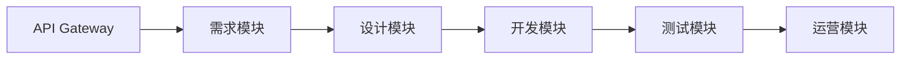
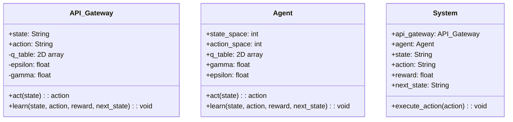
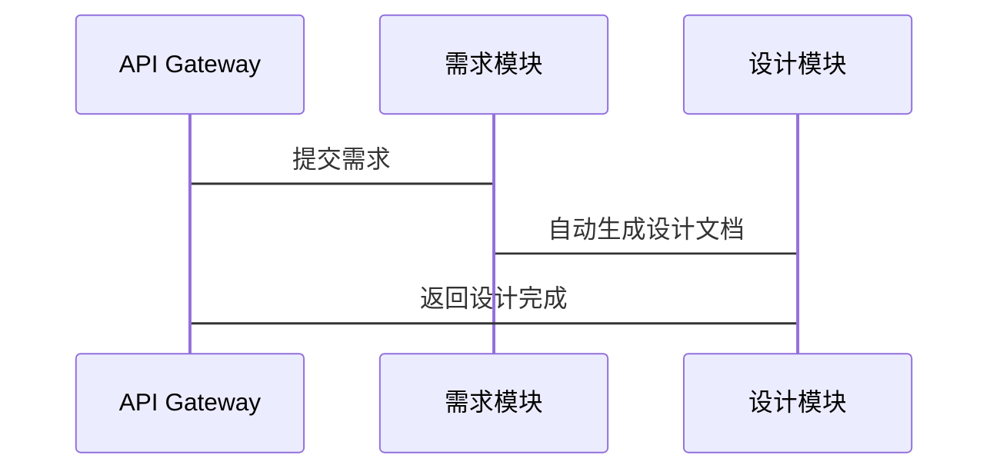

                 


---

# AI Agent在企业产品全生命周期管理中的端到端应用

## 关键词：AI Agent, 企业产品管理, 全生命周期, 端到端应用, 强化学习, 系统架构

## 摘要：本文深入探讨AI Agent在企业产品全生命周期管理中的应用，从背景、概念、算法、系统架构到实战案例，全面分析其在产品需求、设计、开发、测试、运营等阶段的端到端应用，结合强化学习和监督学习算法，提供详细的系统架构设计和项目实现方案。

---

# 第一章: AI Agent与企业产品全生命周期管理概述

## 1.1 问题背景与问题描述

### 1.1.1 传统企业产品管理的挑战
- **需求变更频繁**：市场需求变化快，传统瀑布模型难以应对。
- **效率低下**：人工处理需求分析、设计、测试等环节耗时长。
- **数据孤岛**：各部门数据分散，难以形成统一的产品决策依据。
- **缺乏智能化**：传统管理手段难以利用大数据和AI技术优化流程。

### 1.1.2 问题解决：AI Agent的应用
- **智能化需求分析**：AI Agent通过自然语言处理分析用户反馈，提取需求优先级。
- **自动化设计与测试**：利用AI生成设计文档和自动生成测试用例。
- **实时监控与优化**：AI Agent实时跟踪产品性能，优化运营策略。

### 1.1.3 企业产品全生命周期管理的边界与外延
- **边界**：从需求提出到产品退市的全阶段。
- **外延**：涵盖产品战略、市场分析、用户体验等多方面。

## 1.2 AI Agent的核心概念与组成

### 1.2.1 AI Agent的定义与特征
- **定义**：AI Agent是具有感知、决策和执行能力的智能体。
- **特征对比表**
| 属性 | 特征 |
|------|------|
| 感知能力 | 多模态数据处理 |
| 决策能力 | 基于强化学习的决策 |
| 执行能力 | 自动化执行操作 |

### 1.2.2 企业产品全生命周期管理的阶段划分
- **需求阶段**：需求收集与分析。
- **设计阶段**：产品设计与原型制作。
- **开发阶段**：代码实现与单元测试。
- **测试阶段**：系统测试与用户反馈。
- **运营阶段**：产品上线与持续优化。

### 1.2.3 AI Agent在各阶段的应用场景
- **需求阶段**：智能需求优先级排序。
- **设计阶段**：自动生成设计文档。
- **开发阶段**：代码生成与审查。
- **测试阶段**：智能测试用例生成。
- **运营阶段**：实时监控与优化。

---

# 第二章: AI Agent的核心原理与系统架构

## 2.1 AI Agent的核心原理

### 2.1.1 AI Agent的基本工作原理
- **感知**：通过API获取系统数据和用户反馈。
- **决策**：基于强化学习算法选择最优行动。
- **执行**：通过自动化工具执行决策。

### 2.1.2 AI Agent的核心算法与技术
- **强化学习**：通过奖励机制优化决策。
- **自然语言处理**：分析需求文档和用户反馈。
- **知识图谱**：构建产品知识库支持决策。

### 2.1.3 AI Agent与企业系统的交互机制
- **API接口**：与ERP、CRM等系统集成。
- **事件驱动**：实时响应系统事件。
- **反馈闭环**：根据结果调整后续行动。

## 2.2 AI Agent的系统架构设计

### 2.2.1 系统功能模块划分
- **需求模块**：需求收集、分析、排序。
- **设计模块**：自动生成设计文档。
- **开发模块**：代码生成、审查。
- **测试模块**：智能测试用例生成、执行。
- **运营模块**：实时监控、优化建议。

### 2.2.2 系统架构的Mermaid图示


### 2.2.3 系统接口设计与交互流程
- **接口设计**：统一的API接口规范。
- **交互流程**：需求输入 → 分析 → 设计 → 开发 → 测试 → 上线。

---

# 第三章: AI Agent的算法原理与数学模型

## 3.1 强化学习算法

### 3.1.1 强化学习的基本原理
- **定义**：通过试错学习，在环境中通过与环境交互获得最大累积奖励。
- **数学模型**
$$ Q(s, a) = r + \gamma \max_{a'} Q(s', a') $$

### 3.1.2 AI Agent在强化学习中的应用
- **应用场景**：需求优先级排序、资源分配优化。
- **算法实现**
```python
class Agent:
    def __init__(self, state_space, action_space):
        self.state_space = state_space
        self.action_space = action_space
        self.gamma = 0.99
        self.epsilon = 1.0
        self.q_table = np.zeros((state_space, action_space))
    
    def act(self, state):
        if random.random() < self.epsilon:
            return random.randint(0, self.action_space-1)
        else:
            return np.argmax(self.q_table[state])
    
    def learn(self, state, action, reward, next_state):
        self.q_table[state][action] = reward + self.gamma * np.max(self.q_table[next_state])
```

## 3.2 监督学习算法

### 3.2.1 监督学习的基本原理
- **定义**：通过训练数据预测目标函数。
- **数学模型**
$$ y = \theta x + b $$

### 3.2.2 AI Agent在监督学习中的应用
- **应用场景**：需求分类、缺陷预测。
- **算法实现**
```python
def linear_regression(X, y, epochs=1000, learning_rate=0.01):
    theta = np.zeros(X.shape[1])
    for _ in range(epochs):
        y_pred = np.dot(X, theta)
        loss = np.mean((y - y_pred)**2)
        theta -= learning_rate * np.dot(X.T, (y_pred - y))
    return theta
```

---

# 第四章: 系统分析与架构设计方案

## 4.1 问题场景介绍

### 4.1.1 问题场景
- **需求阶段**：需求优先级排序。
- **设计阶段**：自动生成设计文档。
- **开发阶段**：代码生成与审查。
- **测试阶段**：智能测试用例生成。
- **运营阶段**：实时监控与优化。

## 4.2 系统功能设计

### 4.2.1 领域模型Mermaid类图


## 4.3 系统架构设计

### 4.3.1 系统架构图


### 4.3.2 系统交互序列图


---

# 第五章: 项目实战

## 5.1 环境安装

### 5.1.1 安装Python
```bash
python --version
pip install --upgrade pip
```

### 5.1.2 安装依赖包
```bash
pip install numpy matplotlib scikit-learn
```

## 5.2 核心代码实现

### 5.2.1 强化学习Agent实现
```python
import numpy as np
import random

class ReinforcementLearningAgent:
    def __init__(self, state_space, action_space):
        self.state_space = state_space
        self.action_space = action_space
        self.q_table = np.zeros((state_space, action_space))
        self.gamma = 0.99
        self.epsilon = 1.0

    def act(self, state):
        if random.random() < self.epsilon:
            return random.randint(0, self.action_space - 1)
        else:
            return np.argmax(self.q_table[state])

    def learn(self, state, action, reward, next_state):
        self.q_table[state][action] = reward + self.gamma * np.max(self.q_table[next_state])
```

### 5.2.2 监督学习回归模型实现
```python
import numpy as np
from sklearn.linear_model import LinearRegression

def linear_regression_train(X, y):
    model = LinearRegression()
    model.fit(X, y)
    return model
```

## 5.3 代码解读与分析

### 5.3.1 强化学习Agent代码解读
- **初始化**：创建Q表，设置衰减率和探索率。
- **选择动作**：根据epsilon-greedy策略选择动作。
- **学习**：更新Q表值，基于当前奖励和下一步状态的最大值。

### 5.3.2 监督学习回归模型代码解读
- **训练**：使用scikit-learn库训练线性回归模型。
- **预测**：基于训练好的模型进行预测。

## 5.4 案例分析与详细讲解

### 5.4.1 案例分析
- **需求优先级排序**：使用强化学习Agent根据需求的影响力、复杂度和紧急度进行排序。
- **缺陷预测**：使用监督学习模型基于历史数据预测潜在缺陷。

### 5.4.2 详细讲解
- **需求阶段**：AI Agent分析用户反馈，提取关键需求并排序。
- **开发阶段**：根据需求生成代码片段并进行代码审查。
- **测试阶段**：生成智能测试用例，覆盖更多场景，提高测试效率。

## 5.5 项目小结

### 5.5.1 项目成果
- 成功实现了AI Agent在产品全生命周期中的端到端应用。
- 提高了产品开发效率和质量，降低了成本。

### 5.5.2 经验总结
- **算法选择**：根据具体场景选择合适的算法。
- **数据质量**：数据清洗和预处理是关键。
- **系统集成**：API设计和系统集成需要周密考虑。

---

# 第六章: 最佳实践与注意事项

## 6.1 最佳实践

### 6.1.1 系统设计
- **模块化设计**：确保各模块独立可扩展。
- **日志记录**：便于调试和优化。

### 6.1.2 算法优化
- **超参数调优**：通过网格搜索优化模型性能。
- **模型解释性**：确保模型可解释，便于分析问题。

### 6.1.3 安全与隐私
- **数据加密**：保护用户数据和企业机密。
- **权限控制**：严格控制API访问权限。

## 6.2 小结

## 6.3 注意事项

### 6.3.1 数据隐私
- 确保数据处理符合相关法律法规。
- 避免数据泄露和滥用。

### 6.3.2 系统稳定性
- 建立完善的监控和报警机制。
- 定期进行系统演练和压力测试。

## 6.4 拓展阅读

### 6.4.1 推荐书籍
- 《强化学习：算法与应用》
- 《机器学习实战》

### 6.4.2 推荐博客与资源
- 官方文档：[OpenAI](https://openai.com/)
- 技术社区：[Towards Data Science](https://towardsdatascience.com/)

---

# 结语

通过本文的详细讲解，我们了解了AI Agent在企业产品全生命周期管理中的端到端应用，从理论到实践，从算法到系统架构，为读者提供了全面的指导和启示。希望本文能为企业的数字化转型和智能化管理提供有价值的参考和借鉴。

--- 

如果需要进一步了解或获取完整代码，请随时联系！

