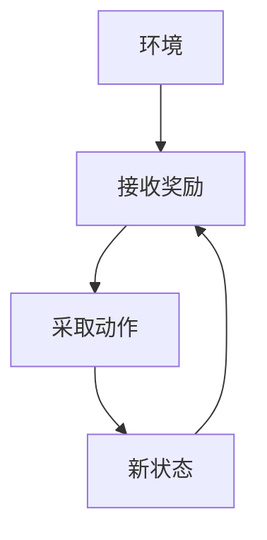
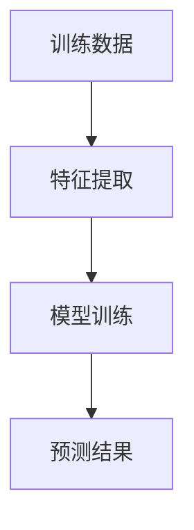
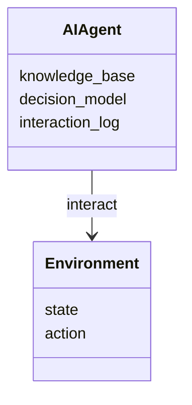
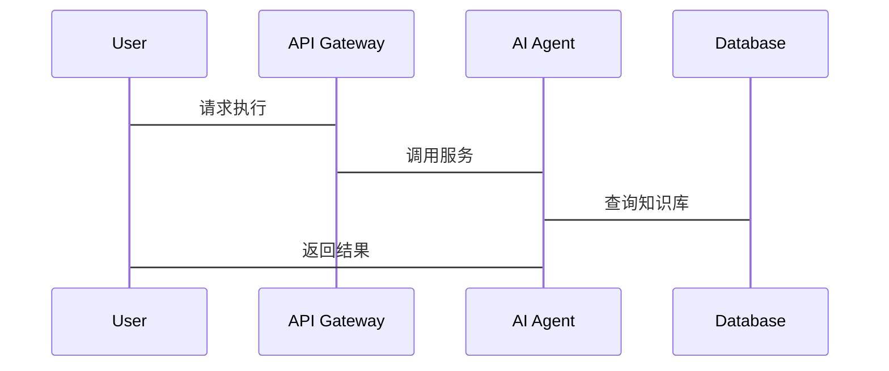

                 


# AI Agent在企业产品创新与概念验证中的应用

> 关键词：AI Agent，企业创新，概念验证，人工智能，算法原理，系统架构

> 摘要：本文将深入探讨AI Agent在企业产品创新与概念验证中的应用，分析其核心概念、算法原理、系统架构，并结合实际案例，展示其在企业中的实际应用价值和未来发展方向。

---

## 第一部分: AI Agent 的背景与核心概念

### 第1章: AI Agent 的基本概念与技术背景

#### 1.1 AI Agent 的定义与特点

**1.1.1 AI Agent 的定义**

AI Agent（人工智能代理）是指一种能够感知环境、自主决策并执行任务的智能体。与传统AI不同，AI Agent具有主动性，能够在动态环境中主动采取行动以实现目标。

**1.1.2 AI Agent 的核心特点**

- **自主性**：AI Agent能够在没有外部干预的情况下自主决策。
- **反应性**：能够实时感知环境变化并做出反应。
- **目标导向**：所有行为都以实现特定目标为导向。
- **学习能力**：能够通过经验改进自身性能。

**1.1.3 AI Agent 与传统 AI 的区别**

| 特性          | 传统AI                | AI Agent             |
|---------------|-----------------------|----------------------|
| 行为方式      | 被动响应输入           | 主动采取行动           |
| 决策能力      | 基于规则或模型         | 具备自主决策能力       |
| 适应性        | 固定场景              | 适应动态环境           |

#### 1.2 AI Agent 的技术背景

**1.2.1 人工智能技术的发展历程**

人工智能技术经历了从专家系统、机器学习到深度学习的演变，为AI Agent的发展提供了坚实的技术基础。

**1.2.2 大模型技术对 AI Agent 的影响**

大模型技术（如GPT系列）的出现，显著提升了AI Agent的自然语言处理能力和上下文理解能力。

**1.2.3 当前 AI Agent 的技术现状**

当前，AI Agent结合了自然语言处理、强化学习和知识图谱等技术，已在多个领域得到广泛应用。

#### 1.3 AI Agent 在企业中的应用价值

**1.3.1 企业产品创新中的 AI Agent**

AI Agent可以通过数据分析和预测，帮助企业发现新的市场机会，优化产品设计。

**1.3.2 概念验证中的 AI Agent**

在概念验证阶段，AI Agent可以快速模拟不同方案的效果，降低企业试错成本。

**1.3.3 AI Agent 的优势与局限性**

- **优势**：高效、智能、可扩展。
- **局限性**：依赖数据质量，处理复杂场景时可能面临挑战。

#### 1.4 本章小结

本章介绍了AI Agent的基本概念、技术背景及其在企业中的应用价值，为后续内容奠定了基础。

---

### 第2章: AI Agent 的核心概念

#### 2.1 AI Agent 的核心原理

**2.1.1 知识表示与推理**

知识表示是AI Agent理解世界的基础，推理则是基于知识做出逻辑推断的过程。

**2.1.2 行为决策与规划**

AI Agent通过分析目标和环境状态，制定最优行动方案。

**2.1.3 人机交互与反馈机制**

AI Agent通过与用户的交互获取反馈，持续优化自身行为。

#### 2.2 AI Agent 的属性特征对比

**2.2.1 不同类型 AI Agent 的对比分析**

| 类型          | 基于规则的AI Agent | 基于模型的AI Agent |
|---------------|--------------------|--------------------|
| 决策方式      | 预定义规则          | 基于模型推理        |
| 适应性        | 较低                | 较高                |

**2.2.2 基于表格的核心概念属性特征对比**

| 属性          | 描述               |
|---------------|--------------------|
| 自主性         | 主动性             |
| 反应性         | 实时响应           |
| 目标导向       | 以目标为导向         |
| 学习能力       | 改进性能的能力       |

**2.2.3 ER 实体关系图架构**

```mermaid
erd
    entity AI Agent {
        id
        knowledge_base
        decision_model
        interaction_log
    }
```

#### 2.3 AI Agent 的工作流程

**2.3.1 问题分析与目标设定**

AI Agent首先明确任务目标，并分析问题背景。

**2.3.2 知识获取与处理**

通过数据采集和知识建模，构建AI Agent的知识库。

**2.3.3 行为决策与执行**

基于知识库和环境反馈，制定决策并执行。

**2.3.4 反馈与优化**

根据执行结果进行反馈，并优化知识库和决策模型。

#### 2.4 本章小结

本章详细讲解了AI Agent的核心原理及其工作流程，帮助读者理解其内在机制。

---

## 第二部分: AI Agent 的算法原理与数学模型

### 第3章: AI Agent 的算法原理

#### 3.1 强化学习算法

**3.1.1 强化学习的基本原理**

强化学习通过智能体与环境的交互，学习最优策略以最大化累积奖励。

**3.1.2 Q-learning 算法的实现**

Q-learning算法通过更新Q表，学习状态-动作对的最优值。

**3.1.3 算法流程图**



**3.1.4 Python 实现示例**

```python
import numpy as np

class QLearning:
    def __init__(self, state_space, action_space):
        self.q_table = np.zeros((state_space, action_space))
    
    def choose_action(self, state, epsilon=0.1):
        if np.random.random() < epsilon:
            return np.random.randint(0, action_space)
        return np.argmax(self.q_table[state])
    
    def update_q_table(self, state, action, reward, next_state, learning_rate=0.1, gamma=0.9):
        self.q_table[state][action] = self.q_table[state][action] * learning_rate + reward + gamma * np.max(self.q_table[next_state])
```

**3.1.5 数学模型**

Q-learning的更新公式为：
$$ Q(s, a) = Q(s, a) \cdot \alpha + \alpha \cdot (r + \gamma \cdot \max Q(s', a')) $$

其中：
- $\alpha$ 是学习率，
- $\gamma$ 是折扣因子。

---

#### 3.2 监督学习算法

**3.2.1 监督学习的基本原理**

监督学习通过训练数据学习输入与输出的映射关系。

**3.2.2 算法流程图**



**3.2.3 Python 实现示例**

```python
from sklearn import tree

# 数据集
data = [...]  # 特征
target = [...]  # 标签

# 创建决策树模型
model = tree.DecisionTreeClassifier()

# 训练模型
model.fit(data, target)

# 预测
预测结果 = model.predict(new_data)
```

---

## 第三部分: AI Agent 的系统分析与架构设计方案

### 第4章: 系统分析与架构设计方案

#### 4.1 项目背景

本项目旨在利用AI Agent技术，帮助企业优化产品创新过程。

#### 4.2 系统功能设计

**4.2.1 领域模型**



#### 4.3 系统架构设计


#### 4.4 系统接口设计

**4.4.1 API 接口**

- `/api/v1/agent/init`
- `/api/v1/agent/execute`

#### 4.5 系统交互流程



---

## 第四部分: 项目实战

### 第5章: 项目实战

#### 5.1 环境安装

安装所需的Python库：

```bash
pip install numpy scikit-learn mermaid
```

#### 5.2 核心代码实现

**5.2.1 AI Agent 核心实现**

```python
class AIAGENT:
    def __init__(self, knowledge_base):
        self.knowledge_base = knowledge_base
    
    def analyze(self, input):
        # 分析输入并返回结果
        pass
    
    def decide(self, options):
        # 根据选项做出决策
        pass
```

---

## 第五部分: 最佳实践与总结

### 第6章: 最佳实践

#### 6.1 小结

AI Agent在企业中的应用前景广阔，但需要结合具体场景选择合适的技术方案。

#### 6.2 注意事项

- 数据质量对AI Agent性能影响重大。
- 需要结合业务场景进行模型调优。

#### 6.3 拓展阅读

建议深入学习强化学习和大模型技术，以更好地应用AI Agent。

---

## 结语

本文详细介绍了AI Agent在企业产品创新与概念验证中的应用，从理论到实践，为读者提供了全面的指导。通过本文的学习，读者可以深入了解AI Agent的核心原理、算法实现和实际应用，为企业创新提供有力的技术支持。

