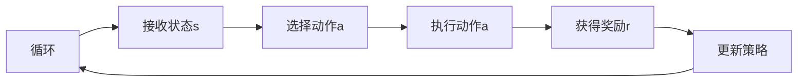
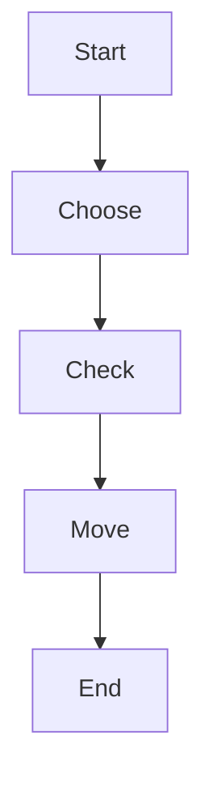
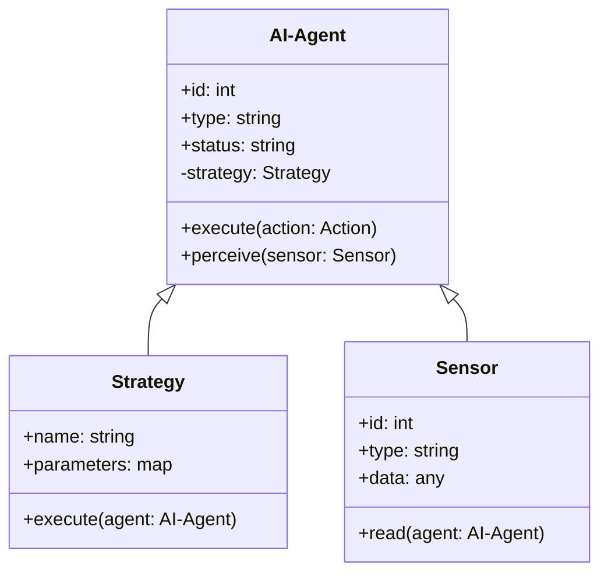

                 


# AI Agent在企业产品创新与概念验证中的角色

**关键词：** AI Agent、企业创新、概念验证、算法原理、系统架构、项目实战

**摘要：**  
本文探讨AI Agent在企业产品创新与概念验证中的角色，分析其核心概念、算法原理、系统架构，并通过实际案例展示其应用价值。文章旨在为企业技术决策者和开发者提供理论与实践相结合的深度解析，帮助企业在产品创新中高效利用AI Agent技术。

---

# 第一部分: AI Agent在企业产品创新中的背景与概念

## 第1章: AI Agent的基本概念与背景

### 1.1 AI Agent的定义与特点

#### 1.1.1 AI Agent的定义
AI Agent（人工智能代理）是一种能够感知环境、自主决策并执行任务的智能系统。它通过传感器获取信息，利用算法进行分析和推理，并通过执行器与环境交互。

#### 1.1.2 AI Agent的核心特点
- **自主性**：AI Agent能够独立运行，无需外部干预。
- **反应性**：能够实时感知环境变化并做出响应。
- **目标导向**：基于预设目标或学习目标进行决策。
- **适应性**：能够根据环境变化调整行为策略。

#### 1.1.3 AI Agent与传统自动化工具的区别
| **特点**       | **传统自动化工具**             | **AI Agent**                  |
|----------------|-------------------------------|-------------------------------|
| 决策能力       | 基于固定规则，无法灵活调整     | 基于学习和推理，能够动态调整   |
| 适应性         | 无法应对环境变化               | 能够自适应环境变化             |
| 创新能力       | 无法提出新解决方案             | 可以辅助创新，提出新方案       |

### 1.2 企业产品创新中的问题背景

#### 1.2.1 传统产品创新的痛点
- 创新周期长：从概念提出到产品落地，传统方法效率低下。
- 资源浪费：试错成本高，资源浪费严重。
- 决策依赖人工经验：依赖个体经验，难以实现系统化决策。

#### 1.2.2 AI Agent如何解决创新中的问题
AI Agent可以通过自动化数据分析、预测和优化，缩短创新周期，降低试错成本，提高决策效率。

#### 1.2.3 企业创新的边界与外延
企业创新不仅限于产品开发，还包括流程优化、市场拓展等领域。AI Agent可以广泛应用于这些场景，提升整体创新效率。

### 1.3 AI Agent与企业系统的关联

#### 1.3.1 AI Agent在企业系统中的位置
AI Agent通常作为企业系统的一部分，嵌入到产品开发、市场分析等环节中。

#### 1.3.2 AI Agent与企业数据流的关系
AI Agent通过企业数据流获取信息，分析数据并生成决策，再通过企业系统执行任务。

#### 1.3.3 AI Agent对企业创新流程的优化
AI Agent可以自动化执行创新流程中的部分任务，例如数据收集、市场分析和方案验证，从而提高效率。

---

## 第2章: AI Agent在企业中的核心作用

### 2.1 AI Agent的核心概念与原理

#### 2.1.1 AI Agent的感知与决策机制
- **感知**：通过传感器或数据接口获取环境信息。
- **决策**：基于感知信息，利用算法进行推理和选择最优行动方案。

#### 2.1.2 AI Agent的自主性与反应性
- 自主性：AI Agent能够独立运行，无需外部干预。
- 反应性：能够实时响应环境变化，调整行为策略。

#### 2.1.3 AI Agent的规划与执行能力
- **规划**：制定实现目标的步骤和策略。
- **执行**：通过执行器或API调用其他系统完成任务。

### 2.2 AI Agent与企业系统的关联

#### 2.2.1 AI Agent在企业系统中的位置
AI Agent通常作为企业系统的一部分，嵌入到产品开发、市场分析等环节中。

#### 2.2.2 AI Agent与企业数据流的关系
AI Agent通过企业数据流获取信息，分析数据并生成决策，再通过企业系统执行任务。

#### 2.2.3 AI Agent对企业创新流程的优化
AI Agent可以自动化执行创新流程中的部分任务，例如数据收集、市场分析和方案验证，从而提高效率。

---

## 第3章: AI Agent的核心概念与联系

### 3.1 AI Agent的核心概念原理

#### 3.1.1 AI Agent的感知模块
- 通过传感器或数据接口获取环境信息。
- 示例：电商企业通过爬虫获取市场竞争数据。

#### 3.1.2 AI Agent的决策模块
- 基于感知信息，利用算法进行推理和选择最优行动方案。
- 示例：通过强化学习算法优化产品定价策略。

#### 3.1.3 AI Agent的执行模块
- 制定实现目标的步骤和策略。
- 示例：通过API调用供应链系统完成订单处理。

### 3.2 AI Agent的属性特征对比

| **属性**       | **反应式AI Agent**       | **基于模型的AI Agent**       |
|----------------|--------------------------|-----------------------------|
| 决策方式       | 基于当前状态做出反应     | 基于预设模型和历史数据       |
| 适应性         | 强调实时反应              | 强调模型的准确性与稳定性      |
| 应用场景       | 适用于实时交互场景        | 适用于需要长期规划的场景      |

### 3.3 AI Agent的ER实体关系图

```mermaid
erDiagram
    customer[顾客] {
        <属性>
        id : integer
        name : string
        email : string
    }
    product[产品] {
        <属性>
        id : integer
        name : string
        price : float
    }
    market[市场] {
        <属性>
        id : integer
        region : string
        competitor : string
    }
    agent[AI Agent] {
        <属性>
        id : integer
        type : string
        status : string
    }
    customer --> market : "影响市场行为"
    product --> market : "影响市场竞争"
    agent --> market : "分析市场数据"
```

---

# 第二部分: AI Agent的算法原理与数学模型

## 第4章: AI Agent的核心算法原理

### 4.1 基于强化学习的AI Agent算法

#### 4.1.1 强化学习的基本原理



#### 4.1.2 DQN算法的数学模型

- **Q-learning公式**：
  $$ Q(s,a) = Q(s,a) + \alpha (r + \gamma \max Q(s',a') - Q(s,a)) $$
  其中：
  - \( Q(s,a) \)：当前状态\( s \)下执行动作\( a \)的Q值。
  - \( \alpha \)：学习率。
  - \( \gamma \)：折扣因子。

---

## 第5章: 基于A*算法的AI Agent路径规划

#### 5.1.1 A*算法的基本原理



#### 5.1.2 A*算法的数学模型

- **启发函数**：
  $$ h(n) = \text{估计从节点} n \text{到目标的最短距离} $$
- **总成本函数**：
  $$ f(n) = g(n) + h(n) $$
  其中：
  - \( g(n) \)：从起点到节点\( n \)的实际成本。
  - \( h(n) \)：从节点\( n \)到目标的估计成本。

---

## 第6章: AI Agent的系统架构设计

### 6.1 系统功能设计

#### 6.1.1 领域模型



---

## 第7章: AI Agent的项目实战

### 7.1 环境安装

- **Python环境**：安装Python 3.8及以上版本。
- **依赖库**：安装`numpy`, `tensorflow`, `scikit-learn`。

### 7.2 核心代码实现

```python
import numpy as np
from tensorflow.keras import models, layers

# 定义DQN网络
def build_dqn_model(input_dim, output_dim):
    model = models.Sequential()
    model.add(layers.Dense(32, activation='relu', input_dim=input_dim))
    model.add(layers.Dense(32, activation='relu'))
    model.add(layers.Dense(output_dim, activation='linear'))
    model.compile(optimizer='adam', loss='mean_squared_error')
    return model

# 示例用法
input_dim = 4
output_dim = 2
dqn_model = build_dqn_model(input_dim, output_dim)
```

---

## 第8章: 最佳实践与注意事项

### 8.1 最佳实践

- **数据质量**：确保输入数据的准确性和完整性。
- **模型调优**：根据实际场景调整超参数。
- **监控与反馈**：实时监控AI Agent的行为，及时调整策略。

### 8.2 小结

本文详细探讨了AI Agent在企业产品创新与概念验证中的角色，从理论到实践，为技术决策者和开发者提供了全面的指导。

### 8.3 注意事项

- AI Agent的应用需要结合企业实际需求。
- 注意数据隐私和安全问题。

### 8.4 未来展望

随着AI技术的进步，AI Agent将在企业创新中发挥更重要的作用，尤其是在复杂场景下的智能决策。

### 8.5 拓展阅读

- 《强化学习导论》
- 《AI系统架构设计》

---

**结语：** 通过本文的详细讲解，读者可以全面理解AI Agent在企业创新中的重要性，并能够实际应用这些技术来优化企业的创新流程。

