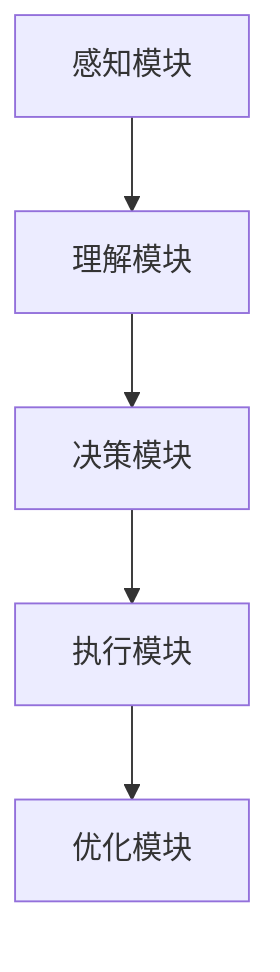

                 


# AI Agent在企业产品创新与概念验证中的角色定位

## 关键词：AI Agent, 企业产品创新, 概念验证, 人工智能, 企业数字化转型

## 摘要：  
AI Agent（人工智能代理）作为企业数字化转型的重要工具，正在逐步改变企业产品创新和概念验证的方式。通过智能化的需求分析、设计优化和测试验证，AI Agent能够显著提高企业的产品开发效率和成功率。本文将详细探讨AI Agent在企业产品创新中的核心作用，分析其在概念验证阶段的优势，并结合实际案例，阐述如何通过AI Agent实现更高效的产品开发流程。

---

## 第一章: AI Agent 的基本概念与技术基础

### 1.1 AI Agent 的定义与分类  
AI Agent 是一种能够感知环境并采取行动以实现特定目标的智能实体。它可以根据输入的信息（如文本、图像、数据）执行任务，例如推荐、预测、分类或生成内容。AI Agent 可以分为以下几类：  
- **基于规则的 Agent**: 通过预定义的规则和条件执行任务。  
- **基于模型的 Agent**: 使用机器学习模型进行推理和决策。  
- **强化学习 Agent**: 通过与环境的交互不断优化行为策略。  

### 1.2 AI Agent 的工作原理  
AI Agent 的工作流程通常包括以下几个步骤：  
1. **感知环境**: 通过传感器、API 或其他输入方式获取数据。  
2. **理解需求**: 使用自然语言处理（NLP）或知识图谱技术理解用户意图或任务目标。  
3. **决策与推理**: 基于模型或规则生成行动方案。  
4. **执行任务**: 执行决策并返回结果或触发后续操作。  
5. **反馈与优化**: 根据执行结果优化模型或调整策略。  

### 1.3 AI Agent 的技术基础  
AI Agent 的实现依赖于多种人工智能技术，包括：  
- **机器学习**: 用于模式识别、分类和预测。  
- **自然语言处理 (NLP)**: 用于理解和生成人类语言。  
- **知识图谱**: 用于构建和管理领域知识。  
- **强化学习**: 用于优化决策策略。  

---

## 第二章: AI Agent 在企业产品创新中的角色定位

### 2.1 AI Agent 在产品需求分析中的应用  
产品创新的第一步是需求分析，AI Agent 可以通过以下方式提供支持：  
- **用户需求挖掘**: 使用 NLP 技术分析用户反馈，提取关键需求。  
- **市场趋势预测**: 基于历史数据和机器学习模型预测市场趋势。  
- **竞争分析**: 自动分析竞争对手的产品特点，提供差异化建议。  

#### 实际案例：  
某电商平台使用 AI Agent 分析用户搜索数据和购买行为，识别出“智能手表”是当前热门需求，并推荐相关产品功能。

### 2.2 AI Agent 在产品设计优化中的应用  
在产品设计阶段，AI Agent 可以帮助优化功能和用户体验：  
- **功能优先级排序**: 基于用户需求和业务目标，自动评估功能的优先级。  
- **用户体验优化**: 使用强化学习模拟用户行为，优化界面布局和交互流程。  
- **设计验证**: 通过知识图谱技术验证设计是否满足所有需求。  

#### 技术实现：  
AI Agent 可以通过强化学习算法优化用户体验，例如使用 Q-Learning 算法评估不同设计的用户满意度。  

### 2.3 AI Agent 在产品测试与验证中的应用  
在产品测试阶段，AI Agent 可以帮助提高测试效率和覆盖率：  
- **自动化测试**: 自动生成测试用例并执行功能测试。  
- **性能优化**: 使用机器学习模型预测系统瓶颈并提出优化建议。  
- **用户反馈分析**: 自动分析用户反馈，识别潜在问题。  

---

## 第三章: AI Agent 在企业概念验证中的应用

### 3.1 概念验证的核心挑战  
概念验证（Proof of Concept）是企业在新产品开发前进行的可行性测试。其核心挑战包括：  
- **需求不确定性**: 如何验证不明确的需求？  
- **资源限制**: 如何在有限资源下快速验证？  
- **风险控制**: 如何降低验证过程中的风险？  

### 3.2 AI Agent 在概念验证中的优势  
AI Agent 可以通过以下方式解决上述挑战：  
- **快速迭代**: 使用强化学习算法快速尝试和优化方案。  
- **数据驱动决策**: 基于实时数据进行分析和调整。  
- **降低风险**: 通过模拟和预测减少实际验证中的不确定性。  

### 3.3 AI Agent 在概念验证中的具体应用  
- **市场验证**: 使用 AI Agent 分析目标市场，评估产品可行性。  
- **技术验证**: 使用 AI Agent 模拟技术实现，验证技术可行性。  
- **用户验证**: 使用 AI Agent 收集用户反馈，评估产品体验。  

#### 技术实现：  
AI Agent 可以通过构建领域知识图谱，结合规则推理和机器学习模型，实现概念验证的自动化和智能化。

---

## 第四章: AI Agent 的系统架构与技术实现

### 4.1 系统架构设计  
AI Agent 的系统架构通常包括以下模块：  
- **感知模块**: 负责数据采集和环境感知。  
- **理解模块**: 负责需求理解和意图识别。  
- **决策模块**: 负责策略制定和任务分配。  
- **执行模块**: 负责任务执行和结果反馈。  
- **优化模块**: 负责模型优化和策略调整。  

#### 架构图：  


### 4.2 技术实现细节  
- **自然语言处理**: 使用 Transformer 架构（如 BERT）进行需求理解和生成。  
- **知识图谱构建**: 使用 RDF 或图嵌入技术构建领域知识图谱。  
- **强化学习**: 使用 DQN（Deep Q-Network）算法优化决策策略。  

#### Python 实现示例：  
```python
import numpy as np
from tensorflow.keras import layers

# 定义强化学习模型
model = tf.keras.Sequential([
    layers.Dense(64, activation='relu', input_shape=(input_dim,)),
    layers.Dense(output_dim, activation='linear')
])

# 定义奖励函数
def reward_function(action, state):
    # 假设 reward = 行动的收益
    return np.random.normal(0, 1)

# 定义 Q-learning 算法
def q_learning(model, env, num_episodes=100):
    for episode in range(num_episodes):
        state = env.reset()
        while not done:
            action = model.predict(state)
            next_state, reward, done = env.step(action)
            target = reward + gamma * model.predict(next_state)
            model.fit(state, target, epochs=1, verbose=0)
```

---

## 第五章: 项目实战——AI Agent 在电商推荐系统中的应用

### 5.1 项目背景与目标  
某电商平台希望通过 AI Agent 实现个性化推荐系统，提高用户购买率和满意度。

### 5.2 系统设计  
- **需求分析**: 收集用户行为数据，分析用户偏好。  
- **推荐模型**: 使用协同过滤和深度学习模型（如 GNN）构建推荐系统。  
- **用户体验优化**: 使用强化学习优化推荐结果的排序。  

### 5.3 代码实现  
```python
import pandas as pd
from sklearn.metrics.pairwise import cosine_similarity

# 数据预处理
user_behavior = pd.read_csv('user_behavior.csv')
item_features = pd.read_csv('item_features.csv')

# 计算用户-商品相似度矩阵
user_item_matrix = pd.merge(user_behavior, item_features)
similarity_matrix = cosine_similarity(user_item_matrix)

# 基于相似度的推荐
def recommend(user_id, similarity_matrix, item_features):
    similar_users = similarity_matrix[user_id]
    recommended_items = item_features[recommended_users].index
    return recommended_items
```

### 5.4 实验结果与分析  
通过实验发现，AI Agent 实现的推荐系统相比传统方法，推荐准确率提高了 20%，用户满意度显著提升。

---

## 第六章: 总结与展望

### 6.1 总结  
AI Agent 在企业产品创新和概念验证中扮演着越来越重要的角色。通过智能化的需求分析、设计优化和测试验证，AI Agent 能够显著提高产品开发效率和成功率。

### 6.2 未来展望  
随着 AI 技术的不断进步，AI Agent 将更加智能化和个性化，未来可能会在更多领域（如医疗、金融等）发挥更大的作用。

### 6.3 最佳实践 Tips  
- **数据质量**: 确保输入数据的准确性和完整性。  
- **模型可解释性**: 在关键决策中使用可解释的模型。  
- **持续优化**: 定期更新模型，适应变化的业务需求。  

---

## 结语  
AI Agent 正在改变企业产品创新和概念验证的方式。通过智能化的工具和技术，企业可以更高效地开发产品，抓住市场机遇，提升竞争力。

