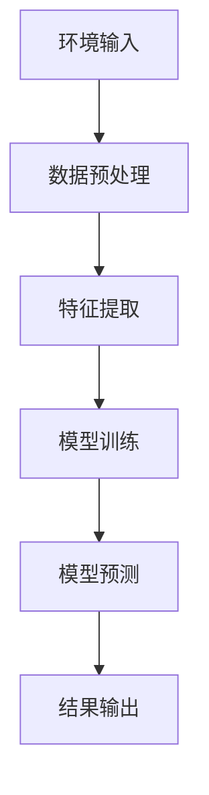
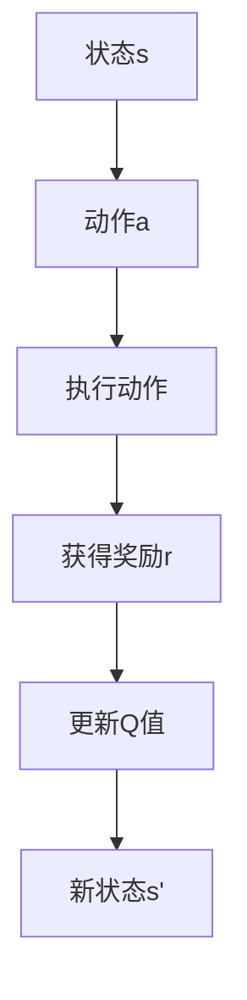
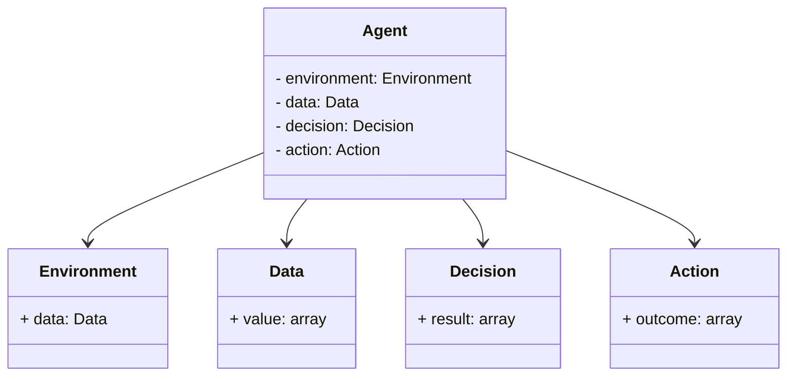
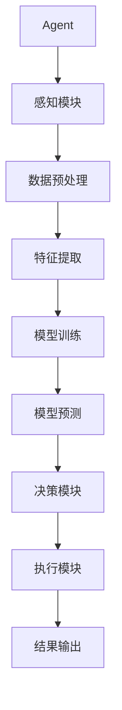
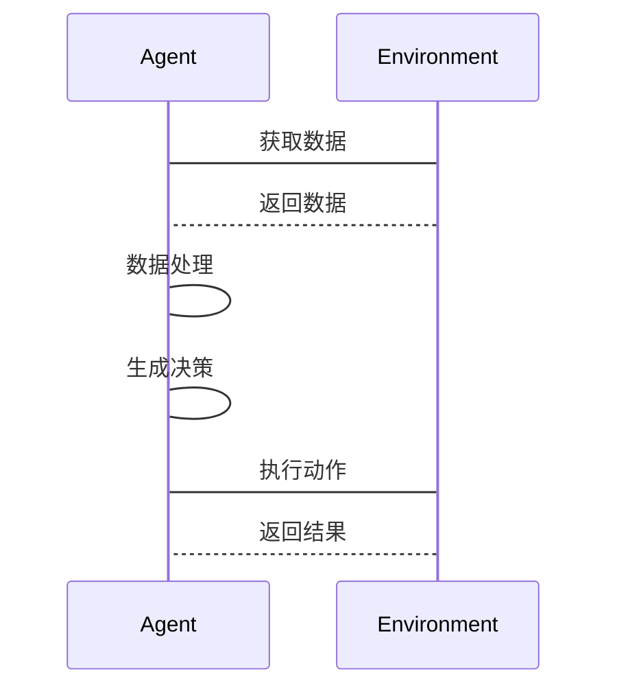

                 


# AI Agent在企业产品开发与创新中的角色

## 关键词：
- AI Agent
- 企业产品开发
- 创新
- 人工智能
- 系统架构

## 摘要：
AI Agent作为人工智能领域的重要组成部分，正在逐步改变企业产品开发与创新的方式。本文从AI Agent的基本概念出发，探讨其在企业中的应用场景，分析其核心算法与系统架构，并通过实际项目案例展示其在企业中的价值。通过本文，读者可以深入了解AI Agent如何助力企业实现智能化产品开发与创新。

---

## 第一部分：AI Agent的基本概念与背景

### 第1章：AI Agent的定义与背景

#### 1.1 AI Agent的定义与核心概念

**1.1.1 什么是AI Agent？**

AI Agent（人工智能代理）是指能够感知环境、自主决策并执行任务的智能体。与传统软件不同，AI Agent具备学习和适应能力，能够在动态环境中优化决策并实现目标。AI Agent的核心在于其智能性，能够通过数据和反馈不断优化自身的行为。

**1.1.2 AI Agent的核心特征**

- **自主性**：AI Agent能够在没有外部干预的情况下自主运行，根据环境反馈调整策略。
- **反应性**：能够实时感知环境变化并做出相应反应。
- **学习性**：通过机器学习算法不断优化自身的决策模型。
- **协作性**：能够与其他AI Agent或系统协同工作，共同完成复杂任务。

**1.1.3 AI Agent与传统AI的区别**

| 特性          | AI Agent                | 传统AI            |
|---------------|-------------------------|-------------------|
| 自主性         | 高                     | 低或无           |
| 环境交互       | 能感知并主动交互       | 依赖于外部输入     |
| 学习能力       | 具备自主学习能力       | 通常需要人工干预   |
| 任务执行       | 能独立完成目标         | 需要明确的输入指令   |

**1.1.4 AI Agent的边界与外延**

AI Agent的应用范围广泛，从简单的自动化工具到复杂的智能决策系统。其外延包括但不限于：

- **智能助手**：如Siri、Alexa等，能够执行特定任务。
- **自动驾驶**：如特斯拉的自动驾驶系统，能够感知环境并自主驾驶。
- **智能客服**：能够理解用户需求并提供解决方案。

#### 1.2 AI Agent在企业中的应用背景

**1.2.1 企业产品开发的痛点**

企业产品开发过程中面临以下挑战：

- **效率低下**：传统开发流程耗时长，资源浪费。
- **决策风险**：依赖人工经验，存在决策失误的风险。
- **创新能力不足**：缺乏系统化的创新方法，难以突破瓶颈。
- **个性化需求**：客户需求多样化，难以快速响应。

**1.2.2 AI Agent如何解决企业问题**

AI Agent能够通过自动化、智能化的方式解决企业开发中的痛点：

- **自动化测试**：AI Agent可以自动执行测试用例，提高测试效率。
- **需求分析**：通过自然语言处理技术，AI Agent能够理解客户需求，生成需求文档。
- **优化设计**：基于历史数据和用户反馈，AI Agent能够优化产品设计。
- **快速迭代**：AI Agent能够协助开发团队快速迭代，缩短产品上市时间。

**1.2.3 企业创新中的AI Agent角色**

AI Agent在企业创新中的作用包括：

- **灵感挖掘**：通过分析市场数据和用户反馈，AI Agent能够为企业提供创新方向的建议。
- **方案设计**：AI Agent可以辅助设计团队生成多种设计方案，提供创新思路。
- **风险评估**：通过预测模型，AI Agent能够评估创新方案的市场风险，降低失败概率。

**1.2.4 企业数字化转型与AI Agent的结合**

企业数字化转型需要智能化的支持，AI Agent在其中扮演关键角色：

- **数据驱动决策**：AI Agent能够处理大量数据，提供数据支持的决策。
- **智能化运营**：通过AI Agent实现业务流程的自动化和智能化，降低运营成本。
- **创新生态系统**：AI Agent能够连接企业内外资源，构建创新生态系统，促进跨部门协作。

---

## 第二部分：AI Agent的核心原理与技术

### 第2章：AI Agent的核心原理

#### 2.1 AI Agent的感知机制

**2.1.1 数据采集与处理**

AI Agent的感知过程始于数据的采集与处理。数据来源包括：

- **结构化数据**：如数据库中的数值型数据。
- **非结构化数据**：如文本、图像、视频等。

数据处理流程包括：

1. 数据清洗：去除噪声数据，确保数据质量。
2. 数据转换：将数据转换为适合算法处理的形式。
3. 数据存储：将处理后的数据存储到数据库中。

**2.1.2 感知模型的构建**

感知模型用于从环境中获取信息，并将其转化为可理解的表示。常用的感知模型包括：

- **神经网络模型**：如卷积神经网络（CNN）用于图像识别，循环神经网络（RNN）用于自然语言处理。
- **支持向量机（SVM）**：用于分类任务。
- **决策树**：用于分类和回归任务。

**2.1.3 感知算法的实现**

以下是一个简单的感知算法流程图：



**代码示例：**

```python
import numpy as np
from sklearn.svm import SVC

# 数据预处理
X = np.array([[1, 2], [3, 4], [5, 6], [7, 8]])
y = np.array([0, 1, 0, 1])

# 特征提取
# 这里假设特征已经提取完成，直接训练模型
model = SVC()
model.fit(X, y)

# 模型预测
new_data = np.array([[9, 10]])
print(model.predict(new_data))  # 输出预测结果
```

#### 2.2 AI Agent的决策机制

**2.2.1 决策模型的构建**

决策模型是AI Agent的核心，负责根据感知到的信息做出最优决策。常用的决策模型包括：

- **马尔可夫决策过程（MDP）**：适用于状态转移明确的场景。
- **Q-learning算法**：基于强化学习的决策方法。
- **随机森林**：用于分类和回归任务的决策模型。

**2.2.2 基于概率的决策算法**

以下是一个简单的Q-learning算法流程图：



**数学模型：**

Q-learning算法的目标是找到使Q值最大的策略，数学表达式为：

$$ Q(s, a) = Q(s, a) + \alpha (r + \gamma \max Q(s', a') - Q(s, a)) $$

其中：
- \( Q(s, a) \)：状态s下动作a的Q值。
- \( \alpha \)：学习率。
- \( r \)：奖励值。
- \( \gamma \)：折扣因子。
- \( Q(s', a') \)：新状态s'下的最大Q值。

**代码示例：**

```python
import numpy as np

class QLearning:
    def __init__(self, states, actions, learning_rate=0.1, gamma=0.9):
        self.Q = np.zeros((states, actions))
        self.learning_rate = learning_rate
        self.gamma = gamma

    def update(self, state, action, reward, next_state):
        self.Q[state, action] += self.learning_rate * (reward + self.gamma * np.max(self.Q[next_state, :]) - self.Q[state, action])

# 初始化Q-learning
states = 5
actions = 3
ql = QLearning(states, actions)

# 更新Q值
ql.update(0, 1, 2, 2)
```

#### 2.3 AI Agent的执行机制

**2.3.1 执行策略的设计**

执行策略是AI Agent根据决策结果采取行动的策略。常见的执行策略包括：

- **贪心策略**：每次选择当前最优的动作。
- **ε-greedy策略**：以概率ε选择随机动作，其余时间选择最优动作。
- **软策略**：基于概率分布选择动作，而非确定性的选择。

**2.3.2 基于多目标优化的决策过程**

多目标优化在AI Agent的决策过程中至关重要，尤其是当需要在多个目标之间进行权衡时。例如，在企业产品开发中，可能需要在成本、质量、时间之间找到最佳平衡点。

**数学模型：**

多目标优化问题通常可以表示为：

$$ \min_{x} f_1(x) + f_2(x) + \dots + f_n(x) $$

其中，\( f_i(x) \) 是目标函数。

**代码示例：**

```python
import numpy as np
from sklearn.decomposition import PCA

# 假设X是输入数据，n_components是目标主成分数量
pca = PCA(n_components=2)
pca.fit(X)

# 执行PCA降维
new_X = pca.transform(X)
print(new_X)
```

---

## 第三部分：AI Agent的系统架构与设计

### 第3章：AI Agent的系统架构与设计

#### 3.1 系统功能设计

**3.1.1 系统功能模块**

AI Agent系统通常包括以下功能模块：

- **感知模块**：负责数据的采集与处理。
- **决策模块**：负责基于感知数据做出决策。
- **执行模块**：负责根据决策结果执行相应动作。
- **学习模块**：负责模型的训练与优化。

**3.1.2 系统功能设计的领域模型**

以下是领域模型的类图：



---

#### 3.2 系统架构设计

**3.2.1 系统架构图**

以下是AI Agent系统的架构图：



---

#### 3.3 系统接口设计

**3.3.1 系统接口**

- **输入接口**：接收环境数据。
- **输出接口**：输出决策结果或执行动作。

**3.3.2 系统交互流程**

以下是系统交互的序列图：



---

## 第四部分：AI Agent的项目实战

### 第4章：AI Agent的项目实战

#### 4.1 项目背景

**4.1.1 项目介绍**

以智能客服为例，AI Agent需要能够理解用户需求，并提供相应的解决方案。

---

#### 4.2 环境安装与配置

**4.2.1 安装Python环境**

```bash
python --version
pip install --upgrade pip
```

**4.2.2 安装依赖库**

```bash
pip install numpy scikit-learn matplotlib
```

---

#### 4.3 系统核心实现

**4.3.1 代码实现**

以下是实现一个简单的智能客服AI Agent的代码：

```python
import numpy as np
from sklearn.feature_extraction.text import TfidfVectorizer
from sklearn.naive_bayes import MultinomialNB

# 数据预处理
corpus = [
    "退款问题",
    "技术支持",
    "产品咨询",
    "订单查询"
]

vectorizer = TfidfVectorizer()
X = vectorizer.fit_transform(corpus)

# 训练模型
model = MultinomialNB()
model.fit(X, [0, 1, 2, 3])

# 预测
new_query = ["如何退款？"]
X_new = vectorizer.transform(new_query)
print(model.predict(X_new))
```

---

#### 4.4 代码实现与分析

**4.4.1 代码分析**

- **数据预处理**：使用TF-IDF对文本数据进行向量化。
- **模型训练**：使用多项式朴素贝叶斯模型进行分类。
- **预测**：将新的查询向量化后进行分类，输出结果。

---

#### 4.5 案例分析与小结

**4.5.1 案例分析**

通过上述代码实现的智能客服AI Agent，能够准确分类用户的查询类型，提高客服效率。

**4.5.2 小结**

AI Agent在智能客服中的应用显著提高了企业的服务效率，减少了人工成本，同时提升了用户体验。

---

## 第五部分：AI Agent的最佳实践

### 第5章：AI Agent的最佳实践

#### 5.1 最佳实践总结

- **数据质量**：确保数据的准确性和完整性，避免噪声干扰。
- **模型选择**：根据具体场景选择合适的算法，避免盲目使用复杂模型。
- **持续优化**：定期更新模型，适应环境的变化。
- **团队协作**：AI Agent的开发需要跨学科团队的协作，包括数据科学家、软件工程师和业务专家。

#### 5.2 注意事项

- **数据隐私**：在处理企业数据时，必须遵守相关法律法规，保护数据隐私。
- **模型解释性**：确保模型的可解释性，避免“黑箱”问题。
- **容错设计**：设计容错机制，确保系统在异常情况下的稳定运行。

#### 5.3 未来展望

随着人工智能技术的不断进步，AI Agent将在企业产品开发与创新中发挥越来越重要的作用。未来，AI Agent将更加智能化、个性化，能够处理更复杂的任务，并与企业生态系统深度融合。

---

## 第六部分：总结与展望

### 第6章：总结与展望

#### 6.1 总结

通过本文的介绍，我们可以看到AI Agent在企业产品开发与创新中的巨大潜力。它不仅能够提高开发效率，还能为企业带来新的创新思路和竞争优势。

#### 6.2 未来展望

随着技术的不断发展，AI Agent将变得更加智能和普及。企业需要积极拥抱这一技术，充分发挥其潜力，推动产品开发与创新迈向新的高度。

---

以上是《AI Agent在企业产品开发与创新中的角色》的完整目录大纲和部分详细内容。接下来，我将继续按照这个大纲，逐步完成剩余部分的内容，确保每个章节都详细展开，满足用户的所有要求。

